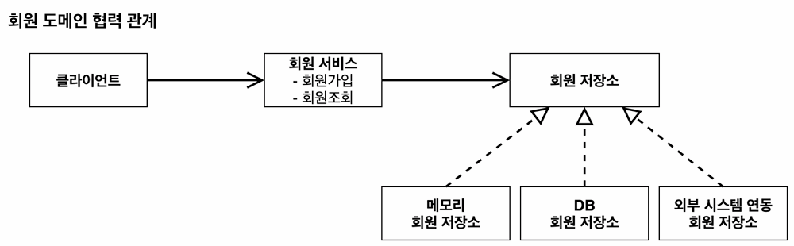
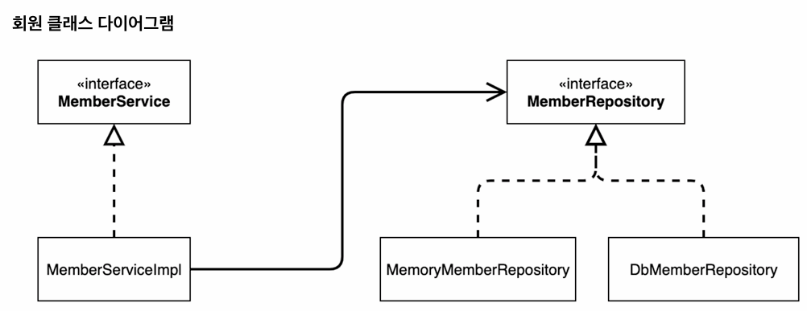
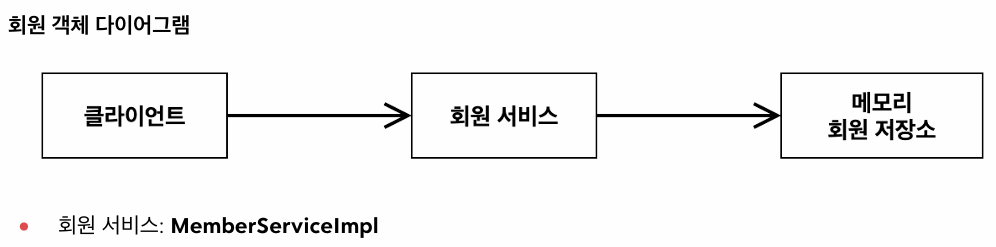
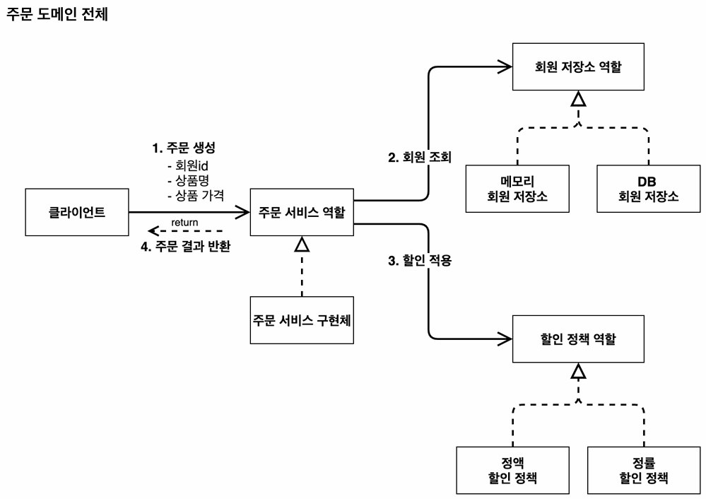
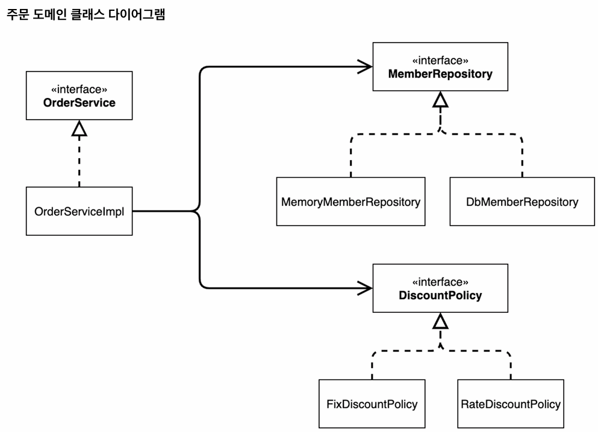
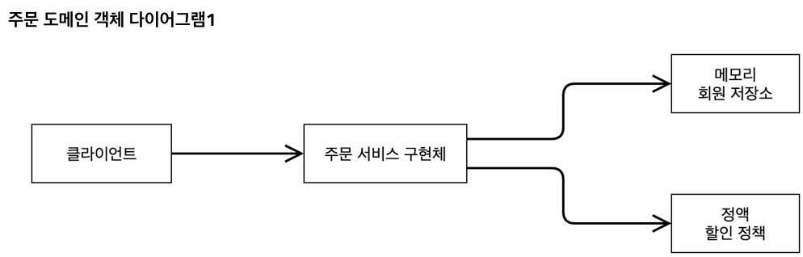

## 비즈니스 요구사항과 설계의 도전

### 1. 난관 (The Dilemma)
* **상황:** 회원 데이터 저장소(DB) 선정이나 구체적인 할인 정책 등, 비즈니스의 핵심적인 부분이 아직 결정되지 않았다.
* **문제:** 그렇다고 해서 정책이 결정될 때까지 **개발을 무기한 대기할 수는 없다.**

### 2. 해결책: 객체 지향 설계 (The Solution)
> **"앞서 배운 객체 지향의 핵심(다형성 + SOLID)을 활용하면 해결할 수 있다."**

* **전략:** **역할(Interface)** 과 **구현(Implementation)** 을 철저히 분리한다.
* **실행 방법:**
    1.  **인터페이스 정의:** 확정되지 않은 정책(역할)을 인터페이스로 먼저 정의하고, 이를 기반으로 개발을 진행한다.
    2.  **유연한 교체:** 일단은 가짜(Dummy) 구현체나 단순한 구현체를 만들어 사용한다.
    3.  **최종 적용:** 나중에 정책이 확정되면, 기존 코드를 변경하지 않고 **새로운 구현체로 갈아끼우기만 하면** 된다.
* **핵심 원칙:**
    * **다형성 (Polymorphism):** 구현체를 실행 시점에 유연하게 변경.
    * **OCP (개방-폐쇄 원칙):** 
      * 기능 확장에는 열려 있고, 코드 변경에는 닫혀 있음.
      * 즉, **클라이언트 코드는 변경하지 않고, 새로운 구현체로 기능을 추가함**
    * **DIP (의존관계 역전 원칙):** 구체적인 것이 아닌, 추상화(인터페이스)에 의존함.

---

## 회원 도메인 설계의 3가지 관점

설계는 **기획(개념) → 개발(코드) → 실행(런타임)** 순서로 구체화된다.

### 1. 회원 도메인 협력 관계 (기획자 관점 - 개념)

* **특징:** 기획자도 이해할 수 있는 **거시적인 그림**이다.
* **구성:**
    * **클라이언트:** 서비스를 호출하는 사용자 혹은 계층.
    * **회원 서비스 역할:** 비즈니스 로직을 담당 (회원 가입, 조회 등).
    * **회원 저장소 역할:** 데이터 관리 담당. (구현체 후보: 메모리, RDB, 외부 시스템 등)
* **목적:** 구체적인 기술보다는 **역할과 역할 간의 협력 관계**를 정의하는 것이 핵심이다.

### 2. 회원 클래스 다이어그램 (개발자 관점 - 정적)

* **특징:** 
  * 도메인 협력 관계를 바탕으로 개발자가 구체화한 그림이다.
  * **서버를 실행하지 않고 코드(클래스)만 분석**한다.
* **구성:**
    * **인터페이스(역할)** 와 **구현체(구현 클래스)** 가 모두 보인다.
    * 예: `MemberService` ← `MemberServiceImpl`
* **한계:**
    * 클래스들의 관계는 알 수 있지만, **실제로 어떤 구현체가 주입될지는 알 수 없다.**
    * 예: 코드만 봐서는 `MemberServiceImpl`이 `MemoryRepository`를 쓰는지 `DbRepository`를 쓰는지 확정할 수 없다.

### 3. 회원 객체 다이어그램 (런타임 관점 - 동적)

* **특징:** 실제 서버가 떠서 **클라이언트 객체가 실제로 참조하는 메모리 주소(인스턴스)** 를 그린 그림이다.
* **시나리오:**
    1.  서버 실행 (Runtime)
    2.  스프링 컨테이너가 의존성 주입 (DI)
    3.  **결과:** `Client` → `MemberServiceImpl` (참조) → `MemoryMemberRepository` (참조)
* **목적:** 클래스 다이어그램으로는 판단하기 어려운 **실제 런타임 의존관계**를 파악하기 위함이다.

---

## Q. 왜 서비스도 역할(`MemberService`)과 구현(`Impl`)으로 나눌까?

> **Q. 저장소(Repository)는 DB가 바뀔 수 있으니까 이해가 가는데, 서비스(Service) 로직은 바뀔 일이 거의 없지 않나? 왜 굳이 인터페이스를 만들어서 복잡하게 하지?**

### 이유 1: '변경 가능성'에 대한 대비 (OCP)
지금 당장은 서비스 로직이 하나뿐이지만, **비즈니스 요구사항은 언제든 변할 수 있기 때문**이다.
* **상황:** 예를 들어, `MemberService`의 기본 로직이 있는데, **설날 이벤트 기간 동안만 '특별 할인 로직이 포함된 서비스'** 로 통째로 갈아끼워야 한다면?
* **해결:** 인터페이스가 있다면 기존 코드를 건드리지 않고, `EventMemberServiceImpl`만 새로 만들어서 설정(Config)만 바꾸면 된다.

### 이유 2: 기술적인 이유 (Spring AOP와 Proxy)
스프링의 핵심 기술 중 하나인 **AOP(관점 지향 프로그래밍, 예: `@Transactional`)** 가 동작하는 원리 때문이다.
* **원리:** 스프링은 트랜잭션 처리를 위해 실제 클래스를 감싸는 **가짜(Proxy) 객체**를 만든다.
* **과거의 제약:** 과거에는 이 프록시 객체를 만들 때 **반드시 인터페이스가 있어야만** 만들 수 있었다. (JDK Dynamic Proxy 기술)
* **현재:** 
  * 지금은 기술이 발전해서(CGLIB) 인터페이스 없이 클래스만 있어도 프록시를 만들 수 있다. 
  * 하지만 **오래된 관습(Convention)** 과 **'역할과 구현의 분리'라는 설계 철학**을 보여주기 위해 학습 단계에서는 정석대로 분리하는 경우가 많다.

### 결론: 실무에서는?
* **실무 가이드:** **"변경 가능성이 정말 없다"** 면 인터페이스 없이 **구체 클래스(`MemberService`)만 바로 만들어 쓰기도 한다.** (YAGNI 원칙 적용)
* 그러다 나중에 변경이 필요해지면 그때 리팩터링을 통해 인터페이스를 추출한다.

---

## 컬렉션 프레임워크 선택: HashMap vs ConcurrentHashMap

### HashMap (강의 예제)
* **특징:** 단일 쓰레드 환경에서 빠르고 가볍다.
* **사용 이유:** 예제의 단순함을 위해 사용했다.

### ConcurrentHashMap (실무 권장)
* **문제점 (동시성 이슈):**
    * 웹 애플리케이션은 수많은 사용자가 동시에 요청을 보내는 **멀티 쓰레드 환경**이다.
    * 여러 쓰레드가 공유되는 `HashMap`에 동시에 데이터를 넣거나(`put`) 뺄 때(`get`), 타이밍이 겹치면 데이터가 유실되거나 에러가 발생한다.
* **해결:**
    * `ConcurrentHashMap`은 내부적으로 정교한 동기화(Lock) 기술을 사용하여, **여러 쓰레드가 동시에 접근해도 안전(Thread-safe)** 하게 데이터를 처리한다.
* **결론:** 실무에서 전역 변수나 공유 객체의 필드로 Map을 쓸 때는 반드시 `ConcurrentHashMap`을 써야 한다.

---

## 패키지 설계 전략: 인터페이스와 구현체의 위치

### 방식 A: 패키지 분리 (전통적인 계층형 아키텍처)
> **인터페이스와 구현체를 서로 다른 패키지로 나누는 방식**

* **목적 (의존성 제어):**
    * 클라이언트가 실수로라도 **'구현' 클래스에 직접 접근하는 것을 원천 차단**하기 위함이다.
    * 패키지를 나누면 `impl` 패키지를 숨길 수 있어, 클라이언트가 오직 **'인터페이스'만 의존하도록 강제**할 수 있다.
* **장점:** 설계(Interface)와 구현(Implementation)의 물리적 영역이 명확히 구분된다.

### 방식 B: 패키지 통합 (Package by Feature)
> **관련된 인터페이스와 구현체를 같은 패키지에 두는 방식**

* **개념:** 기능(Feature)이나 도메인 단위로 패키지를 구성하여, 관련된 파일들을 한곳에 모아두는 방식이다.
* **장점:**
    * **높은 응집도:** 관련된 코드가 한곳에 모여 있어 개발 편의성이 높다.
    * **최근 트렌드:** 최근 마이크로서비스(MSA)나 도메인 주도 설계(DDD) 등에서는 이 방식을 많이 선호한다.
* **결론:** 정답은 없으며, 프로젝트의 아키텍처 원칙에 따라 선택한다.

---

## 개발 프로세스와 순서

### 개발 순서의 핵심 원칙
1.  **의존 관계의 순서:** 의존을 받는 대상(Repository)이 먼저 정의되어야, 이를 사용하는 대상(Service)을 만들 수 있다.
2.  **역할과 구현의 분리:** 인터페이스(역할)가 먼저 정의되어야 구현체(구현 클래스)를 만들 수 있다.

### 개발 순서가 중요한 이유
> **Repository -> Service 순서로 개발해야 한다.**

* **의존관계의 방향성:** `MemberService`는 비즈니스 로직을 수행하기 위해 `MemberRepository`를 호출(의존)한다.
* **컴파일 에러 방지:** 사용하려는 대상(역할/인터페이스)이 먼저 정의되어 있지 않으면, 서비스 코드를 작성할 때 존재하지 않는 클래스를 참조하게 되어 컴파일 에러가 발생한다.

### 추천 개발 순서
1.  **도메인 (Domain):** `Grade`, `Member`
    * 가장 기초가 되는 데이터 모델이다.
2.  **리포지토리 역할 (Repository Interface):** `MemberRepository`
    * 저장소가 해야 할 일(기능)을 정의한다.
3.  **리포지토리 구현 (Repository Impl):** `MemoryMemberRepository`
    * 인터페이스를 받아 실제로 동작하는 코드를 작성한다.
4.  **서비스 역할 (Service Interface):** `MemberService`
    * 비즈니스 로직의 역할을 정의한다.
5.  **서비스 구현 (Service Impl):** `MemberServiceImpl`
    * 실제 비즈니스 로직을 구현한다.
    * **핵심:** 이때 서비스 구현체는 `MemoryMemberRepository`(구현)가 아니라, `MemberRepository`(**2번에서 만든 인터페이스**)에 의존하여 코드를 작성한다.

---

## 자바 다형성의 동작 원리 (Runtime)

### 코드와 실행의 차이
```java
// 선언(Interface) = 구현(Class)
MemberRepository memberRepository = new MemoryMemberRepository();
memberRepository.save(member);
```

### 동작 과정
1.  **컴파일 타임 (설계 시점):**
    * 개발자가 작성한 코드상에서는 `MemberRepository` **인터페이스**의 `save()`를 호출하는 것으로 보인다.
2.  **런타임 (실행 시점):**
    * 실제 메모리에 생성(`new`)된 인스턴스는 `MemoryMemberRepository`이다.
    * 자바 가상 머신(JVM)은 **오버라이딩(Overriding)된 `MemoryMemberRepository`의 `save()` 메서드**를 찾아 실행한다.

---

## 자바의 메모리 구조

### 관련 문서
- [[부록] 자바 메모리 구조 및 동작 원리](./appendix/01-java-memory.md)

---

## 의존하는 객체를 static으로 선언하면 안 되는 이유

### 1. 객체 지향 설계 원칙 위반 (OCP, DIP)
> **클래스 로딩 시점에 객체가 생성되므로 DI를 못하니까 OCP/DIP 역시 준수하지 못하게 된다.**
> 
> 즉, **좋은(유연하고 변경에 용이한) 객체지향 설계가 불가능해진다.**

#### **논리적 흐름:**
1. `static` 필드는 **클래스 로딩 시점**에 결정되므로, **DI(객체를 직접 생성하지 않고, 외부에서 생성된 객체를 주입받는 것)** 를 적용할 수 없다.
2. DI가 불가능하므로 클래스 내부에서 구현체를 직접 생성(`new`)해야 한다. 
3. 이에 따라 **OCP**와 **DIP**를 위반하게 되었으므로, 좋은(유연하고 변경에 용이한) 객체 지향 설계라고 할 수 없다.

#### **상세 설명:**
* **DI 불가:** 객체 생성 시점에 외부에서 의존 관계를 주입받는 것이 불가능하다. (Mock 객체 주입 또한 불가능)
* **OCP 위반:** 기능을 확장하거나 변경할 때 클라이언트(Service) 코드를 직접 수정해야 한다.
* **DIP 위반:**
    * **문제:** 추상화(Interface)가 아닌 구체화(Implementation)에 의존하게 된다.
    * **상세:** `static MemberRepository repo = new MemoryMemberRepository();` 처럼 코드에 **구체적인 구현 클래스(`Memory...`)가 명시**되어 있으므로, 추상화가 아닌 구체화에 의존하게 된다.

### 2. 테스트 독립성 및 신뢰성 저해
> **멀티스레드로 테스트를 진행하는 경우, Race Condition이 발생할 수 있다.**

* **공유 자원 문제:** `static` 필드는 JVM의 Method Area(Static Area)에 저장되어 **모든 객체와 스레드가 공유**한다.

* **테스트 독립성이 보장되지 않음:**
    * 테스트는 서로 독립적이어야 하지만, 하나의 `static` 변수를 공유하므로 이전 테스트의 데이터가 다음 테스트에 영향을 준다.
* **Race Condition (경쟁 상태):**
    * 멀티 스레드 환경(병렬 테스트 등)에서 여러 스레드가 동시에 `static` 변수를 수정하려 할 때, 데이터가 꼬이는 현상이 발생하여 테스트 결과를 신뢰할 수 없다.

---

## 그럼 static은 언제 사용해야 하는가?

객체 지향 설계에서 `static`은 **"객체의 상태(State)와 관련 없는 공통 요소"** 를 정의할 때 사용한다.

### 1. 상수 (Constants)
* **용도:** 애플리케이션 전체에서 변하지 않는 고정된 값.
* **예시:** `public static final double PI = 3.14;`

### 2. 유틸리티 메서드 (Utility Methods)
* **용도:** 인스턴스 변수 없이 입력값(Parameter)만으로 작동하는 순수 함수.
* **예시:** `Math.max(10, 20)`, `StringUtils.isEmpty(str)`

### 3. 인메모리 공유 자원 
* **용도:** 임시로 데이터를 모든 객체가 공유할 필요가 있는 특수한 경우. (실무에서는 거의 사용 X)
* **예시:** 순수 자바 환경의 임시 저장소 (현재 예제와 같음)

---

## 주문 도메인의 협력과 위임

주문 서비스(`OrderService`)는 회원 등급에 따른 할인 여부 판단과 할인 금액 계산에 대한 책임과 권한을 할인 정책(`DiscountPolicy`)에게 전적으로 위임한다.

* **위임(Delegation):**
    * 위임이란 **권한을 다른 객체에게 넘기는 것**을 의미한다.
    * 주문 서비스는 "할인이 가능한지 확인하고, 가능하다면 할인된 결과를 알려달라"는 요청만 보낼 뿐, 구체적인 계산 로직이나 과정에는 관여하지 않는다.
* **설계의 목적:** 이를 통해 주문 서비스는 할인 정책의 구체적인 구현 내용(VIP 할인율, 할인 조건 등)을 알 필요가 없게 되며, 오직 자신의 주요 업무인 '주문 생성'에만 집중할 수 있다.

---

## 역할과 구현의 분리

역할(인터페이스)과 구현(클래스)을 명확히 분리함으로써, 실행 시점에 구현 객체를 자유롭게 조립하고 대체할 수 있는 유연한 구조를 갖는다.

* **할인 정책의 확장성:** '할인 정책'이라는 역할만 정의해두면, 구체적인 정책이 변경되어도 유연하게 대처할 수 있다.
    * **정액 할인 정책:** 등급에 따라 고정된 금액(예: 1000원)을 할인한다.
    * **정률 할인 정책:** 등급에 따라 고정된 비율(예: 10%)을 할인한다.
* **구현체 명명 관례:** 인터페이스에 대한 구현체가 단 하나만 존재할 때는, 해당 구현체 클래스 이름 뒤에 `Impl`을 붙이는 것이 일반적인 개발 관례다. (예: `OrderServiceImpl`)

---

## 협력 관계의 재사용성과 변경 용이성


객체지향적으로(즉, 역할들 간의 협력 관계를) 잘 설계했기 때문에, 하위 구현 기술이 변경되어도 전체적인 협력 구조는 흔들리지 않는다.

* **인프라의 변경:** 데이터 저장소가 메모리 기반에서 실제 데이터베이스(DB)로 변경되어도 주문 서비스의 협력 관계는 유지된다.
* **정책의 변경:** 할인 정책이 정액에서 정률로 변경되어도 클라이언트인 주문 서비스 구현체(`OrderServiceImpl`)의 코드는 변경할 필요가 없다.

---

## 클래스 다이어그램과 객체 다이어그램의 차이

설계를 이해할 때는 **정적인 코드**와 **동적인 실행 시점**을 명확히 구분해야 한다.

### **클래스 다이어그램 (Static)**


* 애플리케이션을 실행하지 않고 소스 코드만으로 파악할 수 있는 정적인 의존 관계다.
* 클래스와 인터페이스가 어떻게 연결되어 있는지 보여준다.

### **객체 다이어그램 (Dynamic)**


* 실제 애플리케이션이 실행되어(`new`), 메모리에 객체(인스턴스)가 생성된 후 동적으로 맺어지는 연관 관계를 보여준다.

---

## 예제 설계의 단순화

학습 단계에서 핵심 원리에 집중하기 위해 실무 로직보다 단순화된 형태로 예제를 구성했다.

* **데이터 전달:** 실무에서는 상품 객체(`Item`) 자체를 넘기지만, 예제에서는 상품명과 가격 등 단순 데이터를 파라미터로 전달한다.
* **주문 결과:** 실무에서는 생성된 주문 객체(`Order`)를 데이터베이스에 저장하지만, 예제에서는 DB 저장 과정 없이 생성된 주문 객체 자체를 반환하는 것으로 흐름을 단순화했다.

---

## 주문과 할인 도메인 개발 흐름

도메인을 개발할 때는 **'역할(인터페이스)'을 먼저 정의하고, 그 역할을 수행할 '구현(클래스)'을 만드는 순서**로 진행한다. 또한, 의존성이 없는 객체나 다른 객체가 의존해야 하는 대상부터 순차적으로 개발하는 것이 효율적이다.

1. **할인 정책 (DiscountPolicy):**
    * 주문 서비스가 의존해야 하는 대상(서버)이므로 가장 먼저 개발한다.
    * 회원 등급 등을 기준으로 얼마를 할인해 줄 것인지 계산하여 반환하는 역할을 수행한다.
2. **주문 엔티티 (Order):**
    * 원가와 할인액을 필드로 가지며, 내부적으로 최종 판매가를 계산하는 비즈니스 로직을 포함한다.
3. **주문 서비스 (OrderService):**
    * 주문 엔티티를 생성하고, 할인 계산을 `DiscountPolicy`에 위임한다.

---

## 계층(Layer)의 분리와 역할

객체지향 설계에서는 **애플리케이션의 복잡성을 관리하기 위해 역할을 여러 계층으로 분리**한다. 일반적으로 4개의 핵심 계층으로 나눌 수 있으며, 현재 설계된 클래스들은 다음의 계층들에 속한다.

### 1. 프레젠테이션 계층 (Presentation Layer / Web Layer)
* **해당 객체:** 사용자 화면(UI) 혹은 웹 요청을 처리하는 `Controller`
* **성격 및 역할:** 외부의 요청(HTTP 등)을 받아들이고, 서비스 계층을 호출한 뒤 그 결과를 다시 외부로 응답하는 역할을 한다.

### 2. 도메인 계층 (Domain Layer)
* **해당 객체:** `DiscountPolicy`, `Order`
* **성격 및 역할:** 애플리케이션의 핵심 비즈니스 규칙과 도메인 지식을 캡슐화하는 계층이다.
    * **비즈니스 규칙:** "VIP 회원은 구매 금액의 10% 할인을 받는다"와 같은 실제 비즈니스 규칙 자체를 의미한다.
    * **도메인 지식:** 할인 정책, 주문 상태 등 비즈니스 영역에서 다루는 개념과 정보들을 말한다.
    * **캡슐화(Encapsulation):** 
      * 데이터와 데이터를 처리하는 행위(메서드)를 하나로 묶고, 내부의 복잡한 구현 로직을 외부로 드러내지 않는 것이다. 
      * 예를 들어 `DiscountPolicy`는 내부에 차등적으로 할인하는 로직과 데이터를 함께 묶어두고, 외부에는 오직 `discount(member, price)`라는 결과만 제공한다.
* **특징 (기술적 환경에 대한 독립성):** 
  * 도메인 계층의 코드는 데이터베이스(SQL)나 웹 프레임워크(HTTP) 같은 특정 인프라 기술에 의존하지 않는 **순수한 자바 코드로 작성되어야 한다.** 
  * 그래야 인프라가 교체되더라도 핵심 로직은 수정 없이 유지된다.

### 3. 서비스 계층 (Service Layer)
* **해당 객체:** `OrderService`
* **성격 및 역할:** 도메인 객체들을 조립하고 활용하여 **핵심 비즈니스 흐름(요청 수신 → 처리 위임 → 결과 반환)** 이 동작하도록 제어하는 계층이다.
* **예시:** 
  * `OrderServiceImpl`은 직접 할인 금액을 계산하지 않는다. 
  * 단지 도메인 객체인 `DiscountPolicy`에게 계산을 위임하고, 그 결과를 받아 `Order` 객체를 생성하는 전체적인 비즈니스 흐름 제어 역할을 수행한다.

### 4. 데이터 접근 계층 (Data Access Layer / Infrastructure Layer)
* **해당 객체:** `MemberRepository`, `OrderRepository`
* **성격 및 역할:** 도메인 객체나 데이터를 관계형 데이터베이스(RDB)나 외부 파일 시스템 등에 실제로 영구 저장하고 불러오는 역할을 수행한다.

---

## 주문 서비스의 설계와 객체 지향 원칙

```java
public class OrderServiceImpl implements OrderService {
    
    private final DiscountPolicy discountPolicy;

    // 생성자 주입 생략

    @Override
    public Order createOrder(Long memberId, String itemName, int itemPrice) {
        // 할인 여부 및 금액 계산을 discountPolicy에 위임
        int discountPrice = discountPolicy.discount(member, itemPrice);
        
        // 최종 주문 객체 생성 및 반환
        return new Order(memberId, itemName, itemPrice, discountPrice);
    }
}
```

### 도메인(문맥)에 따른 추상화와 책임

객체의 책임을 정의할 때는 현실 세계의 모든 특성을 무분별하게 가져오는 것이 아니라, **도메인(Domain)** 의 목적에 필요한 특성만 추출해야 한다. 이를 **추상화(Abstraction)** 라고 한다.

#### **학생 객체의 추상화:**
* **성적 관리 프로그램:** 
  * '성적 관리'에 관련된 데이터와 행위만 가져야 한다. 
  * 현실의 학생이 게임을 한다고 해서 여기에 '게임하다' 기능을 넣는 것은 도메인에 맞지 않는 불필요한 책임을 부여하는 것(SRP 위반)이다.
* **심즈:** 
  * '일상생활 영위'가 목적이므로, 공부뿐만 아니라 밥을 먹고, 화장실을 가고, 게임을 하는 등의 모든 일상생활 로직이 합당한 책임으로 부여된다.

#### **자동차 객체의 추상화:**
* **레이싱 게임:** 
  * '물리 엔진 기반의 주행(가속, 감속, 마찰력 계산)'에 대한 책임을 갖는다.
  * 즉, **'물리 엔진 기반의 주행'에 관련된 비즈니스 규칙이 변경되었을 때만 자동차 클래스의 코드를 수정해야 한다.**
* **자동차 보험사 시스템:** 
  * '사고 이력 기록 및 보험료 산정 데이터 제공'에 대한 책임을 갖는다. 
  * 이 시스템에서는 엔진이 어떻게 도는지와 같은 주행 로직은 전혀 알 필요가 없다.

### 단일 책임 원칙 (SRP)과 변경의 시점

> SRP란 **"한 클래스는 하나의 (담당 업무에 대한) 책임만 가져야 한다"** 는 원칙이다. 

이 원칙이 잘 지켜졌는지 검증하는 가장 정확한 기준은 **'클래스의 코드를 수정해야 하는 시점(Time of Change)이 딱 하나뿐인가?'** 를 따져보는 것이다.

* **학생 객체의 변경 시점:** 
  * 성적 관리 프로그램에서는 '성적 산출 로직이나 공부 방법이 바뀌는 시점'에만 코드가 수정되어야 한다. 
  * 반면 심즈에서는 '일상생활 영위 규칙(예: 밥 먹는 방법)이 바뀌는 시점'에 수정된다.
* **자동차 객체의 변경 시점:** 
  * 레이싱 게임에서는 '물리 엔진이 바뀌는 시점'에만 수정되어야 하고, 
  * 보험사 시스템에서는 '자동차세나 보험료 산정 기준 법안이 바뀌는 시점'에만 수정되어야 한다.

만약 하나의 자동차 클래스가 '물리 엔진이 바뀌는 시점'에도 수정되고, '세금 법안이 바뀌는 시점'에도 수정되어야 한다면, 이는 명백히 두 가지 이상의 담당 업무를 떠안고 있는 것이므로 SRP 위반이다.

### 주문 서비스에 적용된 SRP와 OCP

위의 심화 개념을 바탕으로 현재의 주문 서비스 설계를 평가해 보자.

#### **SRP 준수:** 
* `DiscountPolicy`는 오직 '할인 금액 계산'이라는 업무에 대한 책임만을 가지고 있다. 
  * 따라서 할인 로직이 바뀌는 시점에만 이 클래스를 수정한다. 
  * 비즈니스에 과세(Tax) 로직이 새롭게 추가되는 시점에는 이 클래스를 고치지 않는데, 과세가 할인의 책임이 아니기 때문이다.
* `OrderServiceImpl` 역시 '주문 생성'이라는 업무 로직이 변경되는 시점에만 수정된다.
* 각 객체가 변경되어야 할 시점을 단 하나로 통제했으므로 SRP를 잘 준수한 설계다.

#### **OCP 준수:** 
* 할인 정책을 정액에서 정률로(즉, 새로운 로직으로) 확장(Open)하더라도, 클라이언트(`OrderServiceImpl`)의 코드는 전혀 수정할 필요가 없다(Closed). 
* 따라서 OCP를 완벽히 준수하고 있다고 볼 수 있다.

---

## Enum 타입의 동등성 비교

Java에서 `enum` (열거형) 타입을 비교할 때는 `.equals()` 메서드 대신 **`==` 연산자**를 사용하는 것이 원칙이다.

* **싱글톤 보장:** `enum` 상수는 JVM 메모리 상에 단 하나만 생성되는 인스턴스임이 문법적으로 보장된다.
* **성능 및 안전성:** 따라서 내부 값을 복잡하게 비교하는 `.equals()`보다, 메모리 참조 주소를 직접 비교하는 `==` 연산자가 실행 속도가 더 빠르다.
* **Null Safe:** `.equals()`를 사용할 경우 비교 주체가 `null`이면 `NullPointerException`이 발생할 수 있지만, `==`는 `null`과 비교해도 에러 없이 `false`를 반환하여 더 안전하다.

---

## IntelliJ IDE 단축키

### 스마트 완성 (Smart Completion)
* **단축키:** `Ctrl` + `Shift` + `Enter`
* **기능:**
    * 단순히 세미콜론(`;`)만 찍어주는 기능이 아니다.
    * `if`, `for`, 메서드 정의 등에서 **현재 구문(Statement)을 문법에 맞게 완성**해주고, 커서를 다음 줄로 옮겨준다.
    * **예시:** `if (condition` 상태에서 입력 시 -> `if (condition) { }` 로 괄호를 닫고 블록까지 생성.

### 자동 임포트 및 빠른 수정 
- `Alt` + `Enter` (Mac: `Option` + `Enter`)

### 오류 위치 탐색 
- `F2` 키를 누르면 파일 내에서 컴파일 오류나 경고가 발생한 다음 위치로 즉시 이동하므로 디버깅에 매우 유용하다.

---

## 단위 테스트 (Unit Test)

스프링 컨테이너나 데이터베이스 같은 외부 인프라의 도움 없이, 오직 **순수한 자바 코드**만으로 로직을 검증하는 테스트 방식이다.

* **장점:** 전체 애플리케이션을 로딩할 필요가 없으므로 테스트 실행 속도가 매우 빠르고, 비즈니스 로직 자체의 결함만을 집중적으로 파악할 수 있다.
* **좋은 설계 지표:** 일반적으로 스프링 컨테이너 없이도 테스트가 가능한 구조가 좋은 객체 지향 설계일 확률이 높다.