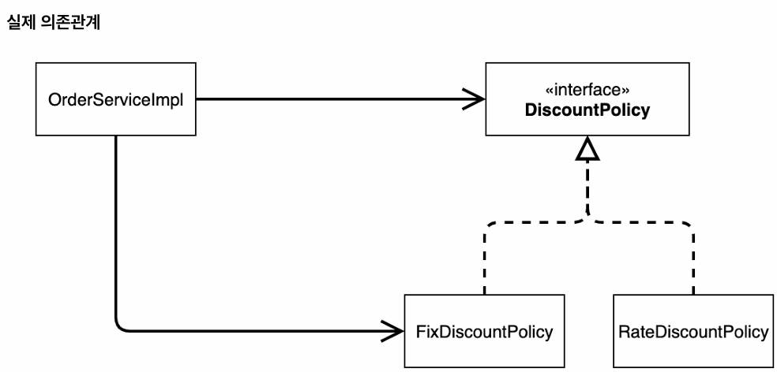
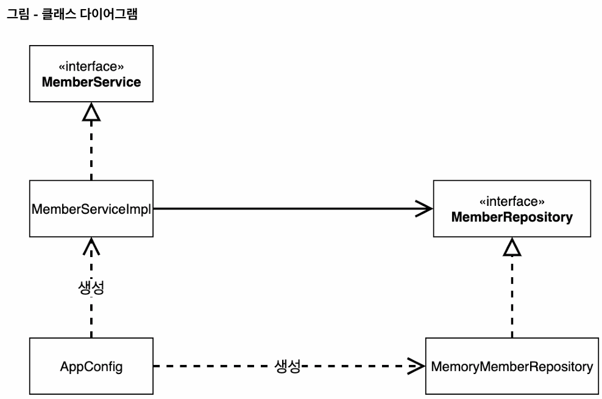
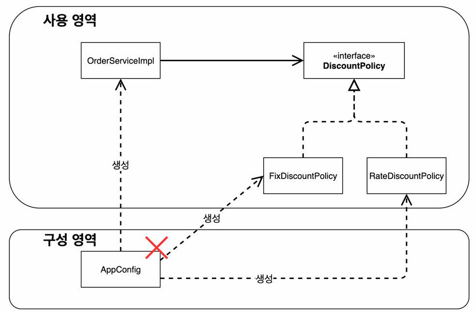
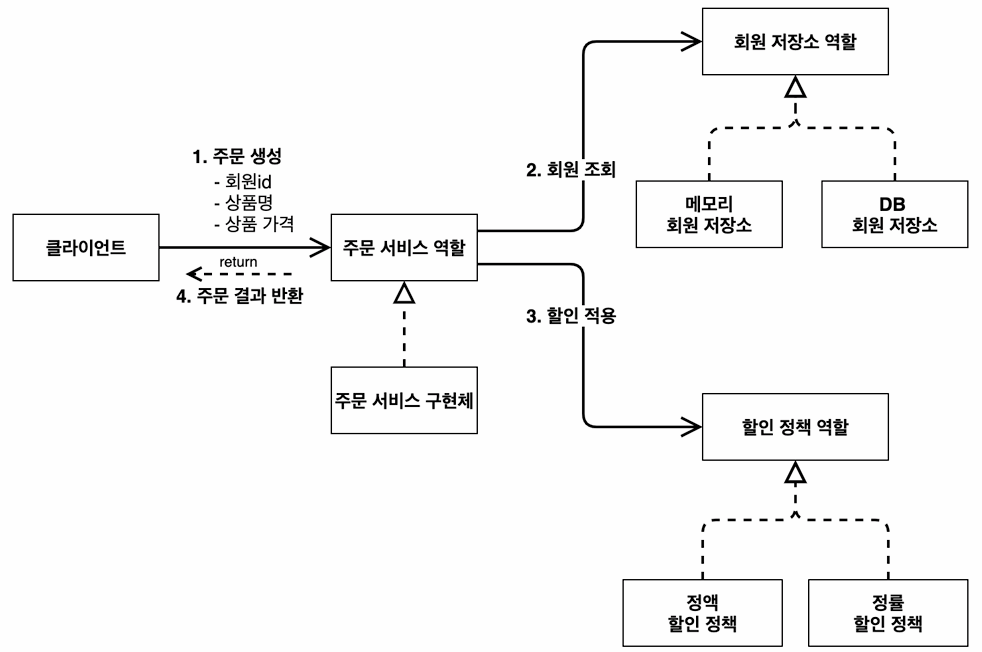
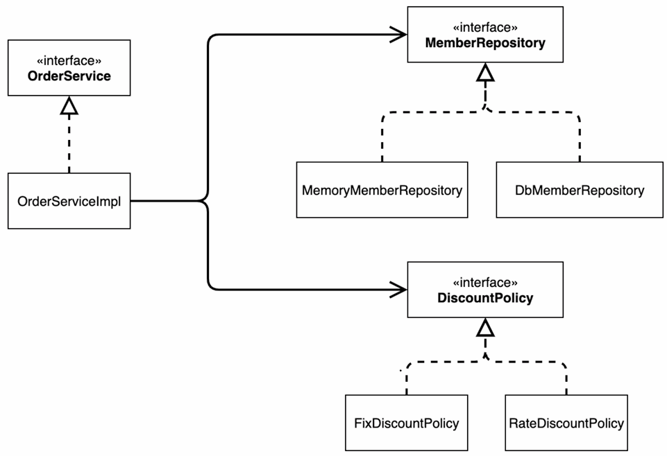

## 테스트 케이스 작성 원칙

테스트 코드를 작성할 때는 **성공 케이스(Happy Path)** 과 **실패 케이스(Failure Case)** 모두 검증해야 한다.

* **성공 케이스:** VIP 등급의 회원이 주문했을 때 할인이 정상적으로 적용되는지 확인한다.
* **실패 케이스:** 
  * 일반(BASIC) 등급의 회원이 주문했을 때 **할인이 적용되지 않는지(0원)** 검증한다. 
  * 조건에 맞지 않는 데이터가 들어왔을 때 로직이 방어적으로 잘 동작하는지 확인해야 좋은 테스트가 된다.

---

## Import와 Static Import의 차이

일반적인 `import`와 `static import`는 **가져오는 대상**과 **코드에서의 사용 방식**에서 차이가 있다.

### 1. 일반 Import (`import`)
* **대상:** 특정 패키지에 있는 클래스(Class)를 가져온다.
* **사용:** 클래스 이름을 통해 정적 메서드나 필드에 접근해야 한다.
    ```java
    import org.junit.jupiter.api.Assertions; 
    
    // 사용 시 클래스명을 명시해야 함
    Assertions.assertThat(actual).isEqualTo(expected);
    ```

### 2. Static Import (`import static`)
* **대상:** 특정 클래스 내부에 있는 **정적 메서드(Static Method)** 혹은 **정적 필드(Static Field)** 를 가져온다.
* **사용:** 클래스 이름 없이 메서드나 필드 이름을 **그대로 사용**할 수 있다.
    ```java
    // Assertions 클래스의 모든 정적 멤버를 가져옴
    import static org.junit.jupiter.api.Assertions.*; 
    
    // 클래스명 생략 가능
    assertThat(actual).isEqualTo(expected);
    ```
* **장점:** 테스트 코드(특히 AssertJ, JUnit) 작성 시 반복되는 클래스명을 생략할 수 있어 가독성이 크게 향상된다.

---

## OCP와 DIP 위반 분석



기존 코드에서 할인 정책을 변경하려고 할 때, 클라이언트인 `OrderServiceImpl`의 코드를 고쳐야 하는 상황이 발생했다. 이는 객체지향의 핵심 원칙을 위반한 것이다.

* **OCP (개방-폐쇄 원칙) 위반:**
    * 할인 정책(기능)을 확장(Open)하려고 했더니, 이를 사용하는 클라이언트의 코드를 변경(Closed 위배)해야 한다.
* **DIP (의존관계 역전 원칙) 위반:**
    * 의존 관계를 분석해보면, 클라이언트는 인터페이스(`DiscountPolicy`)뿐만 아니라 **구체적인 구현 클래스(`FixDiscountPolicy`, `RateDiscountPolicy`)에도 동시에 의존**하고 있다.
    * **"추상화(인터페이스)에 의존해야지, 구체화(구현)에 의존하면 안 된다"** 는 원칙을 위반했다.

---

## 관심사의 분리 (Separation of Concerns)

이 문제를 해결하기 위해서는 **객체를 생성하고 연결(결정)하는 역할**과 **사용하는 역할**을 명확히 분리해야 한다.

### 1. AppConfig의 등장


애플리케이션의 전체 동작 방식을 구성(Configuration)하기 위해, **구현 객체를 생성하고 연결하는 책임**을 담당하는 별도의 설정 클래스 `AppConfig`가 등장했다. 이로 인해 애플리케이션은 크게 두 가지 영역으로 나뉘게 된다.

#### **사용 영역 (Usage Area)** 
* `Controller`, `Service`, `Repository` 등 실제 비즈니스 로직이 수행되는 영역.

#### **구성 영역 (Configuration Area)** 
* `AppConfig`처럼 사용 영역의 객체들을 생성하고 조립(연결, 주입)해 주는 영역.
* `AppConfig`와 같은 구성 영역은 모든 계층을 밖에서 아우르며, 객체를 생성하고 연결하는 별도의 최상위 설정 계층에 위치한다.
* 따라서 프레젠테이션, 서비스, 도메인, 데이터 접근 계층 등 **비즈니스 로직을 수행하는 그 어떤 계층에도 속하지 않는다.**

### 2. SRP (단일 책임 원칙) 준수
* 기존 `OrderServiceImpl`은 '주문 생성' 책임과 '할인 정책 선택' 책임을 모두 가지고 있어 SRP를 위반했었다.
* 이제 `AppConfig`가 '할인 정책 선택'을 포함한 **사용 영역 전반의 '구현체 선택 및 생성' 책임을 가져가기 때문에**, `OrderServiceImpl`은 '주문 생성' 책임만 남게 되어 SRP를 준수하게 된다.

### 3. DI (Dependency Injection, 의존관계 주입)
* `AppConfig`는 생성한 객체 인스턴스의 참조(레퍼런스)를 **생성자를 통해 주입(연결)** 해준다.
* **결과:** 
  * 클라이언트(`OrderServiceImpl`) 입장에서는 마치, **의존관계를 외부에서 주입해주는 것과 같다**고 하여 DI(Dependency Injection)라고 한다. 
  * 클라이언트는 어떤 구현체가 들어올지 알 수 없으며, 오직 사용하는 역할에만 집중한다.

### 관심사의 분리 효과


> AppConfig를 통해 관심사를 분리한 결과, 애플리케이션이 크게 사용 영역과 구성 영역으로 분리되었다.

덕분에 구현체를 바꾸더라도, 구성 영역만 변경하게 되었다. **(사용 영역은 건드리지 않아도 된다.)**

--- 

## 현재 코드의 한계와 과제 (중복 생성)

현재 작성된 `AppConfig` 코드를 보면, 리포지토리가 중복 생성되는 문제가 있다.

```java
public MemberService memberService() {
    return new MemberServiceImpl(new MemoryMemberRepository()); // 1번 저장소 생성
}

public OrderService orderService() {
    return new OrderServiceImpl(new MemoryMemberRepository(), ...); // 2번 저장소 생성
}
```

### **문제점** 
- `new MemoryMemberRepository()`가 두 번 호출되면서 **서로 다른 메모리 공간을 가진 리포지토리가 2개 생성**된다. 
- 이로 인해 회원 가입 데이터와 주문 시 조회하는 데이터가 일치하지 않는 문제가 발생한다.

### **의도** 
- 이는 강의의 빌드업 과정으로, 순수 자바 코드로만 작성했을 때 발생하는 한계를 보여준다. 
- 클래스 별로 싱글톤을 보장하도록 개선할 수는 있지만, 아래 예시(`MemoryMemberRepository`에 싱글톤 적용)와 같이 **코드가 지저분해지고 유연성이 저하되는 문제가 발생**한다.
- 다만 **순수 자바 코드에서 클래스 별로 싱글톤을 보장하도록 했더라도**, '테스트 코드의 독립성'을 지키기 위해서는 `@AfterEach` 등을 통해 **초기화된 상태를 유지해야 하는 번거로움이 재차 발생**한다. 

#### 1. MemoryMemberRepository
먼저, 레포지토리 클래스 자체에 싱글톤 패턴을 적용해야 한다.
```java
  public class MemoryMemberRepository implements MemberRepository {

  // 1. static 영역에 객체를 딱 1개만 생성해둔다.
  private static final MemoryMemberRepository instance = new MemoryMemberRepository();

  // 2. public으로 열어두되, 객체 인스턴스가 필요하면 이 static 메서드를 통해서만 조회하도록 허용한다.
  public static MemoryMemberRepository getInstance() {
      return instance;
  }

  // 3. 생성자를 private으로 선언해서 외부에서 new 키워드를 사용한 객체 생성을 못하게 막는다.
  private MemoryMemberRepository() {
  }

  @Override
  public void save(Member member) {
      // ... 저장 로직
  }

  @Override
  public Member findById(Long memberId) {
      // ... 조회 로직
      return null;
  }
}
```

#### 2. AppConfig
더 이상 `AppConfig`에서 `new`를 사용할 수 없게 되었으므로, `getInstance()`를 호출해야 한다.
```java
public class AppConfig {

    public MemberService memberService() {
        // return new MemberServiceImpl(new MemoryMemberRepository()); // 기존 (X)
        return new MemberServiceImpl(MemoryMemberRepository.getInstance()); // 변경 (O)
    }

    public OrderService orderService() {
        // return new OrderServiceImpl(new MemoryMemberRepository(), fixDiscountPolicy()); // 기존 (X)
        return new OrderServiceImpl(MemoryMemberRepository.getInstance(), fixDiscountPolicy()); // 변경 (O)
    }
    
    // ...
}
```

---

## AppConfig 리팩터링: 역할과 구현의 명확한 분리

기존의 `AppConfig`는 관심사를 분리하는 데는 성공했지만, 코드상에서 **역할과 구현이 한눈에 들어오지 않는 한계**와 **중복**이 존재했다. 이를 해결하기 위해 리팩터링을 진행한다.

### 1. 문제점: 역할의 은폐와 중복
* **역할의 부재:** `new MemoryMemberRepository()` 같은 구체적인 구현 코드는 보이지만, 이것이 `MemberRepository`라는 **역할**임이 명확히 드러나지 않는다.
* **중복 발생:** `MemberService`와 `OrderService`에서 각각 `new MemoryMemberRepository()`를 호출하므로, 리포지토리 생성 코드가 중복된다.

### 2. 해결 방안: 역할 드러내기 (Extract Method)
`new MemoryMemberRepository()`나 `new FixDiscountPolicy()` 같은 생성 로직을 별도의 메서드로 추출(Extract Method)하여 **역할을 명확한 메서드 이름으로 드러낸다.**

* **Before:**
    ```java
    return new MemberServiceImpl(new MemoryMemberRepository()); // 역할이 숨겨짐
    ```
* **After:**
    ```java
    return new MemberServiceImpl(memberRepository()); // 역할(메서드)이 드러남
    
    public MemberRepository memberRepository() {
        return new MemoryMemberRepository(); // 구현이 안에 들어감
    }
    ```

### 3. 리팩터링의 효과: 애플리케이션 구성의 가시화



리팩터링된 `AppConfig`를 보면 클래스 다이어그램의 설계 내용이 그대로 코드에 투영된다.

#### 전체 구성(역할과 구현)을 빠르게 캐치
* **메서드 이름 (`memberRepository`)** = **역할 (Role)**
* **메서드 반환값 (`new MemoryMemberRepository`)** = **구현 (Implementation)**
* `AppConfig` 코드만 봐도 애플리케이션의 전체 구성을 한눈에 파악할 수 있다.
  * 즉, 애플리케이션의 전체 배역(역할)과 배우(구현)을 바로바로 찾을 수 있다.
  * 단순히 관심사의 분리만 적용했던 기존 `AppConfig`에 비해서 **역할과 구현의 분리**가 훨씬 명확해졌다.

#### 변경의 용이성 
- 구현체를 변경할 때(예: `Memory` -> `JDBC`), `AppConfig`의 다른 코드는 볼 필요 없이 **해당 역할에 해당하는 메서드 내부의 반환값(생성 객체)만 변경**하면 된다.

---

## 제어의 역전 (IoC, Inversion of Control)
> **기존 프로그램과 달리, 프로그램의 제어 흐름을 개발자가 아닌 외부(`AppConfig`, 프레임워크)에서 관리하는 것**을 말한다.

### 기존 프로그램
- 클라이언트 구현 객체가 스스로 필요한 서버 구현 객체를 생성하고, 연결하고, 실행했다.
- 구현 객체가 프로그램의 제어 흐름(객체 생성, 연결, 실행 시점 결정)을 스스로 조종했다.

### 설정 클래스(`AppConfig`) 등장 이후 
- **구현 객체는 자신의 로직을 실행하는 역할만 담당**한다.
  - 더 이상 스스로 객체를 생성하거나, 연결하거나, 실행 시점(로직을 언제 실행할건지)을 결정하지 못한다.
  - 즉, 구현 객체는 자신의 로직만 수행할 뿐, 어떤 구현체가 들어오는지 알 수 없게 되었다.
- **제어권의 이동:** 프로그램의 제어 흐름에 대한 권한이 `AppConfig`로 넘어갔다.

---

## 프레임워크 vs 라이브러리
> 둘을 구분하는 핵심 기준은 **"누가 제어 흐름을 쥐고 있는가(IoC)"** 이다.

### 프레임워크 (IoC 적용)
- **외부에서**(프레임워크가) 제어 흐름을 담당한다.
- 예(**JUnit**): **개발자는 테스트 로직만 작성하면, 실행과 생명주기 관리는 JUnit 프레임워크가 알아서 수행**한다.

### 라이브러리 (IoC 미적용)
- **개발자가 작성한 코드가** 직접 제어 흐름을 담당한다.
- 예(**XML/JSON 파서**): 개발자가 필요할 때 직접 라이브러리를 호출해서 사용한다.

---

## 의존관계 주입 (DI, Dependency Injection)
> **객체를 직접 생성(`new`)하지 않고, 외부에서 생성된 객체를 넣어주는 방식**

애플리케이션 실행 시점(런타임)에 외부에서 실제 구현 객체를 생성하고 클라이언트에 전달하여, 클라이언트와 서버의 실제 의존관계가 연결되는 것을 말한다.

### 정적인 클래스 의존관계
- 애플리케이션을 실행하지 않고 코드(import문 등)만 보고도 분석할 수 있는 관계이다.
  - 인텔리제이에서는 패키지나 클래스 우클릭 → `Show Diagram` → `Show Dependencies`를 통해 시각적으로 확인 가능하다.
- 예: `OrderServiceImpl`은 `MemberRepository` 인터페이스를 의존하고(알고) 있다.

### 동적인 객체(인스턴스) 의존관계
- 애플리케이션 실행 시점(런타임)에 실제 생성된 객체 인스턴스의 참조가 연결된 관계이다.

### DI가 갖는 의의
- 정적 클래스 의존관계를 변경하지 않고(기존 클라이언트 코드를 수정하지 않고), 객체(인스턴스) 의존관계(구현체)를 쉽게 변경할 수 있다.

---

## IoC 컨테이너, DI 컨테이너
> **`AppConfig`처럼 객체를 생성하고 관리하면서 의존관계를 연결해 주는 것**을 말한다.

### 다양한 명칭
- IoC 컨테이너, DI 컨테이너뿐만 아니라 다양한 명칭으로 불리지만,
  - 어셈블러: **애플리케이션 전체에 대한 조립을 여기서 한다**는 의미에서.
  - 오브젝트 팩토리: 말그대로 오브젝트를 만들어낸다고 해서.
- IoC는 범용적이기 때문에, 주로 '의존관계 주입'에 초점을 맞추어 DI 컨테이너라고 부르는 것이 일반적이다.
  - IoC: **프로그램의 제어 흐름을 외부로 위임(개발자가 아닌 외부에서 관리)한다**는 설계 원칙
  - DI: **IoC를 달성하기 위해 제어 흐름(객체 생성, 의존관계 주입)을 컨테이너에 위임**하는 구체적인 패턴

### DI가 아닌 다른 IoC도 있겠네?
> 그렇다. IoC는 '**제어 흐름을 외부로 위임한다는 설계 원칙**'이고, DI는 **IoC를 구현하는 구체적인 패턴**이기 때문이다.

#### 예시: 상속을 통한 IoC
1. 부모 클래스: `process()` 메서드 안에 `step1()`, `step2()`를 순서대로 호출하는 로직(제어 흐름)을 다 짜놓는다.
2. 자식 클래스: `step1()`, `step2()` 메서드를 오버라이딩한다.
3. 실행: `process()`을 실행하면, 부모는 자식의 메서드를 호출하게 된다.
   - IoC 여부: 제어권이 (자식 클래스 본인이 아닌) 부모에게 있기 때문에 IoC지만,
   - DI 여부: 외부에서 객체를 주입받은 게 아니기 때문에 DI는 아니다. (**제어권을 뺏긴 상태에서 의존관계 주입도 발생해야 DI이다.**)

---

## '의존'의 의미
### OrderServiceImpl(구현)이 OrderService(역할)을 의존한다고 볼 수 있을까?
> **엄밀히 말하면 의존하는 것이 맞다.**

- 의존한다는 말은 흔히 '**알고 있다**'로 해석되곤 하지만, '**대상이 변하면 나도 영향을 받는다**'로 볼 수도 있다.
  - 즉, 'A가 B에게 의존한다'는 말은 곧 'B가 변하면 A도 영향을 받는다'로 해석할 수 있다.
  - 예) `OrderService`에서 인터페이스의 메서드 이름이 바뀌면, 이를 구현하는 `OrderServiceImpl`의 코드도 수정해야 한다.



- 위 그림에서 `OrderServiceImpl`은 `OrderService`, `MemberRepository`, `DiscountPolicy`에 의존한다.
  - 대상(`OrderService`)이 변하면 본인 역시 변해야 하기 때문이고,
  - `MemberRepository`와 `DiscountPolicy`를 알고 있기 때문이다. (어떤 방식으로 해석해도 됨)

---

## 스프링 컨테이너와 설정 정보(`@Configuration`)

### 구성(설정 정보, `Configuration`)
> 애플리케이션이 어떻게 구성되는지, 즉 **애플리케이션의 구성(설정 정보)를 담당하는 파일**이다.

- '구성'이라는 단어보다는 '**설정 정보**'라는 표현이 더 와닿는 것 같다.
- 클래스 레벨에 `@Configuration`을 붙여 사용한다.

### 스프링 컨테이너(`ApplicationContext`)
> **스프링의 모든 것은 `ApplicationContext`에서 시작하며, 이것이 곧 스프링 컨테이너이다.**

#### 생성 방법
```java
new AnnotationConfigApplicationContext(AppConfig.class) // 설정 정보를 넘긴다.
```
- **파라미터로 구성 클래스를 넘겨주면, 해당 구성(설정 정보)을 반영하여 스프링 컨테이너가 만들어진다.**

### 스프링 빈 등록 과정
> **스프링 컨테이너는 설정 정보(`@Configuration`)에 있는 `@Bean`이 붙은 메서드들을 스프링 빈으로 등록한다.**

- `Map<메서드명, 반환 객체>`의 형태로 저장하며, 스프링 컨테이너에 등록된 Bean 객체들은 스프링 컨테이너가 관리한다.

### 스프링 빈 사용 방법과 등록 의의
- 기존처럼 `new`로 직접 생성하는 것이 아니라, `applicationContext.getBean("Bean 객체명", "해당 클래스")`을 통해 **컨테이너에서 꺼내서 사용한다.**
- 객체의 생성과 관리를 스프링 컨테이너가 담당하게 되었기 때문에, 스프링 컨테이너의 많은 기능과 이점을 누릴 수 있게 된다.