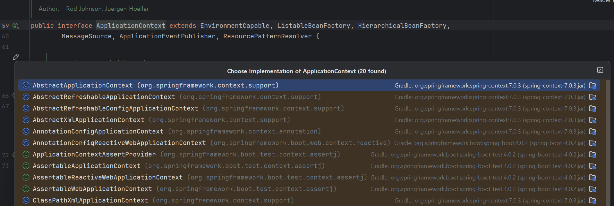
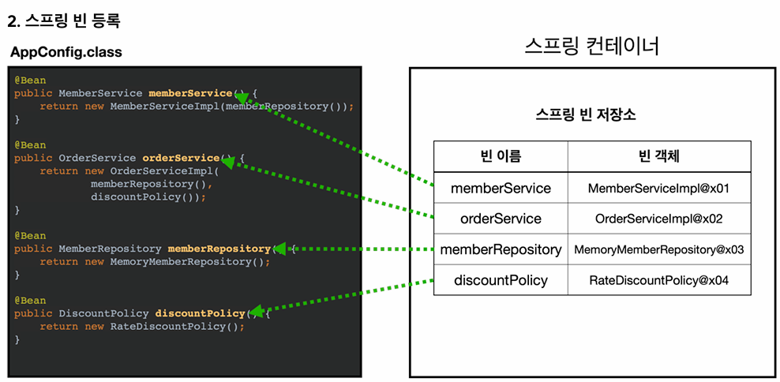
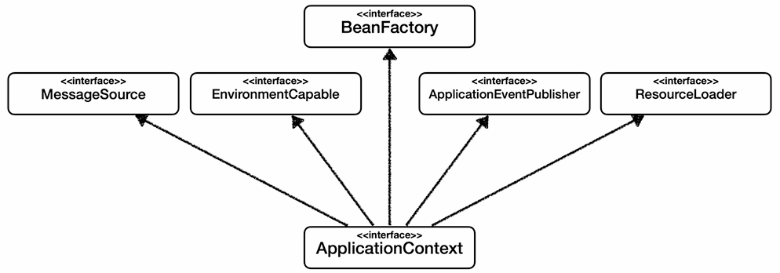
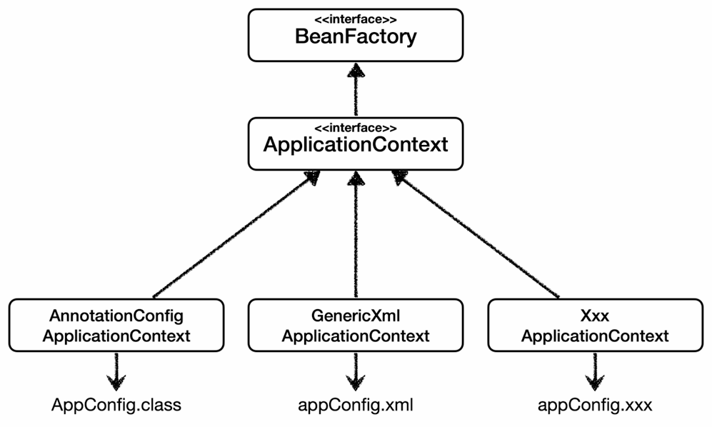
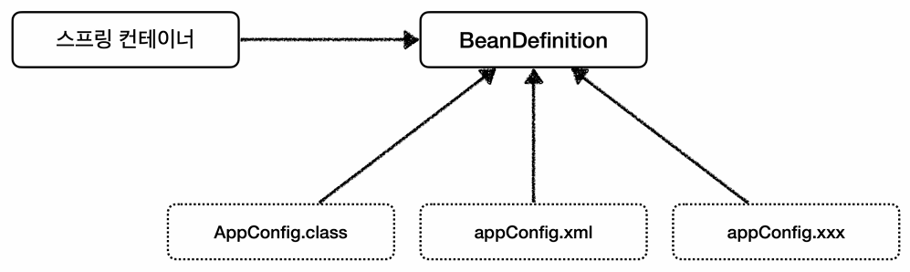
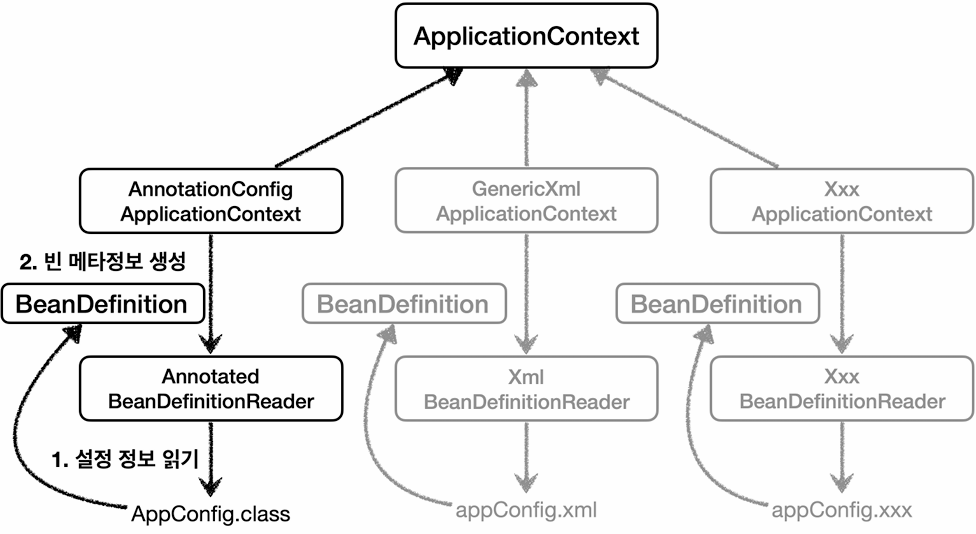

## 스프링 컨테이너(`ApplicationContext`)
### 개요
- `ApplicationContext`를 스프링 컨테이너라 한다.
- 인터페이스로 정의되어 있으며, 다형성이 적용되어 있다.

### 생성(설정) 방식
- XML 기반: 과거에 주로 사용했으나, 현재는 주로 사용하지 않는다.
- 설정 클래스(애노테이션) 기반: `AppConfig.class`처럼 자바 코드로 설정 정보(`@Configuration`)를 구성하여 생성하는 방식이다.

### 구현체 확인


- `Shift` + `Shift` → `Classes` 탭에서 `ApplicationContext` 검색
- 클래스 시그니처 왼쪽의 아이콘을 클릭(또는 `Ctrl` + `H`)하면 구현체 목록을 확인할 수 있다.

### 스프링 컨테이너의 생성 과정
스프링 컨테이너가 생성되고 동작하는 대략적인 흐름은 다음과 같다.

#### 1. 스프링 컨테이너 생성
```java
new AnnotationConfigApplicationContext(AppConfig.class) // 설정 정보 넘김
```
- 스프링 컨테이너를 생성할 때는 구성 정보(설정 정보)를 인자로 넘겨주어야 한다.

#### 2. 스프링 빈 등록


- **파라미터로 넘어온 설정 클래스(`AppConfig`) 정보를 사용하여 @Bean이 붙은 메서드들을 호출하고, 반환된 객체를 스프링 빈 저장소(Map)에 등록한다.**

#### 3. 스프링 빈 의존관계 주입
- 설정 정보를 참고해서 의존관계를 주입한다.

### 생성자 주입의 특성
- 원칙적으로 스프링 사이클은 스프링 빈 등록 단계와 의존관계 주입 단계가 명확히 구분되어 있다.
- **하지만 '생성자 주입'을 사용하는 경우 객체를 생성하는 시점에 의존관계가 주입되어야 하기 때문에, 이 경우에만 예외적으로 두 단계(생성과 DI)가 동시에 일어나게 된다.**

---

## 스프링 빈(Bean)
### 네이밍 정책
> **Bean 이름은 항상 고유해야 한다.**

### 역할 (BeanDefinition Role)
> **스프링 컨테이너에 등록된 빈들은 역할(Role)에 따라 구분된다.**

#### `BeanDefinition.ROLE_APPLICATION`
- **사용자가 직접 등록한 애플리케이션 빈**이다.
- 즉, 스프링이 내부 로직을 수행하기 위해 자동으로 등록한 빈이 아니라, **사용자가 애플리케이션을 개발하기 위해 직접 등록한 빈**을 의미한다.

#### `BeanDefinition.ROLE_INFRASTRUCTURE`
- **스프링이 내부 로직을 수행하거나 기술적인 지원을 담당하기 위해 자동으로 등록한 빈**이다.

#### `BeanDefinition.ROLE_SUPPORT`
- 거의 사용하지 않는다.

---

## 스프링 빈 조회
### 기본
`ApplicationContext`(`ac`)를 통해 빈을 조회하는 가장 기본적인 방법 3가지이다.

#### 1. 이름으로 조회
```java
ac.getBeans("memberService")
```
- **타입을 지정하지 않으면 `Object`로 변환되므로 캐스팅이 필요하다.**

#### 2. 이름과 타입으로 조회
```java
ac.getBeans("memberService", MemberService.class)
```
- **명확하기 때문에, 가장 많이 사용하는 방법**이다.

#### 3. 타입으로 조회
```java
ac.getBeans(MemberService.class)
```
- 같은 타입의 빈이 하나만 있다면 이처럼 이름 없이도 조회할 수 있다.
- **같은 타입의 빈이 여러 개 존재하는 경우, `NoUniqueBeanDefinitionException` 오류가 발생**한다.

#### +) 구현체로 조회
```java
ac.getBeans(MemberServiceImpl.class)
```
- 역할(인터페이스)이 아닌 구현체로 조회하는 방법이다.
- 이는 유연성이 떨어지므로(DIP 위배), **"이런 기능도 있다"** 정도로만 알아두는 것이 좋다.

### 동일한 타입이 둘 이상일 때 (Duplicate Type)
> **Bean 이름을 지정하거나, 해당 타입의 모든 Bean을 조회하여 해결한다.**

```java
ac.getBeansOfType(MemberRepository.class); // 모두 조회: 해당 타입의 모든 Bean 조회
```

### 상속
> **부모 타입으로 조회하면, 자식 타입은 모두 함께 조회된다**는 원칙을 기억하자.

- 때문에 **자바 객체의 최상위 부모인 `Object`로 조회하면, 스프링 컨테이너에 있는 모든 빈이 조회된다.**
  - 즉, 역할이 `INFRASTRUCTURE`인 빈까지 모두 조회된다.

### 실무에서는?
- **사실 개발자가 `ApplicationContext`(스프링 컨테이너)에서 직접 `getBean()`을 호출할 일은 거의 없다.**
- 하지만 다음의 이유 때문에, 학습 과정에서는 알아둘 필요가 있다.
    - 스프링 컨테이너가 어떻게 빈을 찾고 관리하는지 기본 원리를 이해해야 한다.
    - 간혹 레거시 코드를 다루거나, 순수 자바 앱에서 스프링 컨테이너를 독자적으로 띄울 때는 해당 지식이 필요하다.

---

## static Inner Class
### Why Inner Class?
> **해당(외부) 클래스 내부에서만 사용하기 위함이다.**

### Why static?
> **외부 클래스와는 무관하게 독립적으로 내부 클래스를 생성하기 위함**이다. **(즉, 외부 클래스의 인스턴스 없이도)**

---

## JUnit5 예외 테스트와 람다 함수
### `assertThrows`와 람다식 활용
- 테스트 코드 작성 시 특정 예외가 발생하는지 검증하기 위해 주로 `assertThrows`를 사용한다.
- 이때 실행할 로직을 전달하기 위해 자바8의 람다 문법을 활용한다.
```java
// 예시: join() 메서드 실행 시 IllegalStateException이 발생해야 성공
assertThrows(IllegalStateException.class, () -> memberService.join(member1));
```

### 람다와 익명 클래스의 관계
> **람다 함수는 익명 클래스를 대체한다.**

- `asssertThrows`의 2번째 파라미터는 `Executable`이라는 함수형 인터페이스다.
- 과거에는 이를 구현하기 위해 `new Executable() {...}` 형태의 익명 내부 클래스를 사용했다.
- 하지만, 자바8부터는 람다식을 통해 불필요한 코드를 제거하고 핵심 로직만 간결하게 표현할 수 있게 되었다.
  - 즉, **`new XXX() {...}`에서 매개변수와 실행 블록을 `() -> {...}` 형태로 간단하게 표현한 것**이다.

---

## BeanFactory와 ApplicationContext
### BeanFactory
- 스프링 컨테이너의 최상위 인터페이스다.
- **스프링 빈을 관리하고 조회하는 역할(`getBean()`)을 담당**한다.

### ApplicationContext
- `BeanFactory`의 기능을 모두 상속받는다.
- **빈 관리 기능에 더하여, 수많은 부가 기능을 제공**한다.

> **그렇기에 BeanFactory나 AC 모두 스프링 컨테이너라 부르지만, 개발자는 대부분의 상황에서 AC를 사용한다.** (BeanFactory를 사용할 일은 거의 없다)

### ApplicationContext가 제공하는 부가 기능
> **AC는 Bean 관리 이외에도 EA(Enterprise App.) 개발에 필요한 다양한 부가 기능을 ISP에 따라 상속받아 제공한다.**



#### 메시지 소스를 활용한 국제화 (`MessageSource`)
- 한국에서 접속하면 한국어, 영어권에서 접속하면 영어로 출력하는 기능을 지원한다.

#### 환경변수 (`EnvironmentCapable`)
- 로컬(Local), 개발(Dev/Test), 운영(Prod) 등 환경에 따라 구분해서 처리해야 하는 설정 정보를 관리한다.

#### 애플리케이션 이벤트 (`ApplicationEventPublisher`)
- 이벤트를 발행하고 구독하는 모델을 편리하게 지원하여, 로직 간의 결합도를 낮춘다.

#### 편리한 리소스 조회 (`ResourceLoader`)
- 파일, 클래스패스, 외부 URL 등 다양한 위치에 있는 리소스를 추상화하여 편리하게 읽어들일 수 있는 기능을 제공한다.

---

## 스프링 XML 구성 (Spring XML Configuration)
### 개요
#### 스프링의 다양한 설정 형식 지원

> **스프링은 자바 코드, XML, Groovy 등 다양한 형식의 구성(설정 정보)을 받아들일 수 있도록 유연하게 설계되어 있다.**

#### 사용 추세
- 최근에는 **스프링 부트를 많이 사용하면서 자바 코드 기반의 설정(`@Configuration`)이 주류**가 되어, XML을 거의 사용하지 않는다.

#### 학습 목적
- 하지만 아직 XML을 사용하는 레거시 프로젝트가 존재한다.
- 또한, XML 기반의 설정은 **컴파일 없이 설정 파일만 수정하여 Bean 구성을 변경할 수 있다**는 장점이 있다.
- 때문에, 스프링 컨테이너가 얼마나 유연한지 이해하는 차원에서 가볍게 알아두는 정도로 살펴보도록 한다.

### 설정 파일 위치와 로딩 방식
#### 위치: `src/main/resources/appConfig.xml`
- 자바 소스 코드(`src/main/java`)가 아닌 리소스 폴더(`src/main/resources`)에 위치한다.

#### 로딩 방식의 차이
- **자바 설정:** `new AnnotationConfigApplicationContext(AppConfig.class)`
  - 클래스파일(컴파일된 클래스 정보, `Class<?>`)을 인자로 넘긴다.
- **XML 설정:** `new GenericXmlApplicationContext("appConfig.xml")`
  - 클래스패스 상의 리소스(`resources`) 파일 경로(`String`)를 인자로 넘긴다.
  - 즉, **`resources` 디렉토리를 기준으로 파일을 탐색한다.**

### 문법
> 자바 코드의 `@Bean` 설정을 XML 태그로 옮긴 형태이다.

#### `<bean>` 태그
- 스프링 빈을 등록할 때 사용한다.
  - `id`: 빈의 이름(주로 역할/인터페이스 이름으로 지정, **자바(어노테이션) 기반의 설정에서 그랬던 것처럼**)
  - `class`: 실제 생성할 구현체 클래스의 전체 경로 (패키지명 포함)

#### `<constructor-arg>` 태그
- 생성자 주입을 담당한다.
  - `ref`: 의존할 다른 빈(즉, 의존대상)의 `id`를 지정한다.

```xml
<!-- id: Bean 객체명, class: 구현체 경로-->
<bean id="memberService" class="hello.core.member.MemberServiceImpl">
    <!-- ref: 의존대상의 Bean 객체명-->
    <constructor-arg ref="memberRepository" />
</bean>

<bean id="memberRepository" class="hello.core.member.MemoryMemberRepository" />
```

### 그래서 왜 배운다고?
> XML 사용법 자체보다는 **스프링이 설정 정보의 형식을 가리지 않고 유연하게 빈을 등록하고 관리할 수 있다**는 사실을 이해하기 위함이다.

---

## BeanDefinition (빈 설정 메타정보)
### 개념
> **스프링이 자바 코드(`@Configuration`), XML, Groovy 등 다양한 설정 형식을 지원할 수 있는 핵심 이유**는 바로 **BeanDefinition이라는 추상화** 덕분이다.



- **스프링 컨테이너는** 설정 정보(Config)가 자바 코드로 되어 있는지, XML로 되어 있는지 알 필요가 없다.
- **그저 BeanDefinition만 보고 Bean 객체들을 만들면 된다.**
  - **BeanDefinition을 보고 Bean 객체를 직접 생성할지, 위임할지(팩토리 메서드 방식)를 결정하게 된다.**


- 정확히는 스프링 컨테이너(AC) 구현체 별로 가지고 있는 `XXXBeanDefinitionReader`가 동작한다.
  - `XXXBeanDefinitionReader`가 설정 정보(`AppConfig.XXX`)를 읽고 `BeanDefinition`을 생성하여 컨테이너(구현체)에 등록한다.
  - **구현체는 등록된 `BeanDefinition`을 통해 'Bean을 어떻게 만들어야 할지'에 대해 숙지하게 된다.**
    - 예) 이 클래스를, 이 스코프로, 이 생성자 인자를 넣어서, ...

### 메타정보
> **어떤 대상(Data)을 설명하기 위한 데이터(Data) (마치, 요리와 레시피의 관계)**

- 단순히 클래스 이름만 있는 것이 아니라, **객체를 어떻게 생성하고 관리할지에 대한 모든 지침**이 들어 있다.
  - **Scope:** 싱글톤인지 프로토타입인지?
  - **lazyInit:** 컨테이너 뜰 때 생성할지(`false`), 실제 요청할 때 생성할지(`true`)?
  - **Init/Destroy Methods:** 생성 후/소멸 전 호출할 메소드는 무엇인지?
  - **Constructor Args:** 의존대상은 무엇인지?
  - **FactoryBeanName/FactoryMethodName:** 팩토리 메서드 방식이면 값(각각 `appConfig`, `memberService`)이 들어가고, 아니면 `null`

### 빈을 등록하는 2가지 방식 (직접 등록 vs 팩토리 메서드 방식)
> **누가 `new`를 호출하는 코드를 작성했는지**, 즉 **빈을 생성하는 주체와 방법**에 관련된 이야기이다.
>
> **앞서 공부했던 자동 등록(`@ComponentScan` 방식)/수동 등록(Java Code Configuration, 즉 `@Configuration` 설정 클래스 생성 방식) 개념과는 다르다.**

#### 직접 등록
> 스프링 내부에서 `Reflection` 등의 기술을 통해 **컨테이너가 직접 `new` 키워드를 사용하여 객체를 생성하는 방식**
- 특징
  - 빈의 클래스 경로(Class Name)가 명확히 드러난다. 
- 상황 (어떨 때 빈이 직접 등록되는가?)
    - **XML의 `<bean class="hello.core...MemberServiceImpl">`**: **빈으로 등록할 클래스의 위치만 알려줬을 뿐, 개발자(설정 파일)가 `new`를 통해 Bean 객체를 생성하지 않음** 
    - **`@Component`(자동 등록):** 클래스 자체에 붙어 있으므로, 스프링이 해당 클래스를 직접 생성한다.
- 예시
  - XML 파일에 `class="...MemberServiceImpl"`라고 클래스 경로(이름)만을 적어둔다. (**즉, XML 파일에서 생성 방법을 알고 있는 것이 아님!**)
  - **스프링 컨테이너는 해당 경로(`String`)를 보고, 리플렉션 기술을 사용해 직접 `new MemberServiceImpl()`을 호출하여 객체를 생성한다.**

#### 팩토리 메서드 방식
> 컨테이너가 팩토리에 있는 메서드를 호출하면, **해당 메서드가 Bean 객체를 생성하여 컨테이너에 반환하는 방식**

- 특징
  - **스프링 컨테이너가 빈 생성의 책임을 팩토리(외부의 어떤 공장) 객체에 위임한다.**
  - 왜냐하면 스프링 컨테이너는 빈 생성 방법을 모르고, 팩토리 객체만 알고 있기 때문이다.
- 상황 (어쩔 때 팩토리에게 빈 생성을 위임하는가?)
  - **자바 설정 클래스(`@Configuration`)**
- 예시
  - **자바 설정 클래스(`@Configuration`) 내부에 개발자가 직접(`new`를 사용하여) Bean 객체 생성 방법을 정의하였다.** 
  - 따라서, **스프링은 해당 객체를 생성하는 방법을 모른다.** (자바 설정 클래스라는 팩토리만이 알고 있을 뿐)
  - 그렇기에, 스프링은 빈 생성 메소드(팩토리 메소드)를 호출하기만 한다. (**그 결과로 Bean 객체가 생성되었을 뿐이지, 스프링이 생성한 것이 아니다.**)

### 실무에서는 볼 일이 없다.
> **개발자가 BeanDefinition을 직접 정의하거나 코드로 볼 일은 거의 없다.**

### 그럼 왜 배워?
- **스프링이 어떻게 다양한 설정 포맷을 유연하게 처리하는지(추상화)를 이해**하기 위함이다.
- 또한, 추후에 오픈소스나 프레임워크 내부 코드를 볼 때 재등장할 수 있다.

### ApplicationContext에서는 BeanDefinition을 알 수 없다.
> **AC는 빈을 사용하는 역할이기 때문에 `getDefinition`같은 기능이 필요도 없고, 알 수도 없다.**

- 만약 알고 싶으면 구현체(`XXXBeanFactory`, `AnnotationConfigAC`)로 선언하면 된다. (평소에는 몰라도 된다는 뜻이다.)

---

## 인텔리제이 단축키
- `iter` + `tab`
  - 리스트나 배열이 있을 때 사용하면, 해당 컬렉션을 순회하는 `for-each`문이 자동으로 완성된다.
- `soutm` (method)
  - 현재 실행 중인 클래스명과 메서드명을 출력하는 코드를 생성한다.
  - 예) `System.out.println("ApplicationContextInfoTest.findApplicationBean");`
- `soutv` (variable)
  - 직전에 선언된 변수의 이름과 값을 출력하는 코드를 생성한다.
- `shift` + `shift` (Search Everywhere)
  - 전체 검색 창을 연다.
- `Alt` + `O`
  - 검색 범위를 지정한다. (라이브러리 등을 포함하여 찾을지 여부 결정)
