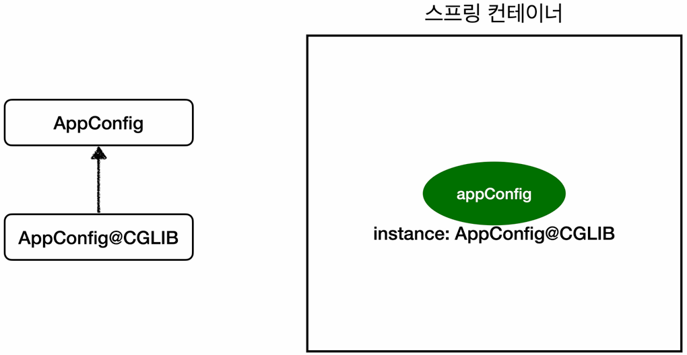

## 웹 어플리케이션과 싱글톤 (Singleton)
### 스프링의 탄생 배경과 웹 어플리케이션
- **태생:** 스프링은 태생적으로 **기업용 온라인 서비스 기술**을 지원하기 위해 탄생했다.
- **서버의 형태:** 서버는 웹 어플리케이션뿐만 아니라 데몬, 배치 등 다양한 형태로 존재하지만, **대부분이 웹 어플리케이션**이다.

### 순수한 DI 컨테이너의 문제점
- 스프링 없이 `new AppConfig()`를 통해 만든 순수한 DI 컨테이너를 생각해보자.
- 클라이언트가 요청할 때마다 `appConfig.memberService()` 등을 호출하여 객체를 생성하게 된다. (즉, **메모리 낭비 문제가 발생**한다.)
  - 만약 TPS가 100이라면, 초당 100개의 객체가 생성되고 소멸된다.
  - 아무리 GC 성능이 좋아졌다지만, 이는 심각한 메모리 낭비를 초래한다.
- 따라서, 해당 객체를 딱 1개만 생성해놓고, 요청이 올 때마다 이를 공유해서 쓰도록 하는 것이 좋다. (**싱글톤의 등장 배경**)

### 싱글톤 패턴
> **클래스의 인스턴스가 딱 1개만 생성되는 것을 보장하는 디자인 패턴**이다.

#### 구현 방법
- **static 인스턴스:** 
  - 클래스 레벨에 딱 하나만 존재하도록 만든다.
  - 예) `private static final SingletonService instance = new SingletonService();`
- private 생성자:
  - 외부에서 `new` 키워드로 임의의 인스턴스를 생성하지 못하도록 막는다.
  - 이는 **실행 시점에 오류가 터지지 않고, 컴파일 시점에 막히도록 설계한 방식**이므로 **좋은 설계**라고 볼 수 있다.

#### 문제점
> **싱글톤 패턴은 메모리 효율이라는 장점이 있지만, 안티 패턴으로 불릴 만큼 수많은 문제점을 동반한다.**

- **코드 복잡성 증가:** 싱글톤을 구현하기 위한 코드 자체가 많이 들어간다.
- **DIP 위반:** 
  - 클라이언트가 역할이 아니라 구현체에 의존한다.
  - 예) `Client` → `Singleton.getInstance()`
- **OCP 위반:** 구현체에 의존하기 때문이다.
- **유연성 저하:** 
  - 인스턴스가 미리 생성/고정되어 있기 때문에, 테스트 시 **Mock 객체 등으로 교체하기가 매우 어렵다.**
  - 또한, `private` 생성자를 사용하므로 자식 클래스를 만들기 어렵고, 내부 속성을 변경하거나 초기화하기도 어렵다.

#### 하지만..
> **스프링 프레임워크는 싱글톤 패턴의 모든 문제점을 해결하면서, 객체를 싱글톤으로 관리해준다.**

- 객체를 싱글톤으로 관리함에도,
  - 지저분한 싱글톤 구현 코드(`static`, `getInstance` 등)가 전혀 필요 없고,
  - DIP, OCP, 테스트, `private` 생성자 문제로부터도 자유롭기 때문이다.

---

## 검증 메서드 비교 (isSameAS vs isEqualTo)
### isSameAs
> `==` 비교 **(참조값 비교, 메모리 주소가 같은지 확인)**

### isEqualTo
> `equals()`비교 **(값 비교)**

- `a.equals(b)`는 값만 비교하므로 null을 처리하지 못하지만, 
- **`Objects.equals(a, b)`는 `null`까지 안전하게 처리할 수 있다.**

---

## 싱글톤 컨테이너와 무상태 설계
### 싱글톤 컨테이너
#### 정의
- 스프링 컨테이너는 싱글톤 패턴을 코드에 직접 적용하지 않아도, 객체 인스턴스를 싱글톤으로 관리한다. (때문에 **싱글톤 컨테이너**라고도 불린다.)
- 이렇게 싱글톤 객체를 생성하고 관리하는 기능을 **싱글톤 레지스트리**라 한다. 

#### 장점
- 앞서 말했던 싱글톤 패턴의 단점(지저분한 코드, DIP/OC 위반, 유연성 저하 등)을 모두 해결하면서도, 싱글톤의 장점은 유지한다.

#### 참고
- 스프링의 기본 빈 등록 방식은 싱글톤이지만, 요청할 때마다 새로운 객체를 반환하는 기능(프로토타입 스코프 등)도 제공한다. (빈 스코프 파트에서 학습 예정)
- 하지만 실무에서는 99% 이상 싱글톤 빈을 사용한다.

### 무상태 설계
> **싱글톤 객체는 여러 클라이언트가 하나의 인스턴스를 공유하기 때문에 상태 관리에 매우 주의해야 한다.**

#### 상태 유지(Stateful) 금지
- 특정 클라이언트에 의존적인 필드가 있으면 안 된다.
- **특정 클라이언트가 값을 변경할 수 있는 필드가 있으면 절대 안 된다.**

#### 무상태(Stateless) 원칙
- 가급적 읽기(Read-Only)만 가능해야 한다.
- 필드(인스턴스 변수) 대신 **자바에서 공유되지 않는 영역**을 사용해야 한다.
  - 지역 변수, 파라미터, ThreadLocal 등

### 실제 사고 사례
- 공유 필드를 잘못 사용하여 A 고객의 결제 내역이 B 고객의 화면에 뜨는 사고가 있었다.
- 이는 해결하기 매우 어렵고, 비즈니스적으로도 치명적이므로 주의해야 한다.

### 결론
> **스프링 빈은 항상 무상태(Stateless)로 설계해야 한다.**
 
- 필드에 값을 저장해서 상태를 유지하려 하지 말고, 파라미터로 넘기거나 지역 변수에서 끝내야 한다.

---

## 스프링 빈을 무상태로 설계해야 하는 이유
### 싱글 스레드에서는 문제가 없었지만
- **앞서 작성한 예제(`psvm`으로 실행)들은 싱글 스레드라서 문제가 발생하지 않는다. (Tomcat도 없고, 요청도 혼자 보냄)**
- 하지만, 앞서 말했듯 스프링은 **태생이 웹 어플리케이션을 위한 프레임워크**이다.

### 웹 어플리케이션은 기본적으로 멀티 스레드로 동작한다.
- 웹 어플리케이션이 되면 톰캣(Tomcat) 같은 웹 서버가 붙는다. (**스프링 부트를 쓰든, 단순 스프링을 쓰든 웹이라면 무조건 WAS가 필요하다.**)
- 이때 톰캣은 **멀티 스레드 환경**으로, **수백 명의 요청이 동시에 들어오면, 톰캣은 스레드 풀에서 스레드를 꺼내 각 요청을 처리**하게 된다.
  - 이를 **Thread per Request** 모델이라 한다.

### 따라서 스레드 공유 영역에 상태를 저장하면 문제가 발생할 수 있다.
- 자바 메모리 파트에서 봤듯, 이때 싱글톤 빈의 **필드(인스턴스 변수)는 Heap 영역에 저장되어 모든 스레드가 공유**한다.
- 따라서 Thread A(A 사용자)가 값을 수정하는 찰나에 Thread B(B 사용자)가 들어오면 데이터 일관성이 깨질 수 있다.

---

## ThreadLocal
> **해당 스레드만 접근할 수 있는 전용 저장소(를 만들어준)다.**

### 동시성 문제가 발생하는 경우 (Stateful)
> **일반적인 인스턴스 변수(nameStore)는 Heap 메모리에 하나만 존재하므로, 여러 스레드가 동시에 접근하면 덮어쓰기가 발생한다.**
```java
public class Service {
    
    private String nameStore; 

    public void logic(String name) {
        System.out.println("저장: " + name);
        this.nameStore = name; // 값을 저장
        sleep(1000); // 실행에 시간이 걸린다고 가정 (1초 대기)
        System.out.println("조회: " + this.nameStore);
    }
}
```
- Thread A(사용자 A)가 들어와서 `logic("userA")`를 호출했다고 하자. (`nameStore`에 `userA` 저장)
- Thread A가 Sleep하고 있는 사이에, Thread B(사용자 B)가 들어와서 `logic("userB")`를 호출하면 `nameStore` 값이 덮어씌워진다.
- Thread A가 깨어나서 `nameStore`를 조회하면, 덮어씌워진 값이 출력된다. (**문제 발생**)

### ThreadLocal을 통해 동시성 문제를 해결한 경우
```java
public class ThreadLocalService {

    // ThreadLocal 객체를 생성한다.
    private ThreadLocal<String> nameStore = new ThreadLocal<>();

    public void logic(String name) {
        System.out.println("저장: " + name);
        nameStore.set(name); // [저장] 현재 스레드의 전용 보관소에 저장
        sleep(1000);
        System.out.println("조회: " + nameStore.get()); // [조회] 현재 스레드의 보관소에서 꺼냄
        
        // [필수] 사용 후에는 반드시 비워줘야 한다!
        nameStore.remove(); 
    }
}
```

### 단, ThreadLocal을 사용하면 반드시 `remove()`해야 한다.
#### 톰캣(WAS)의 스레드 풀
> **웹 서버는 스레드를 생성하는 비용이 비싸기 때문에, 스레드를 다 쓰고 버리는게 아니라 재사용(Thread Pool)해야 한다.**

#### `remove()`하지 않았을 때 발생할 수 있는 문제
- Thread A가 요청(사용자 A)을 처리하고 `ThreadLocal`에 데이터를 남겨둔 채 반환된다.
- 나중에 Thread A가 다른 요청(사용자 C)을 처리하러 재할당된다.
- **이때 사용자 C는 아무것도 안 했는데, Thread A가 남겨둔 사용자 A의 데이터를 보게 된다.**

### 결론
- 싱글톤 빈에서 필드를 써야 하는데 동시성 문제가 걱정된다면, 일반 필드 대신에 `ThreadLocal` 사용을 고려할 수 있다.
- **단, `ThreadLocal`을 사용할 경우, `ThreadLocal.remove()`를 통해 데이터가 남지 않도록 해야 한다.**

---

## `@Configuration`과 싱글톤의 관계
### `@Configuration`이 없으면 싱글톤이 깨진다.
- 만약 `AppConfig`에 `@Configuration` 없이 `@Bean`만 붙인다면?
- `memberRepository()`가 호출될 때마다 `new MemoryMemberRepository()`가 **각각 실행되어 다른 인스턴스가 생성**된다. (순수 자바 코드이므로 당연함)

### `@Configuration`은 CGLIB(Code Generation Library, 프록시 기술)을 사용한다.

> **`@Configuration`은 CGLIB을 이용해 설정 클래스를 상속받는 프록시 객체를 만들고, 이 프록시를 통해 `@Bean` 메소드 호출을 가로채서 싱글톤을 보장한다.**

- **`@Configuration`을 붙이면 스프링이 CGLIB이라는 바이트코드 조작 라이브러리를 사용해 `AppConfig` 클래스를 상속받는 임의의 다른 클래스(Proxy)를 만들고, 해당 클래스를 스프링 빈으로 등록한다.**
  - 예상: `class hello.core.AppConfig`
  - 실제: `class hello.core.AppConfig$$SpringCGLIB$$0` (혹은 `$$EnhancerBySpringCGLIB$$0`)
  - 즉, 이름은 `appConfig`지만 빈으로 등록된 실제 인스턴스는 CGLIB이 만든 자식(프록시) 클래스(`AppConfig@CGLIB`)이다.
- 이 프록시 객체(`AppConfig`의 자식 클래스)가 **이미 스프링 컨테이너에 빈이 있으면 그걸 반환하고, 없으면 새로 생성해서 등록하라**는 로직을 수행해주기 때문에 싱글톤이 보장되는 것이다.
- 이러한 프록시 기술(**프록시를 통해 메소드 호출을 가로채는(intercept) 방식**)은 추후 배울 AOP 등에서도 핵심적으로 사용된다.

---

## @Bean 메서드 호출 순서
### 의존관계가 있는 경우
> **의존관계가 있는 대상부터 먼저 생성한다.**

### 의존관계가 없는 경우
> **무작위이다. 즉, 소스코드의 작성 순서와 일치하지 않는다.**

- 스프링은 설정 파일(`AppConfig`)을 읽을 때 자바의 리플렉션(Reflection) 기술 (`Class.getDeclaredMethods()`)를 사용한다.
- **자바 스펙상 리플렉션이 반환하는 순서는 정의되어 있지 않다.** (JVM 구현체나 컴파일 버전에 따라 달라질 수 있다.)
- 따라서, 소스코드의 작성 순서와는 무관하게, 스프링이 읽어들이는 순서는 뒤죽박죽일 수 있다.
- 만약, 순서가 중요했다면 `@Order`과 같은 어노테이션을 강제했겠지만, **빈 생성 순서는 DI에 의해 결정되는 것이 핵심**이기에 등록 순서는 크게 중요하지 않다.
- 또한, 이러한 intercept는 **@Bean이 붙은 모든 메서드에 대해 동작**한다.

---

## 프록시와 리플렉션
### 프록시
> **클라이언트가 실제 객체(Target)를 바로 호출하는 것이 아니라, 대리인(Proxy)을 거쳐서 호출하게 만드는 디자인 패턴**

#### 핵심 동작 (Intercept)
- 클라이언트가 실제 객체(Target)의 메서드를 호출하면, 프록시가 그 호출을 중간에서 가로챈다.
- **가로챈 후, 필요한 추가 로직(싱글톤 확인, 권한 체크, 로그 남기기 등)을 먼저 수행하고, 그 뒤에 실제 객체의 메서드를 호출할지 말지 결정**한다.

#### 스프링에서의 활용 (`@Configuration`)
- `AppConfig@CGLIB` 프록시가 `memberRepository()` 호출을 가로챈다.
- **가로챈 후, "스프링 컨테이너에 이미 이 빈이 있는가?"를 먼저 확인**한다.
  - 있으면, 컨테이너에서 찾아서 반환 (싱글톤 보장)
  - 없으면, 실제 `AppConfig`의 메서드를 호출해서 생성 후 등록
- 즉, 호출을 가로채서 제어 흐름을 바꿨기 때문에 싱글톤이 보장되는 것이다.

### 리플렉션
> **구체적인 클래스 타입을 알지 못해도, 그 클래스의 메서드/타입/변수에 접근할 수 있도록 해주는 자바 API**이다.

#### 의의
- 컴파일 시점에는 무슨 클래스인지 몰라도, **런타임에(실행 중에) 객체의 내부를 들여다보고 조작할 수 있다.**

#### 스프링에서의 활용
- 스프링은 런타임에 `@Configuration`, `@Bean`과 같은 어노테이션의 위치를 스캔하고, CGLIB로 프록시 객체를 만들어내기 위해 리플렉션을 사용한다.