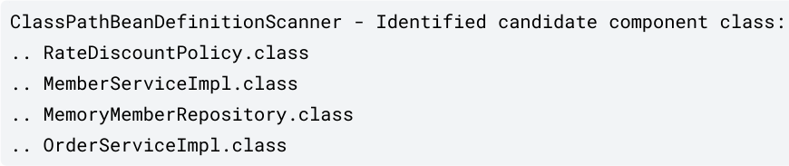

## 컴포넌트 스캔과 의존관계 자동 주입
### 등장 배경
- 기존에는 자바 코드(`@Bean`)나 XML(`<bean>`)에 일일이 빈을 등록했다. **(수동 등록)**
- 하지만 등록해야 할 빈이 수십, 수백 개가 되면 누락할 수도 있고, 무엇보다 **설정 정보 작성 자체가 매우 귀찮다는 문제점이 존재한다.**
- 따라서, 설정 정보 없이도 **자동으로 스프링 빈을 등록**하는 `@ComponentScan`과 **의존관계도 자동으로 주입**하는 `@Autowired` 기능이 등장했다.

### 컴포넌트 스캔
> **설정 클래스에 `@ComponentScan`을 붙이면, `@Component` 어노테이션이 붙은 클래스를 모두 찾아서 자동으로 스프링 빈으로 등록해준다.**

#### 필터란?
- **상황:** 기존에 작성한 `AppConfig`(수동 등록 설정)가 존재한다.
- **문제:**
  - 컴포넌트 스캔은 `@Component`를 다 긁어오는데, `@Configuration` 내부 코드를 까보면 `@Component`가 붙어 있다.
  - 즉, **`AppConfig`도 스캔 대상이 되어 빈이 중복 등록되거나 충돌하는 문제가 발생할 수 있다.**
- **해결책: `excludeFilters`**
  - `Filter`란 스캔 대상에서 특정 클래스를 포함하거나 제외하는 규칙이다.
  - 강의에서는 기존 예제(`AppConfig`)를 유지하기 위해 `FilterType.ANNOTATION`을 사용하여 `@Configuration`이 붙은 클래스를 모두 스캔 대상에서 제외했다.
    ```java
    @Configuration
    @ComponentScan(
        excludeFilters = @Filter(type = FilterType.ANNOTATION, classes = Configuration.class)   // @Configuration 어노테이션이 붙은 클래스만 제외
    )
    ```
    - 실무에서는 보통 설정 정보를 제외하진 않지만, 학습 예제 보호 차원에서 설정했다.

#### 빈 등록과 네이밍 전략


- **동작:** `ClassPathBeanDefinitionScanner`가 동작하여 `@Component`가 붙은 클래스를 식별(Identified candidate)한다.
  - 앞서 학습했듯 `BeanDefinition`이란 **빈 설정 메타정보**로, **스프링이 빈 객체들을 만들기 위해 참조하는 인터페이스**이다.
  - **`BeanDefinition`이라는 추상화 덕분에, 스프링이 자바 코드, XML, Groovy 등 다양한 설정 형식을 지원**할 수 있게 되었다.
- **네이밍 전략:**
  - 기본적으로 **클래스명을 사용하되, 맨 앞글자만 소문자**로 바꿔서 등록한다.
  - 예) `MemberServiceImpl` 클래스 → `memberServiceImpl` (Bean 객체명)
  - 만약 이름을 직접 지정하고 싶다면 `@Component("myBeanName")`처럼 부여할 수 있다.
- **부모 타입으로 조회하면 자식 타입은 모두 함께 조회된다**는 원칙을 기억하자.
  - `RateDiscountPolicy`에 `@Component`를 붙이면, `rateDiscountPolicy`라는 이름으로 객체가 생성되어 등록된다.
  - 이 객체는 `DiscountPolicy` 타입(역할)의 구현체이므로, 나중에 타입으로 조회하면 자식 타입으로 조회된다.

### 의존관계 자동 주입 (`@Autowired`)
> **의존관계를 주입할 곳에 `@Autowired`를 붙이면, 컨테이너가 자동으로 해당 타입의 스프링 빈을 찾아서 주입해 준다.**

#### 현재 상황: 설정 파일에 더 이상 설정 정보를 작성하지 않는다.
- 기존 `AppConfig`에서는 `new MemberServiceImpl(memberRepository())`처럼 생성자에 무엇이 들어갈지 개발자가 직접 명시했다.
- 하지만 `@ComponentScan` 기반으로 새로 만들 `AutoAppConfig`는 텅 비어 있다. 
  - 즉, `MemberService` **클래스 안에서 의존관계를 직접 해결**해야 한다.

#### 해결책: `@Autowired`
- **방법:** 생성자 주입을 할 경우, 생성자에 `@Autowired`를 붙여준다.
- **동작:** 스프링 컨테이너가 자동으로 해당 스프링 빈을 찾아서 주입한다.
- **조회 전략:** 기본적으로 **타입이 같은 빈**을 찾아서 주입한다.
  - 마치 `ac.getBean(MemberRepository.class)`와 동일하다고 이해하면 된다.
  - 상속에 의해 부모 타입으로 조회하면 자식 타입 빈도 다 찾아지므로, `MemberRepository` 타입으로 찾으면 `MemoryMemberRepository`가 주입된다.

### 요약
> 이제는 설정 파일(`AppConfig`)에 의존관계를 명시하지 않는 대신, **클래스 자체(`MemberServiceImpl`)에 `@Component`와 `@Autowired` 어노테이션을 작성하여 클래스 안에서 등록과 주입을 모두 해결**한다.

#### 1. `@ComponentScan` 동작 (스프링 빈 등록)
- 설정 정보(`@Configuration`)에 `@ComponentScan`이 있으면, `basePackages`(해당 클래스가 있는 패키지 하위 전역)를 다 뒤져서 `@Component`가 붙은 클래스를 자동으로 스프링 빈으로 등록한다.
- 이때 빈 이름은 `memberServiceImpl`처럼 앞글자 소문자로 등록된다.

#### 2. `@Autowired` 동작 (의존관계 주입)
- 빈을 생성할 때 생성자에 `@Autowired`가 있으면, 스프링 컨테이너에 있는 빈 중에서 타입이 맞는 녀석을 꺼내서 주입해준다.
- 따라서 **의존 대상(`MemberRepository`)도 당연히 사전에 컴포넌트 스캔되어 빈으로 등록되어 있어야 한다.**

---

## 컴포넌트 스캔의 탐색 범위(시작 위치)와 대상
### 탐색 범위 지정 (basePackages)
> **`@ComponentScan`에는 탐색할 패키지의 시작 위치를 지정하는 옵션이 있다.**

- `basePackages`: 탐색할 패키지의 시작 위치를 문자열로 지정한다. (이 패키지를 포함해서 하위 패키지를 모두 탐색한다.)
- `basePackageClasses`: 지정한 클래스가 속한 패키지를 탐색 시작 위치로 지정한다.
- **디폴트:** 만약 위치를 지정하지 않으면, `@ComponentScan`이 붙은 설정 정보 클래스의 패키지가 시작 위치가 된다.

### 권장되는 탐색 범위와 구성(설정 정보) 클래스 위치
> **패키지 위치를 지정하지 않고(디폴트 사용), 설정 정보 클래스의 위치를 프로젝트 최상단에 두는 것이 좋다.**

- 스프링 부트의 대표 시작 정보인 `@SpringBootApplication`을 프로젝트 시작 루트 위치에 두는 것이 관례이기 때문이다.
- `@SpringBootApplication`에는 이미 `@ComponentScan`이 들어 있어, 스프링 부트를 쓰면 별도의 설정 없이도 자동으로 스캔이 된다.

### 컴포넌트 스캔 대상과 각 대상의 부가 기능
> **내부에 `@Component`를 포함하고 있으면 모두 컴포넌트 스캔 대상이 되고, 각 어노테이션은 스프링에서 컴포넌트 스캔 이외에도 중요한 부가 기능을 수행한다.**

#### @Controller
- 스프링 MVC 컨트롤러로 인식한다. (웹 요청을 처리하는 핸들러 매핑 등을 가능하게 한다.)

#### @Repository
- 스프링 데이터 접근 계층으로 인식한다.
- **예외 변환:** 데이터 계층의 예외를 **스프링이 추상화한 예외(`DataAccessException`)로 변환**해준다.
  - **DB마다 터지는 예외가 다른데(Oracle 예외, MySQL 예외 등), 이를 서비스 계층까지 올리면 서비스 계층이 특정 DB 기술에 종속되기 때문이다.**
  - 이를 방지하기 위해 스프링이 공통된 예외로 포장(추상화)해서 던져준다.

#### @Configuration
- 스프링 설정 정보로 인식한다.
- 앞서 배운 것처럼 CGLIB 프록시 등을 통해 스프링 빈이 싱글톤을 유지하도록 한다.

#### @Service
- 특별한 처리를 하진 않지만, 개발자들이 비즈니스 로직 계층임을 인식하도록 도움을 준다.
- 보통 이 계층에서 `@Transactional` 등을 걸어서 트랜잭션을 시작하고 끝내는 역할을 수행한다.

---

## 메타 어노테이션
### 메타 어노테이션이란?
> **어노테이션을 설명하기 위한 어노테이션**, 즉 어노테이션을 설명하기 위해 어노테이션에 붙이는 어노테이션이다.

### 표준 메타 어노테이션
> **자바 컴파일러와 JVM이 인식하고 기능을 수행하는 메타 어노테이션**이다. (`java.lang.annotation` 패키지 소속)

- 종류: `@Target`, `@Retention`, `@Documented`, `@Inherited` 등
- 적용 예시
  - `@Service`라는 어노테이션에 `@Target(ElementType.TYPE)`이라는 표준 메타 어노테이션이 붙어있다고 하자.
  - **표준 메타 어노테이션이기 때문에, 자바는 해당 기능을 철저히 수행**한다.
  - 가령, `@Service`는 `@Target`에 의해 클래스 레벨에만 붙일 수 있도록 설정되었기 때문에, 메서드에 붙이면 컴파일 에러가 발생한다.
- 특징
  - 컴파일러가 이미 규칙을 알고 있는 어노테이션들이므로, 재귀적으로 탐색하지 않는다. (즉, **그 자체로 리프 노드**라고 생각하면 편하다.) 
    
### 일반(커스텀/스프링) 메타 어노테이션
> **자바에서는 무시하는 어노테이션**, 즉 자바에서도 등록할 수는 있지만 특별한 기능은 수행하지 않는 어노테이션이다.

- 종류: `@Component`, `@Controller`, `@Configuration`, `@MyIncludeComponent` 등
- 적용 예시
  - `@Service`라는 어노테이션에 `@Component`라는 스프링 메타 어노테이션이 붙어있다고 하자.
  - **스프링 메타 어노테이션이기 때문에, 자바는 관여하지 않는다.**
  - 즉, **`@Service`가 `@Component`의 자식이므로 컴포넌트 스캔 대상이라느니** 이러한 판단 자체를 하지 않는다. (그냥 장식품 취급한다.)
- 특징 (**상속**)
  - **자바에서는 장식품 취급하는 어노테이션이지만, 스프링에서는 해당 메타 어노테이션을 재귀적으로 탐색**한다.
  - 가령, `@Service` 어노테이션에서 멈추지 않고 내부적으로 `@Component`가 존재함을 파악하고, 컴포넌트 스캔 대상으로 지정한다.
  - 이를 **상속**이라고 표현하며, **자바에서 지원되지 않는 이유는 자바 리플렉션 기술(depth 1)의 한계 때문**이다.

### 정리하자면
> **자바에서도 어노테이션을 만들 수 있고, 붙일 수 있고, 읽을 수 있지만, 상속 기능(재귀적 탐색)은 제공되지 않는다.** 

- 만들 수 있다: `public @interface MyAnnotation {...}`  
- 붙일 수 있다: 클래스나 메서드 위에 `@MyAnnotation`을 붙일 수 있다.
- 읽을 수 있다: 리플렉션을 통해 해당 클래스에 등록된 어노테이션들을 읽을 수 있다. 

---

## 컴포넌트 스캔 필터
> **컴포넌트 스캔 대상을 추가(`includeFilters`)하거나 제외(`excludeFilters`)할 때 사용하는 기능**으로, `@ComponentScan` 어노테이션 값으로 설정해 사용하면 된다.

### 커스텀 어노테이션
> **자바에서는 사용자가 직접 어노테이션을 정의할 수 있다.** 

컴포넌트 스캔 필터링을 테스트하기 위해 다음과 같은 메타 어노테이션을 (커스텀 어노테이션에) 붙여 만들어 보자.

#### `@Target`: 이 어노테이션을 어디에 붙일 수 있는가? 
- 어노테이션을 부착할 수 있는 대상을 지정하는 어노테이션으로, `ElementType` 열거형(Enum) 상수를 사용한다.
  - `ElementType.TYPE`: 클래스, 인터페이스, 열거형(Enum) (스프링 빈 등록 시 가장 많이 사용)
  - `ElementType.FIELD`: 필드 (인스턴스 변수)
  - `ElementType.METHOD`: 메서드 
  - `ElementType.PARAMETER`: 파라미터 (매개변수)
  - `ElementType.CONSTRUCTOR`: 생성자
  - `ElementType.ANNOTATION_TYPE`: 다른 어노테이션

#### `@Retention`: 언제까지 살아있는가?
- 어노테이션의 생명주기(메모리에 유지되는 기간)을 결정하는 어노테이션으로, `RetentionPolicy` Enum 상수를 사용한다.
  - `RetentionPolicy.RUNTIME`:
    - 런타임에도 JVM이 이 어노테이션 정보를 참조할 수 있다.
    - **스프링은 런타임에 리플렉션으로 컴포넌트를 찾아내서 빈으로 등록하기 때문에, 스프링 관련 어노테이션은 대부분(거의 항상) `RUNTIME`이다.** 
  - `RetentionPolicy.CLASS`: 컴파일 후 클래스파일(`.class`)까지는 남지만, 런타임에는 사라진다.
  - `RetentionPolicy.SOURCE`: 소스 코드(`.java`)에만 있고, 컴파일되면 사라진다. (예: `@Override`, `@Getter` 등 컴파일러 정보 제공용)

#### `@Documented`: 문서화할지?
- 해당 어노테이션을 JavaDoc에 문서에 포함시킨다.

### FilterType: 무엇을 대상으로(어떤 기준으로) 필터링(포함/제외)할지?
- **`ANNOTATION`:** 애노테이션을 대상으로 필터링한다. (**가장 많이, 그리고 기본으로 사용**)
- **`ASSIGNABLE_TYPE`:** 클래스 타입을 대상으로 필터링한다. (**간혹 특정 클래스 하나만 콕 집어서 제외하고 싶을 때 사용**)
- **`ASPECTJ`:** 패키지나 클래스를 대상으로 하며, AspectJ 문법을 기준으로 필터링한다.
- **`REGEX`:** 패키지나 클래스를 대상으로 하며, 정규표현식을 기준으로 필터링한다.
- **`CUSTOM`:** 패키지나 클래스를 대상으로 하며, 커스텀 인터페이스를 기준으로 필터링한다.

### FilterClass: FilterType 중에서도 정확히(구체적으로) 무엇을 대상으로 필터링할지?
- `ANNOTATION`이었다면, 어떤 애노테이션을 대상으로 할지? (예: `MyIncludeComponent.class`)
- `ASSIGNABLE_TYPE`이었다면, 어떤 클래스를 대상으로 할지? (예: `OrderServiceImpl.class`)

### 하지만 대부분의 상황에서 `@Component`면 충분하다.
- **`@Component`만으로도 충분**하므로, `includeFilters`를 사용할 일은 거의 없다.
- `excludeFilters`은 간혹 사용할 때가 있지만 많지 않다.
- 최근 스프링 부트는 컴포넌트 스캔을 기본으로 제공하기 때문에 **옵션을 변경하기보다는 스프링의 기본 설정에 맞추어 사용하는 것을 권장**한다.

--- 

## 빈 등록 충돌
> **컴포넌트 스캔에 의해 자동으로 빈이 등록될 때, 이름이 같은 빈이 존재하면 충돌이 발생한다.**

### 1. 자동 빈 등록 vs 자동 빈 등록
- **상황:** 컴포넌트 스캔에 의해 자동으로 등록되는 빈의 이름이 같은 경우
  - 예) `serviceA`라는 이름을 가진 빈이 서로 다른 패키지에 2개 존재하는 경우
- **결과:** `ConflictingBeanDefinitionException` 예외 발생

### 2. 수동 빈 등록 vs 자동 빈 등록
- **상황:**
  - **자동:** `@Component`가 붙은 클래스 (예: `memoryMemberRepository`) 
  - **수동:** `@Configuration` 설정 파일에서 `@Bean`으로 직접 등록한 메서드명이 위와 동일한 경우 
    ```java
    @Bean
    public MemberRepository memoryMemberRepository() { ... }
    ```

#### 순수 스프링 프레임워크에서는
> **수동 빈이 자동 빈을 덮어써버린다.** (Overriding)

- **로그:** `Overriding bean definition for bean 'memoryMemberRepository' ...`
- **이유:**
  - 스프링은 **더 구체적인 것이 우선권을 가진다**는 원칙을 따른다.
  - 자동보다는 개발자가 수동으로 작성하는 것(Specific)이 의도가 더 분명하다고 판단했기 때문이다.

#### 스프링 부트에서는
> **오류가 발생하여 애플리케이션 구동에 실패한다.**

- **이유:**
  - 수동 빈이 자동 빈을 덮어쓰는 것을 의도했을 수는 있지만, **대부분은 실수인 경우**가 많다.
  - 이런 경우 정말 잡기 어려운 버그가 만들어진다.
- **해결:** 
  - 때문에 최근 스프링 부트는 수동 빈 등록과 자동 빈 등록이 충돌나면 **기본적으로 오류를 발생시키도록 설정이 변경**되었다.
  - 만약, 굳이 덮어쓰고 싶다면 `application.properties`에 `spring.main.allow-bean-definition-overriding=true` 옵션을 주면 되지만, 권장하지 않는다.

### 3. 수동 빈 등록과 자동 빈 등록에서 이름뿐만 아니라 타입까지 동일한 경우
- **상황:**
    - **자동:** `@Component`가 붙은 클래스 (예: `memoryMemberRepository`)
    - **수동:** `@Configuration` 설정 파일에서 `@Bean`으로 **직접 등록한 메서드명뿐만 아니라 타입까지 위와 동일**한 경우
      ```java
      @Bean
      public MemoryMemberRepository memoryMemberRepository() { ... } 
      ```
- **결과:**
  - **이름과 타입이 같기 때문에, 앞서(자동) 등록된 빈을 재정의할 필요가 없다.**
  - 즉, **동일한 빈을 두 번 컴포넌트 스캔할 뿐이지, 등록은 한 번만 이루어진다.** (오버라이딩이 발생하지 않는다.)

