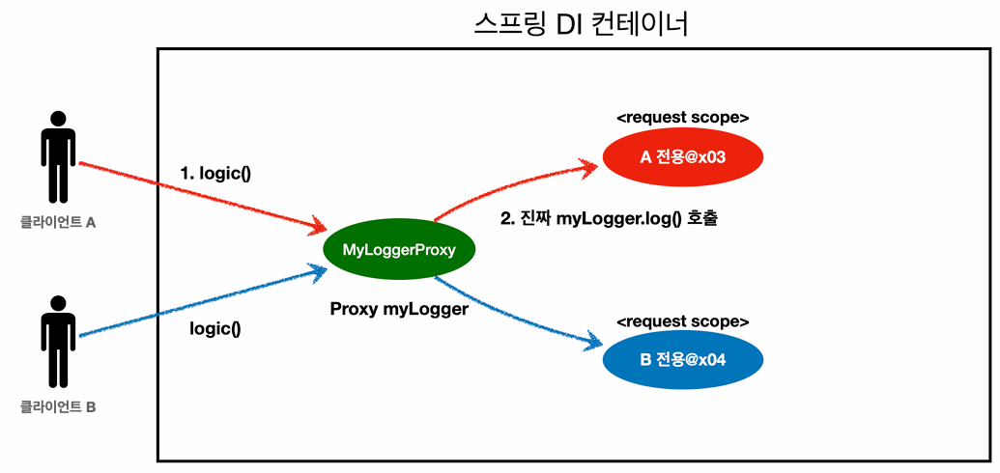

## 스프링 빈 스코프 (Bean Scope)
### 스코프
> 말그대로 **빈이 존재할 수 있는 범위**를 의미한다.

- 즉, **스프링 컨테이너가 이 Bean 객체를 언제 생성해서 언제까지 관리할 것인지**를 결정하는 생명주기의 연장선에 있는 개념이다.
- 앞서 써왔던 빈들은 **싱글톤 스코프**라서 **스프링 컨테이너가 뜰 때 생성되고 종료될 때까지 관리된 것**이다.

### 프로토타입 스코프
> 싱글톤과 달리, **요청할 때마다 항상 새로운 빈 객체를 생성해서 반환하는 스코프**이다.

- 스프링 컨테이너는 프로토타입 빈의 **객체 생성 → DI → 초기화 콜백(`@PostConstruct`)까지만** 해 준다.
- 이후에는 컨테이너가 관리하지 않는다.
  - 초기화가 끝난 프로토타입 빈을 클라이언트에게 반환해준 후, 컨테이너에서 지워버린다.
  - 따라서 **이후의 관리는 빈을 받아간 클라이언트가 직접 해야 하며, 스프링이 관리하지 않으므로 소멸 전 콜백(`@PreDestroy`) 역시 호출되지 않는다.**

### 웹 스코프
> **스프링 웹 환경(Spring MVC 등)이 들어가야만 사용할 수 있는 스코프**이다.

#### 1. Request 스코프
> **HTTP 요청에 대한 응답이 이루어질 때까지 유지**되는 스코프

- 고객의 요청이 들어오는 순간 생성되어 응답이 나가면 소멸되므로, 그 이후엔 컨테이너에서 사라진다.
- **각 HTTP 요청마다 별도의 빈 인스턴스가 생성되고 관리**된다.

#### 2. Session 스코프
> **웹 세션이 생성되고 종료될 때까지 유지**되는 스코프

- **세션:**
  - **클라이언트(웹 브라우저)가 서버에 최초로 접속할 때 생성되어 서버 메모리에 할당되는 사용자별 고유한 상태 정보 객체**이다.
- **생명주기:**
  - 특정 사용자의 세션 객체가 서버에 생성될 때 빈이 생성된다.
  - **생성된 빈은 로그아웃이나 타임아웃과 같이 세션 객체가 파기될 때 함께 소멸**한다.
    - **클라이언트가 명시적으로 세션 무효화 처리를 요청**할 때 (e.g. 로그아웃 시 서버에서 `session.invalidate()` 호출)
    - 설정된 시간 동안 클라이언트로부터 어떠한 추가 요청도 오지 않아 **서버가 자체적으로 세션을 만료 처리**할 때 (e.g. 타임아웃)
- **간단한 예시:**
  - 우리가 웹사이트에 로그인하면 생성되고 로그아웃할 때까지 유지되는 스코프이다.
  - 세션은 보통 브라우저를 닫거나, 로그아웃해서 파기되며 이에 따라 세션 스코프를 가진 빈도 함께 소멸된다.
  - 즉, **Session 스코프로 생성된 빈은 특정 사용자가 사이트를 이용하는 동안에만 살아있다.**

#### 3. Application 스코프
> **서블릿 컨텍스트와 동일한 생명주기를 갖는 스코프**

- **서블릿:**
  - **자바를 사용하여 웹 페이지를 동적으로 생성**하는 서버 측 프로그램의 표준 규격이다.
  - 간단하게, **HTTP 요청을 받아서 처리하고, 응답을 만들어내는 자바 객체**이다.
- **서블릿 컨테이너:**
  - 톰캣같은 **웹서버 구동 프로그램 그 자체**이다.
  - 네트워크 포트를 열고 **클라이언트의 연결을 수신**하며, **서블릿/서블릿 필터 객체의 생명주기(생성, 실행, 소멸)를 관리**한다.
  - 다수의 클라이언트 요청을 처리하기 위해, 요청마다 스레드를 할당하는(Thread Per Request) **멀티 스레드 환경을 제어**한다.
- **스프링 부트의 동작:**
  - `spring-boot-starter-web` 라이브러리를 추가하면 스프링 부트는 **애플리케이션을 실행할 때 내부에 포함된 톰캣 서버를 함께 구동**시킨다.
  - 즉, **별도의 웹 서버를 설치할 필요 없이 스프링과 웹 서버가 동시에 구동**된다.
- **서블릿 컨텍스트:**
  - **서블릿 컨테이너(톰캣)의 동작에 필요한 정보(URL 매핑 정보, 공유 데이터 등)를 저장하는 객체(메모리 공간)로, 메모리에 단 1개만 생성된다.**
- **애플리케이션 스코프:**
  - 톰캣 서버가 실행되어 이 `ServletContext` 객체가 메모리에 생성될 때 빈이 생성되고, 톰캣 서버가 종료되어 메모리에서 내려갈 때 빈도 함께 소멸한다.
  - 즉, 웹 어플리케이션 전체에서 단 1개만 존재하며 서버의 시작과 끝을 함께하는 웹 스코프이다.
- **싱글톤 스코프와의 비교:**
  - 싱글톤 스코프는 스프링 컨테이너(AC), 애플리케이션 스코프는 서블릿 컨텍스트 단위로 1개씩 존재한다.
  - 그런데 **일반적인 스프링 부트 환경에서는 하나의 컨테이너에 하나의 서블릿 컨텍스트 환경이 매칭되므로, 사실상 싱글톤 빈과 거의 동일한 생명주기**를 갖는다.

#### 4. WebSocket 스코프
> **웹소켓과 동일한 생명주기를 갖는 스코프**

- **웹소켓:**
  - 클라이언트(웹 브라우저)와 서버 간에 **지속적인 양방향 통신을 지원하는 네트워크 통신 프로토콜**이다.
  - 일회성인 HTTP 통신과 달리, **한 번 연결되면 클라이언트나 서버가 명시적으로 연결을 끊을 때까지 통신 채널이 계속 열려 있다.**
  - 실시간 서비스에서 주로 사용된다.
- **생명주기:**
  - 클라이언트와 서버 간의 웹소켓 연결이 수립되는(맺어지는) 시점에 빈이 생성되고, 연결이 종료(네트워크 단절 등)되는 시점에 빈이 소멸하는 생명주기를 갖는다.

---

## 서블릿과 스프링 가볍게 정리
### 관련 문서
- [[부록] 서블릿과 스프링 가볍게 정리](./appendix/03-servlet-and-spring-simple.md)

---

## 프로토타입 스코프
### 프로토타입 빈의 생명주기와 DI
- **생성 시점:**
  - 프로토타입 빈은 스프링 애플리케이션 로딩 시점에 미리 생성되지 않는다. (싱글톤 빈과의 차이점)
  - 오직 **컨테이너에 요청(조회)이 들어오는 순간에 생성**된다.
- **DI 시점:**
  - 싱글톤 빈이 생성되면서 프로토타입 빈을 의존성으로 필요로 한다면, **컨테이너는 DI 시점에 프로토타입 빈을 새로 만들어서 싱글톤 빈에게 넘겨준다.**
  - 단, 컨테이너가 빈을 생성할 수 있어야 하므로 빈 설정 메타정보인 `BeanDefinition`은 가지고 있어야 한다.
- **컨테이너의 책임:**
  - 컨테이너는 프로토타입 빈의 생성, DI, 초기화 콜백까지만 처리한다.
- **이후의 관리:**
  - **컨테이너의 관리 목록에서 배제되었기 때문에, 이후 똑같은 빈을 요청해도 컨테이너는 새로운 인스턴스를 만들어서 제공**한다.
  - 또한, 컨테이너가 관리하지 않으므로 `@PreDestroy`와 같은 소멸 전 콜백을 호출해주지 않는다.

#### 싱글톤 빈과 소멸 전 콜백
> **싱글톤 빈 역시 명시적으로 컨테이너를 종료(`ac.close()`)해야만 소멸 전 콜백이 호출된다.**

- 자바의 GC는 메모리에서 안 쓰는 객체만 지워버릴 뿐, 스프링의 `@PreDestroy`와 같은 어노테이션을 읽어서 메서드를 실행해주지는 않는다.
- 따라서 컨테이너가 정상적으로 종료(`ac.close()`)되어야만 소멸 전 콜백이 실행된다.

### 컨테이너에 프로토타입 빈의 Definition을 등록해놓아야 하는 이유
> **어차피 프로토타입 빈은 필요할 때 만드는 건데, 컨테이너(ac)에 파라미터로 `PrototypeBean.class`를 왜 넘겨야 할까?**

- 이는 당장 객체를 만들진 않더라도, **'이런 클래스가 빈으로 생성될 수 있다'는 설계도(BeanDefinition)를 컨테이너에 미리 등록**해 두어야, 추후 생성할 수 있기 때문이다.
- 만약 BeanDefinition을 등록해두지 않으면, `NoSuchBeanDefinitionException`이 발생한다.

### 프로토타입 빈은 "사용할 때마다" 새로 생성되어야 한다.
> **같은 클라이언트의 요청이더라도, 동일한 프로토타입 빈이 사용되어서는 안 된다.**

- **예시:**
  - 사용자 A가 싱글톤 빈의 `logic()`을 호출 → prototypeBeanA 생성 및 사용
  - 사용자 B가 싱글톤 빈의 `logic()`을 호출 → prototypeBeanB 생성 및 사용
  - 사용자 A가 다시 `logic()`을 호출 → prototypeBeanC 생성 및 사용
- **결론:**
  - 즉, **프로토타입 빈은 싱글톤 빈의 필드로 주입되어서 동일한 인스턴스로 계속 사용되면 안 되고, 요청이 들어올 때(메서드가 호출될 때)마다 새로운 인스턴스로 사용되어야 한다.**
  - 이를 위해 DL(Dependency Lookup)이라는 개념이 등장한다.

### DI와 DL
#### DI (Dependency Injection)
- **작동 방식:**
  - 클래스 내부에서 필요한 객체를 직접 찾거나 생성하지 않는다.
  - 단지 생성자, 필드, Setter 등을 통해 의존성(구현체)을 주입받을 자리만 마련해둔다.
  - 애플리케이션 로딩 시점에 컨테이너가 해당 자리에 알맞는 의존성(구현체)을 주입(할당)한다.
- **코드의 특징:**
  - 클래스 코드 내부에는 스프링 프레임워크와 관련된 코드가 전혀 들어가지 않는다. **(순수한 자바 코드 유지)**

#### DL (Dependency Lookup)
- **작동 방식:**
  - 클래스 내부에서 **필요한 시점에 직접 컨테이너나 대리인(Factory, Provider)에 접근하여 "특정 타입의 빈을 달라"고 요청(조회)하는 방식**이다.
- **코드의 특징:**
  - 의존성(구현체)을 찾기 위해 클래스 코드 내부에서 `ac.getBean()`이나 `provider.getObject()`와 같은 탐색 전용 메서드를 호출해야 한다.

#### 왜 DI 대신 DL을 사용하는가?
> **의존대상의 생명주기(스코프)가 자신(싱글톤)과 달라서 필요한 순간마다 컨테이너로부터 새롭게 의존대상의 인스턴스를 받아와야 하기 때문이다.**

- **DI의 한계점:**
  - 기본적으로, 스프링에서는 IoC 원칙을 지키기 위해(클라이언트 코드에서 객체를 생성하고 연결하지 않도록) DI를 사용하는 것이 권장된다.
  - **하지만 DI를 통해 프로토타입 빈을 주입받으면, 그 프로토타입 빈 역시 주입되는 시점에 한 번만 생성되어 싱글톤 빈 내부에 영구적으로 할당된다.**
  - 따라서, 클라이언트가 해당 메서드를 여러 번 호출하더라도 매번 동일한(이미 주입된) 프로토타입 인스턴스만 사용하게 된다.
- **DL을 통한 해결:**
  - 이를 해결하기 위해 Provider를 도입한다.
  - **싱글톤 빈은 실행될 때마다 내부 필드에 이미 주입된 프로토타입 빈을 사용하는 것이 아니라, 컨테이너에서 직접 프로토타입 빈을 조회한다.**
  - 이 호출을 받을 때마다 컨테이너는 프로토타입의 정의(`BeanDefinition`)에 맞게 **매번 새로운 인스턴스를 생성하여 반환**해 준다.

#### 요약
- **DI:**
  - **애플리케이션 로딩 시점에 외부에서 구현체를 주입받아 필드에 저장해 두고 사용하는 방식**이다.
  - 한 번 주입된 인스턴스는 해당 빈의 스코프를 그대로 따라가며 종속된다.
- **DL:**
  - **필요한 시점에 외부(컨테이너)에 직접 요청하여 의존관계를 찾아오는 방식**이다.
  - 프로토타입 빈의 경우, DL을 사용하면 호출할 때마다 컨테이너에 새로운 객체 생성을 요청하게 되므로 매번 새로운 인스턴스를 반환받을 수 있다.

### 1. ApplicationContext를 통한 DL
#### 작동 원리
```java
@RequiredArgsConstructor
static class ClientBean {
    
    private final ApplicationContext ac;
    
    public int logic() {
        PrototypeBean bean = ac.getBean(PrototypeBean.class);
        bean.addCount();
        return bean.getCount();
    }
}
```
1. DI: 스프링 컨테이너 객체(AC) 자체를 생성자나 필드를 통해 외부로부터 주입받는다.
2. DL: 주입받은 AC의 `getBean()`을 호출하여, 필요한 시점에 프로토타입 빈을 직접 조회하고 가져온다.

#### 해당 방법이 가능한 이유
> **스프링은 기본적으로 컨테이너 자체도 컨테이너에 등록해 두기 때문에, 필요한 곳에서 컨테이너를 주입받을 수 있기 때문이다.**  

#### 하지만 다음의 이유에서 권장되지 않는다.
1. 객체지향 설계 원칙 중 ISP(자신이 사용하지 않는 메서드에 의존하면 안 된다)를 위반한다.
2. 스프링 컨테이너에 종속적이며, 순수한 단위 테스트를 작성하기 어려워진다.

#### 순수한 단위 테스트란?
- [[부록] 순수한 단위 테스트](./appendix/02-pure-unit-test.md)

### 2. ObjectFactory(ObjectProvider)를 통한 DL
#### 작동 원리
1. `ObjectProvider` 객체 자체는 내부적으로 컨테이너에 대한 참조를 가지고 있다.
2. 개발자는 `ac.getBean()`을 직접 호출하는 대신, `provider.getObject()`를 호출한다.
3. Provider는 대리인으로서 직접 컨테이너를 탐색하지는 않고, 자신이 가진 컨테이너 참조를 통해 `ac.getBean()`을 대신 호출하여 결과를 받아온다.
   - 즉, **실제 탐색(및 생성)은 컨테이너가 수행하고, Provider는 이를 중개하는 대리인 역할만 수행**한다.

#### ObjectFactory와 ObjectProvider
- **ObjectFactory:** `getObject()` 기능만 제공하는 단순한 Provider이다.
- **ObjectProvider:**
  - `ObjectFactory`를 상속받아 여러 편의 기능(Optional, Stream 처리 등)을 추가한 확장 인터페이스이다.
  - 팩토리와 마찬가지로 스프링 의존적(`import org.springframework...`)이다.
  - AC와 마찬가지로 `ObjectProvider` 역시 별도의 빈으로 등록하지 않아도, 컨테이너가 내부적으로 알아서 등록해 놓는 빈이다. (`BeanDefinition` 목록에는 조회되지 않는다.)

### 3. JSR-33O(자바 표준)의 Provider를 통한 DL
> **자바 표준에서 제공하는 Provider이기 때문에 코드가 스프링에 종속되지는 않지만, 별도로 와부 라이브러리(`jakarta.inject`)를 추가해야 동작한다.**

#### 이런 상황에서는 스프링 제공 라이브러리를 사용해야 할까? 아니면 자바 표준을 사용해야 할까?
> 결론부터 말하면 **기본적으로는 스프링 제공 라이브러리를 사용하되, 스프링에서도 공식적으로 자바 표준을 권장하는 경우(`@PostConstruct` 등)에는 자바 표준을 사용한다.** 

- **JPA의 경우:**
  - 자바 진영에서 JPA라는 DB 접근 표준 인터페이스를 잘 만들어 두었다.
  - 따라서 실제 동작은 Hibernate라는 구현체가 하더라도, 개발자는 Hibernate 전용 클래스가 아닌 EntityManager와 같은 **JPA 표준 인터페이스에 의존하여 코드를 작성**한다.
- **스프링의 경우:**
  - 실제로 스프링 프레임워크가 표준은 아니지만, **사실상 기술 표준(De facto)일 정도로 점유량이 지배적**이다.
  - 따라서 번거롭게 외부 라이브러리를 추가하면서(`jakarta.inject` 등)까지 자바 표준을 사용할 이유가 없다.
  - 다만, `@PostConstruct`와 같이 스프링에서도 공식적으로 자바 표준을 권장하는 경우(보통 스프링에 포함되어 있음)에는 자바 표준을 사용한다.

---

## 웹 스코프
### 특징
- **웹 스코프는 웹 환경(Spring Web 등)에서만 동작**한다.
- 프로토타입 스코프와 달리, **웹 스코프는 컨테이너가 해당 빈의 전체 생명주기를 관리**한다.
- 컨테이너가 빈의 종료 시점을 알고 관리하므로, `@PreDestroy` 등 소멸 전 콜백도 정상적으로 호출된다.
- 종류는 앞서 길게 설명했으므로, `Request Scope`를 중심으로 웹 스코프를 이해해보자.

### Request Scope 예제
```
[550e8400-e29b-41d4-a716-446655440000] request scope bean create
[550e8400-e29b-41d4-a716-446655440000][http://localhost:8080/log-demo] controller test
[550e8400-e29b-41d4-a716-446655440000][http://localhost:8080/log-demo] service id = testId
[550e8400-e29b-41d4-a716-446655440000] request scope bean close
```
- 위와 같이 `[UUID][URL][MESSAGE]`의 형태로 로그를 남겨 여러 HTTP 요청을 구분해보자.

#### UUID
> **네트워크 상에서 고유성을 보장하기 위해 생성하는 128비트의 범용 고유 식별자**이다.

- **구성:**
  - **128비트를 2진수(0, 1) 대신 16진수(0~9, a~f)로 나타낸다.**
  - UUID가 128비트고 16진수 문자 하나당 4비트를 차지하므로, 총 32개의 문자가 필요하다.
  - 이때 32개의 문자가 그냥 나열되면 식별하기 어려우므로, 중간에 하이픈을 넣어 `[8자리]-[4자리]-[4자리]-[4자리]-[12자리]`의 형태로 표기한다. (총 36글자)
- **사용처:**
  - 웹 어플리케이션에서는 동시에 수많은 사용자의 HTTP 요청이 섞여서 들어온다.
  - 이때 각 요청을 구분하기 위해 **요청별로 UUID를 하나씩 생성하여 로그에 남기는 방식으로 주로 사용**한다.

#### Setter 주입과 `HttpServletRequest`
- **Setter 주입:**
  - 생성자 주입에서와 달리, **Setter 주입에서는 `@Autowired`를 명시적으로 붙여주어야만 스프링이 DI 대상으로 인식**한다. (개수와 무관하게)
- **`HttpServletRequest` 자동 주입:**
  - 컨트롤러의 메서드 파라미터로 `HttpServletRequest`를 선언하면, **톰캣과 스프링이 클라이언트의 요청 정보를 담은 객체를 해당 메서드 호출 시점에 자동으로 주입**해 준다.

#### 서블릿 필터와 스프링 인터셉터
> **클라이언트의 요청이 컨트롤러에 도달하기 전에 공통적인 관심사(로그인 인증, 로그 추적 등)를 처리하는 기술**이다. 동작하는 위치(실행 주체)에 따라 다음과 같이 구분된다.

- **서블릿 필터:**
  - **서블릿 컨테이너(톰캣)** 단에서 동작한다.
  - 클라이언트의 요청이 스프링의 `DispatcherServlet`으로 진입하기 전에 가장 먼저 실행된다.
- **스프링 인터셉터:**
  - **스프링 프레임워크(스프링 MVC) 내부**에서 동작한다.
  - `DispatcherServlet`이 요청을 받은 후, 실제 컨트롤러를 호출하기 직전(`preHandle`)과 직후(`postHandle`) 그리고 요청 처리가 완전히 끝난 후(`afterCompletion`)에 실행될 수 있다. 
- **HTTP 요청 실행 흐름 요약:**
  - 클라이언트 HTTP 요청 수신 (서블릿 컨테이너가 수신)
  - 서블릿 필터 동작 (서블릿 컨테이너가 실행)
  - `DispatcherServlet`으로 요청 전달
  - 스프링 인터셉터 동작 (스프링 프레임워크가 실행)
  
#### 서비스 계층은 웹 기술에 종속돼서는 안 된다.
- **원칙:**
  - **요청 URL과 같은 웹 관련 정보(`HttpServletRequest` 등)는 컨트롤러까지만 사용해야 한다.**
  - 해당 정보를 파라미터로 넘길 경우, 서비스 계층의 코드가 웹 기술에 강하게 종속되는 문제가 발생한다.
- **해결:**
  - 파라미터로 넘기지 말고, 웹 관련 정보를 처리하는 컴포넌트(`MyLogger`)를 컨테이너로부터 주입받으면 된다.
  - 이때 요청별로 다른 인스턴스를 주입받아야 하므로, Request 스코프 빈(`@Scope("request")`)을 사용한다.

### 빈 생성 시점의 충돌 문제
> **싱글톤 빈(`@Controller` 등)에서 웹 스코프 빈(`@Scope("request")`)을 주입받아야 하는데, 애플리케이션 로딩 시점에는 웹 스코프 빈이 컨테이너에 존재하지 않는다.**

```
Caused by: org.springframework.beans.factory.support.ScopeNotActiveException:   // 'scope가 아직 활성화되지 않았나보다' 유추 가능
Error creating bean with name 'myLogger': Scope 'request' is not active for the current thread; // 왜 활성화 안 됐지? → myLogger가 request scope니까 애플리케이션 로딩 시점에는 없구나
consider defining a scoped proxy for this bean if you intend to refer to it from a singleton    // 그래서 해결책으로 scoped proxy를 고려해보라고 하는구나 
```

- `LogDemoController`는 싱글톤 스코프이므로, **스프링 어플리케이션이 구동되는 로딩 시점**에 즉시 생성되고 DI를 시도한다.
- 하지만 의존대상인 `MyLogger`는 Request 스코프이기 때문에, **실제 클라이언트의 HTTP 요청이 서버에 도달해야만 생성**된다.
- 결과적으로, 어플리케이션 로딩 시점에는 HTTP 요청이 없으므로 `MyLogger` 빈이 존재하지 않으며, 이에 컨테이너가 종료된다.

### 해결책 1. Provider를 통한 DL
> **어플리케이션 로딩 시점이 아니라, 필요한 시점에 직접 객체를 조회(DL)하여 가져올 수 있도록 Provider를 이용**한다.

### 해결책 2. Proxy 방식 (@Scope의 proxyMode 옵션)
> **어플리케이션 로딩 시점에 실제 `MyLogger` 클래스 대신, 이 클래스를 상속받는 '가짜 프록시 객체'를 먼저 생성하여 싱글톤 빈처럼 컨테이너에 등록하고 클라이언트(컨트롤러, 서비스 등)에 주입해 둔다.**

#### 종류
- `ScopedProxyMode.TARGET_CLASS`: 적용 대상이 클래스인 경우
- `ScopedProxyMode.INTERFACES`: 적용 대상이 인터페이스인 경우

#### 동작 원리
> **CGLIB로 실제 클래스를 상속받은 가짜 프록시 객체를 만들어서 주입한다.**



- 컨테이너는 어플리케이션 로딩 시점에 CGLIB를 사용해서 가짜 프록시 객체(`MyLogger$EnhancerBySpringCGLIB`)를 생성한다.
- 실제로 요청이 오면, 프록시 객체는 **진짜 빈(`MyLogger`)에게 요청을 위임한다.**
  - 즉, **진짜 빈을 조회하고 해당 요청을 수행하는 메소드를 실행하여 결과를 반환한다.**

#### 특징
- **프록시 객체 덕분에 클라이언트는 마치 싱글톤 빈을 사용하듯이 편리하게 Request 빈을 사용할 수 있다.**
  - 클라이언트는 해당 객체의 내부와는 무관하게 **그저 사용하고, 원하는 결과를 받으면 된다.**
- 사실 Provider를 사용하든, 프록시를 사용하든 핵심 아이디어는 **진짜 객체 조회를 꼭 필요한 시점까지 지연처리(`lazyInit`)한다**는 점이다.
  - 단지 **Provider**의 경우, **클라이언트 코드가 직접 DL하는 방식**이고,
  - **프록시**의 경우, 클라이언트 코드 입장에서는 주입받은 객체(프록시 객체)를 사용하는 것인데, **해당 객체 내부에서 DL이 발생하는 것**이다.
- **다형성과 DI 컨테이너를 활용한 덕분에, 클라이언트 코드를 수정하지 않았다.**
  - 단지 어노테이션 설정(`proxyMode`) 하나만 변경했을 뿐인데 원본 객체를 프록시 객체로 완벽하게 대체했다.
  - AOP의 원리도 이와 동일한데, **실제 비즈니스 로직(원본 객체)은 그대로 두고, 공통 처리 로직을 담은 가짜 프록시 객체를 생성해 클라이언트에게 주입하는 방식으로 작동**한다.

#### 주의사항
- 프록시 객체는 싱글톤 빈처럼 편리하게 공유되어 사용되지만, **내부에 연결되는 진짜 객체는 HTTP 요청마다 다르게 생성되는 Request 빈**이다.
- 싱글톤 같을 뿐이지, 실제로 싱글톤이 아니기 때문에 무분별하게 사용하면 추후 난감한 상황이 발생할 수 있다.
- 따라서 **이런 특별한 스코프(웹 스코프 + 프록시)는 꼭 필요한 곳에 최소한으로 사용해야 한다.**


