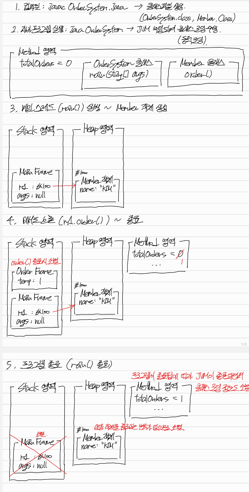

## I. 컴파일과 JVM
### 자바 컴파일러
- JDK에 포함된 컴파일러
- 소스코드 파일(`.java`)을 클래스 파일(`.class`, 바이트코드 파일)로 변환한다.
- 컴파일 과정이므로 문법 체크 등의 정적 분석이 이루어진다.

#### 상세
  - 소스코드 파일 
    ```java
    int sum = 1 + 2;
    ```
  - 클래스 파일에 저장되는 결과물
    - `.class` 파일에는 내부적으로 16진수의 숫자들이 적혀 있다.
    - 이 숫자들은 위 소스코드를 수행하기 위해 필요한 명령어의 ID들이다.
      1. `iconst_1`: 상수 1을 준비해라.
      2. `iconst_2`: 상수 2를 준비해라.
      3. `iadd`: 두 개의 정수를 더해라.
      4. `istore_1`: 결과를 1번 변수(sum)에 저장해라.

#### 요약
  1. 소스코드 한 줄은 여러 개의 바이트코드 명령어로 쪼개져서 `.class` 파일에 저장된다.
  2. **[적재]** 이 명령어들은 실행 시 메모리(Method 영역)에 적재된다.
  3. **[실행]** 실행 엔진은 Method 영역의 명령어를 보고 Stack/Heap 영역을 조작한다. (e.g. 중간 결과물을 저장한다든가)

### 클래스 파일(`.class`)
- 컴파일 결과물로, **바이트코드뿐만 아니라 메타데이터를 포함**하고 있다.
  - 이 파일이 자바 파일이 맞는지 (Magic Number)
  - 자바 버전은 몇인지 (Version)
  - 변수는 뭐고 메서드는 뭔지 (Constant Pool)
  - (해당 클래스의) 모든 메서드의 명령어들 (Byte Code)

### 바이트코드
- **JVM이 이해할 수 있는** 중간 언어
- **OS나 HW에 독립적**

### 기계어
- **CPU가 이해할 수 있는** 비트 단위 명령어 집합 (즉, 0과 1로만 구성됨)
- 특정 OS에 종속된 기계어 코드를 **네이티브 코드(Native Code)** 라고 함
- CPU는 바이트코드를 이해할 수 없으므로, JVM이 바이트코드를 기계어로 변환(번역)해줘야 함

### JVM(자바 가상 머신)
- OS에 독립적이며, 자바 바이트코드(`.class`)를 실행할 수 있도록 해주는 가상 컴퓨터(SW)

#### 왜 가상 머신인가?
- 말그대로 SW로 만든 가짜 컴퓨터이기 때문
- 실제 컴퓨터처럼 **자신만의 메모리 구조(런타임 데이터 영역)와 실행 엔진을 보유**함
- 실제 컴퓨터: CPU, 메모리(RAM), OS를 가짐
- JVM:
  - 가상 CPU: 실행 엔진 (인터프리터, JIT 컴파일러)
  - 가상 메모리: 런타임 데이터 영역 
    - JVM이 OS로부터 할당받은 메모리 공간
    - Method, Heap, Stack Area, PC Register, Native Method Stack으로 구성됨
  - 가상 OS: 클래스 로더, 가비지 컬렉터(GC)
- 즉, 자바 프로그램 입장에서 JVM은 완벽한 하나의 컴퓨터처럼 동작

#### JVM이 왜 필요한가?
- 실행 파일(`.exe`)의 경우, 맥이나 리눅스에서 실행할 수 없음 (OS별로 저마다의 네이티브 코드가 존재하기 때문에)
- 하지만 클래스파일(`.class`)의 경우, 어느 OS에서든 읽을 수 있음
- 이는 클래스파일에 있는 바이트코드를 JVM이 중간에서 네이티브 코드(각 OS에 맞는 기계어)로 변환해주기 때문임

#### JVM의 3가지 역할
1. 적재(Load): **[클래스 로더]** 클래스파일(`.class`)을 읽어서 메모리(Method 영역)에 적재
   - JVM(클래스 로더)이 HDD에 있는 특정 클래스파일(`OrderSystem.class`)을 읽어서 그 명령어들을 메모리(Method 영역)에 적재함
2. 실행(Execute): **[실행 엔진]** 메모리(Method 영역)에 적재된 명령어(바이트코드)를 읽어서 해당 OS의 기계어로 변환해 실행함
   - 정확히는, 기계어로 변환해 CPU가 실행하게 함
3. 관리(Manage): **[GC]** 메모리를 할당하고, 안 쓰는 객체(Heap)를 정리함

#### JVM 실행 엔진
- 메모리(Method 영역)에 적재된 명령어를 실행하는데, 이때 2가지 방식이 혼용된다.
1. 인터프리터:
   - **바이트코드를 한 줄씩 읽어서 즉시 기계어로 변환하고 실행**한다.
   - 초기 실행 속도는 빠르지만, 반복되는 코드를 매번 번역해야 하므로 전체적인 수행 속도가 느리다.
2. JIT 컴파일러:
   - '반복되는 코드를 매번 번역해야 한다'는 인터프리터의 단점을 보완하기 위해 JIT 컴파일러가 도입되었다.
   - 반복되는 코드를 Hot Spot으로 판단하고, 네이티브 코드로 변환하여 코드 캐시(Code Cache)에 저장한다.
   - 이후, **동일한(반복되는) 코드가 호출되면 실시간으로 변환하는 대신, 캐싱된 네이티브 코드를 바로 실행**한다.

### 컴파일
- **'자바 컴파일러(`javac`)가 소스코드를 바이트코드로 변환하는 과정'** 이다.
  - 즉, 사람만 알아볼 수 있는 언어를 JVM이 이해할 수 있는 언어로 변환하는 과정이다.
- 따라서, 이 시점에는 프로그램이 메모리에 올라가지도 않고, 실행되지도 않는다. 

### 런타임
- '클래스 파일(바이트코드 파일)을 실행하는 시점'이다.
- `java {클래스파일명}`을 입력하거나 IDE에서 Run을 누르는 순간(즉 자바 프로그램을 실행하는 순간) JVM이 부팅된다.
- 이때부터 JVM의 클래스 로더가 클래스 파일을 읽어들이고(명령어를 메모리에 적재하고), 실행 엔진(인터프리터와 JIT 컴파일러)을 통해 네이티브 코드로 변환하여 CPU에게 실행시킨다.

### 요약
1. 소스코드 파일(`.java`)은 자바 컴파일러(`javac`)에 의해 클래스 파일(`.class`, 바이트코드 파일)로 변환된다.
2. 바이트코드는 OS에 독립적인 중간 언어이므로, CPU가 바로 실행할 수 없다.
3. 따라서, JVM이 바이트코드를 읽어 해당 OS에 맞는 네이티브 코드로 변환한다.
   - **[적재]**: JVM의 클래스로더가 바이트코드를 메모리(Method 영역)에 적재한다.
   - **[실행]**: JVM의 실행엔진이 메모리에 적재된 바이트코드(명령어)를 네이티브 코드로 변환하여 CPU에게 실행시킨다. (변환할 때, 인터프리터와 JIT 컴파일러가 함께 동작한다.)

---

## II. 동적 로딩과 런타임 데이터 영역
### 개요
- `java {클래스파일명}`을 통해 JVM이 실행되면, 클래스로더가 클래스파일을 메모리(Method 영역)에 적재하기 위해 OS로부터 할당받는 메모리 영역
  - 즉, JVM이 OS로부터 할당받는 메모리 공간
- 클래스로더가 메모리에 클래스파일을 적재할 때는 '로딩→링킹→초기화'의 3단계를 거치며, 이를 **동적 로딩**이라고 부른다.

### 동적 로딩
#### 1. 로딩(Loading)
- 클래스파일(클래스명, 부모 클래스 정보, 변수/메서드 정보 등)을 메모리(Method 영역)에 적재한다.

#### 2. 링킹(Linking)
- 검증: 읽어들인 바이트코드가 자바 언어 명세에 맞는지, 보안상 문제는 없는지 검사한다.
- 준비: 클래스 변수(static 변수)를 위한 메모리를 확보(Method 영역에 할당)하고, 기본값으로 초기화한다.
- 해석: 바이트코드 내의 심볼릭 참조를 실제 메모리 주소로 교체한다.
  - 예) String이라는 문자열(심볼)을 실제 주소(`java.lang.String` 클래스가 로딩된 물리적 메모리 주소)로 교체

#### 3. 초기화(Initializing)
- 클래스 변수(static)에 실제 값을 할당한다.
- `static {...}` 블록(정적 초기화 블록)이 있다면 이때 실행된다.

### 런타임 데이터 영역
- 클래스로더가 클래스파일을 메모리(Method 영역)에 적재하기 위해, OS로부터 할당받는 메모리 영역
- 데이터의 성격과 생명주기에 따라 5개로 나뉜다.

#### 1. 모든 스레드가 공유하는 영역 (Shared Data)
> **힙 영역: 프로그램 실행 중에 new 연산자로 생성된 객체와 배열**

> **메서드 영역: 클래스/메서드/필드 시그니처, 런타임 상수 풀, 클래스 변수**
1. 클래스 정보: 
   - 클래스의 풀네임 (예: `com.example.Member`)
   - 부모 클래스명 (예: `java.lang.Object`)
   - 클래스 타입 (Class, Interface, ...)
   - 접근 제어자 (Public, ...)
2. 런타임 상수 풀
   - 코드 내 모든 리터럴(상수) (예: 숫자 10, 문자열 `"Hello"`)
   - 심볼릭 참조: 클래스, 필드, 메서드명 (실제 주소가 아닌 이름들이 모여 있음. `"System"`, `"out"`, `"println"`, ...)
3. 필드 & 메서드 정보
   - 필드 정보: 변수명, 타입, 제어자 (시그니처만 저장)
   - 메서드 정보: 메서드명, 매개변수 정보, 리턴 타입
   - 메서드 코드: 명령어
4. 클래스 변수: static 키워드가 붙은 공유 변수의 실제 값

#### 2. 스레드별 독립적인 영역 (Per Thread Data)
> **스택 영역: 메서드 호출 시 생성되는 스택 프레임(지역변수 등)**

> **PC 레지스터: 현재 실행 중인 JVM 명령어의 주소**
- **CPU의 PC 레지스터**는 **속도를 위해**(현재 코드를 실행하면서 다음 코드를 가져오기 위해) 항상 **다음에 실행할** 명령어의 주소를 가리킨다.
- 반면, **JVM의 PC 레지스터**는 **디버깅을 위해**(에러가 났을 때 정확히 현재 위치를 추적하고 복구하기 위해) **현재 실행하고 있는** 명령어의 주소를 가리킨다.
  - 가령 런타임 중 NPE가 떴을 때, CPU처럼 다음에 실행할 명령어를 가리킨다고 하면 개발자에게 NPE가 터진 위치를 정확히 알려줄 수 없게 된다.

> **네이티브 메서드 스택: 자바 외의 언어로 작성된 네이티브 코드를 실행하기 위한 공간**
- **네이티브 메서드**란 역할은 자바에 있는데, 구현은 외부(C언어 등)에 있는 메서드를 의미함
- `Thread` 클래스나 `System` 클래스 등을 뜯어보면 `native` 키워드가 붙은 메서드들을 확인할 수 있음 (Thread의 `start0()` 메소드)
- 클래스파일에 일반 자바 메서드와 네이티브 메서드가 둘다 있는 경우를 살펴보자.
  - 일반 자바 메서드: 
    - `.class` 파일: 메서드 시그니처 + **바이트코드**(명령어)로 구성
    - 메모리(Method 영역): 바이트코드 적재
  - 네이티브 메서드:
    - `.class` 파일: 메서드 시그니처 + **네이티브임을 알리는 플래그**로 구성
    - 메모리(Method 영역): 'JNI를 통해 외부 라이브러리(이미 기계어로 작성되어 있음)를 실행하라'는 포인터 적재
- **메서드 영역을 제외한 나머지 4개의 영역은 클래스 로딩 시점에는 텅 비어 있다.**
- **프로그램이 실제로 돌아가면서(main 메소드가 실행되면서) 비로소 채워진다.**

### 런타임 상세
#### 개요
  - 앞서, 
    - 컴파일 타임은 자바 컴파일러(`javac`)로 클래스파일(`.class`)로 만들 때까지,
    - 런타임은 `java {클래스파일명}`을 통해 클래스파일이 실행되어 종료될 때까지(즉, JVM이 켜질 때부터 꺼질 때까지)라고 정의했다.
  - 이를 좀 더 자세히 살펴보자.
#### 런타임 과정
> **런타임은 '적재와 실행'의 반복이다.**
  1. 런타임 시작 (`java {클래스파일명}` 입력)
     - JVM 부팅: JVM이 메모리(RAM)를 할당받고 켜진다.
  2. 동적 로딩
     - JVM이 진입점(Entry Point, `main()` 메소드)을 찾아서 메모리(Method 영역)에 적재한다.
     - 만약 `main()` 메소드가 없는 상황이라면, `NoSuchMethodError`와 함께 프로그램이 종료된다.  
  3. main() 실행
     - main()의 첫 줄부터 실행한다.
  4. 실행 중 추가 로딩의 반복 (지연 로딩)
     - main()을 실행하다가 `new Member()`라는 코드를 만난 상황이라 하자.
     - 이때 실행을 잠깐 멈추고 `Member.class`가 메모리에 있는지 확인한다.
     - 만약 없다면, 동적 로딩을 통해 해당 클래스파일을 다시 메모리에 적재한 후 main() 실행을 이어간다.

### 빌드
> 빌드는 **소스코드를 실행 가능한 결과물로 만드는 일련의 과정**을 총칭하는데, **어디까지를 결과물로 볼 것인가**에 따라 의미가 달라진다.
- 배포용
  - 빌드의 범위: 컴파일 + 테스트 + 패키징(클래스파일 + 리소스 + 외부 라이브러리 + 메타데이터)
  - 결과물: `jar`나 `war`와 같은 압축 파일
- 개발 중
  - 빌드의 범위: 컴파일 (`.java` → `.class`)
  - 결과물: classes 폴더에 쌓이는 `.class` 파일들
  - 개발 중에 jar 파일을 만들지 않는 이유는 '속도' 때문이다.
    - jar 파일을 안 만드는 경우, **변경된 파일만 다시 컴파일해서 실행**하면 된다.
    - 하지만 jar 파일을 만드는 경우, 코드 한 줄만 수정하더라도 전체를 다시 압축해야 해서 굉장히 느리다. 
- 즉, '빌드를 마친다'는 표현은 상대적이다.

> 또한, **빌드와 런타임은 완전히 별개**이다.
  - 배포용으로 빌드를 하더라도, 메모리에 프로그램이 적재되는 것이 아니기 때문이다.
  - 다만, 테스트 과정에서 잠시 JVM이 구동될 수는 있긴 한데, 최종 산출물인 jar 파일은 런타임과는 무관하다.

### 요약
- 클래스로더가 메모리(Method 영역)에 클래스파일을 적재할 때는 '로딩→링킹→초기화'의 3단계를 거치는데, 이를 **동적 로딩**이라고 함
- 동적 로딩
  - **[로딩]**: 클래스파일을 읽어 메서드 영역에 클래스 정보(클래스/메서드/필드 시그니처, 런타임 상수 풀, static 변수)를 저장한다.
  - **[링킹]**: static 변수를 위한 메모리를 할당하고, 심볼릭 참조를 실제 메모리 주소로 교체한다.
  - **[초기화]**: static 변수에 실제 값을 할당한다.
- 런타임 데이터 영역: 동적 로딩을 위해 OS로부터 할당받는 메모리 영역
  - 공유 영역: Method, Heap 영역
  - 스레드별 영역: Stack 영역, PC Register, Native Method Stack

---

## III. 런타임 데이터 영역의 생명주기
### 1. Method 영역
> **클래스 정보(클래스/메서드/필드 시그니처, 부모 클래스명), static 변수, 런타임 상수 풀(모든 리터럴, 심볼릭 참조)이 저장되는 공간**

- JVM 시작 시 생성되어, 프로그램이 종료될 때까지 살아있다.

### 2. Heap 영역
> **new 연산자로 생성된 모든 객체와 배열이 저장되는 공간**

- Method 영역과 마찬가지로, 모든 스레드가 공유하는 영역이다.
- **참조가 끊기면 GC에서 알아서 수거해 간다.**
  - 즉, Heap 영역에 존재하는 객체를 가리키는 변수가 Stack 영역에 존재하지 않는 경우, GC가 수거해 간다.
- **Stack 영역에 있는 변수가 이곳(Heap 영역)의 주소값을 가지고 가리키게 된다.**
  - 즉, `new` 키워드로 인스턴스를 생성하면 Heap 영역에는 생성된 객체가 저장되고, Stack 영역에는 생성된 객체에 대한 참조값(주소값, 레퍼런스)이 저장된다.

### 3. Stack 영역
> **메서드 실행에 필요한 스택 프레임들을 저장하는 공간 (즉, 스택 프레임이라는 아이템을 담는 컨테이너)**

- Method 영역이나 Heap 영역과 달리, **스레드별로 독립적으로 존재하는 영역**이다.
- 하나의 메서드를 실행하기 위해 필요한 메모리 덩어리를 **스택 프레임**이라고 한다.
  - 하나의 메서드당 하나의 스택 프레임이 필요하며, **메서드를 호출하기 직전 스택 프레임을 Stack 영역(자바 Stack)에 생성한 후 메소드를 호출**하게 된다.
  - 스택 프레임 내부에는 메서드의 매개변수, 지역변수, 리턴값 등이 쌓이게 된다.
  - 스택 프레임은 메서드가 호출되기 직전에 생겼다가, 종료되는 즉시 사라진다.

#### 스택 프레임의 구성
> **간단하게는, 매개변수와 지역변수를 담을 지역변수 배열 그리고 연산에 사용할 피연산자 스택으로 구성**

- 지역변수 배열:
  - **메서드의 매개변수와 지역변수들이 순서대로 저장되는 배열**이다.
  - 인스턴스 메서드(static이 아닌 메서드)의 경우, 0번 인덱스에 항상 `this`(본인 객체에 대한 참조)가 저장된다.
- 피연산자 스택:
  - **연산이 이루어지는 작업 공간**이다.
  - 예) `int a = 10 + 20;`을 실행할 때 피연산자(`10`, `20`)를 피연산자 스택에 담고 연산의 결과(`30`)를 지역변수 배열에 넣는다.
- 프레임 데이터: 
  - 리턴 주소: 메서드가 끝난 뒤 돌아가야 할 코드의 위치 정보이다.
  - 상수 풀 참조: 말그대로 Method 영역에 있는 런타임 상수 풀에 대한 참조값을 가진다. (메서드 실행에 필요할 수 있으므로)

---

## IV. 자바 변수의 종류
> **선언된 위치에 따라 클래스변수, 인스턴스변수, 지역변수, 매개변수로 나뉜다.**

### 1. 클래스 변수 (static 변수, 정적 변수)
- static 필드 변수로, Method 영역에 적재된다.
- 클래스 로딩(클래스로더가 클래스파일을 읽어서 메모리에 적재) 시점에 생성된다.
  - 즉, 프로그램 시작 직후에 생성된다.
- 프로그램이 종료될 때 소멸된다.
- 모든 인스턴스가 값을 공유하고, 객체 생성 없이 접근이 가능하다.

### 2. 인스턴스변수
- 그냥 필드 변수로, Heap 영역에 적재된다.
  - 메서드를 실행할 때 스택 프레임에 지역변수, 매개변수 및 반환값을 담았던 것처럼,<br> 
    **인스턴스를 생성할 때 객체(인스턴스)에 인스턴스변수를 담는다**고 생각하자.
  - **실제로 객체를 생성하면, JVM은 Heap 영역에 인스턴스 변수들이 들어갈 만큼의 공간만을 할당**한다.
- 객체와 생명주기를 동일시한다.
- 각 인스턴스마다 별도의 값을 가진다.

### 3. 지역변수
- Stack 영역(스택 프레임 내부)에 적재된다. 
- 메서드 내에서 변수 선언문이 실행될 때 생성되며, 메서드가 종료되어 스택 프레임이 소멸될 때 같이 소멸된다.
### 4. 매개변수
- 지역변수와 마찬가지로 Stack 영역(스택 프레임 내부)에 적재된다.
- 외부에서 메서드로 값을 전달할 뿐, 본질적으로 지역변수와 같다.
  - 즉, 메서드가 호출되어 실행될 때 생성되며, 메서드가 종료되어 스택 프레임이 소멸될 때 같이 소멸된다.

---

## V. 멀티스레드 환경에서의 메모리 공유 문제
### 개요
  - 자바 프로그램은 기본적으로 하나의 메인 스레드로 시작하지만, 웹 어플리케이션(Spring 등)은 수백 개의 스레드가 동시에 돌아가는 멀티스레드 환경이다.
  - 이때 어떤 것들이 공유되고, 공유되지 않는지 구분하는 것이 핵심이다.

### 1. 모든 스레드가 공유하는 영역 (Shared Memory)
#### 대상
- Heap 영역: `new`로 생성된 객체와 배열
- Method 영역: 클래스 정보(클래스/메서드/필드 시그니처, 부모 클래스), 클래스(static) 변수, 런타임 상수 풀
- 즉, static 변수나 Heap 영역에 생성된 객체의 필드가 공유 대상이 된다.

#### 문제점
- 여러 스레드가 동일한 객체의 필드를 동시에 수정할 수 있다.
- 따라서, `synchronized` 키워드 등을 통해 동기화(줄 세우기) 처리를 해야 한다.

### 2. 스레드별 독립적인 영역 (Private Memory)
#### 대상
- Stack 영역: 메서드 실행에 필요한 스택 프레임(지역변수, 매개변수, 반환값, 연산 결과 등을 저장)들을 저장하는 공간
- PC Register: JVM이 현재 실행 중인 명령어의 주소를 가리킨다.
- Native Method Stack: 자바 이외의 언어로 이루어진 네이티브 코드(네이티브 메서드의 구현체)를 실행하기 위한 공간

#### 특징 (Thread-Safe)
- 위 대상들은 스레드마다 별도로 보유하고 있는 독립적인 영역이다.
- 따라서 해당 영역에 있는 변수들(지역변수, 매개변수 등)은 동기화 처리가 필요 없다. (언제나 안전하다.)

---

## 간단한 시뮬레이션
```java
public class OrderSystem {
    static int totalOrders = 0; // 클래스변수

    public static void main(String[] args) {    // 매개변수
        Member m1 = new Member("Kim");
        m1.order();
    }
}

class Member {
    String name; // 인스턴스 변수

    void order() {
        int temp = 1; // 지역 변수
        OrderSystem.totalOrders++;
    }
}
```
