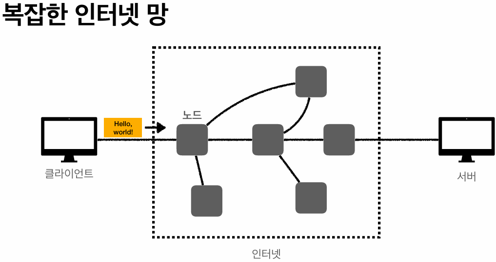
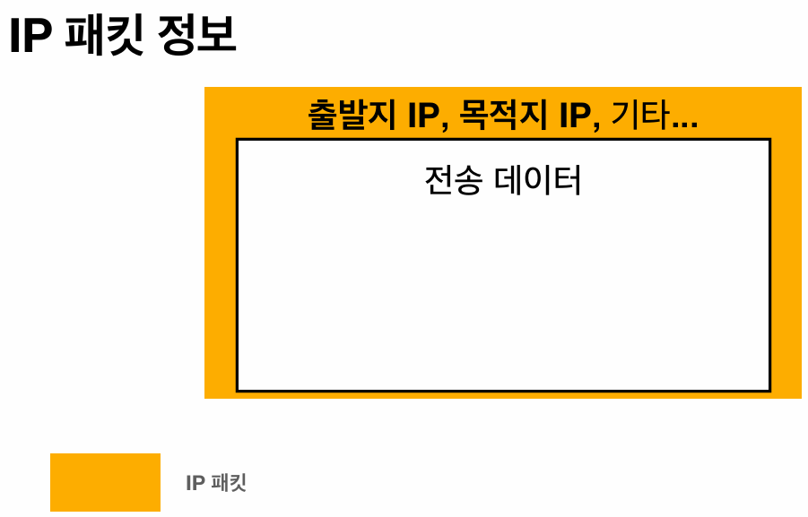
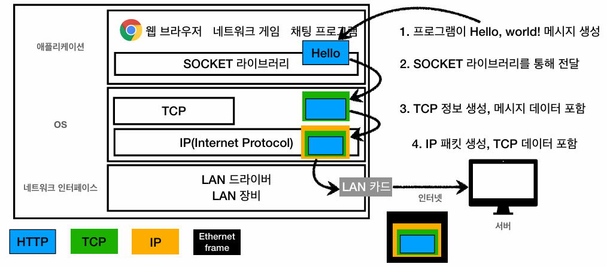
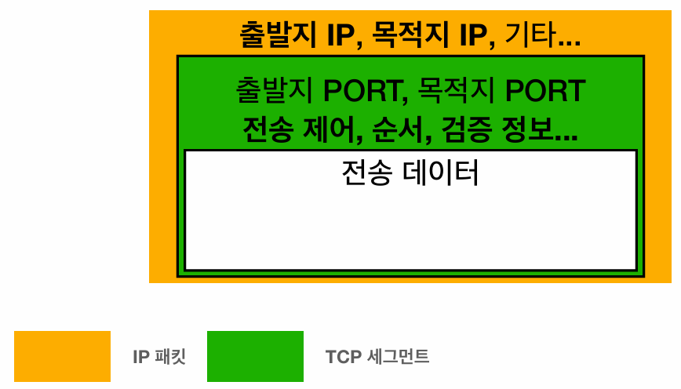

## 인터넷 통신
### 인터넷 네트워크(하부 인프라) 지식의 필요성
- 웹 서비스와 HTTP는 인터넷 네트워크 망을 기반으로 동작한다.
- 따라서 **HTTP 프로토콜의 동작 원리를 파악하기 위해서는 인터넷 망(하부 인프라)에 대한 지식이 선행되어야 한다.**

### 통신 환경의 물리적 제약과 인터넷 망

- 클라이언트와 서버가 **물리적으로 인접한 환경에서는 단순한 전용 케이블 연결만으로도 데이터 송수신이 가능**하다.
- 하지만 실제 운영 환경에서는 통신 주체 간의 물리적 거리가 멀기 때문에, **거대한(복잡한) 인터넷 망을 통해 메시지를 전송**해야 한다.
- **원거리 통신 시 데이터는** 해저 광케이블, 인공위성 등 **다양한 물리적 매체와 수많은 중간 노드(라우터, 중간 서버)를 거쳐 목적지로 라우팅**된다.

### IP(인터넷 프로토콜)의 도입 배경
- **수많은 중간 노드를 거쳐 목적지까지 데이터를 안전하고 정확하게 전달하기 위한 통신 규약이 필요**해졌다.
- 이를 해결하기 위한 기반 기술로서 **네트워크 계층의 IP**가 도입되었다.

---

## IP (Internet Protocol)
### IP란?
- 네트워크 통신을 수행하는 클라이언트와 서버는 먼저 고유한 식별자인 **IP 주소**를 부여받아야 한다.
- IP는 **지정된 IP 주소로 데이터를 전달할 수 있도록 설계된 네트워크 계층의 통신 규약**이다.

### IP 패킷 (통신 단위)

- **애플리케이션의 데이터는 원본 그대로 전송되지 않는다.**
- 출발지 IP, 목적지 IP, 기타 제어 정보와 전송 데이터를 캡슐화하여 **IP 패킷** 단위로 묶어 전송한다.

### IP 프로토콜의 기술적 한계 (TCP 등장 배경)
- **비연결성(Connectionless):**
  - 수신 측 대상 **서버의 연결 상태(정상, 미존재, 오프라인 등) 사전에 확인하지 않고 패킷을 일방적으로 전송한다.**
- **비신뢰성(Unreliable):**
  - 물리적 망 문제로 **중간 라우팅 경로에서 패킷이 소실(Drop)되는 현상을 제어하지 못한다.**
- **순서 미보장:**
  - 하나의 패킷에 모든 메시지를 담아서 전송하지 않는다.
  - 보통 1500바이트 단위로 메시지를 분할하여 전송하는데, 이때 **각 패킷은 서로 다른 경로를 거치게 되므로 수신 측에서의 패킷 도착 순서가 송신 순서와 다를 수 있다.**
  - 하지만, **IP 프로토콜만으로는 수신된 패킷의 순서가 맞는지 파악할 수 없다.**
- **프로세스 식별 불가:**
  - 한 PC 내에서 게임, 음악 등 여러 애플리케이션이 동일한 IP 주소를 사용하여 통신할 경우, **수신된 패킷이 어느 프로세스를 위한 데이터인지 구분할 수 없다.**

---

## TCP/UDP
### TCP 등장
> **IP 프로토콜의 한계(비연결성, 비신뢰성, 프로세스 구분 불가)를 극복하고 데이터 전송의 정합성을 보장하기 위해 상위 전송 계층인 TCP이 도입되었다.**

### 프로토콜 계층과 데이터 캡슐화
#### 프로토콜 계층

- IP 스택은 **애플리케이션 계층(HTTP) → 전송 계층(TCP/UDP) → 인터넷 계층(IP) → 네트워크 인터페이스 계층의 4단계로 구성**된다.
- 하지만 **실제 시스템 아키텍처 관점에서는 애플리케이션, OS, 네트워크 인터페이스의 3단계로 이해하는 것이 직관적**이다.
- 애플리케이션(웹 브라우저, 게임 등) 내의 **소켓 라이브러리가 OS 계층으로 메시지를 전달**하고, 최종적으로 **네트워크 인터페이스(LAN 카드)를 통해 외부로 전송**된다.
- 하위 계층으로 내려갈수록 내려갈수록 제어 정보가 덧붙여지는 **데이터 캡슐화 과정**이 발생한다.

#### 데이터 캡슐화

- **TCP 계층:**
  - 애플리케이션 데이터에 출발지/목적지 PORT 번호, 전송 제어 정보, 순서 정보, 검증 정보 등을 붙여 **TCP 세그먼트**를 생성한다.
- **IP 계층:**
  - TCP 세그먼트에 출발지/목적지 IP 주소 등을 붙여 **IP 패킷**을 생성한다.
- **네트워크 인터페이스 계층**:
  - 패킷에 물리적 하드웨어 주소인 MAC 주소를 붙여 **(이더넷) 프레임을 생성**한다.

#### 실제로 전송되는 데이터는 물리적인 비트 신호이다.
- 네트워크 인터페이스(데이터 링크) 계층에서 캡슐화된 최종적인 논리적 데이터 단위는 프레임이다.
- 하지만, 이 **프레임이 물리적 매체(랜선, 광케이블 등)를 타고 실제로 넘어갈 때(물리 계층)는 0과 1의 비트 스트림으로 변환되어 전송**된다.
- 즉, **논리적인 프레임 형태의 데이터가 물리적인 비트 신호로 변환되어 전송**되는 것이다.

#### 다만 웹 개발 관점에서는 논리적 통신 단위인 패킷까지만 고려한다.
- 웹 애플리케이션 개발 관점에서는 **앞선 하부 변환 과정까지는 고려하지 않고 TCP/IP 패킷 단위로 제어된다**고 추상화하여 이해한다.
- 즉, 웹 개발 관점에서는 논리적 통신 단위인 패킷까지만 고려하여, 통상적으로 **TCP/IP 패킷을 전송한다**고 표현한다.

### TCP (전송 제어 프로토콜)
#### TCP 세그먼트
> 앞서 말했듯, **TCP 세그먼트에는 IP 패킷의 한계를 해결하기 위해 출발지/목적지 PORT 번호, 전송 제어 정보, 순서 정보, 검증 정보가 포함된다.**

#### 연결 지향 (TCP 3-Way Handshake)
> 본 데이터 전송 전, 송수신 측이 서로 통신 가능한 상태인지 파악하는 **논리적 연결 수립 과정**이다.

- **과정:**
  1. 클라이언트가 서버에 **SYN(접속 요청)** 메시지를 전송한다.
  2. 서버가 클라이언트에 **ACK(요청 수락, 확인) + SYN(동기화 요청)** 메시지를 전송한다.
  3. 클라이언트가 서버에 **ACK(확인)** 메시지를 전송한다. (프로토콜 최적화에 따라, 해당 시점에 본 데이터를 함께 포함하여 전송할 수 있다.)
- **논리적 연결:**
  - Handshake를 마쳤다고 해서, 클라이언트와 서버 간 **전용 물리적 회선이 보장되는 것이 아니다.**
  - **양단의 OS가 서로의 상태 정보를 메모리에 유지하는 개념적(논리적) 연결일 뿐**이며, **실제 패킷은 여전히 인터넷 망을 통해 동적으로 라우팅된다.**
- **순서 보장:**
  - 도착한 패킷의 순서가 어긋난 경우, 수신 측은 **잘못된 순서로 들어온 지점의 패킷부터 폐기/재전송 요청을 수행**한다.

#### 안전한 연결 종료 (4-Way Handshake)
> **통신이 완료된 후 연결을 안전하게 종료하기 위해 거치는 과정**이다.

1. 클라이언트가 서버에 **FIN(종료 요청)** 메시지를 전송한다.
2. 서버가 클라이언트에 **ACK(확인)** 메시지를 보내고, 자신이 준비가 될 때까지 기다린다.
3. 준비가 되면, 서버가 클라이언트에 **FIN(준비 완료)** 메시지를 전송한다.
4. 클라이언트는 서버에 **ACK(확인)** 메시지를 전송한다.

### UDP (User Datagram Protocol)
- TCP와 달리 **순서 보장 기능이 없으며, IP 프로토콜의 비연결성과 비신뢰성을 그대로 가진다.**
- 단지 IP 기능에 **PORT 정보**(단일 노드 내 프로세스 식별)과 **체크섬**(메시지 무결성 검증) 데이터만 추가된 형태이다.
- 3-Way Handshake 과정도, 전송 제어 정보도 없기 때문에 **오버헤드가 매우 적고 빠르다.**
- 기본으로 제공하는 기능이 거의 없으므로, 애플리케이션 단에서 **특정 목적에 맞게 제어 기능을 자유롭게 커스터마이징할 수 있는 여지를 제공**한다.

---

## PORT
### PORT란?
> **같은 IP 내에서 프로세스를 구분하는 식별자**이다.

- IP가 네트워크 망에서 목적지 서버(Host)를 찾는 용도였다면, PORT는 **해당 서버 내에서 구동 중인 여러 프로세스의 식별자**이다.
- 즉, **단일 서버(IP) 내에서 복수의 프로세스가 동시에 실행될 때, 어느 프로세스에 속하는 데이터인지 정확히 라우팅하기 위해 도입**되었다.
- 결과적으로 클라이언트와 서버가 통신할 때 데이터는 **IP 주소, PORT 번호, 전송 데이터, 부가 제어 정보가 모두 포함된 TCP/IP 형태**를 가진다.

### PORT 할당 규격
- PORT 번호는 `0`부터 `65535`까지 할당할 수 있지만, `1023`번까지는 **Well-Known Port**라고 해서 일반적인 웹 개발에서는 사용하지 않는다.
- 주요 Well-Known Port로는 HTTP(`80`), HTTPS(`443`), FTP(`20`,`21`)이 있다.

---

## DNS (Domain Name System)
### IP 주소의 한계 (DNS 도입 배경)
#### IP 주소는 기억하기 어렵다
> **단순한 숫자로 구성된 IP 주소(200.200.200.2)는 사용자가 기억하기 어렵다.**

#### IP 주소는 변할 수 있다
> **서버의 인프라 환경 변화에 따라 IP 주소는 언제든 동적으로 변할 수 있다.**

- 이러한 한계를 극복하기 위해 **기억하기 쉬운 문자와 IP를 매핑하는 DNS가 도입**되었다.

### DNS의 동작 매커니즘
> **DNS 서버는 도메인 네임을 key, IP 주소를 value로 저장하는 DB 역할을 수행**한다.

- 클라이언트가 대상 서버와 통신하기 위해 **DNS 서버에 도메인 네임을 질의(Query)하면 DNS는 매핑된 IP 주소를 응답**한다.
- 클라이언트는 반환받은 **IP 주소를 기반으로 대상 서버와 네트워크 연결**을 맺는다.
- 따라서 **대상 서버의 IP 주소가 변경되더라도, DNS 서버의 매핑 레코드만 갱신하면** 클라이언트는 동일한 도메인 명으로 지속적인 서비스 접근이 가능하다.

### 연결과 접속
#### 연결
> TCP 3-Way Handshake 등을 통해 **데이터를 주고받을 수 있는 통신 채널이 수립된 상태**를 의미한다.

#### 접속
> **네트워크 연결을 기반으로**, 클라이언트가 애플리케이션 계층의 **서비스에 진입하여 논리적인 기능들을 수행할 수 있는 인가된 상태**를 의미한다.

