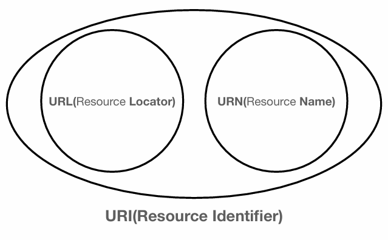
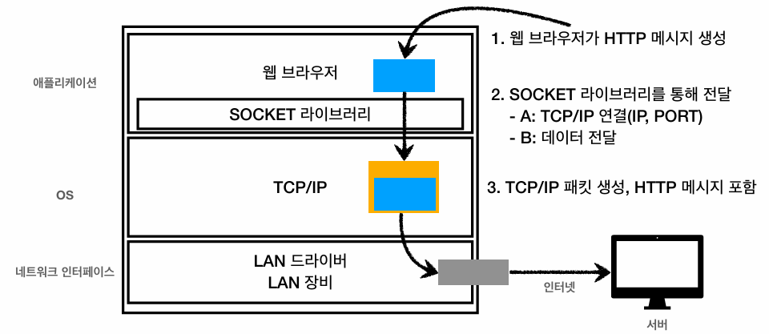

## URI (Uniform Resource Identifier)
### URI
> 통일된 리소스 식별자, 즉 **인터넷 상의 리소스를 일관되게 식별할 수 있는 방법**이다.

- URI는 리소스의 위치로 식별하는 **URL**(Locator)과 리소스에 부여한 고유한 이름으로 식별하는 **URN**(Name)으로 분류된다.
- 이때 리소스는 **네트워크 상에서 구분할 수 있는 모든 데이터**을 의미한다.
  - 예) HTML 문서, 이미지 파일, **실시간 교통정보** 등

### URL
> **특정 리소스가 네트워크 상의 해당 위치에 존재함**을 의미한다.

### URN
> **리소스가 고유한 이름을 가지고 있음**을 의미하며, **리소스의 위치가 변경되어도 식별자가 유지된다**는 장점이 있다.

- 다만, **URN에 부여된 이름만으로 실제 리소스를 매핑하고 찾아내는 기술적 방법이 표준화되거나 보편화되지 않았다.**
- 따라서 **리소스의 식별과 위치 탐색이 동시에 가능한 URL을 표준처럼 사용**하며, 통상적으로 **URI와 URL를 동일한 의미로 사용**한다.

### URL 문법 구조
> `scheme://[userinfo@]host[:port][/path][?query][#fragment]`

#### scheme (protocol)
- 리소스에 접근하기 위한 **프로토콜**을 명시한다.
- 프로토콜이란 **클라이언트와 서버 간의 통신 방식을 지정한 규약**이며, 종류로는 `http`, `https`, `ftp` 등이 있다.

#### userinfo
- **URL 자체에 사용자 인증 정보를 포함할때 사용**한다.
- 보안상의 이유로 일반적인 웹 서비스에서는 거의 사용하지 않으며, CI/CD 파이프라인 등에서 **스크립트를 통한 자동 로그인을 처리할 때 제한적으로 사용**된다.

#### host
- 접근할 대상 서버의 **도메인 네임**이나 **IP 주소**를 명시한다.

#### port
- 대상 서버 내의 프로세스에 접근하기 위한 포트 번호를 지정한다.
- 일반적으로 생략 가능하며, **생략 시 scheme에 정의된 기본 포트가 자동으로 적용**된다.

#### path
- **대상 서버 내에서 리소스가 위치한 구체적인 경로**를 나타낸다.
- 일반적으로 디렉토리 형태의 계층적(hierarchical) 구조로 설계된다.

#### query (query parameter)
- `key=value` 형태의 데이터 쌍으로 구성되며, **서버에 부가적인 파라미터를 넘길 때 사용**된다.
- `?` 기호로 시작하고, 데이터가 여러 개일 경우 `&`로 연결한다.
- 숫자를 입력하더라도 **HTTP 메시지를 통해 네트워크로 전송될 때는 모두 문자열 형태로 직렬화되어 넘어가기 때문에 쿼리 스트링**이라고도 불린다.

#### fragment
- HTML 문서 내부의 특정 위치(북마크)로 스크롤을 이동할 때 사용한다.
- 이 정보는 클라이언트(웹 브라우저) 내부의 렌더링 목적에만 사용되며, **네트워크를 통해 서버로 전송되지 않는다.**

---

## 웹 브라우저의 요청 흐름

### 1. 클라이언트의 요청 메시지 생성
- 웹 브라우저는 입력된 URL을 기반으로 DNS 서버를 조회하여 대상 서버의 IP 주소를 획득한다.
- 브라우저는 **획득한 대상 정보(IP 주소, PORT 번호)를 바탕으로 HTTP 요청 메시지를 생성**한다.
  - 통신할 대상 프로세스를 식별하는 PORT 번호는 `scheme`에 정의된 기본 포트를 통해 사전에 인지하여 적용한다.
  - 해당 메시지에는 url 정보 일부(`host`, `path`, `query`), `http method`, `http version` 등이 포함된다. 

### 2. 데이터 캡슐화 및 네트워크 전송
- **애플리케이션 계층에서 생성된 HTTP 요청 메시지는 소켓 라이브러리를 통해 OS 내부의 전송 계층으로 전달**된다.
- **전송 계층**(TCP)에서는 전달받은 메시지에 출발지/목적지 PORT, 전송 제어 정보, 패킷 순서 정보, 무결성 검증 정보 등을 덧붙여 **TCP 세그먼트를 생성**한다.
- **인터넷 계층**(IP)에서는 TCP 세그먼트에 출발지/목적지 IP 주소 등의 정보를 붙여 **TCP/IP 패킷으로 캡슐화**한다.
- 캡슐화된 패킷은 **네트워크 인터페이스(데이터 링크) 계층을 거쳐 논리적인 프레임 형태로 구성**되며, **실제 물리적인 인터넷 망을 통해서는 0과 1의 전기적 신호인 비트 단위로 변환되어 대상 서버로 전송**된다.

### 3. 서버의 요청 처리 및 응답 메시지 반환
- 네트워크를 통해 데이터를 수신한 대상 서버는 **계층을 역순으로 거치며 캡슐화된 헤더 정보를 모두 해제**(Decapsulation)한다.
- 서버 애플리케이션은 최종적으로 추출된 **HTTP 요청 메시지를 확인 및 해석(파싱)하고, 요구된 비즈니스 로직을 처리**한다.
- 처리가 완료되면 웹 서버는 클라이언트에게 반환할 **HTTP 응답 메시지를 생성**한다.
  - 해당 메시지에는 사용된 `http version`, **처리 성공 여부**를 나타내는 상태 코드, **응답 데이터의 형식**을 명시하는 `content-type`, **데이터의 크기**인 `content-length` 및 **실제 페이로드**(HTML 데이터)가 포함된다.
- 생성된 HTTP 응답 메시지 **역시 동일한 네트워크 캡슐화 과정을 거쳐 인터넷 망을 통해 클라이언트(웹 브라우저)로 전송**된다.

### 4. 클라이언트의 렌더링
- 최종적으로 응답 데이터를 수신한 웹 브라우저는 **전달받은 HTML을 화면에 렌더링**한다.
