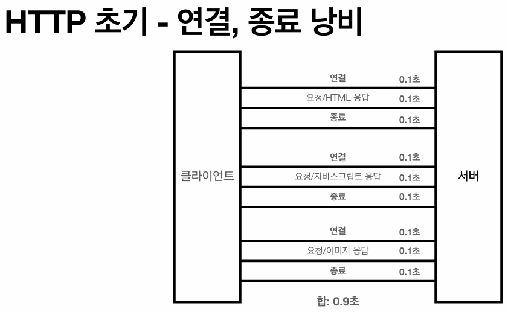
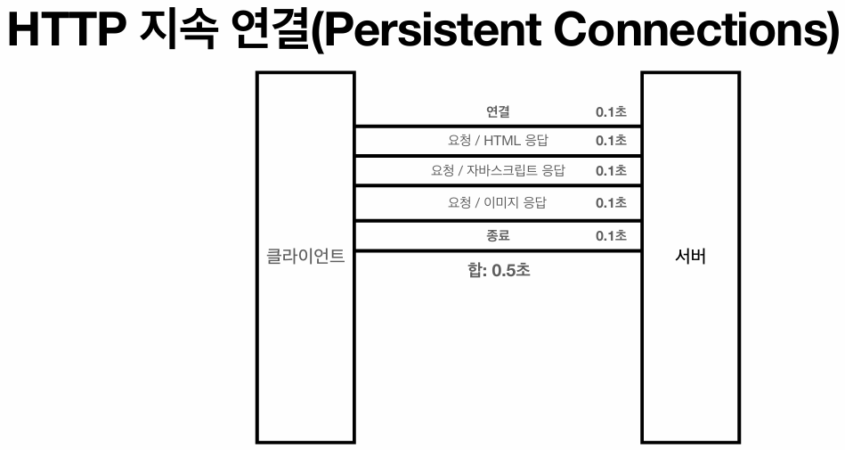
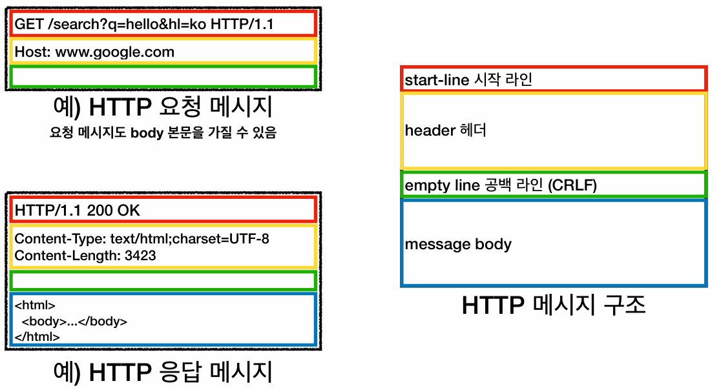

## HTTP
### HTTP와 HyperText
> **HTTP(HyperText Transfer Protocol)는 웹 상에서 데이터를 주고받기 위한 통신 프로토콜**이다.

- **HyperText**는 **문서 내부에 링크(다른 문서로 즉시 접근할 수 있는 참조)를 포함한 텍스트**를 의미하며, 이를 구조적으로 구현한 마크업 언어가 HTML이다.
- 초기 HTTP는 이러한 **HTML 문서를 전송하기 위한 목적으로 설계**되었다.
- 하지만 기술의 발전으로 **현재는 HTML뿐만 아니라** 텍스트, 이미지, 음성, 영상, 파일, JSON, XML 등 **네트워크를 통해 전달 가능한 거의 모든 형태의 데이터를 HTTP 메시지에 담아 전송**한다.

### HTTP의 전송 범위
- **클라이언트(웹 브라우저, 모바일 앱 등)와 서버 간의 통신**뿐만 아니라, MSA 등 **백엔드 서버 간 통신에서도 대부분 HTTP를 기본 통신 규약으로 사용**한다.

### HTTP 버전
- 1997년에 등장한 **HTTP/1.1** 버전이 현재 가장 널리 사용되며, 웹 아키텍처에서 가장 중요한 기반 스펙이다.
- HTTP 통신에 필요한 대부분의 핵심 기능이 **HTTP/1.1** 스펙에 정의되어 있으며, 1997년(RFC2068)부터 2014년(RFC7235)까지 지속적으로 스펙이 개선되었다.
- 이후에 등장한 **HTTP/2와 HTTP/3는** 프로토콜 패러다임의 변화보다는, 네트워크 대역폭 활용 및 전송 **성능 개선에 초점**이 맞추어져 있다.

### 기반 프로토콜 스택 (TCP/UDP)
- `HTTP/1.1`과 `HTTP/2`는 신뢰성과 데이터 전달을 보장하는 **TCP 프로토콜 기반** 위에서 동작한다.
- 반면, 최신 규격인 `HTTP/3`은 전송 속도 향상과 성능 최적화를 위해 **UDP 프로토콜 기반**으로 설계되어 동작한다.
- 실제 서비스 중인 웹 사이트(구글 등)가 사용하는 프로토콜 버전은 **개발자 도구 내 네트워크 탭에서 프로토콜 컬럼을 활성화하여 확인**할 수 있다.

### HTTP 특징
- **클라이언트-서버 아키텍처**로 동작
- 상태를 유지하지 않는 **무상태(Stateless)** 프로토콜
- 통신 직후 연결을 끊는 **비연결성(Connectionless)**
- 통일된 규격인 **HTTP 메시지**를 통한 통신
- 구조적 **단순함**과 뛰어난 **확장성**

---

## 클라이언트 서버 구조
> **클라이언트는 HTTP 메시지를 통해 서버에 요청을 전송하고, 응답이 올 때까지 대기**한다.

### 아키텍처 분리와 독립성
- 과거와 달리 현대 웹 아키텍처는 **클라이언트와 서버의 역할을 개념적, 물리적으로 완벽히 분리**하는 구조를 지향한다.
  - 서버는 복잡한 비즈니스 로직 처리와 데이터 접근 및 관리에 집중하고,
  - 클라이언트(PC, 모바일, TV 등)는 사용성(UI/UX) 처리와 화면 렌더링에 집중한다.
- 이러한 **명확한 역할 분리를 통해, 클라이언트와 서버는 서로의 내부 구현에 영향을 받지 않고 독립적으로 진화하고 확장**될 수 있다.

---

## 무상태(Stateless) 프로토콜
### 상태 유지(Stateful)와 무상태(Stateless)
> **HTTP는 기본적으로 서버가 클라이언트의 이전 상태를 보존하지 않는 무상태(Stateless) 프로토콜을 지향**한다.

#### 상태 유지(Stateful)
- Stateful 통신에서는 **서버가 클라이언트의 이전 요청 문맥(Context)을 메모리에 계속 보존**하므로, 클라이언트는 이후 통신에서 추가된 정보만 전송하면 된다.
- 따라서 Stateful 환경에서는 클라이언트의 요청을 처리하던 특정 서버가 다운될 경우 Context가 소실되기 때문에, 클라이언트가 처음부터 통신 절차를 다시 수행해야 한다.

#### 무상태(Stateless)
- Stateless 통신에서는 클라이언트가 **매 요청마다 처리에 필요한 모든 데이터를 포함하여 전송**한다.
- 따라서 Stateless 환경에서는 **서버가 이전 상태를 기억할 필요가 없으므로, 임의의 서버가 요청을 수신하더라도 동일한 처리가 보장된다.**

### Stateless 아키텍처의 장단점
#### 장점: 무한한 서버 증설 (Scale-out 용이)
- 특정 서버에 장애가 발생해도 로드밸런서를 통해 다른 서버로 즉각 요청 처리가 가능하므로, 트래픽 증가 시 서버 장비를 수평적으로 늘리는 **Scale-out(수평 확장)에 유리**하다.

#### 단점: 데이터 통신량 증가
- 클라이언트가 매 요청마다 처리에 필요한 모든 데이터를 포함하여 전송해야 하므로, **네트워크를 통해 전송되는 데이터의 페이로드 크기가 상대적으로 커진다.**

### Stateless의 필연적인 한계
> **모든 웹 애플리케이션 로직을 완벽한 무상태로 설계할 수는 없으며, 사용자 로그인과 같은 특정 도메인에서는 필연적으로 Stateful이 요구된다.**

- 즉, 웹 애플리케이션은 Stateless 설계를 기본으로 하되, **불가피한 영역에 한해 Stateful 로직을 제한적으로 혼용**하는 방식으로 아키텍처를 구성해야 한다.

#### 예시: 세션과 쿠키
> **로그인 상태 유지를 위해 서버의 세션(Stateful)과 브라우저의 쿠키(Stateless)를 조합하여 사용**한다.

- **과정:**
  1. 클라이언트 최초 로그인 시 서버는 **사용자별 고유한 상태 정보를 담은 세션 객체**를 생성하고, 이를 식별할 수 있는 고유 키(Session ID)를 발급한다.
  2. **서버는 이 고유 키를 응답에 담아 보내고, 클라이언트는 이를 쿠키에 저장하여 이후 요청마다 HTTP 헤더에 포함하여 전송**함으로써, 통신 자체의 무상태성(Stateless)을 유지하면서도 Context를 이어 나간다.
  3. 서버는 헤더에 등록된 세션 ID를 키(Key)로 삼아 **세션 메모리에 유지 중인 사용자의 상태 데이터를 조회**(Stateful)한다.  
- **결과:**
  - 이 과정을 통해 **해당 로직(로그인 유지 등)에 한해 Stateful 특성을 가지게 된 것**이다.
  - 따라서 세션의 만료 시간이 지나거나, 상태를 메모리에 저장하고 있는 세션 서버에 장애가 발생하면 유지되던 상태가 모두 소실(로그아웃 처리)된다.

### Stateless를 활용하는 예시
> **앞서 Stateless 모델의 경우, 트래픽 증가 시 서버 장비를 수평적으로 늘리는 Scale-out이 용이**하다고 했다.

- 명절 예매, 선착순 이벤트, 수강신청 등 특정 시간에 대규모 트래픽이 집중되는 환경에서는 이러한 Scale-out이 필수적이다.
- 위와 같은 **서비스 아키텍처를 설계**할 때, **Scale-out에 제약을 주는 Stateful 로직을 최소한으로 사용해야 한다.**

---

## 비연결성 (Connectionless)
### 연결 유지 모델과 비연결 모델
#### 연결 유지(Connection-oriented) 모델
- 클라이언트와 서버가 한번 TCP/IP 소켓 연결을 맺으면, **통신이 끝난 후에도 계속 연결 상태를 유지**한다.
- 연결 유지 모델은 다수의 클라이언트가 접속할 경우, 서버가 요청이 없는 대기 상태의 클라이언트들과의 연결까지 모두 유지해야 하므로 **서버의 시스템 자원(CPU, 메모리 등)이 지속적으로 소모**된다.

#### 비연결(Connectionless) 모델
- 클라이언트가 요청을 보내고 서버가 응답을 반환하면, TCP/IP 연결을 종료한다.
- 비연결 모델은 연결을 유지하기 위한 오버헤드가 없으므로, 서버 입장에서는 **최소한의 시스템 자원만으로 서버 가용성을 극대화**할 수 있다.
- 이러한 이유에서 **HTTP는 비연결성 모델을 채택**하고 있다.
  - **접속 중인 모든 클라이언트와 연결을 유지하는 것은 요청 대비 너무 많은 시스템 자원을 요구**한다. (즉, 비효율적이다.)

### 비연결성의 기술적 한계 (HTTP 지속 연결 등장배경)
> **요청마다 네트워크에서 TCP 3-Way Handshake(연결을 맺는) 과정을 새로 수행**해야 하므로, **추가적인 네트워크 지연 시간(Latency)이 발생**한다.

#### HTTP의 자원 요청 방식
> **클라이언트(웹 브라우저)가 최초의 HTML 문서를 응답받아 파싱할 때, 내부의 리소스(JS, CSS, 이미지 등) 링크를 발견하면 브라우저 엔진이 알아서 각각의 리소스에 대한 개별적인 1:1 HTTP 요청을 보낸다.**

- 초기 HTTP(**HTTP/1.0**) 통신 방식에서는 이러한 **개별 리소스 요청마다 매번 새로운 TCP 연결(3-Way-Handshake)을 맺고 끊는 과정을 반복**했기 때문에 **매우 비효율적**으로 동작했다.

### HTTP 지속 연결 (Persistent Connections)
#### 등장 배경
- 앞서, **HTTP/1.0에서는 하나의 HTML 문서를 온전히 보여주기 위해 개별 리소스 요청마다 매번 새로운 TCP 연결을 맺는다**고 했다.
- 이러한 TCP 연결 오버헤드를 해결하기 위해 **HTTP/1.1부터는 HTTP 지속 연결 매커니즘이 도입**되었으며, 이는 HTTP 헤더의 **Keep-Alive** 기능을 통해 구현된다.

#### 개념

- 지속 연결 상태에서는 **최초의 HTML과 그에 종속된 수많은 자원(JS, CSS, 이미지)을 모두 다운로드할 때까지 TCP 연결을 종료하지 않고 유지**한다.
- 따라서 **하나의 웹 페이지를 온전히 렌더링하기 위한 일련의 통신 과정에서는 TCP 연결(3-Way Handshake)이 한 번만 발생**한다.

#### 지속 연결이라 해서 HTTP를 연결 유지 모델로 바꾸는 것이 아니다.
> **HTTP는 여전히 비연결성(Connectionless) 모델을 기반으로 한다.**

- 단지 TCP 연결로 인한 Latency(네트워크 지연)를 최소화하기 위해, **비연결성 원칙을 일시적으로 지연시키는 최적화 기법**일 뿐이다.
- 서버는 HTML 파일과 그에 종속된 자원(Asset)들이 연달아 요청될 것을 예상하고, 설정된 특정 시간(Keep-Alive Timeout) 동안만 임시로 연결을 열어둔다.
- 해당 타임아웃 시간 내에 클라이언트로부터 추가 요청이 오지않으면, 서버는 즉시 TCP 연결을 종료하여 시스템 자원을 회수한다.

### 웹 아키텍처는 Stateless와 Connectionless를 기반으로 한다.
> 단지, **성능과 사용성을 위해 예외적인 제어 로직(제한적 Stateful, 지속 연결)을 혼용하고 있을 뿐**이다.

- 웹 통신에서 **서버는 클라이언트의 상태를 기억하지 않지만, 예외적으로 세션/쿠키와 같은 제한적인 Stateful 로직을 허용**한다.
- 마찬가지로 **서버는 클라이언트와 연결을 유지하지 않지만, 예외적으로 Keep-Alive와 같은 제한적인 연결 유지 기법을 사용**한다.    

---

## HTTP 메시지 구조
### HTTP 메시지 공통 구조

- **HTTP 요청 메시지와 응답 메시지의 내부 구성은 다르지만, 구조 자체는 동일**하다.
- RFC 7230 공식 스펙에 정의된 공통 구조는 **시작 라인(start-line), 헤더(header), 공백 라인(CRLF, 필수), 메시지 바디(message body)의 4가지 요소로 구성**된다.
- 이때 공백 라인은 **header와 message body를 구분하기 위한 필수 규격**이다.

### request-line (요청 메시지의 시작 라인)
> **`HTTP 메서드 + SP(공백) + 요청 대상 + SP + HTTP 버전 + CRLF`로 구성**된다.

#### HTTP 메서드
- **서버가 수행해야 할 구체적인 동작(`GET`, `POST` 등)을 지정**한다.

#### 요청 대상
- 일반적으로 절대 경로와 쿼리 파라미터를 결합한 형태(`absolute-path[?query]`)를 사용한다.
  - **절대 경로**는 **루트 경로(`/`)부터 시작하여 자원의 정확한 위치를 명시하는 방식**이다. 
  - **현재 위치를 기준(`./` 또는 `../`)으로 자원을 찾는 방식**인 **상대 경로**와 구분된다.
- **request line(시작 라인의 요청 대상)에는 호스트를 제외하고 `/`로 시작하는 절대 경로만을 기입해야 한다.**
  - HTTP/1.1 규격상 목적지 도메인(호스트명)은 반드시 별도의 Host 필드에 명시해야 하기 때문이다.

### status-line (응답 메시지의 시작 라인)
> **`HTTP 버전 + SP + 상태 코드 + SP + 이유 문구 + CRLF`로 구성**된다.

#### 이유 문구 (Reason Phrase)
- **반환된 상태 코드의 의미를 사람이 읽고 이해할 수 있도록 짧게 설명하는 문자열 데이터**이다.

### HTTP 헤더
> **`필드 이름(field-name) + : + OWS + 필드 값(field-value) + OWS`로 구성**된다.

- 필드 이름은 대소문자를 구분하지 않으며, OWS(Optional Whitespace) 규격에 따라 콜론 뒤의 띄어쓰기는 선택적이다.
- 메시지 바디의 페이로드 데이터를 제외한, **HTTP 전송 및 제어에 필요한 모든 메타데이터**를 담는다.
  - 바디 데이터의 타입(`Content-Type`) 및 크기(`Content-Length`), 압축 방식, 인증 정보, 클라이언트 브라우저 정보, 서버 애플리케이션 정보, 캐시 제어 정보 등이 포함된다.
- 프로토콜에 사전 정의된 수많은 표준 헤더 필드가 존재하며, 애플리케이션 요구사항에 따라 **클라이언트와 서버가 합의한 임의의 커스텀 헤더를 추가할 수 있다.**

### HTTP 메시지 바디
> **실제 네트워크를 통해 전송할 목적(Payload) 데이터를 담는 공간**이다.

- HTML 문서, 이미지, 영상, JSON, XML 등 **바이트(Byte) 단위로 직렬화할 수 있는 모든 형태의 데이터**를 전송할 수 있다.
- 응답 메시지뿐만 아니라 **요청 메시지도 메시지 바디를 가질 수 있다.**
  - 클라이언트가 HTML 폼을 통해 `Submit`하는 경우
  - HTTP API(JSON) 통신으로 서버에 데이터를 저장/수정하는 경우

#### 직렬화 (Serialization)
> **전송 및 저장을 위해 객체를 특정 포맷으로 바꾸는 일련의 행위**이다.

- **메모리에 적재된 객체나 데이터 구조를** 네트워크 전송, 파일 저장, DB 보관 등에 적합한 **특정 포맷으로 변환하는 모든 과정**을 의미한다.
- 변환되는 결과물은 `0`과 `1`로 이루어진 **바이트 스트림**일 수도 있고, 웹 통신에서 주로 사용하는 **JSON, XML과 같은 텍스트 기반 문자열**일 수도 있다.
  - **HTTP 통신에서 서버의 애플리케이션 객체를 JSON 문자열로 변환하는 것** 역시 직렬화의 대표적인 예시이다.

#### 역직렬화 (Deserialization)
> **전송 및 저장을 위해 변환했던 데이터 포맷을 원래 객체나 데이터 구조로 복원하는 일련의 행위**이다.

- 전송 및 저장을 위해 변환했던 데이터 포맷(바이트, JSON 등)을 **애플리케이션 메모리 상에서 논리적으로 식별하고 사용할 수 있도록** 원래의 객체나 데이터 구조로 복원하는 과정이다.

### HTTP 프로토콜의 설계 철학 (단순함과 확장성)
- **HTTP 메시지는 텍스트 기반으로 구조가 매우 직관적이고 단순**하다.
- 인터넷 환경에서 범용적인 표준 기술로 크게 성공한 이유는 이러한 **단순함**뿐만 아니라, **헤더와 바디를 통한 뛰어난 확장성**을 동시에 갖췄기 때문이다.
