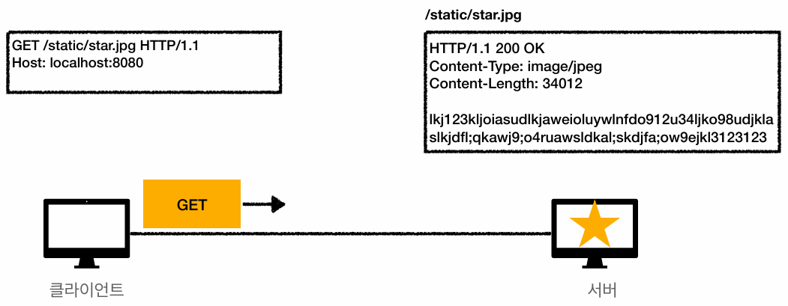
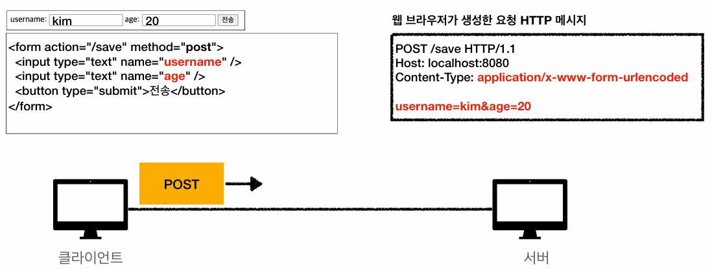
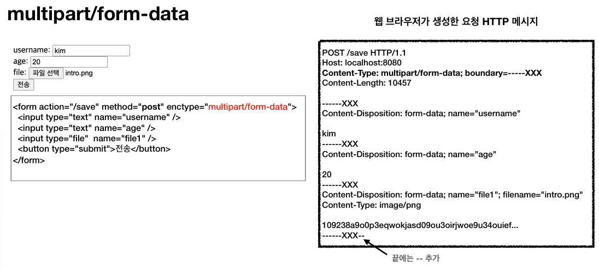

## 클라이언트에서 서버로 데이터 전송
### 데이터 전송 방식
클라이언트가 서버로 데이터를 전달하는 매커니즘은 크게 두 가지로 분류된다.

- **쿼리 파라미터:**
  - 주로 GET 메서드를 활용하여 데이터를 조회할 때 사용한다.
  - **검색어, 필터 조건, 정렬 조건 등의 데이터를 URI에 포함하여 전송**한다.
- **메시지 바디:** 
  - 주로 POST, PUT, PATCH 메서드를 활용하여, 서버에 리소스를 등록하거나 리소스의 상태를 변경할 때 사용한다.
  - **HTTP 요청 메시지 바디(Payload)에 데이터를 담아 전송**한다.

이러한 2가지 데이터 전송 방식을 기반으로, 크게 4가지의 데이터 전송 상황이 정의된다.

### 상황 1. 정적 데이터 조회
> **정적인 이미지 파일, 텍스트 문서 등을 조회할 때 발생하는 상황**이다.

- 클라이언트가 서버에 **부가적인 데이터를 전달할 필요가 없으므로 쿼리 파라미터를 사용하지 않는다.**
- 대상 자원의 **URI만으로 단순하게 조회**를 수행한다.

### 상황 2. 동적 데이터 조회
> **게시판 목록의 검색, 정렬 조건 변경 등 동적으로 결과가 바뀌는 데이터를 조회할 때 발생하는 상황**이다.

- 리소스를 변경하지 않는 조회 목적이므로 GET 메서드를 사용한다.
- 클라이언트는 **특정 데이터를 찾는 검색어, 조회 결과를 축소하는 필터, 출력 순서를 변경하는 정렬 조건 등을 서버에 전달**하기 위해, **쿼리 파라미터를 Key-Value 형태로 구성하여 URI에 포함해 전송**한다.

### 상황 3. HTML Form 데이터 전송
> **웹 브라우저가 HTML의 `<form>` 태그 속성(`action`, `method`)을 기반으로 HTTP 요청 메시지를 자동 생성하여 전송하는 방식**이다.

#### POST 전송 (`application/x-www-form-urlencoded`)
> **회원 가입, 상품 주문 등 리소스를 등록/변경할 때 사용**한다.

- 폼 입력 필드의 데이터를 Key-Value 형태로 메시지 바디에 담는다.
- 이때 **한글이나 특수문자 전송 시의 데이터 깨짐을 방지하기 위해 웹 브라우저가 데이터를 URL 인코딩(`김` → `%EA%B9%80`) 처리하여 전송**하는 것이 표준 스펙이다.

#### GET 전송 (method = `get`)
> **브라우저가 폼 데이터를 메시지 바디가 아닌 URI의 쿼리 파라미터로 변환하여 전송하는 방식**이다.

- 이 방식은 리소스 변경(`/save` 등)에 사용해서는 안 되며, **특정 조건의 데이터를 검색하는 조회 목적으로만 제한적으로 사용**해야 한다.

#### 파일 전송 (enctype = `multipart/form-data`)
> **이미지, 영상 등 바이너리 데이터를 폼 데이터와 함께 전송할 때 사용하는 타입**이다.

- 전송하는 데이터를 고유한 경계선(`boundary`)으로 분할(Multipart)하여, **문자열 폼 데이터와 여러 종류의 파일 데이터를 한 번의 HTTP 요청에 병합하여 서버로 전송**할 수 있게 해준다.

### 상황 4. HTTP API 데이터 전송
> **HTML 폼을 거치지 않고, 애플리케이션 코드 레벨에서 직접 HTTP 메시지를 생성하여 통신하는 방식**이다.

#### 주요 활용 아키텍처
- 백엔드 시스템 간의 **서버 대 서버** 통신
- 아이폰, 안드로이드 등 **모바일 앱 클라이언트**와 서버 간의 통신
- React, Vue.js와 같은 **웹 클라이언트**에서 AJAX(비동기 JS 통신)를 이용한 웹 통신

#### 전송 규격
- 리소스 변경(POST, PUT, PATCH) 시에는 **메시지 바디**를 사용한다.
- 리소스 조회(GET) 시에는 **쿼리 파라미터**를 사용한다.

#### 데이터 포맷
- 메시지 바디에 TEXT, XML 등 다양한 데이터 형식을 담을 수 있다.
- 하지만 **현재는 대부분 `application/json` 규격의 JSON 포맷을 사실상 표준으로 채택하여 사용**한다.

---

## HTTP API 설계 예시
### API 설계 모델 1: 컬렉션(Collection) 기반 (POST 신규 등록)
> **서버가 리소스의 생성과 URI 관리를 전담하는 디렉터리 구조**이다.

- **동작 방식:** 
  - **클라이언트는 신규 리소스를 등록할 때 대상의 정확한 URI를 모른 채, 컬렉션(리소스의 집합 경로, `/members`)으로 POST 요청**을 보낸다.
- **서버의 역할:**
  - 서버는 요청을 받아 새로운 식별자(`100`)를 생성한다.
  - 응답 시에는 `Location` 헤더를 통해 생성된 리소스의 전체 URI(`/members/100`)를 반환하거나,
  - 응답 메시지 바디에 생성된 식별자(`{"id": 100}`)를 담아 클라이언트에게 전달한다.
- **특징:** 
  - 현대 HTTP API 아키텍처에서 신규 자원 등록 시 **가장 보편적으로 채택하여 사용하는 설계 방식**이다.

### API 설계 모델 2: 스토어(Store) 기반 (PUT 신규 등록)
> **클라이언트가 리소스의 URI를 사전에 알고 직접 관리하는 저장소(Repo.) 구조**이다.

- **동작 방식:**
  - **클라이언트는 신규 자원을 등록할 때 자신이 직접 식별자(`/files/star.jpg`)를 지정**하여, **구체적인 URI로 PUT 요청**을 보낸다.
- **특징:**
  - **클라이언트가 주도적으로 URI를 관리해야 하므로, 컬렉션 방식에 비해 사용 비중이 현저히 낮다.**

### API 설계 모델 3: 순수 HTML Form 기반
> **`<form>` 태그만을 이용하여 HTTP API를 설계하는 방식**이다.

- **기술적 제약:**
  - 웹 브라우저의 순수 HTML `<form>` 태그는 오직 GET, POST 메서드만 지원하므로 PUT, PATCH, DELETE를 통한 리소스 조작이 불가능하다.
- **컨트롤 URI 활용:**
  - 이러한 제약을 우회하기 위해, **예외적으로 동사 형태의 행위를 포함한 컨트롤 URI를 설계**하여 POST 메서드로 요청을 전송한다.
  - 등록 폼: `/members/new`
  - 수정 폼: `/members/{id}/edit`
  - 삭제 처리: `/members/{id}/delete` (DELETE 메서드를 사용할 수 없으므로 POST + 컨트롤 URI를 통해 삭제를 구현함)
- **경로 일치화 권장:**
  - 등록 폼 화면에서 데이터를 입력하고 `submit`할 때, **도착지 URI를 폼 출력 URI와 동일하게 `/members/new`로 맞추는 것이 권장**된다.
  - 서버 검증(Validation) 실패 시, **클라이언트의 URI 경로가 변경되지 않은 채로 폼 화면을 재구성하여 응답하기 수월**하기 때문이다.

### URI 설계 시 알아두면 좋은 4가지 용어
#### 문서 (Document)
- **파일 한 개, 단일 객체 인스턴스, DB의 단일 Row와 같이 단일 개념을 나타내는 용어**이다.
- 예) `/members/100`, `/files/star.jpg`

#### 컬렉션 (Collection)
- **서버가 식별자를 생성하고 관리하는 리소스 디렉터리를 뜻하는 용어**이다.
- 예) `/members`

#### 스토어 (Store)
- **클라이언트가 식별자를 직접 지정하고 관리하는 리소스 저장소를 뜻하는 용어**이다.
- 예) `/files`

#### 컨트롤 URI (Controller)
- **명사형 리소스와 HTTP 메서드의 조합만으로는 해결할 수 없는 프로세스를 처리하기 위해 예외적으로 사용하는 URI**이다.
- 유일하게 **동사**를 사용하여 구성한다.
- 예) `/orders/{orderId}/delivery-start`