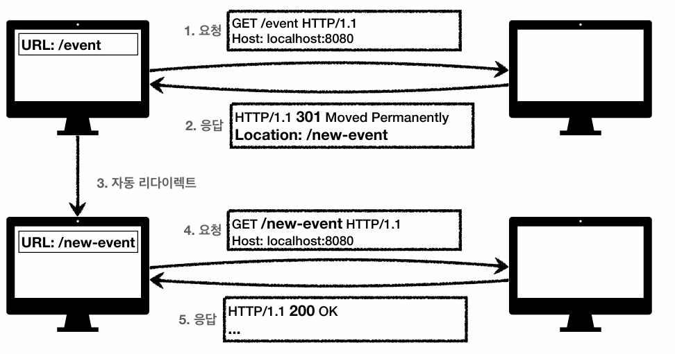
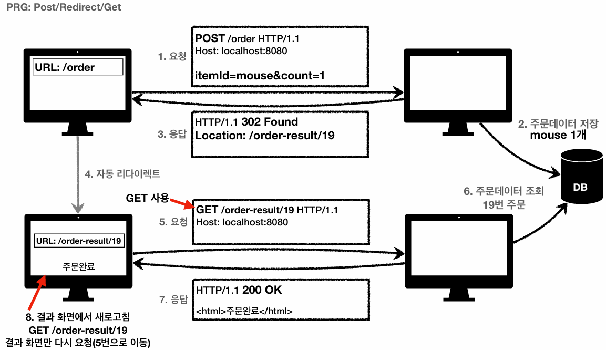

## HTTP 상태 코드
### 정의 
> **클라이언트의 요청 처리 상태를 나타내는 코드**, 즉 **서버로 보낸 HTTP 요청이 어떻게 처리되었는지** 알려주는 코드이다.

### 종류
상태 코드는 첫 번째 자리 숫자에 따라 크게 4가지 범주(Class)로 분류된다. (`1xx`는 거의 사용하지 않으므로 제외)
 
- **2xx(Success):** 요청 정상 처리 
- **3xx(Redirection):** 요청을 완료하기 위해 클라이언트의 추가적인 행동이 필요함
- **4xx(Client Error):** 클라이언트의 잘못된 문법이나 요청으로 인해 서버가 처리할 수 없음
- **5xx(Server Error):** 서버 내부의 문제로 인해 유효한 요청을 정상적으로 처리하지 못함

### 미인식 상태 코드 처리 규칙
- 클라이언트가 인식할 수 없는 새로운 상태 코드를 서버로부터 반환받은 경우, **해당 코드의 상위 클래스로 해석하여 처리**해야 한다.
- 예) `299` 코드를 수신한 경우, 상위 클래스인 `2xx(성공)` 코드로 해석

---

## 2xx (Successful)
> **클라이언트의 요청이 서버에서 정상적으로 처리되었음**을 의미한다.

### 200 OK
> **클라이언트의 요청이 정상적으로 처리되었음**을 나타낸다.

- 주로 리소스를 조회하는 GET 요청의 성공 응답으로 사용된다.

### 201 Created
> 클라이언트의 요청이 성공하여 **서버에 새로운 리소스가 생성되었음**을 나타낸다.

- 주로 POST 메서드를 통한 데이터 등록 시 사용된다.
- 서버는 응답 헤더의 `Location` 필드에 새로 생성된 리소스의 전체 URI를 포함하여 클라이언트에게 반환한다.

### 202 Accepted
> 클라이언트의 요청이 서버에 **정상적으로 접수되었으나, 아직 처리가 완료되지 않았음**을 의미한다.

- **배치 처리**(클라이언트의 요청을 대기열에 담아두고, 서버의 배치 프로세스가 나중에 일괄 처리) 등에 활용한다.
- 예) 요청 접수 1시간 뒤에 배치 프로세스가 요청을 처리하는 경우

### 204 No Content
> 클라이언트의 요청을 서버가 성공적으로 처리했지만, **응답 메시지 페이로드에 반환할 데이터가 없음**을 나타낸다.

- 결과 데이터가 없더라도 `204` 코드를 통해 클라이언트는 **요청 성공, 반환 데이터 없음**이라는 사실을 인지할 수 있다.
- 예) 웹 문서 편집기의 `save` 버튼

### 상태 코드의 팀 컨벤션
> 모든 성공적인 응답을 `200 OK`로만 통일할 것인지, 아니면 **명확하게 구분하여 사용할 것인지는 팀 컨벤션에 따라 유동적으로 결정**해야 한다.

- 이는 상태 코드의 모든 종류에 적용된다.

---

## 3xx (Redirection)
> **요청을 완료하기 위해 클라이언트(웹 브라우저, 유저 에이전트)의 추가 조치가 필요함**을 나타낸다.

### 자동 리다이렉트 흐름
> **클라이언트가 리다이렉트 응답을 확인하고, 새로운 요청을 전송하여 화면이 렌더링되기까지 발생하는 일련의 과정**이다. 

1. **클라이언트의 요청**
2. **서버의 리다이렉트 응답** (`3xx` 코드와 `Location` 헤더를 포함한 응답)
3. **리다이렉트 판단** (자동으로 발생)
   - 웹 브라우저는 **서버의 리다이렉트 응답을 통해 `Location`에 해당하는 URL로 새로운 요청을 보내야겠다**고 판단한다.
4. **클라이언트의 새로운 요청** (자동으로 발생)
   - 판단 즉시, 브라우저는 (주소창을 변경하기에 앞서) 새로운 요청 메시지를 전송한다.
5. **서버의 응답 및 화면 렌더링**
   - 브라우저가 서버의 응답을 받아오면서 화면이 렌더링된다. 
   - 이때 화면 렌더링 직전에 브라우저 주소창의 URL이 변경되는 것을 **네비게이션 커밋**이라고 한다.

### 영구 리다이렉션
> **특정 리소스의 URI가 영구적으로 이동했음**을 의미한다.

- 검색 엔진은 기존 URI를 폐기하고, **변경된 새로운 URI를 검색 결과에 반영**(갱신)한다.

#### 301 Moved Permanently
- **리다이렉트 시 요청 메서드가 GET으로 변하고, 본문(메시지 바디)이 제거**될 수 있다.
- 모든 경우는 아니지만, 대부분의 경우에 브라우저가 위와 같이 처리한다.

#### 308 Permanent Redirect
- `301`과 기능은 동일하나, 리다이렉트 시 **요청 메서드와 메시지 바디를 그대로 유지**한다.
- 하지만 **보통 URI가 바뀌면 데이터 포맷도 바뀌는 경우가 많기 때문에 대부분의 경우에 `301`을 사용**한다. 

### 일시적인 리다이렉션
> **리소스의 URI가 일시적으로 변경되었음**을 의미한다.

- **변경이 일시적이므로 검색 엔진은 기존 URI를 그대로 유지**한다.

#### 302 Found
- **리다이렉트 시 요청 메서드가 GET으로 변하고, 본문(메시지 바디)이 제거**될 수 있다.

#### 307 Temporary Redirect
- `302`와 기능은 동일하나, 리다이렉트 시 **요청 메서드와 메시지 바디를 그대로 유지**한다.

#### 303 See Other
- `302`와 기능은 동일하나, 리다이렉트 시 **요청 메서드가 명확하게 GET으로 변경**된다.
- 이 역시 `303`, `307`이 명확한 규정이지만, 이미 많은 애플리케이션에서 `302`를 기본값으로 사용하고 있다.
- 자동 리다이렉트 시 메서드가 GET으로 변해도 상관없다면 `302`를 사용해도 무방하다. 

### PRG 패턴 (Post/Redirect/Get)
> **POST 요청 후 웹 브라우저를 새로고침했을 때 발생하는 중복 요청(중복 주문 등)을 방지하기 위한 패턴**이다.

- 웹 브라우저의 **새로고침은 마지막에 전송한 요청을 다시 보내는 기능**인데, **POST 요청은 멱등하지 않기 때문에 문제가 발생**할 수 있다.

#### 동작 흐름 예시

1. **Post:** 
   - 클라이언트가 `/order`에 POST로 주문 요청
2. **Redirect:**
   - 서버가 주문 데이터를 DB에 저장하고, `302 Found`와 `Location: /order-result/19`를 포함한 응답 메시지를 반환한다.
3. **Get:**
   - 브라우저가 `Location` 정보를 읽고, `/order-result/19`로 **새로운 GET 요청을 전송하여 결과 화면을 조회**한다.
4. **결과:**
   - 결과 화면을 **조회**할 뿐이므로, 이후 사용자가 새로고침해도 중복 주문이 발생하지 않는다.

### 기타 리다이렉션 (특수 목적)
#### 304 Not Modified (캐시 리다이렉션)
> **클라이언트의 리소스(캐시)가 최신 버전이므로, 캐시를 사용하라고 알려주는 상태 코드**이다.

- 클라이언트에게 **"너가 가지고 있는 캐시(저장된 데이터)가 최신이니까 그대로 사용하라**"고 알려주는 것이다.
- 클라이언트는 로컬 PC에 저장된 캐시를 사용하게 되므로 **응답 메시지에 페이로드는 포함하지 않으며, 이에 따라 네트워크 전송 데이터도 줄어든다.**

---

## 4xx (Client Error)
> **오류의 원인이 클라이언트에 있다는 상태 코드**이다.

### 특징
- 클라이언트가 이미 잘못된 형식이나 데이터로 요청을 보내고 있으므로, **동일한 요청을 재시도해도 무조건 실패**한다.

### 400 Bad Request
> **클라이언트가 잘못된 요청을 보내서, 서버가 요청을 처리할 수 없는 상태**이다.

- 클라이언트는 **요청 내용(파라미터, 바디 데이터 등)을 재검토한 후 다시 전송해야 한다.**
- 예) 
  - **파라미터 오류:** 쿼리 파라미터나 JSON 바디에서 Key 값을 잘못 입력하는 경우
  - **타입 불일치:** 숫자 데이터 자리에 문자를 입력한 경우
  - 두 경우 모두 **사전에 약속된 API 스펙을 어긴 것이므로 포괄적으로 `400 Request`로 처리**된다.

### 401 Unauthorized
> **클라이언트가 인증(Authentication)받지 않은 상태**임을 나타낸다.

- **인증이 필요하거나 실패했을 때 발생**한다.
- `401` 오류 발생 시, 서버는 **응답에 `WWW-Authenticate` 헤더를 포함하여 클라이언트에게 인증 방법을 설명**해야 한다.
- **이름은 `Unauthorized`(인가되지 않음)지만, 의미는 `Unauthentication`(인증되지 않은 사용자)에 가깝다.**

#### 인증과 인가
- **인증(Authentication):**
  - 시스템이 대상으로, **클라이언트가 해당 시스템에 접근하기 위해 자신의 '신원을 증명'하는 과정**이다.
  - 예) 아이디와 비밀번호를 통한 로그인
- **인가(Authorization):**
  - 특정 리소스가 대상으로, **인증받은 사용자가 해당 리소스를 읽거나 조작할 '권한이 있는지 확인'하는 과정**이다.
  - 예) `ADMIN` 권한 여부
- 의미에서도 알 수 있겠지만, **인가(권한 확인) 이전에 인증(신원 증명)이 선행되어야** 한다.

### 403 Forbidden
> 서버가 요청을 정상적으로 이해했지만, **승인을 거부한 상태**이다.

- 주로 **인증(신원 확인)은 완료되었으나, 해당 리소스에 대해 인가받지 못한 클라이언트인 경우에 발생**한다.
- 즉, **인증은 성공했지만 해당 리소스에 접근할 권한이 없을 때** 발생한다.

### 404 Not Found
> **클라이언트가 요청한 리소스 자체가 서버에 존재하지 않는다.** (URI 오타 등)

- 권한이 없는 클라이언트가 리소스에 접근하려 할 때, **해당 리소스의 존재 자체를 숨기기 위한 목적으로 사용**되기도 한다. (예외적) 

---

## 5xx (Server Error)
> **오류의 원인이 서버 내부에 있다는 상태 코드**이다.

- 서버의 일시적인 문제이거나 장애 조치중일 수 있으므로, **동일한 요청을 나중에 재시도하면 성공할 가능성**이 있다.

### 500 Internal Server Error
> **서버 내부의 인프라 오류, DB 장애, 코드 상 치명적 버그(`NPE`) 등으로 인해 발생한 문제**를 총칭한다.

- 처리하기 애매한 시스템 내부의 예외가 발생하는 경우, 기본적으로 `500` 코드를 사용한다.

### 503 Service Unavailable
> 서버가 일시적인 과부하 상태이거나, 예정된 유지보수 작업 등으로 인해 **잠시 요청을 처리할 수 없는 상태**이다.

- 서버가 언제 복구되는지 `Retry-After` 헤더를 통해 클라이언트에게 예상 시간을 알려줄 수 있다.
- 하지만 서버 다운은 대개 예측 불가능하므로, `503`보다는 대부분 `500`을 겪게 된다.

### 비즈니스 로직의 예외 케이스는 서버 내부 오류가 아니다.
> **`5xx`는 DB 다운이나 네트워크 단절 등 서버 내부의 문제가 발생했을 때만 사용해야 한다.**
 
- 고객의 잔고 부족, 미성년자의 성인용품 구매 시도 등은 분명히 서버 로직에서 차단되긴 하지만, **원인은 클라이언트의 상태나 데이터**에 있다.
- 이러한 정상적인 비즈니스 흐름 내의 예외 케이스는 서버가 터진 것이 아니므로, `5xx`를 반환해서는 안 된다.
- 이러한 상황에서는 클라이언트에게 책임을 묻는 `400`이나 `403`을 반환하는 것이 적절한 상태 코드 설계이다.