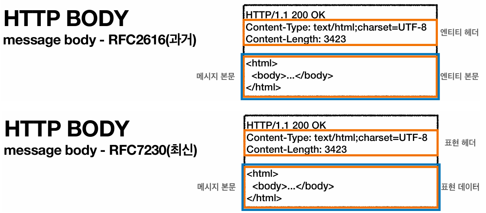
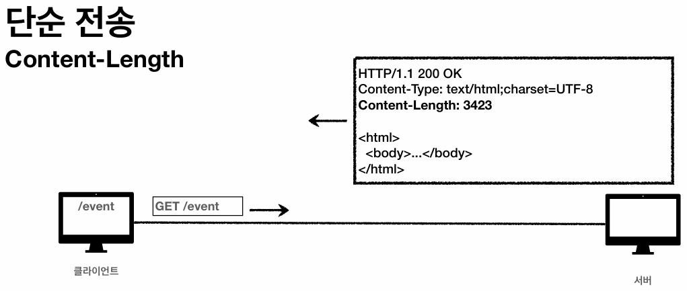
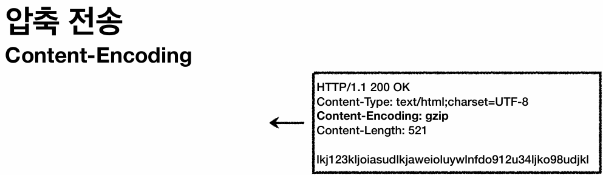
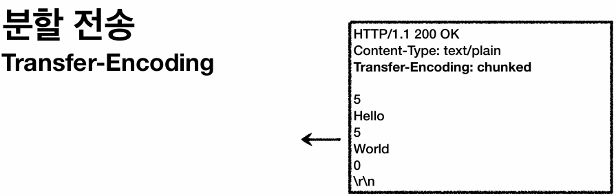
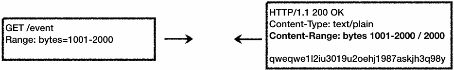

## HTTP 헤더와 표현 (Representation)
### 과거 HTTP 표준(RFC2616)의 4가지 헤더 분류
과거 HTTP 표준(RFC2616)에서는 HTTP 헤더를 목적에 따라 크게 4가지로 분류했다.

- **General:**
  - 종류(요청, 응답)에 상관없이 **통신 메시지 전체에 공통으로 적용되는 정보**이다.
  - 예) `Connection: keep-alive`
- **Request:**
  - 클라이언트의 HTTP **요청 메시지에만** 포함되는 헤더이다.
  - 예) `User-Agent: Mozilla/5.0`
- **Response:**
  - 서버의 HTTP **응답 메시지에만** 포함되는 헤더이다.
  - 예) `Server: Apache`
- **Entity:**
  - **메시지 본문(Entity Body)에 담긴 데이터를 해석하기 위한 정보**를 제공하는 헤더이다.
  - 예) 데이터 유형(`Content-Type`), 길이(`Content-Length`), 압축 정보(`Content-Encoding`) 등

### 최신 HTTP 표준(RFC723x) 개정에 따른 용어 변화 (엔티티 → 표현)

- 2014년에 HTTP 표준이 RFC723x로 개정되면서, **기존의 엔티티가 표현으로 완전히 대체**되었다.
  - **과거의 구조:** 엔티티 = 엔티티 헤더 + 엔티티 본문(메시지 본문)
  - **개정된 구조:** 표현 = 표현 메타데이터(헤더) + 표현 데이터(메시지 본문, 페이로드)
- **표현 데이터는 메시지 본문을 통해 전달**되며, 
- **표현 헤더는 이 데이터를 수신자가 올바르게 해석할 수 있도록 메타데이터(부가 정보)를 제공하는 역할을 수행**한다.

### 표현 (Representation)
- 서버에 존재하는 리소스 자체는 매우 추상적인 상태이다. (DB의 레코드, 메모리 상의 바이트코드 등)
- 클라이언트와 서버가 통신할 때, 즉 **웹 통신에서는 이 추상적인 리소스를 양측이 모두 이해할 수 있는 '구체적인 포맷'으로 변환하여 전달**해야 한다.
- 가령 동일한 회원 리소스라 하더라도 클라이언트의 요청에 따라 **HTML로 표현**하여 전달할 수도 있고, **JSON 형식으로 표현**할 수도 있다.
- **데이터를 어떠한 형식으로 나타내어 전달할 것인가**에 초점을 맞춰, 현재는 엔티티 대신 **표현**이라는 용어를 사용하도록 개정되었다.

### 표현 헤더
> **표현 데이터를 수신자가 올바르게 해석할 수 있도록 메타데이터를 제공하는 역할**을 수행한다.

- 표현 헤더는 요청과 응답 메시지 양쪽에서 모두 사용이 가능하다.

#### Content-Type (표현 데이터의 형식)
- **메시지 본문에 들어있는 페이로드 데이터의 미디어 타입**을 명시한다.
- 예) `text/html`, `application/json`

#### Content-Encoding (표현 데이터의 압축 방식)
- 데이터를 전송하는 측에서 **페이로드의 압축 알고리즘**을 명시한다.
- 데이터를 수신하는 측은 이 헤더의 정보를 확인하여 본문의 압축을 해제한다.
- 예) `gzip`, `deflate`, `identity`

#### Content-Language (표현 데이터의 자연 언어)
- **본문 텍스트가 어떤 자연어로 작성되었는지** 명시한다.
- 예) `ko`, `en-US`

#### Content-Length (표현 데이터의 길이)
- **바이트 단위의 페이로드 전체 크기**를 명시한다.
- 단, 이후 다룰 `Transfer-Encoding`(전송 코딩) 방식을 사용할 때는 데이터가 분할되어 전송되므로 `Content-Length` 헤더를 같이 사용해서는 안 된다.

---

## 콘텐츠 협상 (Content Negotiation)
### 협상 헤더의 개념과 특징
> **클라이언트는 협상 헤더를 통해 자신이 선호하는 형태의 표현 데이터를 서버에 요청**한다.

- 서버는 클라이언트가 전달한 선호도(우선순위)에 맞춰 최대한 적절한 표현 데이터를 생성하여 응답한다.
- 협상 헤더는 클라이언트가 서버로 보내는 **요청 메시지에서만 사용**한다.

### 종류
- **Accept:** 
  - 클라이언트가 선호하는 **미디어 타입**을 지정한다.
  - 예) `application/json`, `text/html`
- **Accept-Charset:**
  - 클라이언트가 선호하는 **문자 인코딩**을 지정한다.
  - 예) `UTF-8`
- **Accept-Encoding:**
  - 클라이언트가 선호하는 **압축 인코딩 방식**을 지정한다.
  - 예) `gzip`, `deflate`
- **Accept-Language:**
  - 클라이언트가 선호하는 **자연 언어**를 지정한다.
  - 예) `ko`, `en-US`

### 우선순위 결정 (Quality Value, q)
> **클라이언트가 1순위로 요청한 형식을 서버가 지원하지 않을 경우, 차선책을 선택할 수 있도록 우선순위를 명시하는 방식**이다.

- 우선순위는 `q` 값으로 표현하며, 0부터 1 사이의 실수를 사용한다.
- 값이 클수록 우선순위가 높으며, 생략할 경우 기본값(1)이 적용된다.
  - 예) `Accept-Language: ko-KR,ko;q=0.9,en-US;q=0.8,en;q=0.7`
- 더 구체적인 값이 높은 우선순위를 갖는다.
  - **우선순위 값이 동일한 경우:** `Accept: text/*, text/plain`에서 `text/plain`이 더 높은 우선순위 
  - **우선순위 값이 동일하지 않은 경우:** `Accept:text/*;q=0.3, text/html;q=0.7`에서 `text/html`의 우선순위 값은 0.7이다.

---

## 전송 방식
HTTP 통신에서 메시지 본문(페이로드)을 전송하는 방식은 크게 4가지로 분류된다.

### 단순 전송 (Content-Length)
> **클라이언트가 한 번에 요청하고, 서버가 한 번에 전체 데이터를 전송하는 가장 기본적인 방식**이다.

- **전송할 콘텐츠의 전체 길이를 사전에 정확히 알 수 있을 때 사용**한다.
- 응답 헤더에 `Content-Length`를 지정하여 데이터의 총 바이트 수를 명시한다.

### 압축 전송 (Content-Encoding)
> **네트워크 대역폭을 절약하기 위해 페이로드 데이터를 압축하여 전송하는 방식**이다.

- 수신 측에서 압축을 해제할 수 있도록, 응답 헤더에 `Content-Encoding`을 추가하여 사용된 압축 알고리즘을 명시해야 한다.

#### 네트워크 대역폭
- 주어진 시간 동안 네트워크를 통해 전송할 수 있는 데이터의 최대 용량, 즉 **데이터 최대 전송량**을 의미한다.
- 할당된 대역폭의 점유율(사용량)을 줄이는 행위를 관용적으로 **대역폭을 절약한다**고 표현한다.
  - 나머지 공간을 다른 통신에서 사용할 수 있게 되기 때문이다.

### 분할 전송 (Transfer-Encoding: chunked)
> **용량이 큰 데이터를 한 번에 전송하기 어려울 때, 데이터를 Chunk 단위로 분할하여 전송하는 방식**이다.

- 응답 헤더에 `Transfer-Encoding: chunked`를 지정한다.
- 클라이언트는 전체 데이터를 기다리지 않고, **네트워크를 통해 도착하는 조각부터 순차적으로 렌더링할 수 있다.**
- 전체 데이터 길이를 사전에 알 수 없으므로, `Content-Length` 헤더를 포함해서는 안 된다.
- 대신 각 Chunk 데이터 본문 앞에 해당 청크의 크기를 명시하여 함께 보낸다. 

### 범위 전송 (Range, Content-Range)
> **대용량 파일 등을 다운로드하다가 중간에 네트워크 연결이 끊겼을 때 사용하는 방식**이다.

- 클라이언트가 처음부터 다시 다운로드하는 낭비를 막기 위함이다.
- 요청 시 `Range` 헤더를 사용하여 **이전에 끊긴 지점부터 (특정 범위의 데이터만 이어서) 보내달라고 요청**한다.

---

## HTTP 일반(정보성) 헤더
> **요청 메시지 또는 응답 메시지들에서 부가적인 정보를 제공**하는 헤더들이다.

### From
> **유저 에이전트(클라이언트)의 이메일 정보**이다.

- 주로 검색 엔진의 웹 크롤러가 사용한다. **(우리는 거의 사용하지 않음)**
- 서버 관리자가 크롤러의 접근을 제한하거나 연락을 취할 목적으로 사용한다.

### Referer
> **현재 요청을 보내는 이전 웹 페이지의 URI 정보**다.

- **요청 메시지에서 사용하며, 유입 경로 분석 등 매우 빈번하게 사용**한다.

#### Referer 헤더가 항상 생성되는 것은 아니다.
- `Referer` 헤더를 생성하여 요청 메시지에 추가하는 1차적인 주체는 웹 브라우저이다.
- 브라우저는 **웹 페이지 내의 앵커 태그(`<a>`)를 클릭하거나, 폼 데이터를 전송할 때만 `Referer` 헤더를 자동으로 추가**한다.
- **사용자가 주소창에 직접 URL을 입력하거나 북마크를 클릭해 이동하는 경우, `Referer` 헤더를 생성하지 않는다.** 
  - 이는 이전 페이지와는 독립적인(논리적인 접점이 없는) **직접 이동**으로 간주하기 때문이다.

#### 심지어 출발지 서버에서도 제어한다.
- 사용자가 링크를 클릭해 이동하는 상황이더라도, **출발지 서버는 응답 헤더에 `Referrer-Policy`를 설정하여 브라우저의 `Referer` 전송 방식을 통제**할 수 있다.
  - 예시1) 사이트 관리자가 보안을 위해 응답 헤더에 `Referrer-Policy: no-referrer`를 명시하면, 해당 사이트 내에서 외부로 나가는 링크를 클릭하더라도 브라우저는 `Referer` 헤더를 전송하지 않는다.
  - 예시2) `google.com/search?q=hello`에서 `ko.wikipedia.org/wiki/Hello`로 이동하더라도 `referer` 헤더에는 기본적인 도메인 정보(`google.com`)밖에 남지 않는데, 이 역시 구글 서버에서 `strict-origin-when-cross-origin` 등의 정책을 지정했기 때문이다.
- 이처럼 **최신 브라우저는 기본적으로 구체적인 경로나 쿼리를 제거하여 전송**하는데, 이는 **다른 도메인으로 이동할 때 민감 데이터가 타 사이트로 넘어가는 것을 방지하기 위함**이다.

#### Referer 헤더 요약
1. 사용자의 이동 방식(클릭 vs 주소창 입력)에 따라 브라우저가 일차적으로 전송 여부를 결정한다.
2. 클릭하여 이동했더라도, 출발지 웹 서버의 `Referrer-Policy`에 따라 전송 수준이 결정된다. 

### User-Agent
> **클라이언트의 브라우저 및 애플리케이션 정보**이다.

- 클라이언트의 OS나 브라우저 버전을 식별할 수 있어, **특정 환경에서 발생하는 장애를 추적하거나 통계 데이터를 추출하는 데 사용**한다.
- 예) `user-agent: Mozilla/5.0`

### Server
> **클라이언트의 요청을 최종적으로 처리하여 응답을 반환하는 최종 목적지(Origin) 서버의 정보**이다.

- 네트워크 중간에 위치한 프록시나 캐시 서버가 아니라, **실제 비즈니스 로직을 수행하는 말단의 백엔드 서버**(`Apache`, `Nginx`, `Tomcat` 등)를 나타낸다.
  - 가령, `클라이언트 → nginx(로드밸런서) → gateway(라우터) → stats` 구조에서는 **실제로 응답 메시지를 생성하는 서버**인 `stats`를 의미하는 것이 맞다.
  - 하지만 **보안을 위해 중간 서버(`nginx`, `gateway`)에서 원래의 `Server` 헤더를 삭제하거나 자신의 정보로 덮어쓰는 경우가 대다수**이다.   
- 응답 메시지에서 사용한다.
- 예) `server: Apache/2.2.22`, `server: nginx`

### Date
> **HTTP 메시지가 발생한 날짜와 시간**이다.

- 응답 메시지에서 사용한다.

---

## HTTP 특별 헤더

### Location
> **리다이렉션(목적지) URI** 혹은 **새로 생성된 리소스 URI**를 의미한다.

- `201 Created` 응답에서는 서버에 새로 생성된 리소스의 URI를 명시하고,
- `3xx` 응답에서는 브라우저가 자동으로 이동해야 할 목적지의 URI를 나타낸다.

### Allow
> **지정한 리소스에서 서버가 허용하는 유효한 HTTP 메서드 목록**이다.

- 만약 클라이언트가 허용되지 않은 메서드로 요청하면 `405 Method Not Allowed`로 응답한다.
- 예) `Allow: GET, HEAD, PUT`

### Retry-After
> **서비스의 복구 시간(혹은 복구까지 남은 시간)을 의미**한다.

- 초 또는 date(특정 날짜 및 시간)의 형식으로 표기한다.

### Host (HTTP/1.1의 필수 헤더)
> **대상 서버의 특정 도메인(Host) 이름**이다.

- **클라이언트가 요청 메시지를 보낼 때 반드시 포함해야 하는 유일한 필수 헤더**이다.

#### 왜 host를 요청 헤더에 반드시 포함해야 할까?
- 일반적으로 대상 서버는 실제 비즈니스 로직을 처리하는 백엔드 서버가 아니라, (리버스) 프록시 서버(`nginx`)이다.
- 이때 **클라이언트의 애플리케이션 계층에서는 대상 서버(프록시 서버)의 IP 주소, PORT 번호만 알아냈기 때문에, 내부에 존재하는 여러 애플리케이션(내부 서버, 프로세스)들을 구분할 수 없다.**
- 즉, **IP 주소와 PORT 번호 이외에 대상 서버의 애플리케이션들을 구분하기 위한 용도**의 무언가가 필요해지는데, 이것이 바로 **`host` 헤더**이다.

#### Host 헤더를 정리하며 깨달은 네트워크 통신 흐름
- [[부록] 네트워크 통신 흐름](./appendix/01-network-flow-with-host.md)

---

## 인증
### 인증/인가
#### 인증 (Authentication)
> 시스템이 대상으로, **클라이언트의 신원(시스템에 접근할 수 있는 식별된 사용자인지)을 확인하는 과정**이다.

- 예) 아이디와 비밀번호를 통한 로그인

#### 인가 (Authorization)
> 리소스가 대상으로, **인증된 사용자가 특정 리소스에 접근할 권한이 있는지 확인하는 과정**이다.

- 예) 일반 유저가 관리자 전용 페이지에 접근하려 할 때 차단하는 것

### 인증에 Authorization 헤더를 사용하는 이유
- 클라이언트가 자신의 신원(ID/PW, 토큰)을 증명하기 위해 서버로 보내는 헤더이므로 논리적으로는 `Authentication`(인증)이 되어야 맞다.
- 하지만 과거 HTTP/1.0 설계 당시, **클라이언트가 신원 증명 정보(Credential)를 보내는 목적은, 결국 서버로부터 인가(`Authorization`)받기 위함이다**라는 논리에서 그렇게 작명했다.
- 결과적으로 **인증 정보를 담아 보내지만, 헤더의 이름은 Authorization인 상태**로 고착화되었다.

### 인증 관련 HTTP 헤더
#### Authorization
> **클라이언트가 서버에 자신의 인증 정보(Credential)를 전달할 때 사용하는 헤더**이다.

- 클라이언트가 시스템에 자신이 누구인지 증명하기 위한 데이터(ID/PW, 토큰 등)를 서버에 제시하는 역할을 한다.
- **Basic Auth (기본 인증):**
  - HTTP 표준에 정의된 고전적인 방식이다.
  - **ID와 PW를 Base64로 인코딩하여 `Authorization: Basic <인코딩된 ID:PW>` 형태로 헤더를 구성**한다.
- **Bearer Token (토큰 기반 인증):**
  - 현대 API 통신에서 가장 널리 사용되는 방식이다.
  - 클라이언트가 **로그인에 성공하면 서버는 암호학적 서명(Signature)이 포함된 문자열(JWT 등)인 토큰을 발급**한다.
  - **HTTP 규약상 이 토큰을 서버에 다시 보낼 때는 `Authorization: Bearer <발급받은 토큰>` 형태로 헤더를 구성**해야 한다.
  - 이때 `Bearer`는 **토큰 소지자(Bearer)에게 권한을 부여하라**는 인증 타입(방식)을 의미하며, 
  - Postman의 Auth 탭에서 `Bearer Token`을 설정하면, Postman은 위 규격에 맞춰 Authorization 헤더를 자동으로 생성해 서버로 전송해준다. 

#### WWW-Authenticate
> **시스템이 클라이언트에게 요구하는 인증 방법을 정의하여 안내하는 헤더**이다.

- 클라이언트가 적절한 인증 정보 없이 시스템에 접근하려 할 때, 서버는 접근을 거부하며 `401 Unauthorized` 응답을 반환한다.
- 이때 **서버는 응답에 `WWW-Authenticate` 헤더를 포함시켜, 클라이언트가 시스템에 인증받기 위해 어떤 방식(`Basic`, `Bearer` 등)을 갖추어 다시 요청해야 하는지**, 그 구체적인 규격을 지시한다.

