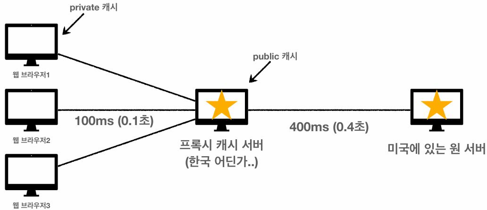
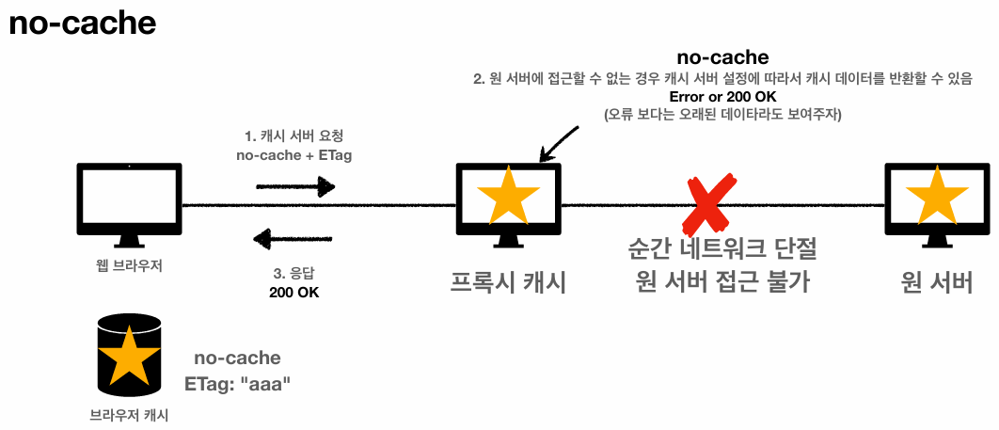
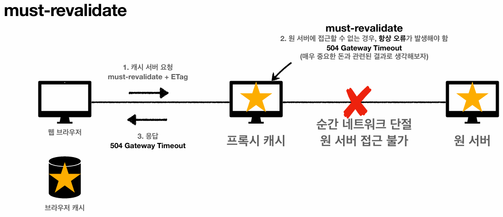

## 캐시 기본 동작
### 캐시의 필요성 (캐시가 없을 때의 비효율성)
- 동일한 데이터에 대한 요청임에도 불구하고, 매번 네트워크를 통해 전체 데이터를 다운로드해야 한다.
- **인터넷 네트워크 통신은 메모리/디스크 접근 속도에 비해 매우 느리고 비싸며**, 결과적으로 브라우저 로딩 속도를 저하시킨다.

### 캐시 적용 시 동작 원리
- **브라우저 내부에는 쿠키 저장소뿐만 아니라, 캐시 저장소가 별도로 존재**한다.
- 서버가 HTTP 응답을 줄 때 헤더에 캐시가 유효한 시간(`cache-control: max-age=`)을 명시하여 전달하면, 브라우저는 응답 데이터를 캐시 저장소에 저장한다.
- 한편 **브라우저는 네트워크 요청을 보내기에 앞서, 캐시 저장소를 먼저 뒤진다.**
- 이때 캐시 유효 시간(`max-age`)이 초과되지 않았다면, 네트워크 망을 거치지 않고 캐시 저장소에서 데이터를 가져온다.

### 캐시 유효 시간이 초과된 경우 (캐시가 만료된 경우)
- 캐시 만료로 인해 Stale 데이터가 되면, 클라이언트는 서버와 통신해 데이터 혹은 캐시 유효 시간을 갱신해야 한다.
- 근데 만약 **캐시는 만료되었지만 데이터 자체는 변하지 않은 상황이라면, 네트워크를 통해 해당 데이터 전체를 응답받는 것은 리소스 낭비**이다.
- 이러한 낭비를 방지하기 위해 서버와 클라이언트간 데이터 변경 여부만 대조하는 '검증 헤더와 조건부 요청' 매커니즘이 등장하게 된다.

---

## 검증 헤더와 조건부 요청
### 캐시 만료 시의 두 가지 상황
브라우저 캐시 저장소에 있던 데이터의 유효 시간(`Cache-Control: max-age`)이 초과되어 서버에 재요청을 해야 할 때, 서버 측의 상태는 다음 두 가지 중 하나이다.

#### 데이터가 변경됨
- 서버의 실제 데이터가 변경되었으므로, 데이터를 새로 받아야 한다.

#### 데이터가 변경되지 않음
- 서버의 실제 데이터가 변경되지 않았으므로, 데이터를 새로 받는 것은 트래픽 낭비이다.
- 따라서 이러한 **트래픽 낭비를 방지하기 위해, '검증 헤더와 조건부 요청' 매커니즘이 등장**하였다.

### 1. `Last-Modified`와 `If-Modified-Since`
#### 검증 헤더 (서버 → 클라이언트)
- **최초 응답 시 서버는 `Last-Modified` 헤더를 추가해 보낸다.** 
- 말그대로 마지막으로 데이터가 수정된 시각을 의미한다.
- 브라우저는 응답 데이터뿐만 아니라, 해당 값 또한 캐시 저장소에 저장한다.

#### 조건부 요청 (클라이언트 ➔ 서버)
- **이후 캐시가 만료되어 재요청할 때, 브라우저는 `If-Modified-Since: <앞서 저장해둔 날짜>` 헤더를 추가해 보낸다.**
- 말그대로 '해당 날짜 이후로 데이터가 수정된 경우라면' 데이터를 새로 보내달라는 의미이다.

#### 서버의 검증 및 응답 (304 Not Modified)
- 서버는 데이터 최종 수정일과 클라이언트가 보낸 날짜를 비교한다.
- **날짜가 같다면(수정되지 않았다면), 서버는 `304 Not Modified` 상태 코드로 응답**한다.
- **페이로드(메시지 본문)는 보내지 않고, 가벼운 표현 헤더(메타데이터)만 보내므로 네트워크 트래픽이 절감**된다.

#### 클라이언트 캐시 갱신
- `304` 응답을 받은 브라우저는 현재 캐시가 유효하다고 판단해, 캐시 저장소의 메타 정보(`Cache-Control` 등)를 갱신하고, 기존 캐시 데이터를 재사용한다.
- 참고로, 개발자 도구 네트워크 탭에서 Status Code가 회색으로 표시된 것들은 이처럼 디스크/메모리 캐시에서 직접 가져와 로딩 속도가 0ms에 수렴하는 리소스들이다.

### `Last-Modified`의 기술적 한계
이 방식은 훌륭하지만, 시간(Date) 기반 검증이 가지는 태생적인 단점이 존재한다.

#### 초 단위 미만의 데이터 변경을 구분하기 어렵다.
- 1초 미만 단위로는 캐시 갱신 및 조정이 불가능하다. (이런 일이 얼마나 있겠냐만은)

#### 데이터는 그대로인데, 날짜만 변경된 경우에도 데이터를 갱신해야 한다.
- 실제로 데이터가 변하지 않았더라도(A → B → A), 날짜가 변한 경우 데이터를 갱신해야만 한다.

#### 서버만의 고유한 캐시 제어 로직 적용 불가
- '공백의 변화로는 캐시를 갱신하지 않겠다'와 같은 서버만의 고유한 캐시 제어 로직을 적용할 수 없다.

### 2. `ETag`와 `If-None-Match`
앞선 날짜 기반 검증의 한계를 극복하기 위해, 데이터의 내용이나 버전을 기준으로 삼는 방식이 등장했다.

#### ETag (Entity Tag)
- **서버가 특정 리소스(Entity)에 대해 임의로 부여하는 고유한 식별자 태그**이다.
- 주로 파일의 해시(Hash) 값을 사용하거나, 명시적인 버전명을 문자열로 부여한다.
  - 예) `ETag: "a2jiodwjekjl3"`, `ETag: "v1.0"`
- `ETag`에는 날짜 대신, 컨텐츠의 내용이 매핑된다.

#### `If-None-Match`
- 말그대로, **'매치되는 `ETag`가 없는 경우에만' 새로 보내달라**는 의미이다.

### 동작 흐름
- 최초 응답 시 서버가 `ETag`를 내려주면, 브라우저의 캐시 저장소에 저장해 둔다.
- 캐시 만료 후 재요청 시, 브라우저는 `If-None-Match: <저장해둔 ETag>` 헤더를 추가하여 보낸다.
- **서버는 두 문자열(보유한 `ETag`, 받은 `ETag`) 값이 같으면 `304 Not Modified`를, 다르면 `200 OK`와 함께 새 데이터를 내려준다.**

### 특징과 활용 사례
#### 캐시 제어의 책임이 서버에만 존재한다.
- 클라이언트는 서버가 `ETag`를 어떻게 만들었는지(SHA-256 해시로 만들었는지, 배포 버전으로 만들었는지 등) 알 수 없다.
- 단순히 이전에 응답받았던 `ETag`가 여전히 유효한지를 확인받을 뿐이다. 
- 따라서, 캐시 제어의 책임은 오롯이 서버에만 존재한다.

#### 사례) 애플리케이션 배포 주기에 맞춰 `ETag`를 모두 갱신하기
- 프론트엔드 리소스(JS, CSS, 이미지)가 배포될 때, 브라우저에 남은 캐시 때문에 화면이 깨지거나 구버전 코드가 도는(캐시 꼬임) 현상이 발생할 수 있다.
- 이에 대응하고자 배포 파이프라인(CI/CD)에서 웹 서버(Nginx, Apache 등) 설정이나 정적 파일명(해시 포함)을 변경하여 `ETag`를 일괄적으로 바꿔버린다.
- 그러면 모든 브라우저의 캐시가 무효화되기 때문에, 최신 버전을 다운로드하게 된다.

---

## 캐시 제어 헤더 (캐시 지시어, Cache Directive)
과거 HTTP/1.0 시절에는 `Pragma`, `Expires` 등의 헤더를 사용했으나, **현재는 상위 호환인 `Cache-Control` 헤더를 표준으로 사용**한다.

### Cache-Control: max-age={초}
- 캐시 만료 시간을 초 단위로 지정한다.
  - 예) `max-age=3600` → 1시간
- 과거에 사용되던 `Expires` 헤더는 정확한 만료 날짜를 지정해야 해서, 서버와 클라이언트 간 시간 동기화 문제가 발생하는 등 유연성이 떨어졌다.
- 하지만 **`max-age`는 '현재부터 N초 동안'이라는 상대적인 시간을 사용하므로 훨씬 안전하고 권장되는 방식**이다.

### Cache-Control: no-cache (항상 물어보고 써라)
- **데이터를 캐시해도 되지만, 사용할 때마다 반드시 원(Origin) 서버에 검증을 받고 사용하라**는 지시어다.

### Cache-Control: no-store (저장하지 마라)
- **데이터에 민감정보(통장 잔고, 개인정보 등)가 포함되어 있으므로, 캐시로 저장하지 말라**는 지시어다.
- **브라우저가 화면에 렌더링하기 위해 데이터를 잠깐 메모리(RAM)에 올려둘 수는 있으나, 디스크에도 저장하지 말고 메모리에서도 최대한 빨리 삭제하라**는 의미이다.

---

## 프록시 캐시 (Proxy Cache)
### 도입 배경

- **원(Origin) 서버가 물리적으로 멀리 떨어져 있는 경우(예: 미국), 클라이언트가 직접 통신하면 RTT가 길어져 로딩 속도가 저하**된다.
- 이를 해결하기 위해 클라이언트와 지리적으로 가까운 곳(예: 한국)에 중간 캐시 서버인 **프록시 캐시 서버**를 둔다.

### CDN(Content Delivery Network)
- **전 세계 주요 거점에 분산 배치된 프록시 캐시 서버들의 네트워크**를 의미한다.
- 즉, 프록시 캐시 서버 집합이다.
- 예) AWS CloudFront

### 동작 방식 (유튜브 동작 속도의 원리)
- 유튜브와 같은 글로벌 서비스에서 **인기 있는 컨텐츠가 빠르게 로딩되는 이유는 해당 데이터가 프록시 캐시 서버에 캐싱되어 있기 때문**이다. (물론 최초에는 원 서버에 업로드돼야 한다.)

#### 첫 번째 유저 (Cache Miss)
- 아무도 보지 않던 영상을 최초로 요청하면 프록시 서버에 데이터가 없으므로 원 서버까지 다녀와야 한다.
- 이때 받아온 데이터가 프록시 캐시 서버에 저장된다.

#### 두 번째 유저 (Cache Hit)
- 이후 동일한 영상을 요청하는 유저들은 원 서버가 아닌, 지리적으로 가까운 프록시 캐시 서버에서 데이터를 즉시 받아온다.

### Private 캐시와 Public 캐시
- 클라이언트별 캐시 저장소를 Private 캐시, 프록시 캐시 서버와 같은 공용 캐시를 Public 캐시라고 한다.

#### `Cache-Control: private` (디폴트값)
- **해당 클라이언트의 캐시 저장소(Private 캐시)에만 저장되어야 할 때** 적용한다.
- 예) 사용자 개인정보, 로그인 화면 등

#### `Cache-Control: public`
- **프록시 캐시 서버(공용 캐시, Public 캐시)에 저장되어 여러 클라이언트가 공통으로 사용할 수 있는 데이터**에 적용한다.
- 예) 공통 이미지, CSS, JS 등

---

## 캐시 무효화 (Cache Invalidation)
### 확실한 캐시 무효화의 필요성
#### 휴리스틱 캐싱(Heuristic Caching)
- **HTTP 응답 헤더에 캐시 지시어가 없더라도, 브라우저는 성능 최적화를 위해 임의로(휴리스틱하게) 데이터를 캐싱해버릴 수 있다.** (주로 `GET` 요청 시 빈번하게 발생한다.)
- 따라서 **절대 캐싱되면 안 되는 페이지의 경우, 브라우저 임의 캐싱을 막기 위해 확실한 무효화 헤더를 명시해야 한다.**

### 확실한 캐시 무효화 헤더
아래의 헤더들을 모두 포함하여 응답해야 완벽한 캐시 무효화가 보장된다.
```
Cache-Control: no-cache, no-store, must-revalidate
Pragma: no-cache
```

#### `Cache-Control: must-revalidate` (반드시 원 서버에서 검증해라)
- **캐시 만료 후 최초 조회 시, 원 서버에 검증하라**는 지시어다.

### `no-cache`와 `must-revalidate`
- 두 지시어는 **모두 원 서버에 검증을 요구한다는 공통점이 있지만, 원 서버와 프록시 캐시 서버 간의 네트워크 단절 상황에서 결정적인 차이**를 보인다.
- 원 서버에 검증을 요청해야 하는데 원 서버가 다운되었거나 통신이 단절된 상황을 가정해 보자.

#### `no-cache`: 에러보단 과거 데이터라도 보여주자

- `no-cache`인 경우, 일부 프록시 캐시 서버는 설정에 따라 **오류를 반환하는 대신 오래된 과거 데이터(Stale Data)를 반환할 수도** 있다.

#### `must-revalidate`: 에러 그대로 보여주자

- 반면 `must-revalidate`인 경우, 프록시 서버는 **반드시 `504 Gateway Timeout` 오류를 반환**한다.

#### 결론
- **`must-revalidate`만 쓰자니 캐시가 만료되지 않으면 의미가 없고, 그렇다고 `no-cache`만 쓰자니 프록시 서버에서 과거 데이터를 반환할 수 있다.**
- **그러므로 확실한 캐시 무효화를 위해서는 둘 다 써야 한다.**