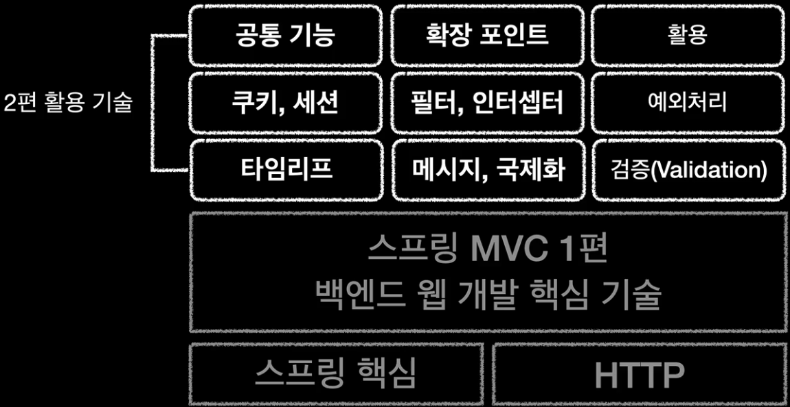

## 스프링 MVC 1편 - 백엔드 웹 개발 핵심 기술
### 스프링 MVC 기본 구조 학습 목적
- 자바 백엔드 웹 기술이 발전함에 따라 스프링 MVC에도 수많은 기능이 추가되었지만, **프레임워크의 뼈대가 되는 기본 구조(아키텍처)는 거의 변하지 않았다.**
- 그렇기에 확장 기능(활용 기술)을 배우기에 앞서, **스프링 MVC의 기본 구조부터 확실하게 이해하는 것이 중요**하다. 

### 스프링 MVC 1편 강의 흐름
- 기본 구조를 확실하게 이해하기 위해, 본 강의에서는 스프링을 배제한 원시 기술부터 단계적으로 추상화 수준을 높여갈 것이다.
- 과거 기술이 가졌던 구조적 한계점은 무엇인지, 이를 어떻게 해결했는지 등을 살펴보며, **스프링 MVC가 등장하기까지 그 일련의 흐름**(인과관계)을 알아볼 것이다.

### 스프링 MVC 1편(백엔드 웹 개발 핵심 기술) 학습 개요

- 스프링 핵심 원리와 HTTP 기반 기술에 대한 이해를 바탕으로, 우선 **웹 애플리케이션의 기본 개념과 동작 방식**을 학습한다.
- 이후 **서블릿(Servlet)**, **JSP**, **MVC 패턴**을 순차적으로 적용해보며, 기초 웹 기술의 동작 원리와 그 한계점을 직접 확인해 본다.
- 해당 한계점을 극복하기 위해 **자체적인 MVC 프레임워크를 구축**(설계/구현)하는 과정을 거치고, 이를 **실제 스프링 MVC의 핵심 구조와 비교**한다.
- 최종적으로는 스프링 MVC의 기본 제어 기능들을 익히고, 웹 애플리케이션 하나를 만들어 보며 핵심 기술 학습(1편)을 마무리한다.

### 스프링 MVC 2편(백엔드 웹 개발 활용 기술) 학습 개요

- 1편에서 완성한 웹 애플리케이션을 기반으로, 실무에서 요구되는 **다양한 부가 기능(활용 기술)을 점진적으로 추가**한다.
- 뷰 템플릿 엔진인 **타임리프**(Thymeleaf)를 시작으로, 텍스트 **메시지 중앙화 및 국제화(i18n), 검증 로직을 차례로 구현**해 본다.
- 이후 **쿠키와 세션을 통해 클라이언트 상태를 유지**하고, **필터와 인터셉터를 통해 공통 관심사(Cross-Cutting Concerns)를 분리**하는 과정을 거친다.
- 최종적으로는 **예외 처리와 여러 확장 포인트를 예제에 적용**해 보며, 활용 기술 학습(2편)을 마무리한다.

