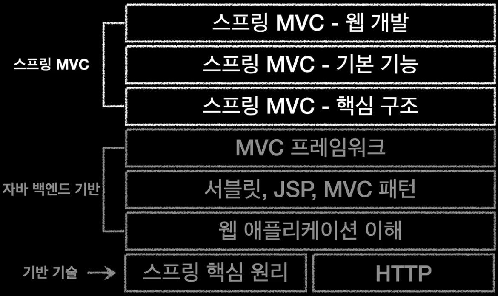

## 스프링 MVC 1편 - 백엔드 웹 개발 핵심 기술
### 스프링 MVC 기본 구조 학습 목적
- 자바 백엔드 웹 기술이 발전함에 따라 스프링 MVC에도 수많은 기능이 추가되었지만, 프레임워크의 뼈대가 되는 기본 구조(아키텍처)는 거의 변하지 않았다.
- 그렇기에 확장 기능(활용 기술)을 배우기에 앞서, 스프링 MVC의 기본 구조부터 확실하게 이해하는 것이 중요하다. 

### 스프링 MVC 강의 흐름
- 기본 구조를 확실하게 이해하기 위해, 본 강의에서는 스프링을 배제한 원시 기술부터 단계적으로 추상화 수준을 높여갈 것이다.
- 과거 기술이 가졌던 구조적 한계점은 무엇인지, 이를 어떻게 해결했는지 등을 살펴보며, 스프링 MVC가 등장하기까지 그 일련의 흐름(인과관계)을 알아볼 것이다.

### 스프링 MVC 1편 학습 개요

1. 웹 애플리케이션의 개념과 기본 동작을 파악한다. (기반 기술은 앞서 학습했으므로)
2. 자바 웹 기술의 시초인 서블릿(Servlet)과 JSP 먼저 단독으로 사용해 본 후, MVC 패턴을 적용해 본다.