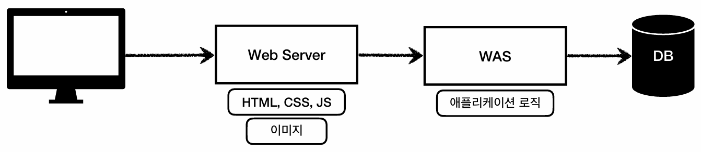
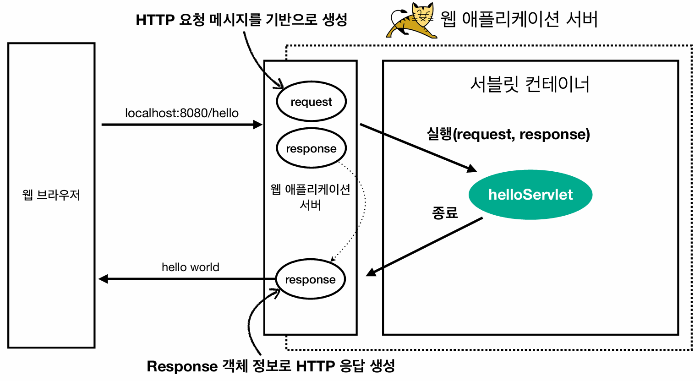
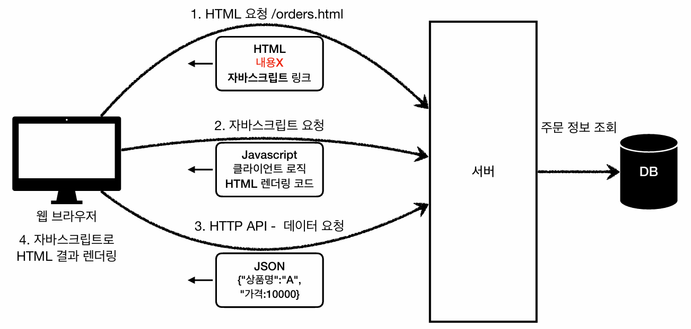

## 웹 애플리케이션 이해
### 웹 서버 (Web Server)
- 인터넷을 통해 데이터를 주고받을 때 주로 사용하는 **HTTP 프로토콜을 기반으로 동작**한다.
- HTML, CSS, JS, 이미지 파일 등 **정적 리소스를 서빙**하는 역할을 수행한다.
- 프로그램 코드를 실행하지 않기 때문에 사용자별로 다른 동적인 화면을 생성하여 제공하는 것은 불가능하다.
- 대표적으로 **NGINX, Apache**가 있다.
  - 특히 NGINX는 웹 서버의 역할뿐만 아니라, 요청을 뒷단의 WAS로 전달하는 리버스 프록시 역할로도 빈번히 사용된다.

### 웹 애플리케이션 서버 (WAS, Web Application Server)
- 웹 서버와 마찬가지로 **HTTP를 기반으로 동작**하며, 웹 서버가 제공하는 **정적 리소스 서빙 기능을 기본적으로 포함**한다.
- 웹 서버와의 가장 큰 차이점은 **프로그램 코드를 실행하여 애플리케이션 로직을 수행**할 수 있다는 것이다.
- 즉, **HTML, REST API(HTTP API), 서블릿, JSP, 스프링 MVC 등을 구동하여, 사용자별 맞춤형 응답을 제공**할 수 있게 된 것이다.
- 대표적으로 **Tomcat, Jetty, Undertow**가 있다.
  - 참고로 **Tomcat과 Jetty는 대표적인 서블릿 기반 WAS**이며, **Netty는 스프링 WebFlux 등에서 주로 사용되는 비동기 이벤트 기반의 네트워크 프레임워크**이다.
  - Netty가 프레임워크지만 결국은 WAS의 핵심 기능인 HTTP 서버를 구현할 수 있기 때문에, WAS처럼 사용되곤 한다.

#### 웹 서버와 WAS의 분류
- 앞서 웹 서버와 WAS로 용어를 분류하긴 했지만, **사실 두 개념의 경계는 모호**하다.
  - 기본적으로 WAS는 정적 리소스를 서빙할 수 있고, 일부 웹 서버도 프로그램 코드를 실행할 수 있기 때문이다.
- 이에 자바에서는 **서블릿 컨테이너(Servlet Container) 기능을 제공하면 WAS**로 분류하기로 했다.

### 웹 시스템 구성 아키텍처 (WEB + WAS + DB)

#### 웹 서버 도입 배경
- 이론적으로는 WAS와 DB만으로도 웹 시스템을 구성하고 정적 리소스까지 서빙할 수 있다.
- 하지만 **WAS가 정적 리소스 서빙과 복잡한 애플리케이션 로직 처리를 모두 담당하게 되면, 서버에 과부하가 발생할 우려**가 있다.
- 가장 중요한 애플리케이션 로직 수행이 정적 리소스 처리로 인해 지연될 수 있으며, WAS에 장애가 발생할 경우 클라이언트에게 기본적인 오류 화면조차 제공할 수 없게 된다.
- 이를 해결하기 위해 **앞단에 웹 서버를 배치하고, 동적인 애플리케이션 로직 처리가 필요할 경우에만 뒷단의 WAS로 요청을 위임하는 아키텍처**를 구성한다.

#### 웹 서버 도입 장점
- **효율적인 리소스 관리 (Scale-out):**
  - 역할을 분리하면 정적 리소스 요청이 급증할 때는 웹 서버를 증설하고, 애플리케이션 로직 부하가 커질 때는 WAS만 증설하여 유연한 대응이 가능하다.
- **안정적인 오류 화면 제공:**
  - 복잡한 로직을 수행하는 WAS나 DB는 장애 발생 확률이 상대적으로 높지만, 앞단의 웹 서버는 단순 정적 서빙만 수행하므로 잘 죽지 않는다.
  - 따라서 WAS에 장애가 발생하더라도 웹 서버가 살아있어, 클라이언트에게 정적 오류 화면을 안정적으로 제공할 수 있게 된다.

#### 웹 서버가 필요없는 경우
- **프론트엔드에서 화면을 렌더링하고 백엔드는 순수하게 HTTP API(JSON 데이터)만 제공하는 아키텍처**인 경우, 정적 서빙의 필요성이 현저히 낮아지므로 웹 서버가 없어도 무방하다.

---

## 서블릿
### 서블릿 도입 배경 (순수 WAS 구현 시의 한계)
- 웹 브라우저가 전송한 HTTP 요청을 처리하기 위해 **WAS를 직접 처음부터 구현한다면, 비즈니스 로직과 무관한 작업들도 직접 처리**해야 한다.
  - 서버 TCP/IP 연결 대기 및 소켓 연결
  - HTTP 요청 메시지 파싱 및 읽기
  - HTTP 메서드 및 URL(Request Target) 식별
  - Content-Type 확인 및 메시지 바디 내용 파싱
  - 저장 프로세스 실행
  - **비즈니스 로직 실행**
  - DB 저장 요청
  - HTTP 응답 메시지 생성 (시작 라인, 헤더, 메시지 바디 입력)
  - TCP/IP 응답 전달 및 소켓 종료
- 비즈니스 로직을 수행하기 위해, 앞뒤로 반복적이고 복잡한 네트워크 통신 과정을 거쳐야 하는데 이를 일일이 구현하는 것은 비효율적이다.
- 이러한 비효율을 해결하고 **개발자가 핵심 비즈니스 로직에만 집중할 수 있도록 서블릿(Servlet)이라는 기술이 등장**했다.

### 서블릿 (Servlet)
- 서블릿은 **HTTP 요청을 받아서 처리하고, 그에 맞는 응답을 만들어내는 자바 객체**이다.

```java
@WebServlet(name = "helloServlet", urlPatterns = "/hello")
public class HelloServlet extends HttpServlet {
    @Override
    protected void service(HttpServletRequest request, HttpServletResponse response) {
        // 애플리케이션 로직
    }
} 
```

- 클라이언트가 `urlPatterns`에 지정된 URL을 호출하면, 서블릿 컨테이너가 담당 서블릿을 찾아 메서드(`service`)를 실행한다.
- 서블릿은 **HTTP 요청 및 응답 정보를 쉽게 다룰 수 있도록, `HttpServletRequest`와 `HttpServletResponse` 객체를 제공**한다.
  - 참고로, 서블릿을 사용하면 **개발자는 OSI 7계층 중 하위 계층(L2~L4, TCP/IP연결 등)의 복잡한 동작이나 L7에서의 HTTP 메시지 문자열 파싱을 직접 구현할 필요가 없다.**
  - 그저 **제공되는 객체를 이용하기만 하면, HTTP 스펙 또한 자연스럽게 준수**되는 것이다.

### 서블릿 동작 흐름

> **클라이언트에서 HTTP 요청이 발생했을 때의 전체적인 동작 흐름**은 다음과 같다.

1. 브라우저가 생성한 HTTP 요청 메시지가 WAS에 도착한다.
2. WAS는 **들어온 요청 메시지를 파싱하여 `HttpServletRequest`, `HttpServletResponse` 객체를 생성**한다.
3. WAS는 앞서 생성한 두 객체를 파라미터로 넘기며, **서블릿 컨테이너 내의 적절한 서블릿(`helloServlet`)을 호출하여 실행**한다.
4. 개발자는 **`request` 객체에서 HTTP 요청 정보를 꺼내 사용하고, 처리된 결과를 `response` 객체에 입력**한다.
5. 서블릿 실행이 종료되면, WAS는 **`response` 객체에 담긴 정보를 바탕으로 최종적인 HTTP 응답 메시지를 생성하여 브라우저로 반환**한다.

### 서블릿 컨테이너 (Servlet Container)
- 톰캣처럼 **서블릿을 지원하는 WAS**를 서블릿 컨테이너라고 부른다.
- 서블릿 컨테이너는 **서블릿의 생명주기(서블릿 객체 생성/초기화/호출/종료 등)를 전담하여 관리**한다.
  - 스프링 컨테이너가 빈(Bean) 객체를 생성하고 생명주기를 관리하는 것과 동일하다.
- **JSP(JS Pages) 파일 역시 실행 시점에 서블릿 코드로 변환**되어 서블릿 컨테이너 내부에서 동작한다.

#### 서블릿 객체 관리 방식 (싱글톤)
- **서블릿 컨테이너는 서블릿 객체를 싱글톤으로 관리**한다.
  - 고객의 요청이 올 때마다 무거운 서블릿 객체를 새로 생성하고 메모리에 할당하는 것은 비효율적이기 때문이다.
  - 따라서 서버 최초 로딩(혹은 최초 요청) 시점에 서블릿 객체를 미리 만들어 두고, 이후 들어오는 모든 요청은 해당 인스턴스를 재활용하여 처리한다.
- 서블릿 객체는 서블릿 컨테이너가 종료될 때 함께 종료된다.
  - 참고로 **서블릿은 JVM의 힙 영역에 존재하므로, 여러 쓰레드가 동시에 접근하여 공유**하게 된다.
  - 즉, 동시성 이슈가 발생할 수 있는 환경이므로, 공유 변수 사용에 주의해야 한다.

#### 동시 요청 지원 (멀티 쓰레드)
- **서블릿 컨테이너는 동시 요청을 처리하기 위한 멀티 쓰레드 환경을 기본적으로 지원**한다.
- 따라서 **서블릿 컨테이너를 사용하는 경우, 개발자는 비즈니스 로직 처리에만 집중**하면 된다.
  - 멀티 쓰레드 환경의 복잡한 동기화 처리, 쓰레드 생성 등의 책임은 서블릿 컨테이너가 전담한다.

---

## 멀티 쓰레드
### 쓰레드 (Thread)
- 앞서 **WAS에서 서블릿 컨테이너 내의 적절한 서블릿을 호출한다**고 했는데, 이때 **애플리케이션 코드를 하나하나 순차적으로 실행하는 주체가 바로 쓰레드**이다.
  - 참고로 **프로세스는 실행되어 메모리에 적재된 프로그램 그 자체**를 의미하며, 
  - **쓰레드는 그 프로세스 내부에서 코드를 한 줄씩 실행하는 작업의 최소 단위**이다.
- 자바 애플리케이션을 실행하면 `main` 쓰레드 먼저 생성되어 동작한다.
  - 즉, 만약 쓰레드가 없다면 애플리케이션 실행 자체가 불가능하다.
- **하나의 쓰레드는 한 번에 하나의 코드만 실행**할 수 있으므로, 동시 처리가 필요하다면 쓰레드를 추가로 생성해야 한다.

### 요청마다 쓰레드를 생성하는 방식
#### 동작 방식 및 장점
- 고객의 요청이 들어올 때마다 새로운 쓰레드를 생성하여 로직을 처리하는 방식이다.
- 서버의 리소스(CPU, 메모리)가 허용하는 한 동시 요청을 처리할 수 있다.
- 하나의 쓰레드 처리가 지연되더라도, 다른 쓰레드들은 영향을 받지 않고 정상적으로 동작한다.

#### 한계점 (쓰레드 풀 도입 배경)
- **쓰레드를 생성하고 종료하는 비용(CPU 및 메모리 자원)은 매우 비싸**기 때문에, 요청별로 쓰레드를 생성하고 종료하는 것은 비효율적이다.
- 단일 프로세스는 여러 쓰레드를 빠르게 전환하며 동시에 실행되는 것처럼 보이게 만드는데, 이때 발생하는 **컨텍스트 스위칭 비용이 쓰레드 수에 비례하여 기하급수적으로 증가**한다.
  - **하나의 프로세스는 여러 쓰레드를 병렬적으로 실행하지만, 실제로 동시에 실행하지는 못한다.**
- **쓰레드 생성 수에 제한이 없기 때문에, 트래픽이 몰릴 경우 리소스(CPU, 메모리) 임계점을 초과하여 서버가 죽게 된다.**
  - 이에 서블릿 객체를 매번 생성하지 않고 재활용하는 것처럼, **쓰레드 역시 최초 로딩/요청 시점에 만들어두고 재활용하는 '쓰레드 풀' 방식이 등장**하게 되었다.

### 쓰레드 풀 (Thread Pool)
#### 특징 및 동작 방식
- **애플리케이션 실행 시점에 필요한 만큼의 쓰레드를 미리 생성하여 쓰레드 풀에 보관**하고 관리한다.
- 생성 가능한 쓰레드의 최대치(Max Thread)를 설정하여 관리하며, 톰캣의 경우 기본 최대 200개로 설정되어 있다. (변경 가능)
- 요청이 들어오면 쓰레드 풀에서 대기 중인 쓰레드를 꺼내서 사용하고, 처리가 완료되면 다시 풀에 반납한다.
- 최대 쓰레드가 모두 사용 중이라 **풀에 남은 쓰레드가 없을 때 추가 요청이 오면, 설정에 따라 대기열(Queue)에서 일정 수치까지 대기시키거나 해당 요청을 거절**할 수 있다.

#### 쓰레드 풀 도입 장점
- 매번 쓰레드를 생성하고 종료하지 않으므로 **비용이 절약되고, 요청에 대한 응답 속도가 빠르다.**
- 생성 가능한 쓰레드의 최대치가 한정되어 있어, **요청(트래픽)이 급증하더라도 서버 리소스 임계점을 넘지 않고 기존 요청들을 안전하게 처리**할 수 있다.
  - 참고로 Netty와 같은 비동기/논블로킹 기반 네트워크 프레임워크는 요청 쓰레드(Caller)를 대기시키지 않고 즉시 반환한다.
  - 따라서 토큰 버킷(Token Bucket)과 같은 처리율 제한 기법이나 Back-Pressure를 통해 유입량을 제어하지 않으면, 내부 이벤트 큐나 커넥션이 무한정 쌓여 OOM(Out of Memory)으로 서버가 죽을 수 있다.

#### 최대 쓰레드 수(Max Thread) 설정
- WAS 성능 튜닝의 가장 핵심적인 포인트는 **최대 쓰레드 수의 적절한 설정**이다.
  - 이 값을 너무 낮게 설정하면 동시 요청이 많을 때 서버 리소스(CPU 5% 등)는 여유롭지만, 클라이언트의 응답이 심각하게 지연된다.
  - 반대로 너무 높게 설정하면 트래픽 급증 시 서버 리소스(CPU, 메모리) 임계점을 초과해 서버 전체가 죽는다.
- 만약 **클라우드 환경에서 장애가 발생한 상황이라면, 일단 서버(인스턴스) 자체를 증설하여 수습한 뒤, 튜닝을 진행한 후 다시 적정 서버 대수로 축소**하면 된다.
  - 물론 클라우드 환경이 아닌 경우라면, 즉각 튜닝을 진행해야 한다.
- 응답이 지연되는 상황인 경우, 무작정 서버를 증설하지 말고, **현재 서버의 리소스 사용률이 적절한지**(절대적인 기준은 아니지만 50%는 사용하고 있는지 등)를 먼저 파악해야 한다.

#### 성능 테스트의 필요성
- 쓰레드 풀의 적정 숫자는 애플리케이션 로직 복잡도, CPU, 메모리, I/O 리소스 상황에 따라 천차만별이므로 최적해를 찾는 것은 어렵다. (숙련자의 경우 감은 있겠지만)
- 따라서 **실제 서비스 환경과 유사하게 구축해 두고 병목 포인트를 찾는 성능(부하) 테스트를 거치는 것이 중요**하다.
  - 부하 테스트 도구로는 Apache ab, JMeter, nGrinder 등이 있다. (Locust 역시 가능하다.)

### WAS의 멀티 쓰레드 지원
- 결론적으로 **멀티 쓰레드에 대한 복잡한 동기화 처리, 생성 및 관리 등은 모두 WAS(서블릿 컨테이너)가 전담하여 지원**한다.
- 따라서 **개발자는 멀티 쓰레드 환경을 크게 신경 쓰지 않고, 마치 싱글 쓰레드 프로그래밍을 하듯 핵심 비즈니스 로직(서블릿)만 개발**하면 된다.
- **다만 실제 구동 환경 자체는 멀티 쓰레드 환경이므로, 싱글톤 객체(서블릿, 스프링 빈 등) 내부에서 상태를 공유하는 전역 변수를 사용할 때는 동시성 이슈가 발생하지 않도록 주의**해야 한다.

---

## HTML, HTTP API, CSR, SSR
### 정적 리소스와 동적 HTML
- **웹 서버는 고정된 정적 리소스(HTML, CSS, JS, 이미지, 영상 등)를 그대로 반환하여 제공**한다.
- 사용자마다 다른 화면을 보여주어야 하는 **동적 HTML의 경우, WAS 내부에서 뷰 템플릿(JSP, Thymeleaf)을 구동하여 HTML 코드를 동적으로 생성**(SSR)한 뒤 브라우저에 내려준다.

### HTTP API (REST API)
- 완성된 HTML 화면을 내려주는 것이 아니라, **순수한 데이터(주로 JSON 포맷)만 전달하는 통신 방식**이다.
- **데이터만 주고받으므로, 실제 UI 화면을 구성하고 그리는 역할(렌더링)은 데이터를 응답받은 클라이언트(브라우저) 측에서 별도로 처리**(CSR)해야 한다.
- 다양한 시스템 간의 통신에서 활용되며, 대표적인 케이스는 다음과 같다.
  - 웹 클라이언트(React, Vue.js, 브라우저 내 자바스크립트) ↔ WAS 서버 (정확히는, 중간에 웹 서버를 한 단계 거치지만)
  - WAS 서버 ↔ WAS 서버 (MSA 등)
  - 앱 클라이언트(아이폰, 안드로이드, PC 데스크톱 앱) ↔ WAS 서버

### 웹 렌더링 패러다임의 진화 (MPA에서 SPA로)
#### MPA (Multi Page Application)
> **어플리케이션을 이용하기 위해 여러 HTML 페이지를 두고, 링크 이동 시마다 서버로부터 새로운 HTML을 받아오는 전통적인 아키텍처**이다.

- 헤더나 네비게이션 바처럼 **변하지 않는 영역까지 매번 다시 통신해야 하므로 대역폭 낭비가 발생**한다.
- **페이지 이동 시 화면이 하얗게 깜빡이는 현상(Blinking) 때문에 UX가 저하**된다.

#### SPA (Single Page Application)
- MPA의 한계를 개선하고자 등장한 아키텍처이다.
- **하나의 HTML 페이지로 애플리케이션을 이용할 수 있는 방식**이다.

#### SPA의 동작 원리와 AJAX
- **SPA는 최초 접속 시 뼈대만 있는 깡통 HTML 파일(`index.html`)과 함께, 애플리케이션 전체 라우팅 및 화면 렌더링 로직이 모두 포함된 JS 번들을 한번에 다운로드**한다.
- 화면 렌더링에 필요한 리소스를 처음에 모두 받았기 때문에, **이후 다른 페이지로 이동하거나 상호작용할 때 서버에 새로운 HTML을 요청할 필요가 없다.**
- 서버와의 추가 통신은 **오직 AJAX를 통해 JSON 데이터만 비동기적**으로 주고받으며, 브라우저는 해당 데이터를 바탕으로 적절한 JS를 실행해 **페이지 새로고침 없이 화면의 필요한 부분만 동적으로 갱신**한다.

### SSR (서버 사이드 렌더링, Server Side Rendering)
> **WAS에서 뷰 템플릿(JSP, Thymeleaf 등)을 통해 HTML 코드를 완성하여 브라우저(클라이언트)에 내려주는 방식**이다.

- **브라우저는 서버가 렌더링을 끝낸 완성된 HTML을 받아 그대로 화면에 띄우기만** 한다.
- 주로 복잡한 상호작용(동적인 UI)이 불필요한 **정적인 서비스**에 사용한다.
  - 화면 일부만 변경되더라도 HTML 전체를 다시 내려받고 렌더링해야 하므로, 복잡한 동적 웹 애플리케이션에는 적합하지 않다.
  - 화면 전환이 빈번한 서비스 또한 동일한 이유에서 적합하지 않다.
- **SEO(검색 엔진 최적화, Search Engine Optimization)에 유리**하다.
  - 완성된 텍스트 기반 HTML이 제공되므로 검색 엔진 크롤러가 페이지 내용을 쉽게 수집할 수 있기 때문이다. 
- 관련 기술(JSP, Thymeleaf) 특성 상, 주로 백엔드 개발자가 책임지는 영역이다.

### CSR (클라이언트 사이드 렌더링, Client Side Rendering)
#### 동작 원리
- **클라이언트(브라우저) 단에서 렌더링하는(화면을 그리는, 화면의 HTML 태그를 생성하는) 방식**이다.
- **서버로부터 텅 빈 HTML 뼈대와 JS 파일을 다운로드한 뒤, 브라우저에서 JS를 실행하여 필요한 데이터만 WAS로부터 응답받아 화면을 렌더링**한다.

#### SPA와 CSR
- **SPA는 아키텍처, CSR은 화면 렌더링 방식**을 의미한다.
  - SPA는 이름에서 알 수 있듯, 하나의 페이지로 애플리케이션을 구성하는 아키텍처를 말한다.
  - CSR 역시 이름에서 알 수 있듯, 클라이언트 단에서 화면을 렌더링하는 방식을 말한다.
- **SPA면 CSR이다:**
  - SPA 구조에서는 서버가 텅 빈 HTML 1개만 제공하므로, 화면 전환을 위해서는 브라우저에서 JS를 실행하여 렌더링해야만 한다.
  - 즉, 하나의 HTML로 애플리케이션을 이용하기 위해서는 필연적으로 클라이언트 단에서 화면을 렌더링해야 한다.
- **CSR이라고 해서, SPA는 아니다:**
  - 브라우저가 화면을 렌더링한다(직접 그린다)고 해서, 애플리케이션 전체가 단일 페이지(SPA)일 필요는 없다.
  - 서버가 여러 개의 HTML 파일을 제공하는 **MPA 구조에서도, 특정 페이지 내부에만 부분적으로 CSR을 적용할 수 있다.** 
- **특징:**
  - **화면 전체를 새로고침하지 않고 필요한 부분만 변경할 수 있어**, 웹을 데스크톱이나 스마트폰 앱처럼 빠르고 부드럽게 동작하도록 만든다.
  - 관련 기술로 React, Vue.js가 사용되며, 주로 웹 프론트엔드 개발자가 다루는 영역이다.

#### 단순 CSR 동작 흐름 (SPA X) 

1. **텅 빈 HTML과 JS 다운로드:**
   - 브라우저가 웹 서버에 특정 페이지(`/orders.html`)를 요청한다.
   - 웹 서버는 내용이 없는 텅 빈 HTML 그리고 관련된 JS 링크를 내려준다.
2. **브라우저의 JS 실행:**
   - 브라우저가 링크된 JS 파일을 요청하여 다운로드하고 실행한다.
   - 이 JS 파일에는 해당 페이지(`/orders.html`) 렌더링에 필요한 모든 코드(클라이언트 코드, 렌더링 코드)가 담겨 있다.
3. **HTTP API 호출:**
   - JS 코드가 실행되면서 실제 주문 데이터가 필요해지면, 브라우저가 JS를 통해 WAS 서버로 주문 정보 조회를 위한 HTTP API 통신을 요청한다. 
4. **JSON 응답 및 화면 렌더링:**
   - WAS 서버는 DB를 조회하여 순수 데이터(`{"상품명":"A", "가격":10000}`)를 JSON 형식으로 반환한다.
   - 브라우저의 JS 코드는 해당 JSON 데이터를 바탕으로 HTML 결과를 렌더링하여 최종 화면을 완성한다.

### 프론트엔드 개발과 웹 서버
#### 프론트엔드 코드의 저장과 실행 위치 분리
- 프론트엔드 개발자는 본질적으로 **클라이언트(브라우저) 단에서 동작하는 코드를 작성하는 개발자**이다.
- 하지만 웹 환경에서는 웹 페이지 최초 접속 시 클라이언트가 관련 화면 정보를 가지고 있지 않으므로, **프론트엔드 코드(HTML, JS 빌드 파일 등)는 물리적으로 웹 서버 단에 저장**된다.

#### 웹 서버의 역할
- NGINX 등 운영 환경의 웹 서버는 React나 Vue.js 코드를 직접 실행하거나 화면을 동적으로 조작하지 않는다.
  - 자바 개발 환경에서도 매번 `.jar` 파일로 패키징하는 대신 `.class` 파일을 직접 실행하여 테스트하지만, 운영 환경에서는 최종 산출물인 `.jar` 파일로 빌드하여 배포하는데, 이와 동일한 원리라고 생각하면 된다.
  - 유사하게, 프론트엔드도 개발 환경에서는 편의상 임시 개발용 웹 서버(Vite, Webpack Dev Server 등)를 띄워(`npm run dev`) 코드를 동적으로 실행할 뿐이지만, 
  - 운영 환경에서는 **소스 코드(`.vue`, `.jsx`, `.tsx`)를 빌드하여 순수 정적 파일(HTML, CSS, JS)로 변환한 후, 운영 환경의 웹 서버(NGINX)에 배포**한다.
- **자신이 보관하고 있는 정적 파일(프론트엔드 개발자가 작성한 JS 파일 등)을 단순히 클라이언트에 내려주는 역할만 수행**한다.

#### 렌더링의 최종 주체: 브라우저
- **웹 서버로부터 동일한 JS 파일을 다운로드 받았더라도, 브라우저에서 렌더링하기 때문에 사용자별로 렌더링되는 결과물은 달라진다.**
  - 즉, 사용자별 맞춤 화면(`안녕하세요! XXX님`)을 렌더링하는 주체는 전적으로 사용자 기기의 브라우저(클라이언트)이다.
- 웹 서버는 단순히 WAS로 요청을 전달할 뿐, WAS 서버와의 통신을 발생시키는 주체는 브라우저이다.

### 클라이언트 환경(웹 브라우저 vs 앱)에 따른 아키텍처 통신 흐름
> **클라이언트 환경(웹이냐 앱이냐)에 따라 프론트엔드 리소스(정적 파일)의 저장 위치가 달라지기 때문에, 아키텍처 구조 또한 달라진다.**

#### 웹 클라이언트 아키텍처 (브라우저 → 웹 서버 → WAS → DB)
- **웹 브라우저 자체는 화면을 렌더링하기 위한 어떠한 정보도 가지고 있지 않으므로, 반드시 앞단의 웹 서버를 거쳐 화면 구성에 필요한 프론트엔드 정적 파일(JS 등)을 다운로드**해야 한다.
- 이후 동적 데이터가 필요할 때 수행하는 HTTP API 호출 역시 웹 서버를 거쳐 WAS에 도달한다.

#### 앱 클라이언트 아키텍처 (앱 → WAS → DB)
- 웹 환경과 달리, 앱 클라이언트 코드는 앱을 스토어에서 설치하는 시점에 기기 내부에 저장된다.
- 즉, **화면을 렌더링하기 위해 필요한 리소스를 앱 설치 시점에 받기 때문에, 아키텍처에 웹 서버가 존재할 이유가 없다.**
- 화면을 렌더링하다가 동적 데이터가 필요해지는 순간에만 HTTP API를 요청하여, 순수 데이터(JSON)를 받아오면 된다.
- 물론 보안이나 로드 밸런싱 등의 이유로 WAS 앞단에 API 게이트웨이나 로드 밸런서를 배치할 수 있다.

#### 웹 시스템 아키텍처에서 왜 '웹 서버'를 경유해야 할까?
1. **웹 브라우저의 CORS(Cross-Site Resource Sharing) 보안 정책:**
   - 웹 브라우저에는 악의적인 해킹을 막기 위해 SOP 정책이 존재하는데, 이는 **현재 페이지와 동일한 출처(포트 및 도메인)로만 API 요청을 보낼 수 있도록 하는 정책**이다.
   - 가령 정적 파일(프론트엔드 리소스)은 웹 서버(`domain.com:443`)에서 제공받았는데, API 요청을 WAS(`api.domain.com` 혹은 `domain.com:8080`)로 직접 보내면 출처(포트나 도메인)가 다르므로 브라우저가 통신 자체를 차단해 버린다.
   - 이를 해결하고자 **브라우저는 정적 파일의 출처인 웹 서버로 API 요청을 보내고, 웹 서버가 API 요청(`/api/*`)만 내부적으로 WAS에 전달**(Proxy)하는 방식을 사용한다.
2. **WAS의 보안 및 네트워크 분리:**
   - WAS는 실제 비즈니스 로직을 수행하고 DB와 직접 연결되어 있는 핵심 서버이므로, **WAS를 외부 인터넷(Public IP)에 직접 노출시키는 것은 위험**하다.
   - 따라서 외부 인터넷망(DMZ)에는 정적 파일과 라우팅을 담당하는 **웹 서버만 노출시켜 브라우저의 요청을 1차적으로 받게 하고, WAS는 외부에서 접근할 수 없는 안전한 내부망(Private IP)에 배치**한다.
   - 브라우저의 API 요청은 반드시 노출된 웹 서버를 거쳐 내부망의 WAS로 전달되어야 한다.
3. **로드 밸런싱:**
   - 트래픽이 많아져 WAS 서버를 증설(Scale-Out)한 경우, 브라우저는 여러 대의 WAS 중 어느 서버로 API 요청을 보내야 할지 직접 결정할 수 없다.
   - 그렇기 때문에 **웹 서버가 여러 대의 WAS 앞단에 위치하여, 트래픽을 균등하게 분배**해줘야 한다.

### 렌더링 기술의 발전과 백엔드 개발자의 권장 학습 범위
#### 하이브리드 렌더링 트렌드
- 순수 CSR 방식은 다음과 같은 한계점을 가진다.
  - 초기 JS 파일 다운로드로 인한 로딩 지연
  - SEO 검색 엔진 봇이 빈 HTML만 읽게 되는 문제 (↔ SEO, 검색 엔진 최적화)
- 이러한 한계를 극복하기 위해, 최근에는 **첫 화면만 서버에서 SSR 방식으로 빠르게 렌더링하여 제공하고, 이후 상호작용은 CSR 방식으로 처리하는 하이브리드 프레임워크**(Next.js, Nuxt.js 등)가 사용되고 있다. 

#### SSR의 효용성
- **관리자(admin) 페이지** 구축이나 복잡한 UI 상호작용이 필요없는 **정적 서비스**에서는 CSR 아키텍처를 도입하는 것이 오버스펙일 수 있다.
- 이러한 환경에서는 **뷰 템플릿(JSP/Thymeleaf)을 활용해 간단하게 화면을 구성하는 SSR 방식이 개발 생산성 측면**에서 여전히 강력하다.

#### 백엔드 개발자의 권장 학습 범위
- 과거의 SSR 기술인 JSP는 점차 사장되는 추세이므로, 백엔드 개발자는 **스프링 진영에서 공식적으로 지원하는 뷰 템플릿 엔진인 Thymeleaf의 학습이 권장**된다.

---

## 자바 백엔드 웹 기술 역사
### 서블릿과 JSP의 한계
#### 서블릿
- 서블릿은 앞서 **HTTP 요청을 받아 처리하고, 그에 맞는 응답을 만들어내는 자바 객체**로, **HTTP 요청 및 응답 정보를 쉽게 다룰 수 있도록 `HttpServletRequest`와 `HttpServletResponse` 객체를 제공한다**고 정리했다.
- 여기서 알 수 있듯, 서블릿은 자바 객체이기 때문에 **동적으로 웹 페이지를 생성하려고 하더라도 결국은 자바 코드 내부에 HTML 문자열을 작성**해야 하는 문제가 존재한다. 
  ```java
    out.println("<html>");
    out.println("<body>");
    out.println("<div>안녕하세요 " + userName + "님</div>");
    out.println("</body>");
    out.println("</html>");
  ``` 

#### JSP
- 동적인 웹 페이지를 생성하기 위해 자바 코드 내부에 HTML을 작성해야 하는 서블릿의 단점을 극복하기 위해, 역으로 HTML 문서 안에 자바 코드를 삽입하는 방식인 JSP가 등장했다.
- HTML 작성이 매우 편리해졌지만, 화면을 렌더링하는 코드(HTML)와 비즈니스 로직(Java)이 하나의 JSP 파일에 모두 섞이게 되었다.
- 이로 인해 복잡한 페이지의 경우, 파일 하나가 수천 줄을 넘어가서 유지보수가 사실상 불가능해지는 문제가 발생했다.

### MVC 패턴의 등장과 프레임워크로의 진화
#### MVC 패턴 도입 (관심사의 분리)
- 하나의 파일에서 모든 것을 처리하던 방식을 버리고, **Model-View-Controller로 역할을 분리**했다.
  - **Controller (서블릿/자바):** 비즈니스 로직 처리 및 클라이언트 요청 제어
  - **View (JSP):** Controller가 전달한 데이터를 바탕으로 화면 렌더링만 전담
- 화면을 렌더링하는 코드와 비즈니스 로직이 분리되었기 때문에, 유지보수성이 크게 향상되었다.  

#### MVC 프레임워크의 등장
- MVC 패턴을 적용하여 개발하다 보니, **매번 동일한 웹 처리 로직을 반복해야 하는 번거로움이 발생**했다.
  - **요청 URL 매핑:** 요청 URL을 컨트롤러로 매핑하는 작업
  - **파라미터 변환:** HTTP 파라미터를 자바 객체로 변환하는 작업
  - **뷰 포워딩:** 뷰로 포워딩하는 작업
  - ...
- 개발자가 비즈니스 로직에만 집중할 수 있도록 **서블릿이 네트워크 및 프로토콜 레벨의 복잡한 작업(TCP/IP 연결, HTTP 메시지 파싱 등)을 자동화해 준 것은 맞지만, 애플리케이션 레벨에서는 여전히 비효율적인 반복 작업이 남아있던 것**이다.
  - **TCP/IP 연결**
  - **HTTP 메시지 파싱:** 순수 HTTP 텍스트(요청/응답) 메시지를 자바 객체(`HttpServletRequest`, `HttpServletResponse`)로 변환
  - ...
- 이러한 보일러플레이트 코드(여러 곳에서 재사용되는 반복적인 코드)를 자동화하는 것에 더해, 편리한 웹 기능(데이터 바인딩, 검증, 예외 처리 등)도 지원하는 여러 MVC 프레임워크가 등장하게 되었다.

### 어노테이션 기반의 스프링 MVC
- 여러 MVC 프레임워크를 제치고 표준으로 자리 잡은 기술이다.
- `@Controller`, `@RequestMapping` 등의 **어노테이션 기반으로 직관적이고 유연한 개발이 가능**해졌다.
- 서블릿이 어떤 문제를 가지고 있었고, 이를 어노테이션 기반의 스프링 MVC는 어떻게 해결했는지 살펴보자.

#### 1. 요청별 서블릿 클래스 구현의 번거로움 (1 요청 = 1 서블릿 클래스)
- 서블릿은 기본적으로 하나의 URL 요청(예: `/member/save`)이 들어오면, 이를 처리하는 하나의 서블릿 클래스(`MemberSaveServlet`)를 만들어야 한다.
- 회원 가입, 조회, 수정, 삭제 등 API가 수백 개라면 서블릿 클래스도 그만큼 만들어야 하므로 코드가 파편화되고 관리하기 어렵다.
- 하지만 스프링 MVC에서는 **`@Controller` 어노테이션이 붙은 하나의 클래스(예: `MemberController`)만으로도 여러 URL 요청을 처리**할 수 있도록 하였다. (메서드별로 `@RequestMapping` 등을 사용)

#### 2. 파라미터 형변환 및 데이터 바인딩의 번거로움
- 서블릿이 제공하는 `HttpServletRequest` 객체에서 데이터를 꺼낼 때, `request.getParameter("age")`의 반환 타입은 무조건 문자열(`String`)이다.
- 따라서 숫자가 필요하면 `Integer.parseInt()`를 사용해 매번 수동으로 변환해야 하고, 클라이언트가 JSON 데이터를 보냈다면 이를 자바 객체로 변환하는 파싱 코드도 직접 개발해야 했다.
- 하지만 스프링 MVC에서는 **매개변수에 `@RequestParam` 어노테이션을 붙이기만 하면, 프레임워크가 알아서 형변환과 JSON 객체 매핑(데이터 바인딩)을 수행**하고 비즈니스 로직에 넘겨주도록 하였다.
  - 예) `@RequestParam int age`, `@RequestParam Member member` 

#### 3. 뷰 포워딩 및 응답 처리의 반복
- 서블릿에서 비즈니스 로직 처리를 끝내고 특정 JSP 화면으로 이동하기 위해서는, 매번 다음과 같은 뷰 포워딩 코드를 작성해야 했다.
  ```java
  RequestDispatcher dispatcher = request.getRequestDispatcher("/WEB-INF/views/save.jsp");
  dispatcher.forward(request, response);
  ```
- 마찬가지로, JSON API를 응답할 때도 매번 다음과 같은 JSON 변환 코드를 작성해야 했다.
  ```java
  response.setContentType("application/json");
  // ObjectMapper를 통한 JSON 변환 코드
  ```
- 하지만 스프링 MVC에서는 **화면 이동 시 단순히 뷰의 논리적 이름(`save`)만 반환하면 알아서 렌더링**을 처리해 주며, **API 응답 시에는 단순히 `@ResponseBody`만 붙이면 객체를 자동으로 JSON으로 변환**하도록 하였다.

### 스프링 부트와 내장 WAS
> **스프링 부트는 스프링 프레임워크(기반 기술)를 편리하게 사용할 수 있도록 도와주는 도구**인데, **가장 유용한 기능은 내장 WAS(Tomcat)의 도입**이다.

#### 기존 배포 방식 (.war)
- 과거에는 서버 장비에 Tomcat(WAS)을 먼저 설치한 뒤, 개발한 애플리케이션 코드를 `.war` 파일로 빌드하고 Tomcat 내부의 특정 폴더에 밀어 넣어 배포했다.
- 즉, 외부의 WAS가 애플리케이션을 품고 실행하는 구조였다.

#### 스프링 부트 배포 방식 (.war)
- 스프링 부트는 **Tomcat 서버를 띄우는(구동하는) 라이브러리 코드를 애플리케이션 코드와 함께 묶어서 하나의 `.jar` 압축 파일로 빌드**한다.
- 즉, 배포 장비에 Tomcat(WAS)을 별도로 설치할 필요가 없다.
  - 단순히 자바 실행 환경(JRE)에서 `java -jar application.jar` 명령어를 실행하면, 내부에 압축되어 있던 Tomcat 객체가 메모리에 함께 생성되면서 스스로 서버를 띄우게 된다.
  - 인텔리제이에서 `Shift + F10`을 누르고 콘솔을 확인해 보면, 자바의 `main()` 메서드가 실행되는 과정에서 내장 Tomcat 서버가 구동되는 것을 확인할 수 있다.

### 스프링 웹 기술의 분화 (Spring MVC vs WebFlux)
> **스프링 웹 기술은 크게 Spring Web MVC(동기/블로킹)와 Spring WebFlux(비동기/논블로킹)로 나뉜다.**

#### Spring WebFlux의 특징
- Netty라는 비동기 네트워크 프레임워크를 기반으로 동작한다.
- 함수형 스타일로 개발하며, Caller의 제어권을 즉시 반환(Non-blocking)하므로 쓰레드가 대기 상태에 빠지지 않는다.
- 위임한 작업이 끝날 때까지 쓰레드가 대기하는 구조가 아니기 때문에, 쓰레드가 많이 필요 없게 되고, 이는 컨텍스트 스위칭 비용의 절감으로 이어진다.

#### Spring WebFlux의 단점
- **기술적 난이도:**
  - 비동기 함수형 코드를 작성하고 디버깅하는 난이도가 높다.
- **RDB 지원의 한계:**
  - 자바에서 RDB와 통신하기 위한 표준 API인 JDBC는 동기/블로킹 방식이다. (쿼리를 날리고 응답이 올 때까지 쓰레드가 대기)
  - WebFlux는 보유한 쓰레드 수가 적기 때문에, DB 통신 과정에서 발생하는 쓰레드 블로킹은 치명적인 문제이다.
- 이러한 이유에서 대부분의 서버에서는 아직 Spring MVC를 주력으로 사용하고 있다.

### 뷰 템플릿 엔진의 역사
- 백엔드 서버에서 HTML을 동적으로 렌더링하기 위해 사용하는 뷰 템플릿 엔진의 역사를 살펴보자.

#### JSP
- 초기 기술로, 실행 속도가 상대적으로 느리고 제공되는 기능이 부족하다.

#### Freemarker / Velocity
- JSP의 단점을 개선했으나, 지속적인 기술 발전과 업데이트가 정체되었다.

#### Thymeleaf
- **Natural Template:**
  - HTML의 원본 태그 모양을 그대로 유지하면서, 속성(Attribute)을 통해 동적 기능을 부여하기 때문에 프론트엔드 개발자와의 협업에 유리하다.
- 스프링 MVC 프레임워크와의 통합이 강력해, **현재 스프링 진영에서 공식적으로 권장하는 뷰 템플릿 엔진**이다.