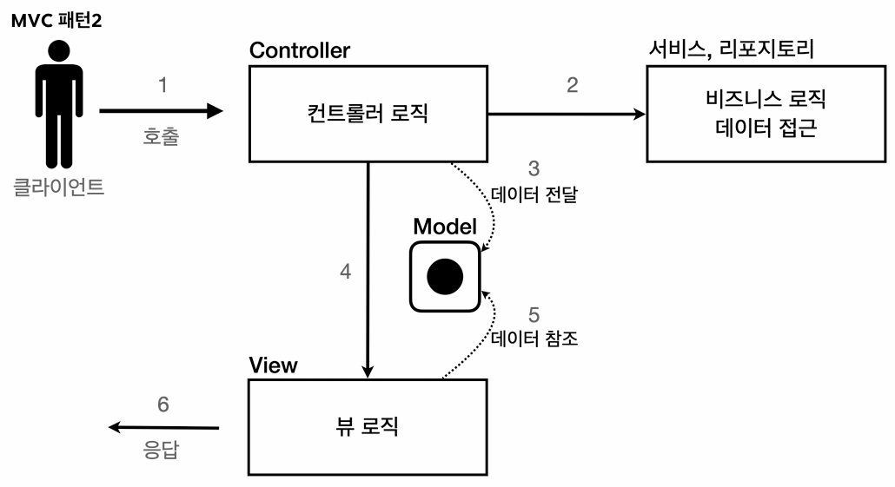

## 회원 관리 웹 애플리케이션 실습
### 개요
> **단순한 회원 저장 및 조회 기능을 가진 웹 애플리케이션을 세 가지 방식으로 점진적으로 구현하며, 웹 기술의 발전 과정과 MVC 패턴의 도입 이유를 학습**한다.

#### 0단계: 핵심 코어 개발
- 본격적인 실습(서블릿/JSP 개발)에 앞서, **회원 데이터를 메모리에 저장하고 조회하는 핵심 코어(`Member` 도메인 및 레포지토리)를 먼저 구현**한다.
- 참고로 본 실습에서는 역할에 따라 패키지(`domain`, `repository`)를 구분하지 않고, 단일 패키지(`member`) 안에서 관련 클래스를 관리하는 방식을 취했다. (실습 규모가 작기 때문)

#### 1단계: 서블릿(Servlet)으로 구현
- **자바 코드로 비즈니스 로직과 화면 렌더링을 모두 처리하는 방식**이다.
- 웹 페이지의 대부분이 렌더링 코드인데, Java로 개발하고 있으므로 **개발 생산성이 매우 떨어진다.**

#### 2단계: JSP로 구현
- **HTML 문서 내에 자바 코드를 삽입하는 방식**으로, 화면 렌더링 코드 작성의 **생산성이 향상**된다.
- 하지만, 여전히 **하나의 JSP 파일 안에 비즈니스 로직과 화면 렌더링 코드가 혼재하기 때문에 유지보수가 어렵다**는 문제가 남아있다. 

#### 3단계: MVC 패턴 적용
- **핵심 비즈니스 로직 처리는 Controller와 Model이 담당하고, 화면 렌더링은 View가 전담하도록 역할을 분리하는 방식**이다.
- 유지보수 문제는 해결하였으나, 여전히 **애플리케이션 레벨에서 반복되는 작업이 있었고, 이를 해결하기 위해 MVC 프레임워크가 등장**하게 된다.

### 서블릿으로 회원가입 웹 앱 만들기
#### 후기
- 동적으로 웹 페이지를 만들 수는 있었지만, 누차 말했듯 자바 코드로 화면 렌더링을 처리하려니까 생산성이 크게 떨어졌다.
- 서블릿 실습을 거치면서, **HTML 문서 형태를 기본으로 유지하면서 비즈니스 로직이 필요한 부분에만 자바 코드를 적용하는 기술**인 템플릿 엔진(JSP, 타임리프 등)의 등장 배경에 대해 납득할 수 있게 되었다.

### JSP로 회원가입 웹 앱 만들기
#### JSP(JavaServer Pages) 환경 설정과 라이브러리
> **스프링 부트 환경에서 JSP를 사용하려면 `build.gradle`에 관련 라이브러리를 추가해야 한다.**

```java
//JSP 추가 시작
implementation 'org.apache.tomcat.embed:tomcat-embed-jasper'    // JSP to Servlet
implementation 'jakarta.servlet:jakarta.servlet-api' // JSP 컴파일러가 참조해야 하는 서블릿 규격
implementation 'jakarta.servlet.jsp.jstl:jakarta.servlet.jsp.jstl-api' // JSTL(JSP Standard Tag Library) 규격
implementation 'org.glassfish.web:jakarta.servlet.jsp.jstl' // JSTL(JSP Standard Tag Library) 규격
//JSP 추가 끝
```

- 서블릿 실습 때는 스프링 부트 웹 스타터에 이미 서블릿 API가 내장되어 있어 별도로 추가할 필요가 없었지만, JSP는 다르다.
- **스프링 부트는 기본적으로 JSP 구동 엔진을 지원하지 않기 때문에, 관련 라이브러리를 별도로 추가**해야 한다.
- **이때 내장 톰캣은 내부적으로 JSP를 서블릿으로 변환한 후에 컴파일한다**는 사실을 기억해두자.

#### JSP 파일의 위치와 WAR 패키징
> **JSP 파일은 반드시 `src/main/webapp` 하위에 생성해야 한다.**

- **자바 웹 표준(WAR 패키징)에서 클라이언트가 리소스를 얻기 위해 접근할 수 있는 최상위 디렉토리**가 해당 경로(`src/main/webapp`)이기 때문이다.
- 참고로 `WEB-INF`는 `src/main/webapp` 내부의 특수한 보안 디렉토리로, 클라이언트의 접근을 허용하지 않는 리소스를 저장하는 공간이다.
- 현재 실습에서는 클라이언트가 브라우저에 JSP 경로를 직접 입력하여 접근해야 하므로, `WEB-INF`가 아닌 `webapp`에 파일을 위치시켰다.

#### JSP 기본 문법과 동작 원리
> **JSP는 HTML 문서 형태를 띠고 있지만, 실행 시점에는 WAS에 의해 서블릿(`.java`)으로 변환된 후 컴파일되어 실행된다.**

- **초기 선언부:**
  - JSP 파일의 경우, 문서 최상단에 `<%@ page contentType="text/html;charset=UTF-8" language="java" %>`를 명시해야 한다. (**문서 타입과 인코딩 규격 명시**)
- **스크립틀릿 (`<% %>`):**
  - 비즈니스 로직(변수 선언, DB 접근, 조건문 등)을 처리하기 위한 자바 실행 구문을 입력하는 영역이다.
- **표현식 (`<%= %>`):**
  - 변수나 메서드의 반환값을 HTML 화면에 직접 출력하기 위한 영역이다.
  - 컴파일 시 내부적으로 `out.print(값);` 형태의 코드로 자동 변환된다.
- **내장 객체 활용:**
  - JSP가 서블릿 코드로 변환될 때 `request`, `response`, `out` 등의 객체가 내부 메서드에 자동으로 선언되므로, 별도의 생성 없이 즉시 사용할 수 있다.

#### JSP 구현의 한계와 MVC 패턴의 필요성
> **HTML 뼈대를 유지하면서 필요한 부분만 자바 코드를 삽입하므로 화면(View) 렌더링 작성은 편리해졌지만, 여전히 하나의 파일에서 비즈니스 로직과 화면 렌더링을 처리하고 있어 유지보수가 어렵다**는 한계가 남아 있다.

- 이에 **비즈니스 로직은 서블릿에, 화면 렌더링은 JSP에 맡기는 MVC 패턴이 등장**하게 되었다.
- 물론 비즈니스 로직을 서블릿으로 분리하더라도(MVC 패턴을 적용하더라도), **화면 렌더링을 위한 최소한의 자바 코드(`<%= member.getAge() %>`)는 필요하다.**

### MVC 패턴 개요
#### MVC 패턴의 등장 배경 (하나의 파일에서 비즈니스 로직과 화면 렌더링을 모두 처리하는 방식의 한계)
> 아래와 같은 이유에서 **화면 렌더링은 뷰 템플릿(JSP, 타임리프)이, 비즈니스 로직은 서블릿이 처리하도록 역할을 분리하는 MVC 패턴이 등장**하게 되었다. 

- **유지보수의 어려움:**
  - 하나의 파일이 너무 많은 역할을 담당하게 되어, 유지보수하기가 어렵다.
  - 특히 비즈니스 로직과 화면 렌더링 코드가 뒤섞인 상황이기 때문에, 가령 비즈니스 로직을 수정했는데 의도치 않게 화면 렌더링에 문제가 발생할 수 있다.
- **변경 주기의 불일치:**
  - UI를 수정하는 일과 비즈니스 로직을 수정하는 일은 대개 서로 독립적으로 발생하는데, 상기 언급했듯 상호 영향을 줄 가능성이 잔재한다.

#### MVC 패턴의 구성 요소


웹 애플리케이션의 표준 아키텍처인 **MVC 패턴은 역할을 크게 3가지(모델, 뷰, 컨트롤러)로 분리**한다.

- **컨트롤러(Controller):** 클라이언트의 HTTP 요청을 받아 분석하고, 적절하게 처리한다.
  - 클라이언트가 보낸 **파라미터를 추출 및 검증**한다.
  - 핵심 **비즈니스 로직을 실행**한다. (실제로는 컨트롤러, 서비스, 레포지토리 구조로 나뉘지만 여기서는 컨트롤러로 퉁쳐서 생각하자)
  - 처리된 결과 데이터를 뷰에 전달하기 위해 모델에 담는다.
- **모델(Model):** 화면 렌더링에 필요한 데이터를 담는 저장소이다.
  - 모델이 중간에서 데이터를 전달해주기 때문에, **뷰는 비즈니스 로직과 무관하게 화면 렌더링에만 집중**할 수 있다.
  - 서블릿 실습에서 다루었던 **`HttpServletRequest` 객체 내부에 있는 저장소를 모델로 사용**한다.
  - **해당 모델에 담는 데이터 하나하나를 `attribute`라고 하며, `request` 객체를 통해 데이터를 저장하거나 조회**할 수 있다.
- **뷰(View):** 사용자에게 보여지는 화면(UI)을 생성한다.
  - 모델에 담겨 있는 데이터를 꺼내와서 HTML, XML, JSP 등의 형태로 화면을 렌더링한다.

### MVC 패턴을 적용하여 회원관리 웹 앱 만들기
#### 실습 진행 방향
- **컨트롤러:** 서블릿을 활용하여 클라이언트의 요청을 받고, 비즈니스 로직을 처리한다.
- **모델:** `HttpServletRequest` 객체 내부에 있는 저장소를 모델로 사용한다.
- **뷰:** JSP를 활용하여 모델의 데이터를 읽고, 화면을 렌더링한다.

#### 화면 이동 방식 (Forward vs Redirect)
- **Forward: `dispatcher.forward(request, response)`**
  - **서버 내부에서만 발생하는 화면 이동으로, 브라우저의 URL 경로가 변경되지 않는다.** (클라이언트는 `Forward` 발생 사실 자체를 모르기 때문)
- **Redirect: `response.sendRedirect(url)`**
  - 클라이언트에게 지정한 URL로 다시 요청하라고 명령(`3xx` 응답 코드, `Location` 헤더)을 보낸다.
  - 클라이언트가 새로운 URL로 다시 서버에 요청을 보내므로, **브라우저의 URL 경로가 실제로 변경**된다.

#### HTML Form의 상대 경로 접근
- **`form` 태그의 `action` 속성에 경로를 입력할 때, 슬래시(`/`)로 시작하지 않으면 상대 경로로 취급**된다.
  - 예) `<form action="save">`
- 이렇게 **상대 경로를 사용하게 되면, 전체 경로는 현재 URL을 기준으로 동작**한다. 
  - 예) 현재 URL이 `/servlet-mvc/members/new-form`일 때, 앞선 예시의 `form` 태그로 인해 이동하게 되는 URL은 `/servlet-mvc/members/save`이다.
  - 예시를 보면 알 수 있듯, **현재 URL에서 마지막 슬래시 이전까지의 경로(`/servlet-mvc/members/`)를 기준점(Base URL)으로 삼고, 상대 경로(`save`)를 이어 붙이는 방식으로 동작**한다.

#### JSP 부가 기능 (EL, JSTL)
> **뷰(JSP)에서 모델의 데이터를 더욱 편리하게 조회하기 위해 제공되는 기능**이다.

- **EL (Expression Language):**
  - `<%=(Member)(request.getAttribute("member")).getUsername()%>`와 같은 복잡한 자바 코드를 `${member.username}`과 같이 간단히 작성할 수 있다. 
- **프로퍼티 접근법:**
  - EL에서 `.username`으로 접근할 때, 실제로는 JavaBeans 규약에 따라 **해당 객체의 `getUsername()` 메서드를 자동으로 찾아 호출**한다.
  - 덕분에 멤버 변수가 `private`이더라도 Getter가 존재하면, `.username`으로 값을 읽을 수 있다.
- **JSTL (JSP Standard Tag Library):**
  - **JSP 문서에서 반복문, 조건문 등을 태그 형태로 깔끔하게 처리하기 위한 자바 표준 라이브러리**다.
  - 사용하려는 문서 최상단에 JSTL 라이브러리를 추가하면 `c:if`, `c:forEach` 등의 태그를 활용할 수 있다. 
  - 예) `<%@ taglib prefix="c" uri="http://java.sun.com/jsp/jstl/core"%>`

### MVC 패턴의 한계
#### MVC 패턴을 도입한 결과
- 비즈니스 로직과 화면 렌더링 로직을 성공적으로 분리한 결과, **JSP(뷰) 파일 내부의 코드는 직관적이고 깔끔**해졌다. (렌더링 역할에만 집중됐기 때문)
- 하지만 **컨트롤러에는 여전히 여러 한계**가 남아 있다.

#### 컨트롤러 단의 코드 중복 및 비효율 문제
- **포워딩 코드의 중복:**
  - 컨트롤러에서 뷰로 이동하기 위한 `RequestDispatcher` 생성 및 `forward()` 호출 코드가 모든 컨트롤러에서 반복된다.
- **ViewPath의 중복:**
  - 접두사(`/WEB-INF/views/`)와 접미사(`.jsp`)가 계속해서 중복 작성된다.
  - 만약 추후 JSP에서 타임리프 등 다른 뷰 템플릿으로 기술을 변경해야 한다면, 수백 개의 컨트롤러 코드를 일일이 수정해야 하는 문제로 이어지게 된다.
- **사용하지 않는 객체와 테스트의 어려움:**
  - 컨트롤러에 따라 파라미터(`HttpServletRequest`, `HttpServletResponse`)를 전혀 사용하지 않는 경우도 발생한다.
  - 또한, 이 객체들은 WAS 환경에서만 생성되므로, 순수 자바 코드로 단위 테스트(Unit Test)를 작성하기가 매우 까다롭다.

#### 구조적 한계 (단일 진입점의 부재)
- 앞선 문제들을 해결하기 위해 **공통 로직을 별도의 메서드로 추출하더라도, 결국 각 컨트롤러가 해당 메서드를 일일이 호출해야 하는 문제가 재차 발생**한다.
- 이는 **현재 아키텍처상, 모든 컨트롤러가 진입점(Entry Point) 역할을 수행해야 하는 구조이기 때문**이다.
- **기능이 확장될수록 각각의 컨트롤러에서 공통으로 처리해야 할 부분(권한 체크, 로깅 등)은 늘어나는데, 현재는 이를 일일이 추가해야 하는(사실상 공통 처리가 불가능한) 구조**인 것이다.

#### 프론트 컨트롤러 도입
- 컨트롤러마다 공통 로직을 추가해줘야 하는 문제를 해결하기 위해, **모든 클라이언트의 HTTP 요청을 가장 먼저 받아들이는 단일 진입점(Single Entry Point)을 두는 패턴**이다.
- **프론트 컨트롤러가 모든 요청을 받아 공통 처리 로직(포워딩, ViewPath 처리 등)을 일괄적으로 수행한 후, 적절한 컨트롤러에 요청을 위임(dispatch)하는 패턴**이다. 
- 참고로 서블릿 필터(Filter) 역시 공통 기능을 처리하지만, 실행 위치와 목적이 다르다.
  - **필터는 프론트 컨트롤러(서블릿)가 실행되기 이전 단계인 WAS 레벨에서 동작**하며, **주로 인코딩 처리나 인증/인가 등 보안 필터링에 사용**된다.
  - 반면, **프론트 컨트롤러는 그 이후에 실행되어 MVC 로직과 관련된 내부 공통 처리와 라우팅에 집중**한다.
  - 스프링 MVC의 `DispatcherServlet`이 프론트 컨트롤러 패턴의 대표적인 구현체이다.