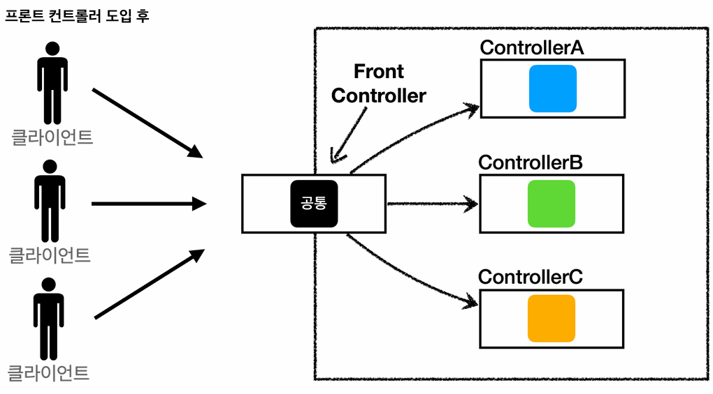
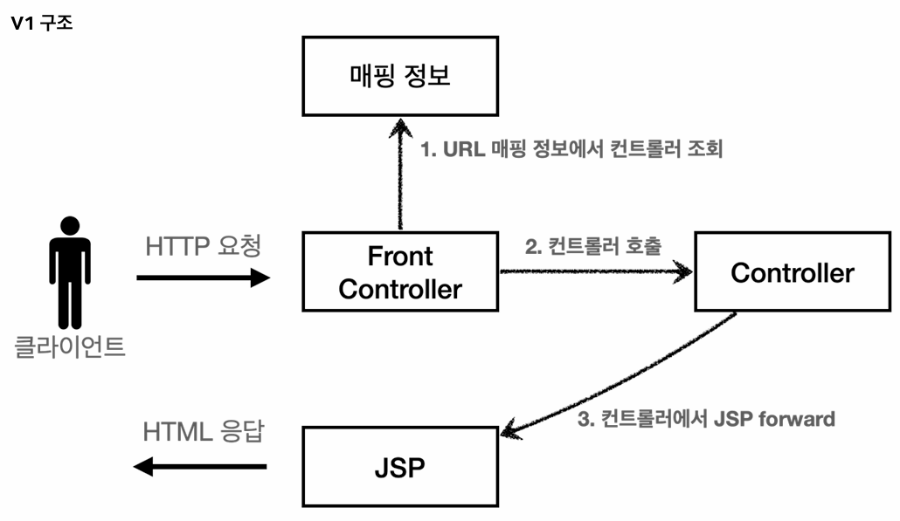
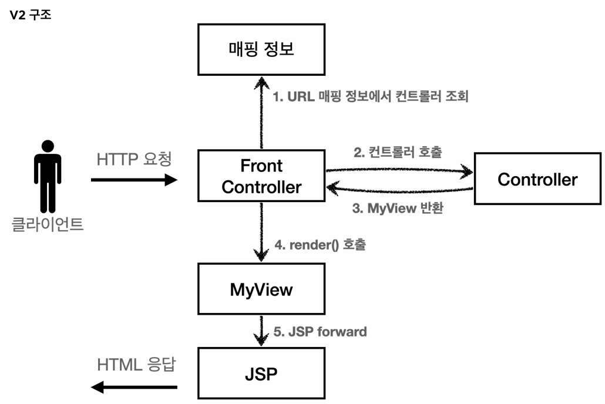
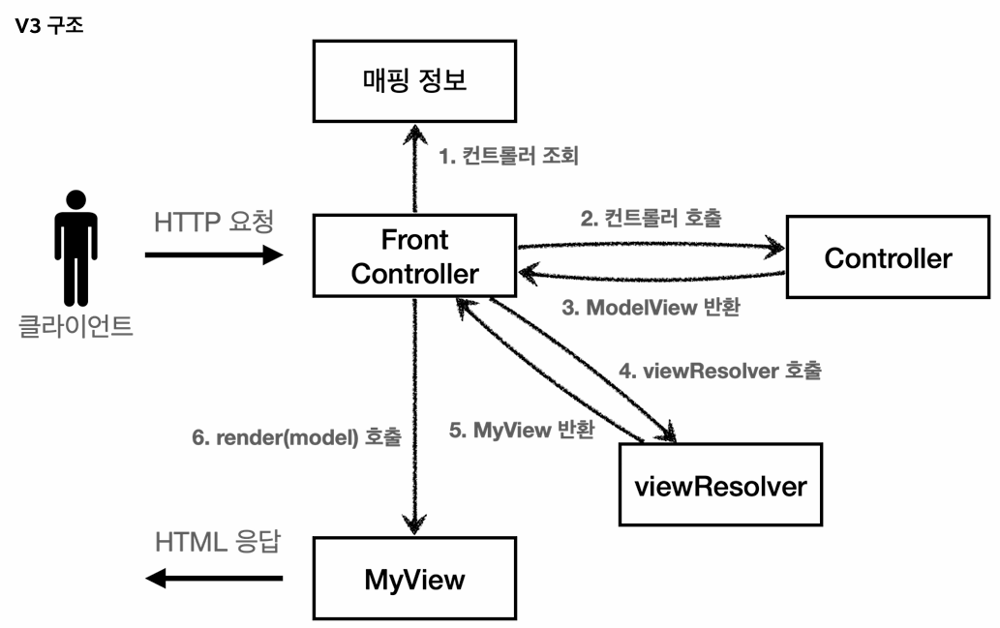

## 프론트 컨트롤러 패턴 소개
### 섹션 개요
- 이번 섹션(MVC 프레임워크 만들기)에서는 프론트 컨트롤러 패턴을 기반으로 직접 MVC 프레임워크를 만들어 볼 것이다.
- 점진적으로 프레임워크를 개선해 나가면서, **스프링 MVC가 어떠한 과정을 거쳐 현재의 구조를 갖추게 되었는지**를 이해하는 것이 주요 목적이다.

### 기존 MVC 패턴의 한계
- 기존 MVC 패턴으로는 컨트롤러마다 개별적으로 공통 로직(포워딩, viewPath 지정 등)을 처리하는 코드를 작성해줘야 했다.
- 하지만 모든 클라이언트의 요청을 가장 먼저 받아들이는 프론트 컨트롤러를 배치하게 되면, 이 **프론트 컨트롤러에서만 공통 로직을 관리**하면 된다.

### 프론트 컨트롤러 패턴의 핵심 구조

#### 단일 진입점
> **클라이언트의 모든 HTTP 요청을 가장 먼저 받아들여야 하므로, 프론트 컨트롤러의 구현체는 서블릿이어야 한다.**

#### 공통 로직 통합
> **기존 구조에서 개별 컨트롤러마다 중복해서 작성해야 했던 공통 로직을, 프론트 컨트롤러에서만 작성해주면 된다.** 

#### 요청 위임 (Dispatch)
> **프론트 컨트롤러가 공통 로직을 처리한 후, 요청 URL에 매핑되는 컨트롤러를 찾아내(호출해) 작업을 위임한다.**

### 개별 컨트롤러의 서블릿 종속성 제거
- HTTP 요청을 가장 먼저 받아들이고, 최종적으로 클라이언트에 HTTP 응답을 반환해야 하므로 프론트 컨트롤러 자체는 서블릿으로 구현되어야 한다.
- 하지만 **프론트 컨트롤러가 이와 같이 서블릿과 관련된 작업들을 처리해주는 덕분에, 개별 컨트롤러들은 더 이상 서블릿으로 작성될 필요가 없다.**
  - 개별 컨트롤러들은 단순히 비즈니스 로직을 처리하는 것에 집중하면 된다.
- 즉, 개별 컨트롤러들을 더 이상 서블릿이 아니라, POJO(순수한 일반 자바 객체)로 구현할 수 있게 되었고, 그 덕분에 유지보수성 또한 향상되었다. (WAS를 띄우지 않고 단위 테스트가 가능해졌기 때문) 

### 스프링 MVC에서의 프론트 컨트롤러 패턴
- 스프링 MVC 프레임워크에서의 핵심 역시, 이러한 프론트 컨트롤러 패턴을 구현하는 것인데, 그 구현체가 바로 `DispatcherServlet`이다.
- 앞서 언급한 공통 로직 처리, 요청 위임 외에도 **`DispatcherServlet`에서 HTTP 요청/응답을 어떻게 처리하는지**도 한 번 알아보자.

#### HTTP 요청 관련 작업
- **WAS로부터 HTTP 요청 메시지를 전달받으면, 해당 메시지에 담긴 정보들을 편리하게 사용할 수 있도록 `HttpServletRequest` 객체를 만들어서 개별 컨트롤러에 전달**한다.  

#### HTTP 응답 관련 작업
- **개별 컨트롤러로부터 뷰 이름을 반환받으면, `ViewResolver`를 통해 해당 뷰를 찾아내 포워딩**한다.
- **뷰 템플릿(JSP, 타임리프 등)은 함께 전달받은 `HttpServletRequest`, `HttpServletResponse` 객체를 참조하여 화면을 렌더링**한다. (정확히는 응답 객체의 메시지 바디를 작성한다.)
- 뷰 템플릿이 메시지 바디를 모두 채우면 제어권이 다시 `DispatcherServlet`으로 돌아온다.
- **`DispatcherServlet`이 남은 공통 로직(인터셉터의 `postHandle`, `afterCompletion` 등)을 마저 처리**하면, **최종적으로 WAS가 해당 응답 객체를 참조해 응답 메시지를 생성**한 후 클라이언트에 반환한다.
 
---

## MVC 프레임워크 구현 파트 1: 구조 개선 (V1 ~ V3)
### V1: 프론트 컨트롤러 도입
#### 기존 MVC 패턴의 한계
- 모든 컨트롤러가 개별적인 진입점(Entry Point) 역할을 하여, **공통 로직(포워딩, viewPath 지정 등)을 일괄적으로 적용하는 데 어려움**이 있었다.

#### V1에서 개선된 구조

- **클라이언트의 HTTP 요청을 가장 먼저 받아들이는 단일 진입점인 프론트 컨트롤러를 도입**하였다.
- 프론트 컨트롤러는 **요청 URL에 매핑되는 컨트롤러를 호출하여, 작업을 위임**(dispatch)한다.

#### 핵심 구현 사항
```java
private final Map<String, ControllerV1> controllerMap = new HashMap<>();

// 매핑 정보 등록
public FrontControllerServletV1() {
    controllerMap.put("/front-controller/v1/members/new-form", new MemberFormControllerV1());
    controllerMap.put("/front-controller/v1/members/save", new MemberSaveControllerV1());
    controllerMap.put("/front-controller/v1/members", new MemberListControllerV1());
}
```
- **매핑 정보 관리:**
  - 프론트 컨트롤러 생성 시, `HashMap<매핑 URL, 호출될 컨트롤러>`의 형태로 매핑 정보를 등록하여 요청 URL에 맞는 컨트롤러를 찾는다.
- **인터페이스 도입:**
  - 개별 컨트롤러(`~~ControllerV1`)들이 일관된 방식으로 호출될 수 있도록 `ControllerV1` 인터페이스를 도입하였다.

#### 한계점
```java
public interface ControllerV1 {

    void process(HttpServletRequest request, HttpServletResponse response) throws ServletException, IOException;
}
```
- **서블릿 종속성 잔재:**
  - 개별 파라미터에서의 서블릿 상속(`extends HttpServlet`)을 제거하여, 기존의 `service` 메서드 대신 인터페이스(`ControllerV1`)의 `process` 메서드를 구현하도록 변경되었다.
  - 하지만 **파라미터로 서블릿 요청/응답 객체를 넘겨받고 있기 때문에, 개별 컨트롤러들은 여전히 서블릿 종속적**이다.
  - POJO 형태가 아니므로, 단위 테스트를 위해서는 여전히 WAS 환경을 구축해야 하는 불편함이 있다.

### V2: 프론트 컨트롤러에서 포워딩 수행 (View 분리)
#### V1의 한계
```java
@Override
public void process(HttpServletRequest request, HttpServletResponse response) throws ServletException, IOException {
    String viewPath = "/WEB-INF/views/new-form.jsp";
    RequestDispatcher dispatcher = request.getRequestDispatcher(viewPath);
    dispatcher.forward(request, response);
}
```
- **프론트 컨트롤러를 통해 진입점은 단일화했지만, 여전히 컨트롤러마다 개별적으로 포워딩 로직을 수행**하고 있다.

#### V2에서 개선된 구조

```java
// 개별 컨트롤러 (~~ControllerV2)
@Override
public MyView process(HttpServletRequest request, HttpServletResponse response) throws ServletException, IOException {
    return new MyView("/WEB-INF/views/new-form.jsp");   // 해당 뷰 템플릿 파일의 위치로 포워딩
}

// 포워딩 전담 객체 (MyView)
public void render(HttpServletRequest request, HttpServletResponse response) throws ServletException, IOException {
    RequestDispatcher dispatcher = request.getRequestDispatcher(viewPath);
    dispatcher.forward(request, response);
}
```
- **개별 컨트롤러가 직접 뷰로 포워딩하는 대신, 포워딩을 전담하는 뷰 객체를 반환**한다.

#### 뷰 템플릿 파일과 뷰 객체
- **뷰 템플릿 파일:**
  - **최종적으로 클라이언트 화면에서 렌더링될 파일**이다.
  - JSP, 타임리프 등의 뷰 템플릿 엔진으로 구현된다.
- **뷰 객체:**
  - **뷰 템플릿 파일로 이동(포워딩)하여 화면을 렌더링하기 위해 사용하는 객체**이다.
  - 내부적으로 `RequestDispatcher`를 사용하여 특정 뷰 템플릿 파일로 포워딩한다. 

### V3: 서블릿 종속성 및 뷰 이름 중복 제거 (paramMap, Model, ViewResolver 도입)
#### V2의 한계
```java
@Override
public MyView process(HttpServletRequest request, HttpServletResponse response) throws ServletException, IOException {

    // 1. 요청 파라미터 추출을 위해 HttpServletRequest 객체 직접 사용
    String username = request.getParameter("username");
    int age = Integer.parseInt(request.getParameter("age"));

    Member member = new Member(username, age);
    memberRepository.save(member);

    // 2. 모델에 데이터를 담기 위해 HttpServletRequest 객체 직접 사용
    request.setAttribute("member", member);
    
    return new MyView("/WEB-INF/views/save-result.jsp");    // 전체 물리적 경로를 반환
}
```
- **서블릿 종속성 잔재:**
  - 개별 컨트롤러가 요청 파라미터 추출이나 모델 데이터 적재를 위해 여전히 서블릿 객체(`HttpServletRequest`)를 직접 사용하고 있다.
  - 추후 테스트를 위해, WAS 환경을 구축해야 하기 때문에 유지보수성이 떨어지는 구조이다. 
- **뷰 이름 내 접두사, 접미사 반복:**
  - 컨트롤러가 반환하는 뷰 경로의 접두사(`/WEB-INF/views/`)와 접미사(`.jsp`)가 중복 등장한다.
  - 추후 뷰 경로나 템플릿 엔진이 변경되는 경우, 일일이 수정해야 하기 때문에 유지보수성이 떨어지는 구조이다.

#### V3에서 개선된 구조

```java
// 프론트 컨트롤러
Map<String, String> paramMap = createParamMap(request);
ModelView modelView = controller.process(paramMap); // 요청 파라미터 맵을 전달

// 개별 컨트롤러 (MemberListControllerV3)
@Override
public ModelView process(Map<String, String> paramMap) {
    List<Member> members = memberRepository.findAll();

    ModelView modelView = new ModelView("members"); // 전체 물리적 경로 대신 뷰의 논리적 이름만 반환
    modelView.getModel().put("members", members);   // 서블릿 요청 객체 대신 자체적인 모델 객체에 데이터를 저장
    return modelView;
}
```
- **서블릿 종속성 제거:**
  - 서블릿 객체 대신 **요청 파라미터 맵을 넘기고**, 서블릿 요청 객체의 내부 저장소 대신 **자체적인 모델 객체를 도입하여 서블릿 종속성을 완전히 제거**하였다.
- **뷰 이름 중복 제거:**
  - 접두사, 접미사가 포함된 **전체 물리적 경로 대신, 뷰의 논리적 이름만 반환하도록 개선**되었다.
  - 정확히는 `ModelView` 객체가 반환되는 것이지만, 해당 객체가 전체 물리적 경로 대신 뷰의 논리적 이름만을 알고 있다는 것이 중요하다.

#### 핵심 구현 사항
```java
@Override
protected void service(HttpServletRequest request, HttpServletResponse response) throws ServletException, IOException {

    String requestURI = request.getRequestURI();    // host를 포함한 전체 URL이 아니라, path만 필요하기 때문
    ControllerV3 controller = controllerMap.get(requestURI);
    if (controller == null) {
        response.setStatus(HttpServletResponse.SC_NOT_FOUND);
        return;
    }

    Map<String, String> paramMap = createParamMap(request);
    ModelView modelView = controller.process(paramMap);

    String viewName = modelView.getViewName();
    MyView view = viewResolver(viewName);   // 논리적 이름(viewName) → 물리적 경로(viewPath)

    // 더 이상 request 객체 내부에 있는 저장소가 모델이 아니므로, 새로 만든 모델 정보 또한 같이 넘겨줘야 함
    view.render(modelView.getModel(), request, response);
}
```
- **`ModelView` 반환:**
  - 개별 컨트롤러는 전체 물리적 경로를 알고 있는 `View` 객체 대신, 모델과 뷰의 논리적 이름을 알고 있는 `ModelView` 객체를 반환한다.
- **`ViewResolver` 도입:**
  - 프론트 컨트롤러는 개별 컨트롤러로부터 뷰의 논리적 이름을 전달받은 뒤, `ViewResolver`를 통해 접두사와 접미사를 조합하여 실제 물리적 위치가 담긴 `View` 객체를 얻어낸다.
  - 이후 `View` 객체를 통해 화면 렌더링을 수행한다.

#### 구조적 이점
```java
private MyView viewResolver(String viewName) {
    return new MyView("/WEB-INF/views/" + viewName + ".jsp");
}
```
- **논리적 이름과 물리적 경로를 분리함으로써, 추후 뷰 경로나 템플릿 엔진(렌더링 기술)의 변경에 유연하게 대응**할 수 있게 됐다.
- 개별 컨트롤러에서 일일이 접두사나 접미사를 수정하는 대신, **`ViewResolver`의 세팅 값만 수정**하면 된다.

---