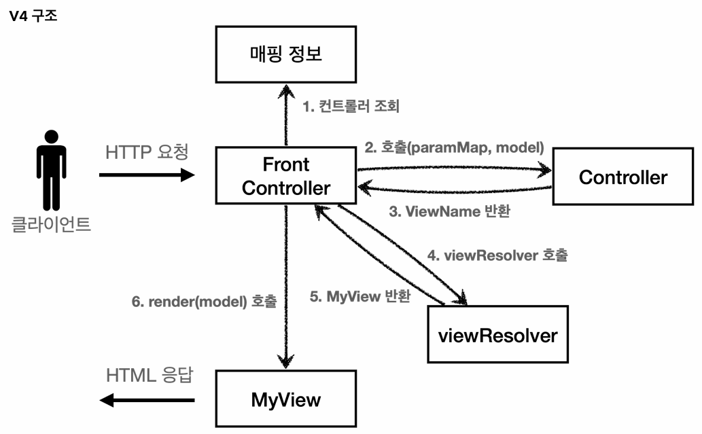

## 프론트 컨트롤러 패턴 소개
### 섹션 개요
- 이번 섹션(MVC 프레임워크 만들기)에서는 프론트 컨트롤러 패턴을 기반으로 직접 MVC 프레임워크를 만들어 볼 것이다.
- 점진적으로 프레임워크를 개선해 나가면서, **스프링 MVC가 어떠한 과정을 거쳐 현재의 구조를 갖추게 되었는지**를 이해하는 것이 주요 목적이다.

### 기존 MVC 패턴의 한계
- 기존 MVC 패턴으로는 컨트롤러마다 개별적으로 공통 로직(포워딩, viewPath 지정 등)을 처리하는 코드를 작성해줘야 했다.
- 하지만 모든 클라이언트의 요청을 가장 먼저 받아들이는 프론트 컨트롤러를 배치하게 되면, 이 **프론트 컨트롤러에서만 공통 로직을 관리**하면 된다.

### 프론트 컨트롤러 패턴의 핵심 구조

#### 단일 진입점
> **클라이언트의 모든 HTTP 요청을 가장 먼저 받아들여야 하므로, 프론트 컨트롤러의 구현체는 서블릿이어야 한다.**

#### 공통 로직 통합
> **기존 구조에서 개별 컨트롤러마다 중복해서 작성해야 했던 공통 로직을, 프론트 컨트롤러에서만 작성해주면 된다.** 

#### 요청 위임 (Dispatch)
> **프론트 컨트롤러가 공통 로직을 처리한 후, 요청 URL에 매핑되는 컨트롤러를 찾아내(호출해) 작업을 위임한다.**

### 개별 컨트롤러의 서블릿 종속성 제거
- HTTP 요청을 가장 먼저 받아들이고, 최종적으로 클라이언트에 HTTP 응답을 반환해야 하므로 프론트 컨트롤러 자체는 서블릿으로 구현되어야 한다.
- 하지만 **프론트 컨트롤러가 이와 같이 서블릿과 관련된 작업들을 처리해주는 덕분에, 개별 컨트롤러들은 더 이상 서블릿으로 작성될 필요가 없다.**
  - 개별 컨트롤러들은 단순히 비즈니스 로직을 처리하는 것에 집중하면 된다.
- 즉, 개별 컨트롤러들을 더 이상 서블릿이 아니라, POJO(순수한 일반 자바 객체)로 구현할 수 있게 되었고, 그 덕분에 유지보수성 또한 향상되었다. (WAS를 띄우지 않고 단위 테스트가 가능해졌기 때문) 

### 스프링 MVC에서의 프론트 컨트롤러 패턴
- 스프링 MVC 프레임워크에서의 핵심 역시, 이러한 프론트 컨트롤러 패턴을 구현하는 것인데, 그 구현체가 바로 `DispatcherServlet`이다.
- 앞서 언급한 공통 로직 처리, 요청 위임 외에도 **`DispatcherServlet`에서 HTTP 요청/응답을 어떻게 처리하는지**도 한 번 알아보자.

#### HTTP 요청 관련 작업
- **WAS로부터 HTTP 요청 메시지를 전달받으면, 해당 메시지에 담긴 정보들을 편리하게 사용할 수 있도록 `HttpServletRequest` 객체를 만들어서 개별 컨트롤러에 전달**한다.  

#### HTTP 응답 관련 작업
- **개별 컨트롤러로부터 뷰 이름을 반환받으면, `ViewResolver`를 통해 해당 뷰를 찾아내 포워딩**한다.
- **뷰 템플릿(JSP, 타임리프 등)은 함께 전달받은 `HttpServletRequest`, `HttpServletResponse` 객체를 참조하여 화면을 렌더링**한다. (정확히는 응답 객체의 메시지 바디를 작성한다.)
- 뷰 템플릿이 메시지 바디를 모두 채우면 제어권이 다시 `DispatcherServlet`으로 돌아온다.
- **`DispatcherServlet`이 남은 공통 로직(인터셉터의 `postHandle`, `afterCompletion` 등)을 마저 처리**하면, **최종적으로 WAS가 해당 응답 객체를 참조해 응답 메시지를 생성**한 후 클라이언트에 반환한다.
 
---

## MVC 프레임워크 구현 파트 1: 구조 개선 (V1 ~ V3)
### V1: 프론트 컨트롤러 도입
#### 기존 MVC 패턴의 한계
- 모든 컨트롤러가 개별적인 진입점(Entry Point) 역할을 하여, **공통 로직(포워딩, viewPath 지정 등)을 일괄적으로 적용하는 데 어려움**이 있었다.

#### V1에서 개선된 구조

- **클라이언트의 HTTP 요청을 가장 먼저 받아들이는 단일 진입점인 프론트 컨트롤러를 도입**하였다.
- 프론트 컨트롤러는 **요청 URL에 매핑되는 컨트롤러를 호출하여, 작업을 위임**(dispatch)한다.

#### 핵심 구현 사항
```java
private final Map<String, ControllerV1> controllerMap = new HashMap<>();

// 매핑 정보 등록
public FrontControllerServletV1() {
    controllerMap.put("/front-controller/v1/members/new-form", new MemberFormControllerV1());
    controllerMap.put("/front-controller/v1/members/save", new MemberSaveControllerV1());
    controllerMap.put("/front-controller/v1/members", new MemberListControllerV1());
}
```
- **매핑 정보 관리:**
  - 프론트 컨트롤러 생성 시, `HashMap<매핑 URL, 호출될 컨트롤러>`의 형태로 매핑 정보를 등록하여 요청 URL에 맞는 컨트롤러를 찾는다.
- **인터페이스 도입:**
  - 개별 컨트롤러(`~~ControllerV1`)들이 일관된 방식으로 호출될 수 있도록 `ControllerV1` 인터페이스를 도입하였다.

#### 한계점
```java
public interface ControllerV1 {

    void process(HttpServletRequest request, HttpServletResponse response) throws ServletException, IOException;
}
```
- **서블릿 종속성 잔재:** 
  - 개별 컨트롤러에서 서블릿 상속(`extends HttpServlet`, `service(req, resp)`)을 제거하고, 별도의 인터페이스(`ControllerV1`, `process(req, resp)`)를 구현하도록 구조가 변경되었다.
  - 하지만 **파라미터로 서블릿 요청/응답 객체를 넘겨받는다는 점은 그대로기 때문에, 개별 컨트롤러들은 여전히 서블릿 종속적**이라고 할 수 있다.
  - POJO 형태가 아니라면 단위 테스트 과정에서 WAS 환경을 구축해야 하기 때문에, 효율적인 유지보수를 위해서는 서블릿 종속성의 제거가 요구된다.  

### V2: 프론트 컨트롤러에서 포워딩 수행 (View 분리)
#### V1의 한계
```java
@Override
public void process(HttpServletRequest request, HttpServletResponse response) throws ServletException, IOException {
    String viewPath = "/WEB-INF/views/new-form.jsp";
    RequestDispatcher dispatcher = request.getRequestDispatcher(viewPath);
    dispatcher.forward(request, response);
}
```
- **프론트 컨트롤러를 통해 진입점은 단일화했지만, 여전히 컨트롤러마다 개별적으로 포워딩 로직을 수행**하고 있다.

#### V2에서 개선된 구조

```java
// 개별 컨트롤러 (~~ControllerV2)
@Override
public MyView process(HttpServletRequest request, HttpServletResponse response) throws ServletException, IOException {
    return new MyView("/WEB-INF/views/new-form.jsp");   // 해당 뷰 템플릿 파일의 위치로 포워딩
}

// 포워딩 전담 객체 (MyView)
public void render(HttpServletRequest request, HttpServletResponse response) throws ServletException, IOException {
    RequestDispatcher dispatcher = request.getRequestDispatcher(viewPath);
    dispatcher.forward(request, response);
}
```
- **개별 컨트롤러가 직접 뷰로 포워딩하는 대신, 포워딩을 전담하는 뷰 객체를 반환**한다.

#### 뷰 템플릿 파일과 뷰 객체
- **뷰 템플릿 파일:**
  - **최종적으로 클라이언트 화면에서 렌더링될 파일**이다.
  - JSP, 타임리프 등의 뷰 템플릿 엔진으로 구현된다.
- **뷰 객체:**
  - **뷰 템플릿 파일로 이동(포워딩)하여 화면을 렌더링하기 위해 사용하는 객체**이다.
  - 내부적으로 `RequestDispatcher`를 사용하여 특정 뷰 템플릿 파일로 포워딩한다. 

### V3: 서블릿 종속성 및 뷰 이름 중복 제거 (paramMap, Model, ViewResolver 도입)
#### V2의 한계
```java
@Override
public MyView process(HttpServletRequest request, HttpServletResponse response) throws ServletException, IOException {

    // 1. 요청 파라미터 추출을 위해 HttpServletRequest 객체 직접 사용
    String username = request.getParameter("username");
    int age = Integer.parseInt(request.getParameter("age"));

    Member member = new Member(username, age);
    memberRepository.save(member);

    // 2. 모델에 데이터를 담기 위해 HttpServletRequest 객체 직접 사용
    request.setAttribute("member", member);
    
    return new MyView("/WEB-INF/views/save-result.jsp");    // 전체 물리적 경로를 반환
}
```
- **서블릿 종속성 잔재:**
  - 개별 컨트롤러가 요청 파라미터 추출이나 모델 데이터 적재를 위해 여전히 서블릿 객체(`HttpServletRequest`)를 직접 사용하고 있다.
  - 추후 테스트를 위해, WAS 환경을 구축해야 하기 때문에 유지보수성이 떨어지는 구조이다. 
- **뷰 이름 내 접두사, 접미사 반복:**
  - 컨트롤러가 반환하는 뷰 경로의 접두사(`/WEB-INF/views/`)와 접미사(`.jsp`)가 중복 등장한다.
  - 추후 뷰 경로나 템플릿 엔진이 변경되는 경우, 일일이 수정해야 하기 때문에 유지보수성이 떨어지는 구조이다.

#### V3에서 개선된 구조

```java
// 프론트 컨트롤러
Map<String, String> paramMap = createParamMap(request);
ModelView modelView = controller.process(paramMap); // 요청 파라미터 맵을 전달

// 개별 컨트롤러 (MemberListControllerV3)
@Override
public ModelView process(Map<String, String> paramMap) {
    List<Member> members = memberRepository.findAll();

    ModelView modelView = new ModelView("members"); // 전체 물리적 경로 대신 뷰의 논리적 이름만 반환
    modelView.getModel().put("members", members);   // 서블릿 요청 객체 대신 자체적인 모델 객체에 데이터를 저장
    return modelView;
}
```
- **서블릿 종속성 제거:**
  - 서블릿 객체 대신 **요청 파라미터 맵을 넘기고**, 서블릿 요청 객체의 내부 저장소 대신 **자체적인 모델 객체를 도입하여 서블릿 종속성을 완전히 제거**하였다.
- **뷰 이름 중복 제거:**
  - 접두사, 접미사가 포함된 **전체 물리적 경로 대신, 뷰의 논리적 이름만 반환하도록 개선**되었다.
  - 정확히는 `ModelView` 객체가 반환되는 것이지만, 해당 객체가 전체 물리적 경로 대신 뷰의 논리적 이름만을 알고 있다는 것이 중요하다.

#### 핵심 구현 사항
```java
@Override
protected void service(HttpServletRequest request, HttpServletResponse response) throws ServletException, IOException {

    String requestURI = request.getRequestURI();    // host를 포함한 전체 URL이 아니라, path만 필요하기 때문
    ControllerV3 controller = controllerMap.get(requestURI);
    if (controller == null) {
        response.setStatus(HttpServletResponse.SC_NOT_FOUND);
        return;
    }

    Map<String, String> paramMap = createParamMap(request);
    ModelView modelView = controller.process(paramMap);

    String viewName = modelView.getViewName();
    MyView view = viewResolver(viewName);   // 논리적 이름(viewName) → 물리적 경로(viewPath)

    // 더 이상 request 객체 내부에 있는 저장소가 모델이 아니므로, 새로 만든 모델 정보 또한 같이 넘겨줘야 함
    view.render(modelView.getModel(), request, response);
}
```
- **`ModelView` 반환:**
  - 개별 컨트롤러는 전체 물리적 경로를 알고 있는 `View` 객체 대신, 모델과 뷰의 논리적 이름을 알고 있는 `ModelView` 객체를 반환한다.
- **`ViewResolver` 도입:**
  - 프론트 컨트롤러는 개별 컨트롤러로부터 뷰의 논리적 이름을 전달받은 뒤, `ViewResolver`를 통해 접두사와 접미사를 조합하여 실제 물리적 위치가 담긴 `View` 객체를 얻어낸다.
  - 이후 `View` 객체를 통해 화면 렌더링을 수행한다.

#### 구조적 이점
```java
private MyView viewResolver(String viewName) {
    return new MyView("/WEB-INF/views/" + viewName + ".jsp");
}
```
- **논리적 이름과 물리적 경로를 분리함으로써, 추후 뷰 경로나 템플릿 엔진(렌더링 기술)의 변경에 유연하게 대응**할 수 있게 됐다.
- 개별 컨트롤러에서 일일이 접두사나 접미사를 수정하는 대신, **`ViewResolver`의 세팅 값만 수정**하면 된다.

---

## MVC 프레임워크 구현 파트 2: 실용성과 유연성 확장 (V4 ~ V5)
### V4: 컨트롤러에서 뷰의 논리적 이름 반환
#### V3의 한계
- **V3는 서블릿 종속성 및 뷰 이름 중복 제거 과정을 거쳤기 때문에, 아키텍처 측면에서 잘 설계된 컨트롤러**이다.
- 하지만 **여전히 개별 컨트롤러마다 `ModelView` 객체를 생성해서 반환해야 하는 불편함**이 존재한다.
- 좋은 프레임워크를 위해서는 **아키텍처뿐만 아니라, 실용성(단순하고 편리하게 개발할 수 있는지) 또한 고려**해야 한다.
  - 실제로 아키텍처가 조금 단순하거나 부족하더라도, 사용하기 편리한 프레임워크의 선호도가 훨씬 높다.

#### V4에서 개선된 구조

```java
@Override
public String process(Map<String, String> paramMap, Map<String, Object> model) {
    List<Member> members = memberRepository.findAll();

    model.put("members", members);
    return "members";   // ModelView 객체 대신 단순히 뷰의 논리적 이름 반환
}
```
- 개별 컨트롤러가 `ModelView` 객체를 반환하는 대신, **뷰 템플릿 파일의 논리적인 이름(`String`)을 반환**하도록 개선되었다.

#### 핵심 구현 사항
```java
// 프론트 컨트롤러
Map<String, String> paramMap = createParamMap(request);
Map<String, Object> model = new HashMap<>();

String viewName = controller.process(paramMap, model);  // 모델 객체를 파라미터로 전달
```
- **모델(Model) 객체 파라미터 전달:**
  - 프론트 컨트롤러가 모델 객체(`Map<String, Object> model`)를 파라미터로 전달하기 때문에, 개별 컨트롤러에서 `ModelView` 객체를 생성할 필요가 없어졌다.
  - 단순히, 전달받은 모델에 데이터를 담기만 하면 된다.
- **논리적 뷰 이름 반환:**
  - 개별 컨트롤러는 `ModelView` 객체 대신 뷰의 논리적 이름(`String`)을 반환하면 된다.

### V5: 어댑터 패턴 도입 (여러 종류의 컨트롤러 지원)
#### 기존 구조의 한계
- 지금까지의 프론트 컨트롤러는 지정된 한 가지 방식의 컨트롤러 인터페이스(`ControllerV3` or `ControllerV4`)만 사용할 수 있었다.
- 개발자의 니즈에 따라 V3 방식과 V4 방식을 동시에 지원하거나, 완전히 다른 규격의 컨트롤러를 혼용해서 사용할 수 없는 폐쇄적인 구조였다.

#### V5에서 개선된 구조

```java
// 요청 URL과 매핑되는 핸들러 목록
private final Map<String, Object> handlerMappingMap = new HashMap<>();

// 핸들러를 처리할 수 있는 어댑터 목록
private final ArrayList<MyHandlerAdapter> handlerAdapters = new ArrayList<>();

public FrontControllerServletV5() {
    initHandlerMappingMap();
    initHandlerAdapters();
}

private void initHandlerMappingMap() {
    handlerMappingMap.put("/front-controller/v5/v3/members/new-form", new MemberFormControllerV3());
    handlerMappingMap.put("/front-controller/v5/v4/members/save", new MemberSaveControllerV4());    // save만 다른 규격의 컨트롤러 사용
    handlerMappingMap.put("/front-controller/v5/v3/members", new MemberListControllerV3());
}

private void initHandlerAdapters() {
    handlerAdapters.add(new ControllerV3HandlerAdapter());
    handlerAdapters.add(new ControllerV4HandlerAdapter());
}

@Override
protected void service(HttpServletRequest request, HttpServletResponse response) throws ServletException, IOException {

    Object handler = getHandler(request);   // 요청 URL과 매핑되는 핸들러가 있는지
    if (handler == null) {
        response.setStatus(HttpServletResponse.SC_NOT_FOUND);
        return;
    }
    MyHandlerAdapter adapter = getHandlerAdapter(handler);
    ModelView modelView = adapter.handle(request, response, handler);   // 어댑터를 통해 해당 핸들러를 처리하기

    String viewName = modelView.getViewName();
    MyView view = viewResolver(viewName);   // 논리 이름을 물리 이름으로 변환하고, 해당 위치로 포워딩시켜주는 뷰 객체를 반환받음

    view.render(modelView.getModel(), request, response);
}
```
- 프론트 컨트롤러가 직접 개별 컨트롤러를 호출하는 대신, **다양한 규격의 컨트롤러를 호환하여 호출할 수 있도록 어댑터 패턴을 도입**하였다.

#### 핸들러로의 명칭 확장
- **기존에는 특정 인터페이스(`ControllerV3` 등)를 구현한 컨트롤러만 처리 대상**이었으나, **어댑터가 도입되면서 그에 맞는 어댑터만 존재한다면 종류에 상관없이 어떤 객체든 처리할 수 있게 되었다.**
- 이에 컨트롤러라는 제한적인 단어 대신, **더 넓은 범위를 포괄하는 핸들러로 명칭이 확장**되었다.
- 현재 실습에서는 단순히 `컨트롤러 == 핸들러`라고 이해해도 무방하다.

#### 핵심 구현 사항 (핸들러 어댑터 인터페이스)
```java
public interface MyHandlerAdapter {

    // 해당 핸들러를 처리할 수 있는 어댑터인지
    boolean supports(Object handler);

    // 어댑터를 통해 해당 핸들러를 처리하기
    ModelView handle(HttpServletRequest request, HttpServletResponse response, Object handler) throws ServletException, IOException;
}
```
- **`supports(handler)`:**
  - **해당 핸들러를 처리할 수 있는 어댑터인지**, 그 여부를 반환한다.
- **`handle(request, response, handler)`:**
  - **어댑터를 통해 해당 핸들러를 처리**하고, **그 결과를 프론트 컨트롤러가 요구하는 형식에 맞추어 반환**한다.
  - 현재 실습에서는 `ModelView` 형식을 요구했지만, 다른 형태도 얼마든지 가능하다.
  - 예) 뷰의 논리적 이름(`String` 형식)

#### 어댑터의 핵심 역할 (프론트 컨트롤러가 요구하는 규격으로 변환)
```java
// ControllerV4AdapterHandler (ControllerV4를 처리할 수 있는 핸들러 어댑터)
@Override
public ModelView handle(HttpServletRequest request, HttpServletResponse response, Object handler) throws ServletException, IOException {

    ControllerV4 controller = (ControllerV4) handler;

    Map<String, String> paramMap = createParamMap(request);
    Map<String, Object> model = new HashMap<>();
    String viewName = controller.process(paramMap, model);

    ModelView modelView = new ModelView(viewName);
    modelView.setModel(model);

    return modelView;
}
```
- 앞서 인터페이스에서 확인했듯, 현재 프론트 컨트롤러는 어댑터로부터 항상 `ModelView` 객체가 반환되기를 기대한다.
- V3 핸들러는 애초에 `ModelView`를 반환하기 때문에 별도의 어댑팅 로직이 필요하지 않지만, V4 핸들러는 뷰의 논리적 이름(`String`)을 반환한다.
- 그렇기에 V4 어댑터는 핸들러로부터 반환받은 뷰의 논리적 이름(`String`)을 기반으로 `ModelView` 객체를 직접 생성하여 반환해야 한다. 
- 이처럼 **어댑터가 프론트 컨트롤러의 요구 규격에 맞춰 어댑팅(Adapting)해주기 때문에, 프론트 컨트롤러는 개별 핸들러의 반환 타입과는 무관하게 일관된 로직을 수행**할 수 있다.

#### V5 구조에서의 요청 처리 프로세스

1. **핸들러 조회:**
   - 클라이언트의 요청이 오면, 가장 먼저 핸들러 매핑 정보(`handlerMappingMap`)에서 요청 URL과 매핑되는 핸들러를 찾는다.
2. **핸들러 어댑터 조회:**
   - 핸들러를 찾은 다음에는, 해당 핸들러를 처리할 수 있는(`supports`) 핸들러 어댑터를 찾는다.
3. **핸들러 실행 및 결과 반환:**
   - 핸들러 어댑터까지 찾았다면, 해당 어댑터를 통해 핸들러를 실행(`handle`)하고, 결과 값을 어댑팅하여 프론트 컨트롤러에 반환한다. 
4. **뷰 렌더링:**
   - 프론트 컨트롤러가 뷰의 논리적 이름을 `ViewResolver`에 전달하면, `ViewResolver`는 물리적 위치가 담긴 `View` 객체를 반환한다.
   - 이후, 해당 `View` 객체를 통해 뷰 템플릿 파일로 이동(포워딩)하여, 화면을 렌더링한다. (서블릿 응답 객체의 메시지 바디를 채운다.)
5. **후처리 및 응답 메시지 반환:**
   - 뷰 템플릿 파일에서 렌더링을 마치면, 프론트 컨트롤러가 제어권을 다시 회수하고, 남은 후처리 로직(인터셉터의 `postHandle`, `afterCompletion` 등)을 수행한다.
   - 최종적으로 WAS가 서블릿 응답 객체를 참조해 HTTP 응답 메시지를 생성한 후, 클라이언트에게 반환한다.

#### 어댑터 패턴 도입이 갖는 의의: OCP 준수
- **어댑터 패턴의 도입으로 인해, 새로운 형태의 핸들러가 추가되더라도 프론트 컨트롤러의 메인 로직(`service()`)은 전혀 수정할 필요가 없게 되었다.**
  - 즉, 어댑터 패턴의 도입을 통해 OCP(기존 코드를 수정하지 않고, 기능을 확장할 수 있다는 원칙)를 준수하게 되었다.
- 참고로, 현재 실습에서는 프론트 컨트롤러 내부에서 핸들러 매핑 정보(`handlerMappingMap`)와 어댑터 목록(`handlerAdapters`)을 초기화하고 있으나, 외부 설정(`DI 컨테이너`)을 통해 이러한 구성 정보를 주입받도록 변경하면 완전한 OCP를 달성할 수 있게 된다.

#### 직접 구축한 MVC 프레임워크와 스프링 MVC 프레임워크의 관계
- **MVC 프레임워크를 점진적으로 개선하는 과정에서 다뤘던 핵심 개념들은 실제 스프링 MVC에서 거의 동일한 이름의 인터페이스로 제공**된다.
  - FrontController → `DispatcherServlet`
  - handleMappingMap → `HandlerMapping`
  - MyHandlerAdapter → `HandlerAdapter`
  - viewResolver → `ViewResolver`
  - MyView → `View`

#### 어노테이션 기반 컨트롤러
- **V5의 한계와 해결책:**
  - 현재 실습한 **V5 구조는 요청 URL과 매핑되는 컨트롤러 클래스를 1:1로 만들어야 하는 단점**이 있다.
  - 이를 개선한 것이 **스프링의 어노테이션 방식**(`@Controller`, `@RequestMapping`)이다.
  - 어노테이션 방식을 사용하면 **하나의 컨트롤러 클래스에 있는 여러 개의 메서드가 저마다의 URL을 처리**할 수 있다.
- **동작 원리:**
  - 이러한 메서드 단위 동작 역시 V5에서 구현한 어댑터 패턴을 기반으로 한다.
  - 스프링 프레임워크는 실행 시점에 `@Controller`가 붙은 클래스들을 스캔하여, 내부의 `@RequestMapping`이 붙은 메서드의 정보들(실행할 클래스, 메서드 이름, 파라미터 타입 등)을 추출한다.
  - 추출한 메서드 정보들을 바탕으로 `HandlerMethod`라는 객체를 만드는데, 스프링의 `HandlerMapping`은 기존처럼 컨트롤러 인스턴스가 아니라, 바로 이 `HandlerMethod` 객체를 핸들러로 취급하여 저장한다.
- **새로운 핸들러를 처리할 어댑터의 등장:**
  - 핸들러의 형태가 클래스에서 `HandlerMethod` 객체로 바뀌었으므로, 이를 처리할 수 있는 새로운 어댑터가 요구되는데, 이에 스프링에서는 `RequestMappingHandlerAdapter`라는 어댑터를 제공한다.
  - 해당 어댑터는 프론트 컨트롤러로부터 `HandlerMethod`를 전달받아 해당(실제 타겟) 메서드를 실행하고, 프론트 컨트롤러가 요구하는 규격에 맞도록 결과 값을 반환한다.
- **결론:**
  - 즉, **스프링 MVC에서의 어노테이션 기반 컨트롤러 역시 우리가 앞서 구축했던 MVC 프레임워크의 구조(프론트 컨트롤러, 어댑터 패턴)를 기반으로** 하는 것을 확인할 수 있다.
  - 단지, 클래스 대신 메서드를 핸들러로 동작시키기 위해 필요한 전용 매핑 객체(`HandlerMapping`)와 전용 어댑터(`RequestMappingHandlerAdapter`)가 추가된 형태일 뿐이다.
- **요약:**
  - **`@RequestMapping`이라는 어노테이션이 붙은 메서드를 핸들러로 등록하기 위해 `HandlerMethod` 객체가 `HandlerMapping`에 등록되어 있어야 하고, 새로운 형태의 핸들러가 등장했으므로 이를 처리하기 위한 어댑터가 필요하게 되는데, 그게 바로 `RequestMappingHandlerAdapter`이다.**