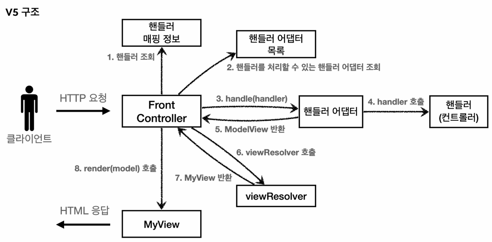
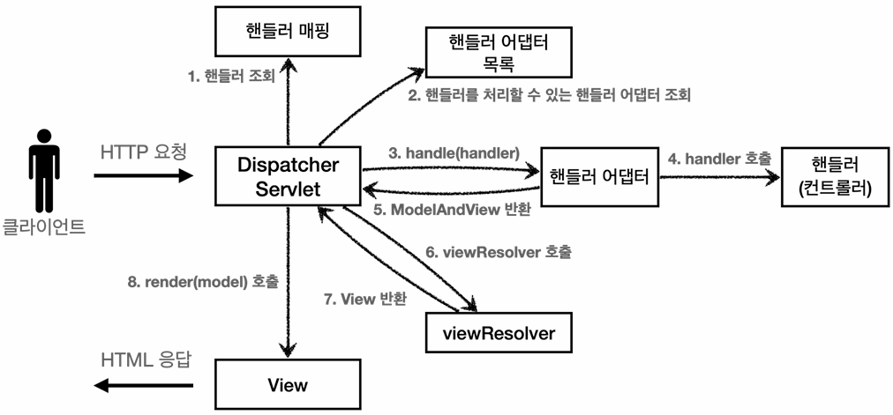

## 스프링 MVC 전체 구조
### 직접 만든 MVC 프레임워크와의 비교
> **앞서 점진적으로 개선하며 구축한 MVC 프레임워크(V5)와 스프링 MVC는 아키텍처 측면에서 사실상 완전히 동일한 구조**를 가진다.

#### 직접 만든 MVC 프레임워크


#### 스프링 MVC 프레임워크


#### 변경 사항
- `DispatcherServlet`을 통해 프론트 컨트롤러 패턴을 구현하였다.
- 그 밖에도 사실상 이름만 변경된 수준이라, 가볍게 살펴보고 넘어가자.
  - handlerMappingMap → `HandlerMapping`
  - MyHandlerAdapter → `HandlerAdapter`
  - viewResolver 메서드 → `ViewResolver` 인터페이스 (확장성 고려)
  - ModelView → `ModelAndView`
  - MyView → `View`

### DispatcherServlet 
- **스프링 MVC에서 프론트 컨트롤러 패턴을 구현한 서블릿으로, 내부적으로 `HttpServlet`을 상속받고 있다.** 
  - **상속 계층:** `DispatcherServlet` → `FrameworkServlet` → `HttpServletBean` → `HttpServlet`
- **스프링 부트 구동 시 `@ServletComponentScan`에 의해 서블릿 컨테이너에 등록**되며, **기본적으로 모든 경로(`urlPatterns = "/"`)에 대해 매핑되어 동작**한다.
  - 참고로 서블릿 매핑 규칙상, 경로는 구체적일수록 우선순위가 높다.
  - 즉, 더 구체적인 `urlPattern`을 가진 서블릿이 별도로 존재한다면, 해당 요청은 `DispatcherServlet` 대신 해당 서블릿이 가로채 처리하게 된다.

### 스프링 MVC에서의 요청 처리 프로세스
1. 클라이언트의 HTTP 요청이 들어오면 `HttpServlet`이 제공하는 `service()`가 호출된다.
2. 스프링 MVC는 `HttpServlet`의 자식 클래스인 `FrameworkServlet`에서 오버라이딩한 `service()`를 호출한다.
3. 이때 내부적으로 `doService()`가 실행되는데, 실제로 호출되는 메서드는 자식 클래스인 `DispatcherServlet`에서 오버라이딩한 `doService()`이다. 
4. 그 과정에서 호출되는 **`doDispatch()`의 동작 방식이 우리가 앞서 구축했던 MVC 프레임워크(V5)의 동작 방식과 사실상 동일**하다.

### doDispatch()의 동작 방식 (★)


1. **핸들러 조회:**
    - 클라이언트의 요청이 오면, 가장 먼저 핸들러 매핑(`HandlerMapping`)을 통해 요청 URL과 매핑되는 핸들러를 찾는다.
2. **핸들러 어댑터 조회:**
    - 핸들러를 찾은 다음에는, 해당 핸들러를 처리할 수 있는(`supports`) 핸들러 어댑터를 찾는다.
3. **핸들러 실행 및 결과 반환:**
    - 핸들러 어댑터까지 찾았다면, 해당 어댑터를 통해 핸들러를 실행(`handle`)하고, 결과 값을 어댑팅(`ModelAndView` 객체로 변환)하여 프론트 컨트롤러에 반환한다.
4. **뷰 렌더링 (JSP의 경우):**
    - 프론트 컨트롤러가 뷰의 논리적 이름을 `ViewResolver`에 전달하면, `ViewResolver`는 물리적 위치 정보가 담긴 `View` 객체를 반환한다.
    - 이후, 해당 `View` 객체를 통해 뷰 템플릿 파일로 이동(포워딩)하여, 화면을 렌더링한다. (서블릿 응답 객체의 메시지 바디를 채운다.)
5. **후처리 및 응답 메시지 반환:**
    - 뷰 템플릿 파일에서 렌더링을 마치면, 프론트 컨트롤러가 제어권을 다시 회수하고, 남은 후처리 로직(인터셉터의 `postHandle`, `afterCompletion` 등)을 수행한다.
    - 최종적으로 WAS가 서블릿 응답 객체를 참조해 HTTP 응답 메시지를 생성한 후, 클라이언트에게 반환한다.

#### 간략화된 코드
```java
protected void doDispatch(HttpServletRequest request, HttpServletResponse response) throws Exception {
    
    HttpServletRequest processedRequest = request;
    HandlerExecutionChain mappedHandler = null;
    ModelAndView mv = null;

    // 1. 요청 URL과 매핑되는 핸들러 조회
    mappedHandler = getHandler(processedRequest);
    if (mappedHandler == null) {
        noHandlerFound(processedRequest, response);
        return;
    }

    // 2. 해당 핸들러를 처리할 수 있는 핸들러 어댑터 조회
    HandlerAdapter ha = getHandlerAdapter(mappedHandler.getHandler());

    // 3. 핸들러 어댑터를 통해 핸들러를 실행하고, ModelAndView 객체를 반환받음
    mv = ha.handle(processedRequest, response, mappedHandler.getHandler());
    
    processDispatchResult(processedRequest, response, mappedHandler, mv, dispatchException);
}


private void processDispatchResult(HttpServletRequest request, HttpServletResponse response, 
                                   HandlerExecutionChain mappedHandler, ModelAndView mv, Exception exception) throws Exception {
    // 4. 뷰 템플릿 파일 렌더링
    render(mv, request, response);
}

protected void render(ModelAndView mv, HttpServletRequest request, HttpServletResponse response) throws Exception {
    
    View view;
    String viewName = mv.getViewName();
    
    // 뷰 리졸버를 통해서 렌더링 역할을 담당하는 뷰 객체를 반환받음
    view = resolveViewName(viewName, mv.getModelInternal(), locale, request);
    
    // 해당 뷰 객체를 통해 뷰 템플릿 파일을 렌더링
    view.render(mv.getModelInternal(), request, response);
}
```
- 핸들러 어댑터로 핸들러를 실행하는 부분을 보면 알겠지만, **기본적으로 `DispatcherServlet`은 어댑터에게 `ModelAndView` 타입을 요구**한다.
- **실제로는 위 과정 전후로 공통 로직을 처리하는 인터셉터(`applyPreHandle`, `applyPostHandle` 등)나 예외처리 등의 로직이 함께 동작**한다.

### 스프링 MVC의 확장성
- **스프링 MVC는 대부분의 기능을 인터페이스로 제공하고, 스프링 컨테이너를 통해 (구성 영역으로부터) 의존관계를 주입할 수 있으므로, 단순히 구현체를 갈아끼우는 것만으로도 얼마든지 기능을 확장할 수 있다.**
  - 즉, `DispatcherServlet`의 메인 코드를 수정할 필요가 없다.
- 하지만 스프링 MVC 자체로도 이미 완성도가 매우 높기 때문에, 제공하는 기능을 직접 확장할 일(`MyHandlerMapping`, `MyViewResolver`, ...)은 사실상 없다.
- 그럼에도 우리는 문제 해결 역량을 향상시키고자, 수 시간에 걸쳐 핵심 동작 원리를 이해하는 과정을 거친 것이다.

---

## 핸들러 매핑과 핸들러 어댑터
### 강의 목표
- 어노테이션 기반의 컨트롤러(`@Controller`)가 등장하기 전에 사용되던 **과거의 방식(`Controller`, `HttpRequestHandler` 인터페이스)을 통해 스프링 MVC의 매핑과 어댑터 동작 원리를 이해**한다.
```java
import org.springframework.web.servlet.mvc.Controller;
import org.springframework.web.HttpRequestHandler;

public interface Controller {
    ModelAndView handleRequest(HttpServletRequest request, HttpServletResponse response) throws Exception;
}

public interface HttpRequestHandler {
    void handleRequest(HttpServletRequest request, HttpServletResponse response) throws ServletException, IOException;
}
```

### 스프링 부트의 자동 등록
- 스프링 부트는 **구동 시점에 웹앱 개발에 필요한 대부분의 `HandlerMapping`과 `HandlerAdapter` 구현체들을 자동으로 스프링 빈으로 등록**해 둔다.
- 즉, 개발자가 해당 인터페이스를 직접 구현할 일은 사실상 없기 때문에 **구현체들의 우선순위와 핵심 동작 원리를 이해하는 것이 중요**하다.

### 주요 HandlerMapping (우선순위 순)
> **클라이언트의 요청 URL과 매핑되는 핸들러를 찾아주는 역할을 한다.**

#### 1. RequestMappingHandlerMapping
- **스프링 컨테이너(`ApplicationContext`)에 등록된 `@Controller` 빈들을 탐색**하여, **`@RequestMapping`이 붙은 메서드들의 메타 정보를 추출**한다.
- **해당 정보를 `(매핑 URL, HandlerMethod)`의 Key-Value 형태로 매핑 테이블에 미리 등록**해 둔다.
- 클라이언트의 요청이 들어오면, **요청 URL과 매핑되는 `HandlerMethod`를 찾아 프론트 컨트롤러에 반환**한다.

#### 2. BeanNameUrlHandlerMapping
- 스프링 컨테이너에 등록된 모든 빈 중에서, **이름이 요청 URL과 정확히 일치하는 빈**을 찾아 핸들러로 반환한다.
- 예) `/springmvc/old-controller`라는 이름으로 등록된 빈(`@Component("/springmvc/old-controller")`)을 찾을 때 사용

### 주요 HandlerAdapter (우선순위 순)
> **`HandlerMapping`을 통해 찾아낸 핸들러를 처리(대신 실행)해주는 역할을 한다.**

#### 1. RequestMappingHandlerAdapter
- 어노테이션 기반의 핸들러(`HandlerMethod`)를 지원(`supports`)하는 어댑터이다.

#### 2. HttpRequestHandlerAdapter
```java
@Override
public boolean supports(Object handler) {
    return (handler instanceof HttpRequestHandler);
}

@Override
public ModelAndView handle(HttpServletRequest request, HttpServletResponse response, Object handler) throws Exception {

    ((HttpRequestHandler) handler).handleRequest(request, response);
    return null;
}
```
- 서블릿과 가장 유사한 형태의 핸들러인 `HttpRequestHandler`를 지원하는 어댑터이다.

#### 3. SimpleControllerHandlerAdapter
- `Controller` 인터페이스를 구현한 핸들러를 지원하는 어댑터이다.

### 매핑과 어댑팅 예시
#### Controller 인터페이스 방식
> **`@Component("/springmvc/old-controller")`로 등록된 `OldController`를 호출하는 경우**

1. **핸들러 매핑 조회:**
   - `RequestMappingHandlerMapping` 실행 → 매핑 정보 없음
   - `BeanNameUrlHandlerMapping` 실행 → 빈 이름이 `/springmvc/old-controller`인 핸들러를 반환  
2. **핸들러 어댑터 조회:**
   - `RequestMappingHandlerAdapter`의 `supports()` → `false` (지원하지 않음)
   - `HttpRequestHandlerAdapter`의 `supports()` → `false`
   - `SimpleControllerHandlerAdapter`의 `supports()` → `true` (`OldController`가 `Controller`를 구현한 핸들러이기 때문)
3. **실행:**
   - 해당 어댑터를 통해 핸들러를 실행(`handle`)하고, 결과 값을 어댑팅(`ModelAndView` 객체로 변환)하여 프론트 컨트롤러에 반환

---

## 뷰 리졸버
### 스프링 부트의 자동 등록
- 스프링 부트는 원활한 웹앱 개발을 위해 `HandlerMapping`, `HandlerAdapter` 뿐만 아니라 `ViewResolver` 구현체들도 스프링 빈으로 등록해 둔다.

### 뷰 객체의 역할
- 앞서 MVC 패턴을 학습하면서 렌더링이란 **모델 데이터를 활용하여 웹 페이지의 형태(HTML, XML, JSP 등)로 화면을 그려내는 것**이라고 정리했다.
  - 물론 모델 데이터를 활용하지 않는 정적 페이지를 응답할 수도 있지만, 일반적인 사례를 생각하자.  
- 하지만 MVC 프레임워크에서 렌더링이란 **모델 데이터를 활용하여 서블릿 응답 객체를 완성해 나가는 일련의 과정**을 의미한다.
  - 즉, 클라이언트에게 전송할 응답 메시지를 만들기 위해 필요한 **응답 객체를 만드는 과정으로, 웹 페이지뿐만 아니라 다양한 형태의 응답을 제공할 수 있다.**
  - 예) 엑셀 파일 다운로드 등 (필요한 시점에 추가적으로 학습하기)
- **뷰 객체를 통해 웹 페이지 이외에도 여러 형태의 응답을 생성할 수 있다**는 사실을 이해하고 있어야, 뷰 리졸버 학습에 지장이 없기 때문에 이와 같이 정리해 보았다.

### 주요 ViewResolver (우선순위 순)
#### 1. BeanNameViewResolver
- 스프링 컨테이너에 등록된 모든 빈 중에서, **뷰의 논리적 이름과 똑같은 이름을 가진 빈**을 찾아 뷰 객체로 반환한다.
- **커스텀 뷰:**
  - `BeanNameViewResolver`가 반환하는 빈 객체를 커스텀 뷰라고 한다.
  - **템플릿 엔진 뷰(`ThymeleafView`, `InternalResourceView`)와 달리 별도의 템플릿 파일을 보유하고 있지 않으며, 자바 코드로 직접 렌더링을 수행한다.**

#### 2. 외부 템플릿 엔진의 ViewResolver (ThymeleafViewResolver 등)
- 타임리프 등 **외부 템플릿 엔진 라이브러리를 추가했을 때 자동으로 등록되는 전용 뷰 리졸버**이다.
- 뷰의 논리적 이름을 해당 템플릿 엔진의 기본 경로(예: `classpath:/templates/`)와 확장자(`.html`)로 조합한다.
- 이후, **해당 템플릿 엔진의 문법을 해석하고 화면을 렌더링할 수 있는 전용 뷰 객체**(`ThymeleafView` 등)를 반환한다.

#### 3. InternalResourceViewResolver
- **내부 리소스로 포워딩해야 할 때 사용하는 뷰 리졸버로, 보통 JSP 파일이 그 대상**이다.
- 뷰의 논리적 이름을 `prefix`(예: `/WEB-INF/views/`)와 `suffix`(`.jsp`)로 조합하여, 실제 JSP 파일이 있는 물리적 경로를 완성한다.
- 이후, 해당 물리적 경로로 포워딩할 수 있는 뷰 객체인 `InternalResourceView`를 반환한다. (JSTL 라이브러리가 있다면 `JstlView`를 반환)
- 참고로, **이 리졸버가 가장 우선순위가 낮은 이유는 해당 경로에 실제로 파일이 존재하는지 확인하지 않고 무조건 뷰 객체를 반환하기 때문**이다.

### 요청 처리 프로세스
1. 프론트 컨트롤러(`DispatcherServlet`)가 핸들러 어댑터를 통해 핸들러를 실행하여, 뷰의 논리적 이름(예: `new-form`)을 획득한다.
2. 등록된 `ViewResolver`들을 우선순위대로 순회하며 호출한다.
   - 먼저, `BeanNameViewResolver`에게 해당 이름의 빈이 있는지 묻는다. (없으면 다음으로 패스)
   - 없으면, 다음 우선순위에 해당하는 뷰 리졸버(`ThymeleafViewResolver` 등)를 조회한다. 
3. 선택된 `ViewResolver`는 렌더링에 필요한 정보를 담아 `View` 객체를 생성하고 반환한다.
4. 프론트 컨트롤러는 해당 `View` 객체를 통해 렌더링을 수행한다.

### 템플릿 엔진별 렌더링 차이
#### JSP (InternalResourceView)
- **서블릿 컨테이너(WAS)가 직접 템플릿 파일(JSP 파일)을 읽어 렌더링하는 구조**이다.
- 즉, **`View` 객체 대신 WAS가 해당 템플릿 파일을 읽고 렌더링할 수 있도록, 내부적으로 `dispatcher.forward()`가 호출**된다.

#### 기타 템플릿 엔진 (ThymeleafView 등)
- JSP와 달리, **템플릿 엔진 라이브러리가 `View` 객체 내부에서 템플릿 파일을 직접 읽고 렌더링하는 구조**이다.

---

## 스프링 MVC - 어노테이션 기반 컨트롤러
### 개요
- **스프링 MVC에서는 어노테이션 기반(`@Controller`, `@RequestMapping`)의 컨트롤러 방식을 채택**하고 있다.
- 앞서 MVC 프레임워크를 점진적으로 개선해 나갔던 것처럼, 이번 실습에서는 스프링 MVC의 어노테이션 컨트롤러를 점진적으로 개선해볼 것이다.

### @Controller의 역할
#### 1. 스프링 빈 등록
- **`@Controller` 어노테이션 내부에 `@Component`가 포함되어 있으므로, 컴포넌트 스캔 대상이 되어 자동으로 스프링 컨테이너에 빈으로 등록**된다.

#### 2. 핸들러 매핑의 타겟 지정
- **스프링 MVC의 `RequestMappingHandlerMapping`은 스프링 빈 중에서 `@Controller`나 `@RequestMapping`이 클래스 레벨에 붙어 있는 빈을 찾는다.**
- **이후 해당 빈 내부에서 `@RequestMapping`이 붙은 메서드들의 메타 정보(`HandlerMethod`)를 추출하여 매핑 테이블에 등록**해 둔다.

### 점진적 개선 과정 (V1 → V3)
#### V1. 어노테이션 기반의 컨트롤러 도입
- 어노테이션 기반으로 컨트롤러를 전환한 초기 버전이다.
- **한계점:**
  - 과거 `Controller` 인터페이스 시절처럼 **하나의 컨트롤러 클래스에서 하나의 URL 요청만 처리하는 구조여서 비효율적**이다.
  - 파라미터를 꺼내기 위해 여전히 **서블릿에 종속적**인 코드(`HttpServletRequest`, `HttpServletResponse`)를 사용한다.
  - **항상 `ModelAndView` 객체를 반환**해야 해서 번거롭다.

#### V2. 컨트롤러 통합
- `@RequestMapping`이 메서드 레벨에 적용된다는 점에 착안하여, **관련 메서드(회원 등록, 조회, 수정 등)들을 하나의 컨트롤러 클래스에서 관리하는 방식**이다.
- **클래스 레벨의 URL 접두사(Prefix) 적용:**
  - 단순히 관련 메서드들을 하나의 컨트롤러 클래스에 집어넣기만 하면, 매핑 URL에서 불필요한 중복이 발생한다.
  - 이에, 매핑 URL에서 중복되는 상위 경로(예: `/springmvc/v2/members`)를 클래스 레벨의 `@RequestMapping`으로 끌어올려 중복을 제거할 수 있다.
- **한계점:**
  - **여전히 서블릿 종속적이며, `ModelAndView` 반환의 번거로움**이 남아 있다.

#### V3. 실용적인 방식 (서블릿 종속성 제거, 뷰의 논리적 이름 반환, HTTP 메서드 방식 분리)
- **서블릿 종속성 제거 (`@RequestParam`):**
  - 무겁고 종속적인 `HttpServletRequest` 대신 `@RequestParam` 어노테이션을 사용하여, 요청 파라미터(GET 쿼리 파라미터, POST Form 데이터)를 메서드의 매개변수로 직접 받을 수 있다.
- **뷰의 논리적 이름 반환:**
  - MVC 프레임워크의 점진적 개선 중 거쳤던 과정(`V4`)이다.
  - `ModelAndView` 객체 대신 뷰의 논리적 이름(`String`)을 반환한다.
  - 이때 모델을 어떻게 처리할 것인지 고민해야 하는데, **MVC 프레임워크에서 깡통 모델(`HashMap<String, Object> model`)을 주입했던 것과 달리 스프링 MVC에서는 주어지는 `Model` 인터페이스(`springframework.ui.Model`)를 사용**하기만 하면 된다.
- **HTTP 메서드 방식 분리:**
  - 단순히 URL 경로만으로 매핑하는 것을 넘어, **해당 요청이 목적에 맞는 HTTP 메서드(GET, POST 등)로 들어왔는지 명확하게 제약을 걸어주는 것이 좋은 API 설계**이다.
  - 좋은 API 설계를 위해 `@RequestMapping`에서는 `method` 옵션을 제공하지만, 보다 축약된 버전인 **`@GetMapping`, `@PostMapping` 등이 일반적으로 사용**된다.
  - **단순 조회는 GET, 데이터 변경은 POST로 하는 등 코드 레벨에서 HTTP 메서드를 명시하여, 의도치 않은 부작용(Side Effect)을 사전에 방지**할 수 있다.

#### 최종적인 코드
```java
import org.springframework.ui.Model;

@Controller
@RequestMapping("/springmvc/v3/members")
public class SpringMemberControllerV3 {

    private final MemberRepository memberRepository = MemberRepository.getInstance();

//    @RequestMapping(value = "/new-form", method = RequestMethod.GET)
    @GetMapping("/new-form")
    public String newForm() {
        return "new-form";  // 뷰의 논리적 이름만 반환 (뷰 리졸버가 prefix, suffix 조립해서 실제 물리적 경로가 담긴 View 객체 생성)
    }
    
    @PostMapping("/save")
    public String save(
            @RequestParam("username") String username,
            @RequestParam("age") int age,
            Model model) {

        Member member = new Member(username, age);
        memberRepository.save(member);

        model.addAttribute("member", member);
        return "save-result";
    }
    
    @GetMapping
    public String members(Model model) {
        List<Member> members = memberRepository.findAll();

        model.addAttribute("members", members);
        return "members";
    }
}
```