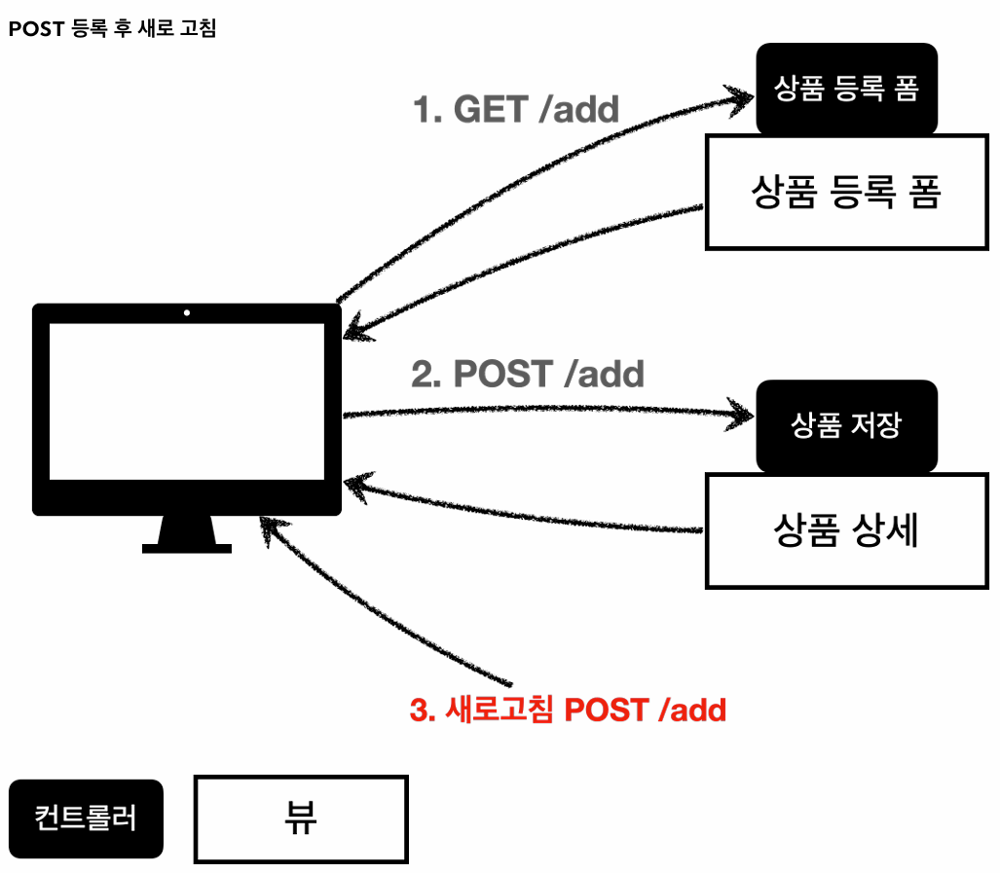
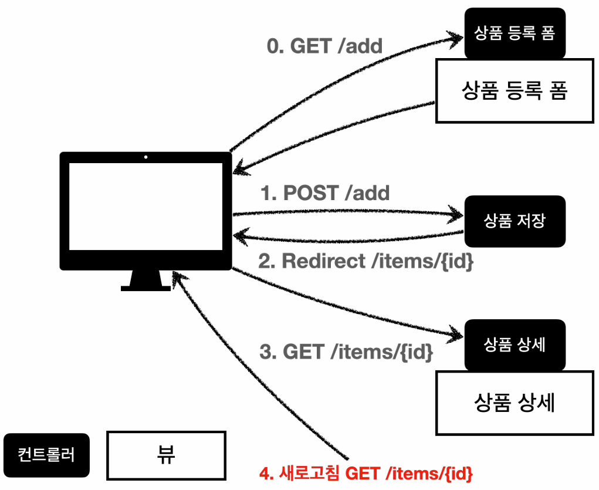

## 프로젝트 생성
### 초기 환경 설정
#### 의존성 추가 
- **`Thymeleaf`:** 서버 사이드에서 렌더링하기 위함
- **`Spring Web`, `Lombok`:** 스프링 MVC를 활용하여 웹 앱을 개발하기 위함

#### 네이밍 규칙
- 아티팩트명이나 패키지명에는 하이픈(`-`)을 사용할 수 없다.

---

## 요구사항 분석
### 웹 개발자의 역할 분담
- **웹 개발자는 크게 클라이언트를 전담하는 프론트엔드, 서버를 전담하는 백엔드 개발자로 나뉜다.**
- 프론트엔드 개발자가 화면 렌더링과 퍼블리싱을 전담해주기 때문에, **프론트엔드 개발자의 유무에 따라 백엔드 개발자의 역할이 달라지게 된다.**

### 프론트엔드 개발자가 있는 경우
- 대부분 **HTTP API를 이용하여 클라이언트가 필요로 하는 데이터를 전달하는 것에 집중**한다.
- 프론트엔드 개발자는 React나 Vue.js와 같은 클라이언트 기술을 활용하여, 동적으로 화면을 내려주게 된다.

### 프론트엔드 개발자가 없는 경우
- 프론트엔드 개발자가 없다는 것은, 곧 **서버 사이드에서 렌더링해야 하는 상황**임을 의미한다.
- 이러한 상황에서 백엔드 개발자는 **Thymeleaf와 같은 뷰 템플릿 엔진을 활용하여, 동적으로 화면을 내려주게 된다.**

---

## 상품 도메인 개발
> **요구사항을 바탕으로 핵심 비즈니스 도메인 모델인 `Item` 객체를 설계하고, 데이터를 저장할 `Repository`를 구현한 뒤 이를 검증하는 섹션**이다.

### Entity와 DTO
#### 엔티티(Entity)
- **DB 테이블(스키마)과 직접적으로 매핑되는 핵심 객체**를 의미한다.
- **엔티티를 데이터 전송(HTTP 요청/응답)에 직접적으로 사용하는 것은 위험**하다.
    1. API 스펙이 DB 테이블에 강하게 종속된다.
    2. 불필요하거나 민감한 데이터가 외부에 노출될 위험이 있다.

#### DTO(Data Transfer Object)
- **따라서 데이터 전송 시에는 엔티티에서 필요한 필드만 추출하여 만든 DTO를 사용**해야 한다.
- **DAO (Data Access Object):**
  - 참고로 DAO는 DB 접근을 전담하는 객체로, 과거에 주로 사용하던 용어이다. 
  - 최근 스프링 MVC에서는 `Repository`가 DAO의 역할을 수행하고 있다.

#### @Data
- **클래스 레벨에 선언하는 어노테이션으로, 다음의 어노테이션들을 자동으로 적용**해 준다.
  - **`@Getter`, `@Setter`, `@ToString`, `@EqualsAndHashCode`, `@RequiredArgsConstructor`**
- **`@Setter`로 인해 객체의 상태가 무분별하게 변경되는 것을 방지하기 위해, 엔티티에서는 `@Data` 사용을 지양**해야 한다.
- DTO는 데이터 전송 목적이기 때문에 상대적으로 괜찮지만, 그럼에도 **DTO에서 역시 `@Data` 대신 별도로 `@Getter`와 생성자를 사용하는 것이 권장**된다.

### 메모리 기반의 레포지토리를 static으로 구현하는 이유
- 본 실습에서는 상품 데이터를 저장하기 위해 간단하게 메모리 기반의 레포지토리를 채택했다. (`static Map<Long, Item> store`)
- 이때 **`static`을 붙인 이유는 순수 단위 테스트 등에서의 정합성도 보장하기 위함**이다. (**방어적 구현**)
  - 스프링 구동 환경에서는 사실 컨테이너가 싱글톤을 보장해주기 때문에 `static` 여부가 별 상관이 없지만 말이다.
  
### 단위 테스트 관련
#### 컬렉션 검증
```java
@Test
void findAll() {
    // given
    Item item1 = new Item("item1", 10000, 10);
    Item item2 = new Item("item2", 20000, 20);

    itemRepository.save(item1);
    itemRepository.save(item2);

    // when
    List<Item> result = itemRepository.findAll();

    // then
    assertThat(result)
            .hasSize(2)
            .contains(item1, item2);
}
```
- 리스트 등 **컬렉션에서는 크기뿐만 아니라 특정 요소를 포함하고 있는지도 검증**해야 한다.

---

## 상품 서비스 HTML
> 본 실습에서는 **클라이언트 개발 편의성을 위해 부트스트랩을 사용**했다.

### 정적 리소스 경로에 두면 안 되는 파일
- **보안이 중요한 파일:**
  - 정적 리소스 경로(`/resources/static`)는 클라이언트가 직접 접근할 수 있는 공간이다.
  - 따라서 보안이 중요한 파일은 해당 경로에 위치시켜선 안 된다.
- **동적 렌더링이 필요한 파일:**
  - 또한 정적 리소스 경로에 위치한 파일은 스프링 MVC 컨트롤러나 템플릿 엔진을 거치지 않는다.
  - 따라서 동적 렌더링이 필요한 파일 역시 해당 경로에 위치시켜선 안 된다. 

---

## 상품 목록 - 타임리프
### @RequiredArgsConstructor와 @Autowired
```java
@Controller
@RequiredArgsConstructor
public class BasicItemController {

    private final ItemRepository itemRepository;

//    @Autowired  // 생성자가 하나만 있으면 생략 가능
//    public BasicItemController(ItemRepository itemRepository) {
//        this.itemRepository = itemRepository;
//    }
    
    // ...
```
#### @RequiredArgsConstructor
- `final` 필드만을 사용해서 생성자를 자동으로 만들어 준다.

#### @Autowired
- **클래스에 생성자가 딱 하나만 존재하는 경우, 스프링은 해당 생성자에 자동으로 `@Autowired`를 추가**해 준다.
- 따라서 **하나의 생성자만 사용하는 경우에는 `@Autowired`를 생략할 수 있지만, 명시성을 위해 등록**해두는 것도 좋다.

### 테스트용 데이터 추가
#### 개요
```java
@PostConstruct  // 초기화 콜백: 스프링 빈 생성 및 DI 이후 동작
public void init() {
    itemRepository.save(new Item("감자칩", 1500, 10));
    itemRepository.save(new Item("요맘때", 600, 20));
}
```
- 상품 목록을 화면에 렌더링하기 위해, 애플리케이션 실행 시점에 테스트용 상품 데이터를 미리 레포지토리에 등록해두어야 한다.
- 본 실습에서 테스트용 데이터를 추가하기 위해 사용한 `@PostConstruct`를 이해하기 위해서는, 스프링 빈의 생명주기를 기억하고 있어야 한다.

#### 스프링 빈의 생명주기
1. **스프링 컨테이너 생성**
2. **스프링 빈 생성** (정확히는 `BeanDefinition`이 먼저 등록되고, 이를 바탕으로 스프링 빈 생성)
3. DI (**생성된 스프링 빈에 적절한 구현체 주입**)
4. 초기화 콜백 (**본격적으로 애플리케이션에서 빈을 사용하기에 앞서, 필요한 초기화 작업을 수행**해주는 단계)
5. **사용** (실제 애플리케이션 동작)
6. 소멸 전 콜백 (**안전한 종료 작업** 수행)
7. **스프링 종료**

#### @PostConstruct
- **해당 어노테이션이 등록된 메서드는 초기화 단계(DI 종료 직후)에 자동으로 실행**된다. 
  - **즉, 해당 어노테이션이 등록된 메서드가 초기화 콜백으로 동작**한다.
- **이미 DI가 완료된 시점이기 때문에, 초기화 콜백 메서드 내부에서는 레포지토리를 호출하여 테스트 데이터를 세팅할 수 있다.**
- 참고로 **외부 라이브러리에 있는 메서드를 초기화 콜백으로 지정하기 위해서는 `@PostConstruct` 대신 `@Bean(initMethod = {해당 메서드명})`을 사용**해야 한다.

### 스프링 부트의 요청 처리 우선순위
#### 1. 핸들러 매핑
- 서버는 가장 먼저 요청을 처리할 수 있는(매핑 URL, HTTP 메서드, 기타 조건 등이 모두 일치하는) 핸들러를 찾는다.

#### 2. 정적 리소스 탐색
- 핸들러가 없다면, 정적 리소스 경로에 해당 파일이 있는지 탐색한다.

### 타임리프 (Thymeleaf)
#### 내츄럴 템플릿 (Natural Template)
- **다른 템플릿 파일(예: `.jsp`)과 달리, 타임리프 문서는 서버를 거치지 않더라도 정상적으로 렌더링**되는 것을 확인할 수 있다.
- 실제로 **타임리프 문서는 서버를 거치지 않으면 순수 HTML, 서버에서 템플릿 엔진을 거치면 템플릿 파일로 렌더링**된다.  
- 이러한 특징을 **내츄럴 템플릿**이라고 하는데, **그 덕분에(다른 템플릿 엔진과 달리 서버를 거치지 않아도 깨지지 않기 때문에) 프론트엔드와의 협업에서 자주 사용**된다.

#### 사용 선언 (네임스페이스 선언)
- 타임리프 문법을 사용하려면 HTML 태그를 다음과 같이 수정해야 한다.
  - **`<html xmlns:th="http://www.thymeleaf.org">`**

#### 기본 동작 방식
- **타임리프는 기본적으로 기존 HTML 속성을 `th:속성명="속성값"`으로 대체(덮어쓰기)하는 방식으로 동작**한다.
- **타임리프(템플릿) 엔진을 거치는 경우:** 
  - `th:` 속성이 기존 속성을 지우고 새롭게 적용된다.
- **타임리프 엔진을 거치지 않고 순수 HTML 파일을 브라우저로 여는 경우**
  - 브라우저는 `th:` 속성을 (해석할 수 없기 때문에) 무시하고, 기존 HTML 속성을 그대로 사용한다.

#### URL 링크 표현식 (`@{...}`)
```html
<link href="../css/bootstrap.min.css"
      th:href="@{/css/bootstrap.min.css}"
      rel="stylesheet">

<!-- 페이지 소스 보기: <link href="/css/bootstrap.min.css" rel="stylesheet"> -->
```
- **타임리프 문서에서 링크를 생성할 때는 URL 링크 표현식(`@{...}`)을 사용**해야 한다.
  - 예) `th:href="@{/css/bootstrap.min.css}"`
- **`<link>`:**
  - **브라우저에서 렌더링하는 도중, `link` 태그를 발견하면 해당 파일(`href`)을 가져오기 위해 서버로 다시 HTTP GET 요청**을 보낸다.
  - 기존 `href` 속성은 상대 경로(`../css/bootstrap.min.css`)이기 때문에, 현재(가장 최근에 보낸) URL에 영향을 받게 된다.
  - 반면 타임리프의 URL 링크 표현식(`@{...}`)은 서블릿 컨텍스트(서버 루트, `localhost:8080`) 기반의 절대 경로로 기존 `href` 속성을 대체하기 때문에, 항상 동일한 결과를 제공받을 수 있다. (현재 URL과 무관)
  - 실제로 위 코드를 보면, 해당 태그의 요청 URL이 `localhost:8080/css/bootstrap.min.css`임을 확인할 수 있다. 
- **URL 링크 표현식은 `()`를 통해 경로 변수(PathVariable) 및 쿼리 파라미터를 지원**한다.
  - **경로 변수:** `@{/basic/items/{itemId}(itemId=${item.id})}` → `/basic/items/1`
  - **쿼리 파라미터:** `@{/basic/items(query='test')}` → `/basic/items?query=test`

#### 변수 표현식 (`${...}`)
- **모델에 담겨 전달된 데이터나 타임리프 내부에 선언된 변수 값을 조회할 때 사용**한다.
- 내부적으로 **프로퍼티 접근법**을 사용한다.

#### 타임리프 변수
```html
<tr th:each="item : ${items}">
    <td th:text="${item.itemName}"></td>
</tr>
```
- 이름에서 알 수 있듯, **타임리프 내부에(`th:` 속성의 값으로) 선언된 변수**를 의미한다.
- 위 코드에서 타임리프 변수는 `item`으로 다음과 같은 특징을 가지고 있다.
  - **선언된 태그(`<tr>`) 내부에서만 생존**한다.
  - **변수 표현식(`${item.itemName}`)을 통해 값을 꺼내올 수 있다.** 

#### 프로퍼티 접근법
- **예시:**
  - 타임리프 문서에서 `${item.price}`라고 작성했다고 하자.
  - 그러면 타임리프 엔진이 내부적으로 자바 리플렉션을 사용하여 해당 객체의 `Getter` 메서드를 찾는다.
  - 이후, `Getter` 메서드를 호출하여 반환받은 값으로 해당 표현식을 대체한다.
- **개념:**
  - 클래스의 `private` 필드에 직접 접근하는 것이 아니라, **리플렉션을 통해 객체의 `Getter`나 `Setter` 메서드를 찾아 실행하여 데이터에 접근하는 방식**을 프로퍼티 접근법이라고 한다.
 
#### 내용 변경 (`th:text`)
```html
<!-- 10000이 ${item.price}로 대체 -->
<td th:text="${item.price}">10000</td>
```
- **해당 HTML 태그의 내부 텍스트 콘텐츠 전체를 `th:text` 속성의 값으로 대체**한다.

#### 리터럴 대체 (`|...|`)
- **타임리프에서 리터럴 대체를 활용하지 않는 경우, `+` 기호를 사용해야 하기 때문에 문자열과 표현식의 결합이 불편**하다.
  - 예) `'문자열' + ${변수}`
- **반면 리터럴 대체를 활용하는 경우, `|문자열 ${변수}|` 형태로 문자열과 표현식을 쉽게 결합**할 수 있다.
- **예시:**
  - `location.href='/basic/items/add'`라는 결과를 만들어야 한다고 하자.
  - 리터럴 대체 활용 X: `'location.href='` + `'\''` + `@{/basic/items/add}` + `'\''`
  - 리터럴 대체 활용 O: `|location.href='@{/basic/items/add}'|`

#### 반복문 (`th:each`)
```html
<tr th:each="item : ${items}">
    <td th:text="${item.itemName}"></td>
</tr>
```
- 모델에서 전달받은 컬렉션 데이터(`items`)의 크기만큼, 해당 태그(`<tr>`)와 그 내부 하위 태그들을 반복해서 생성한다.
- 반복문 내부에서는 선언한 지역 변수(타임리프 변수, `item`)를 사용할 수 있다.

#### 경로 템플릿과 리터럴 대체
```html
<td><a href="item.html" th:href="@{/basic/items/{itemId}(itemId=${item.id})}" th:text="${item.id}">회원id</a></td>
<td><a href="item.html" th:href="@{|/basic/items/${item.id}|}" th:text="${item.itemName}">상품명</a></td>
```
- **경로 템플릿:**
  - 첫 번째 `<td>`처럼 경로 변수(PathVariable)를 활용하는 방식이다.
  - **직관적이고 실수할 여지도 적어서 권장되는 방식**이다.
- **리터럴 대체:**
  - 두 번째 `<td>`처럼 리터럴 대체(`|...|`)를 활용하는 방식이다.
  - 간단하지만, 리터럴 대체 위치를 잘못 지정하는 등 실수할 여지가 존재한다.

#### 렌더링이 갖는 두 가지 의미
> **브라우저는 항상 수행하는 렌더링은 '화면 출력'이라는 의미의 렌더링이지, SSR이나 CSR이 아니다.**

1. **HTML 문서 조립 (서버/프레임워크 관점):**
   - **템플릿(HTML 뼈대)에 모델 데이터를 결합하여 최종적인(동적) HTML 코드를 만들어내는 과정**이다.
   - **SSR:** 이 과정을 거쳐, 서버에서 완성된 HTML을 넘겨주는 경우
   - **CSR:** 이 과정을 거치지 않고, 서버로부터 빈 껍데기만 받은 뒤 브라우저에서 JS를 통해 스스로 HTML을 조립하는 경우
2. **화면 출력 (브라우저 관점):**
   - **브라우저의 렌더링 엔진을 통해 전달받은 HTML을 단순히 그려내는(Paint) 과정**이다.
   - 브라우저는 렌더링 방식(SSR, CSR)에 관계없이 항상 화면을 출력한다.

---

## 상품 상세, 상품 등록 폼
### 상품 상세
- IDE에서 파일을 우클릭한 후 `Copy Path > Absolute Path` 순서대로 클릭하면, 정적 HTML 파일의 로컬 파일 시스템 경로를 알아낼 수 있다.
- **서버를 거치지 않고, 브라우저에서 단순히 정적 파일을 열어보고 싶은 경우**에는 이 방법을 이용하자.

### 상품 등록 폼
#### 권장되는 RESTful API 설계 방식
- 웹 애플리케이션을 설계할 때, **하나의 URL 경로를 유지하면서 HTTP 메서드를 다르게 하여 역할을 명확히 분리하는 것**은 좋은 RESTful 설계 방식이다.
- 본 실습에서는 다음과 같이 적용하였다.
  - **`GET /basic/items/add`:** 클라이언트에게 상품 등록 폼(화면)을 보여준다.
  - **`POST /basic/items/add`:** 클라이언트가 폼에 입력한 데이터를 서버로 전송하여 실제 '상품 등록 처리'를 수행한다.

---

## 상품 등록 처리 - @ModelAttribute
> **상품 등록 Form 데이터를 처리하는 방식을 점진적으로 개선해 보는 실습**이다.

### V1. @RequestParam 사용
```java
@PostMapping("/add")
public String addItemV1(@RequestParam String itemName,
                        @RequestParam int price,
                        @RequestParam int quantity,
                        Model model) {
    Item item = new Item(itemName, price, quantity);
    itemRepository.save(item);
    model.addAttribute("item", item);
    return "/basic/item";
}
```
- 폼에서 넘어온 파라미터를 `@RequestParam`으로 하나씩 전달받는 방식이다.
- 간단하지만 다음의 이유에서 번거롭다고 할 수 있다.
  1. 모든 파라미터를 매개변수로 등록해야 한다.
  2. 직접 `Item` 객체를 생성해야 한다.
  3. `Model`에 앞서 생성한 객체를 직접 담아줘야 한다.

### V2. @ModelAttribute 원형 도입
```java
@PostMapping("/add")
public String addItemV2(@ModelAttribute("item") Item item) {
    itemRepository.save(item);
    return "/basic/item";
}
```
- `@ModelAttribute`를 이용하는 방식으로, V1의 단점이 모두 개선되었다.

#### 1. 객체 생성 및 데이터 바인딩
- **클라이언트가 전송한 폼 데이터의 이름을 바탕으로 객체의 수정자 프로퍼티(`Setter`)를 찾아 자동으로 값을 주입**해 준다.
- **`Setter`가 없고 생성자를 통해서만 객체를 초기화 할 수 있다면?**
  - 생성자 바인딩(**생성자를 통해 파라미터 데이터를 바인딩하는 방식**)을 활용하면 된다.
  - 즉, **`Setter`가 없더라도 `@ModelAttribute`를 사용할 수 있으며, 불변성이 보장되는 덕분에 오히려 권장**되는 방식이다.

#### 2. Model 자동 등록
- `@ModelAttribute`을 통해 생성된 객체는 자동으로 `Model`에 담긴다.
- 이때 어노테이션에 지정했던 이름(`"item"`)을 키로 해서 담긴다.

### V3. @ModelAttribute 이름 생략
- `Model`에 등록할 이름을 생략할 수 있다.
  - 예) `@ModelAttribute Item item`
- 이름을 생략한 경우, 스프링은 **클래스명의 첫 글자를 소문자로 변환한 이름을 키로 사용**한다. 

### V4. @ModelAttribute 어노테이션 생략
- 어노테이션 자체를 생략할 수 있다.
  - 예) `Item item`
- 하지만 **해당 파라미터가 폼 데이터를 바인딩받고 있다는 사실이 직관적으로 드러나지 않으므로, 권장되지 않는다.**

#### 어노테이션 생략 규칙
- 스프링은 요청 파라미터 관련 어노테이션이 생략되었을 경우, 다음과 같은 규칙을 적용한다. 
  - **원시 타입, 래퍼 클래스:** `@RequestParam`으로 인식
  - **`ArgumentResolver`로 지정해둔 타입 (스프링 제공 객체 등):** 요청 파라미터를 바인딩하는 대신, 해당 객체 자체를 파라미터에 주입
  - **나머지 (사용자 정의 객체 등):** `@ModelAttribute`로 인식

---

## 상품 수정
### 상품 수정 폼과 처리
- 상품 등록과 마찬가지로, 하나의 URL 경로를 유지하면서 HTTP 메서드를 다르게 하여 역할을 분리하였다.
  - **`GET /basic/items/{itemId}/edit`:** 클라이언트에게 기존 데이터가 채워진 '상품 수정 폼'을 보여준다.
  - **`POST /basic/items/{itemId}/edit`:** 클라이언트가 폼에서 수정한 데이터를 서버로 전송하여, 실제 '상품 수정 처리'를 수행한다.

### 스프링 MVC에서의 리다이렉트
#### 리다이렉트 응답 (`redirect:`)
- 스프링 MVC에서는 핸들러의 문자열 반환값 맨 앞에 `redirect:` 접두사를 붙이면 자동으로(`302` 응답을 보내며) 리다이렉트를 수행한다.
- 참고로 서블릿에서는 `response.sendRedirect({리다이렉트 URL})`를 통해 리다이렉트 했었는데, 이와 동일한 역할이다.

#### 리다이렉트 URL 작성 관련 주의사항 (`RedirectAttributes` 등장 배경) 
> **리다이렉트 URL을 작성할 때 문자열 더하기 연산(`"redirect:/basic/items/"` + `itemId`)은 권장되지 않는다.**

1. **URL 경로 템플릿 자동 치환:**
   - `redirect:/basic/items/{itemId}`와 같이 **중괄호 템플릿(`{}`)을 사용하면, 스프링이 `@PathVariable`로 주입받은 값으로 치환**해 준다.
   - **참고로 `Model`에 담긴 데이터도 매칭되긴 하지만, 1차원적인 단순한 데이터만 가능**하다.
     - 즉, `redirect:/basic/items/{item.id}`와 같이 사용할 수는 없다.
     - 중괄호 템플릿(`{}`)을 이용한 문자열 치환에서는 `Map<String, Object>`이 사용되는데, 중괄호 템플릿에 기재한 값(`item.id`)을 그대로 키로 사용하기 때문이다.
2. **인코딩:**
   - **문자열 더하기 연산은 말그대로 문자열을 합칠 뿐, 인코딩과 같은 과정을 거치지 않기 때문**이다.
   - **URL 표준 규격상 한글, 공백, 특수문자 등은 URL 인코딩 과정을 거쳐야만 브라우저와 서버가 정상적으로 해석**할 수 있다.

---

## PRG(Post-Redirect-Get) 패턴
### 새로고침 문제 (중복 등록 문제)
#### 기존 '상품 등록 처리' 방식 (V1 to V4)


- 앞서 우리가 상품 등록 Form 데이터를 처리했던 방식(V1 to V4)을 생각해보자.
- 요청 파라미터를 조회하는 방식은 달랐지만, **네 방식 모두 공통적으로 '상품 상세 뷰'를 반환하고 있는 탓에 브라우저의 URL은 `POST /basic/items/add`인 채로 머물러 있다.**

#### 기존 방식의 문제 (PRG 패턴 등장 배경)
- HTTP 메서드의 속성(`03-04`) 섹션에서 배웠듯, **`POST` 메서드는 서버의 상태를 변경하는, 멱등하지 않은(Non-Idempotent) 요청**이다.
- 때문에 상품을 등록한 직후 화면(`URL`이 그대로 남은 상태)에서 **사용자가 새로고침을 하면, 마지막에 수행했던 `POST` 요청이 서버로 다시 전송되어 동일한 상품이 DB에 중복으로 등록되는 문제가 발생**한다.
  - **새로고침(F5):** 가장 최근에 서버로 전송했던 HTTP 요청을 그대로 다시 전송하는 기능 
- **새로고침 시 발생하는 상품 중복 등록 문제를 해결하기 위해 PRG 패턴이 등장**하게 되었다.

### PRG 패턴
> **POST 요청 처리 후 뷰를 렌더링하는 대신, 다른 URL로 리다이렉트(Redirect) 응답을 보내는 설계 패턴**이다.

#### 동작 흐름


1. 클라이언트가 **폼 데이터를 담아 `POST` 요청**을 보낸다.
2. 서버는 **데이터를 DB에 저장(등록 처리)한 후, 클라이언트에게 리다이렉트 응답**을 보낸다.
   - 스프링 MVC에서는 `redirect:`라는 접두사와 `Location` 헤더의 URL을 조합한 문자열을 반환하면 된다.
   - 예) `redirect:/basic/items/1`
3. **응답을 받은 브라우저는 `Location` 헤더의 URL로 새로운 `GET` 요청**을 보낸다.  
4. 서버는 해당 URL에 맞는 상품 상세 화면을 보여준다.

#### 도입 효과
- 클라이언트의 마지막 요청이 `POST`에서 안전하고 멱등한 `GET` 요청으로 변경되었다.
- 따라서 **사용자가 새로고침을 하더라도 단순히 상품 상세 화면을 다시 조회(`GET`)할 뿐, 서버의 상태(DB)는 변하지 않는다.**

---

## RedirectAttributes
### 요구사항 변화: '저장 완료' 메시지 추가
- PRG 패턴을 적용하여 새로고침(중복 등록) 문제는 해결되었지만, **클라이언트 입장에서는 리다이렉트된 상세 화면만 보고 정말 저장이 성공했는지 확신하기 어렵다.**
- 이를 해결하기 위해 **리다이렉트 시 특정 파라미터(예: `status=true`)를 함께 넘겨주고, 해당 파라미터가 존재할 경우 화면에 "저장되었습니다"라는 안내 메시지를 렌더링**할 것이다.
- 단순하게 생각해보면 **문자열 더하기 연산(`+`)을 통해 기존 리다이렉트 URL에 파라미터 정보를 조합하는 방법**을 떠올릴 수 있다.
  - **하지만 이 방법에 문제가 없을까?**
  - 아니, **문제 여부를 차치하고라도 더 간편한 방법이 없을까?**

### RedirectAttributes의 역할과 핵심 기능 
> **문자열 더하기 연산(+)을 통해 리다이렉트 URL을 조립하는 방법은 인코딩 문제가 발생할 수 있는데, 스프링은 이를 안전하게 처리해 주는 `RedirectAttributes` 객체를 제공**한다.

#### 1. URL 인코딩 지원
- 파라미터 값으로 한글이나 특수문자가 들어와도 안전하도록, **URL 인코딩을 자동으로 처리**해준다.

#### 2. 경로 변수 바인딩
- `redirect:/basic/items/{itemId}`와 같이 **URL 템플릿에 중괄호 변수가 있을 경우, `RedirectAttributes`에 담은 데이터의 Key 이름과 일치하면 해당 위치에 자동으로 값을 치환(바인딩)해 준다.**

#### 3. 쿼리 파라미터 자동 변환
- **`RedirectAttributes`에 담은 데이터 중 경로 변수에 사용되지 않은 나머지 속성들은 모두 쿼리 파라미터 형태(`?key=value`)로 붙어서 전송**된다.

### 예시
```java
@PostMapping("/add")
public String addItemV6(Item item, RedirectAttributes redirectAttributes) {
    itemRepository.save(item);

    // RedirectAttributes에 데이터 저장
    redirectAttributes.addAttribute("itemId", item.getId());
    redirectAttributes.addAttribute("status", true);
    
    // 리다이렉트 수행
    return "redirect:/basic/items/{itemId}";
}
```
- **결과 URL:** `localhost:8080/basic/items/3?status=true`
  - **`itemId`:** 경로 템플릿 `{itemId}`의 자리에 치환되어 소모되었다.
  - **`status`:** 경로 템플릿에 없으므로 쿼리 파라미터로 자동 변환되었다.

### 템플릿 파일에서의 쿼리 파라미터 접근
- **타임리프는 HTTP 요청에 포함된 쿼리 파라미터를 편리하게 조회할 수 있는 내장 객체인 `param`을 제공**한다.
- 가령 템플릿 파일에서 `${param.status}`라고 작성하면, 쿼리 파라미터의 값(`true`)을 읽어오게 된다.

#### 예시
```html
<!-- param.status 값이 존재할 때만 해당 태그를 렌더링한다 -->
<h2 th:if="${param.status}" th:text="'저장 완료'"></h2>
```
- 참고로 **타임리프 내부에서 문자열을 출력하는 방법**은 다음과 같다.
  - **작은 따옴표 (`'...'`):** `th:text="'문자열'"`
  - **리터럴 대체 (`|...|`):** `th:text="|문자열|"`
