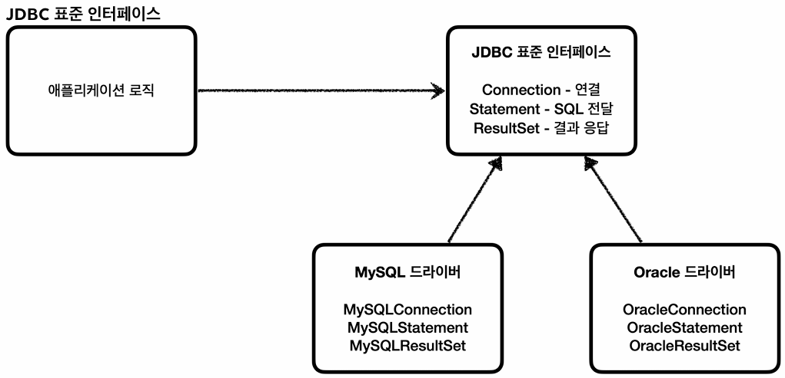

## H2 DB 설정
### H2 DB 개요
- H2는 **개발 및 테스트 용도로 주로 사용되는 가볍고 편리한 RDB**이다.
- **인메모리(In-memory) 모드와 디스크(파일) 모드를 모두 지원**한다.
  - **인메모리 모드:** 메모리(RAM)에 데이터를 저장하므로 속도는 빠르지만, 서버 재실행 시 데이터가 휘발된다.
  - **디스크 모드:** 실제 파일 형태로 디스크에 데이터를 저장하므로, 프로그램이 종료되어도 데이터가 보존된다.

### 개발 환경 구성
#### build.gradle에 H2 의존성 추가
- **스프링 애플리케이션 내부에서 H2 DB와 통신하기 위한 JDBC 드라이버(클라이언트 라이브러리)를 설치하는 과정**이다.
- 이 의존성에는 **H2 엔진이 포함되어 있어, 별도의 서버 설치 없이도 애플리케이션 내부에서 내장 서버(임베디드 모드)를 띄우고 조작**할 수 있다.
- 하지만 내장 서버를 구동할 경우, **웹 콘솔 등 다른 클라이언트에서는 접근할 수 없고 애플리케이션 내부에서만 접근(사용)할 수 있다.** (그래서 보통 내장 서버를 구동하지는 않는다.)

#### H2 DB 다운로드 (외부 서버 설치)
- **독립적으로 실행되는 H2 서버 프로세스**와 이를 시각적으로 조작하기 위한 **웹 콘솔 도구를 설치하는 과정**이다.
- 스프링 애플리케이션과 웹 콘솔 등 **여러 프로세스에서 접근하기 위해 외부 DB 서버를 사용**한다.
  - H2 의존성에서 제공하는 내장 서버로는 스프링 애플리케이션(단일 프로세스)에서만 접근할 수 있다.

### DB 접속 방식 및 URL 포맷
> **H2 DB 웹 콘솔 및 스프링 애플리케이션에서 사용하는 접속 URL 방식에 따라 동작 원리가 달라진다.**

#### 1. 임베디드 모드 (`jdbc:h2:~/test`)
- **현재 프로세스가 직접 DB 파일을 다루는 방식**이다. (OS의 파일 시스템 경로에 접근)
- 해당 URL로 최초 접속 시 사용자 홈 디렉토리(예: `C:\Users\{User명}`)에 물리적 DB 파일(`test.mv.db`)을 생성한다.
- **동시성 문제와 데이터 손상을 방지하기 위해 현재 프로세스가 파일에 락을 걸기 때문에, 다른 프로세스에서는 접근할 수 없다.**

#### 2. 서버 모드 (`jdbc:h2:tcp://localhost/~/test`)
- 로컬 환경(`localhost`)에서 네트워크(`TCP/IP`)를 통해 대기 중인 **H2 중앙 서버 프로세스에 접속**하는 방식이다.
  - 참고로 **`./h2.bat`을 통해 중앙 서버 프로세스(외부 서버)를 구동했다면, 실습 중에는 구동 상태를 유지**해야 하는 것을 잊지 말자.
  - 외부 서버를 구동했을 때 열리는 **웹 콘솔은 대기 중인 외부 서버에 접속할 수 있는 수단이지, 외부 서버 그 자체가 아니기 때문**이다.
- 임베디드 모드와 달리 **중앙 서버 프로세스가 직접 DB 파일을 다루기 때문에, 웹 콘솔이나 스프링 애플리케이션 등 여러 클라이언트(프로세스)에서 동시에 해당 DB 파일에 접근**할 수 있다.
- 따라서 **임베디드 모드(`~/test`)를 통해 DB 파일을 최초로 생성한 이후에는, 다중 접속 환경을 유지하기 위해 항상 서버 모드 접속 방식(`tcp://localhost/~/test`)을 사용**한다.

---

## JDBC 이해
### JDBC 등장 배경
- 애플리케이션 개발 시 중요한 데이터는 대부분 DB에 보관된다.
- 클라이언트 요청 시 애플리케이션 서버는 다음 3단계 과정을 거쳐 DB를 사용하게 된다.
  1. **커넥션 연결:** 주로 TCP/IP를 사용하여 DB와 커넥션을 맺는다.
  2. **SQL 전달:** 애플리케이션 서버는 (연결된) 커넥션을 통해 DB에 SQL을 전달한다.
  3. **결과 응답:** DB는 전달된 SQL을 수행한 결과를 애플리케이션 서버에 응답한다.
- 하지만 **DB마다 커넥션 연결, SQL 전달, 결과를 응답받는 방법이 모두 달라, 다음과 같은 문제(불편)가 발생**했다.
  - DB를 변경할 경우 **비즈니스 로직(애플리케이션 서버에 작성된 데이터 접근 코드)도 수정**해야 한다.
  - 또한 **해당 DB에 접근하기 위한 방법(커넥션 연결, SQL 전달, 결과를 응답받는 방법)을 새로 학습**해야 한다.

### JDBC 표준 인터페이스 (Java Database Connectivity)

- 이러한 문제를 해결하기 위해 **JDBC라는 자바 표준 인터페이스가 등장**했다.
- 덕분에 개발자는 **특정 DB에 구애받지 않고, JDBC 표준 인터페이스에만 의존하여 비즈니스 로직을 작성**할 수 있게 되었다.
- **JDBC는 다음 3가지 기능을 표준 인터페이스로 정의해서 제공**한다.  
  - **`java.sql.Connection:`** 커넥션 연결
  - **`java.sql.Statement:`** SQL을 담은 내용 전달
  - **`java.sql.ResultSet:`** SQL 요청에 대한 응답 결과

### JDBC 드라이버
- **JDBC는 어디까지나 인터페이스기 때문에 동작을 위해서는 실제 구현체가 필요**한데, 이를 **JDBC 드라이버**라 한다.
- JDBC 드라이버는 **각 DB 벤더(회사)가 JDBC 인터페이스를 자신의 DB 환경에 맞도록 구현하여 제공하는 라이브러리**다.
  - 즉, **JDBC 드라이버는 JDBC 표준 인터페이스의 구현체**이다.
- **애플리케이션에서 특정 DB를 사용하고 싶다면, 해당 DB 벤더가 제공하는 드라이버를 JDBC 표준 인터페이스에 꽂아 사용**하면 된다.
  - 가령 MySQL을 사용하고 싶으면 MySQL JDBC 드라이버를, ORACLE을 사용하고 싶으면 ORACLE JDBC 드라이버를 꽂아 사용하면 된다.

### JDBC 등장으로 해결된 문제
- **결합도 감소:**
  - 비즈니스 로직이 JDBC 표준 인터페이스에 의존함에 따라, **DB를 변경하더라도 구현체(JDBC 드라이버, 라이브러리)만 교체**하면 된다.
- **학습 비용 감소:**
  - **JDBC 표준 인터페이스의 사용법 하나만 학습해도 모든 DB에 접근**할 수 있게 되었다.

### JDBC 한계
- JDBC 덕분에 동일한 방식으로 DB에 접근할 수 있게 되었지만, **DB별로 일부 사용법이 다른 문제는 여전히 남아 있다.**  
  - 데이터 타입도 그렇지만, **대표적으로 페이징 처리를 위한 SQL 문법**이 다르다.
  - **ANSI SQL이 일부 문법을 표준화하였으나, 말그대로 '일부'일 뿐**이다.
- 즉, **DB를 변경할 때 JDBC 관련 코드(데이터 접근 방법)는 유지되지만, SQL 같은 경우에는 해당 DB에 맞도록 변경**해야 한다.
- **이 문제는 향후 JPA와 같은 ORM(Object-Relational Mapping) 기술이 등장함에 따라 상당 부분 해소**된다.

---

## JDBC와 최신 데이터 접근 기술
### 최신 데이터 접근 기술의 등장 배경
- 과거에는 애플리케이션 로직에서 직접 JDBC를 사용하여 DB에 SQL을 전달했는데, 사용 방법이 복잡해서 생산성이 떨어졌다.
  - 직접 JDBC를 사용하는 것은 핵심 비즈니스 로직 외에 신경써야 할 부분이 많았다.
- 그래서 최근에는 JDBC를 편리하게 사용할 수 있도록 돕는 다양한 데이터 접근 기술들이 등장하게 되었다.
- 크게 SQL Mapper와 ORM으로 구분할 수 있는데, 하나씩 알아보도록 하자.

### SQL Mapper
- 대표적인 기술로 JdbcTemplate과 MyBatis가 있다.
- **장점:**
  - JDBC의 반복 코드(연결 및 해제 등)를 제거해 준다.
  - SQL 응답 결과를 객체로 편리하게 변환해 준다.
- **단점:**
  - 개발자가 직접 SQL문을 작성해야 한다는 것인데, 이는 오히려 SQL만 작성할 줄 알면 프로젝트에 금방 적용할 수 있다는 장점이 되기도 한다.

### ORM (Object-Relational Mapping)
- 객체를 관계형 DB의 테이블과 매핑해 주는 기술이다.
- 대표적인 자바 표준 인터페이스로는 JPA가 있으며, 이를 구현한 기술(구현체)로는 하이버네이트와 이클립스링크 등이 있다.
  - 주로 사용하는 구현체는 하이버네이트이다.
- **동작 원리:**
  - 개발자가 자바 컬렉션(`List`, `Map` 등)을 다루듯이 객체를 JPA에 전달한다.
  - ORM 구현체가 객체를 분석하여 동적으로 SQL문을 생성하고, 이를 JDBC에 전달하여 실행한다.
- **장점:**
  - 직접 SQL문을 작성하지 않아도 되므로 개발 생산성이 높아진다.
  - 각 DB마다 다른 SQL 문법을 사용하는 문제(파편화 문제)도 ORM이 중간에서 자체적으로 해결해 준다.
- **단점:**
  - SQL Mapper와 달리 기술 자체의 난이도가 높아, 프로젝트에 적용하기 위해서는 깊이 있는 학습이 요구된다.

### JDBC와 데이터 접근 기술
- SQL Mapper와 ORM은 모두 개발자를 돕는 도구일 뿐, 내부적으로는 JDBC를 기반으로 동작한다.
- 따라서 해당 데이터 접근 기술들(SQL Mapper, ORM)을 깊이 있게 이해하기 위해서는 반드시 JDBC의 기본 동작 원리를 알고 있어야 한다.

---

## DB 연결

---

## JDBC 개발
### 등록
### 조회
### 수정, 삭제