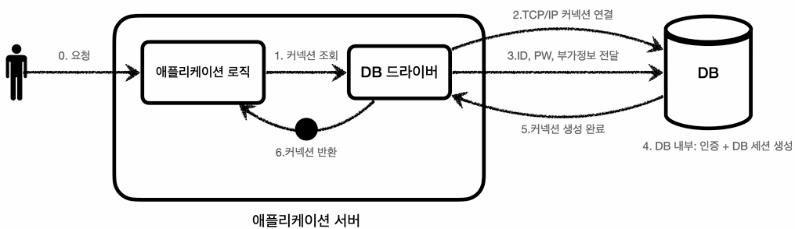
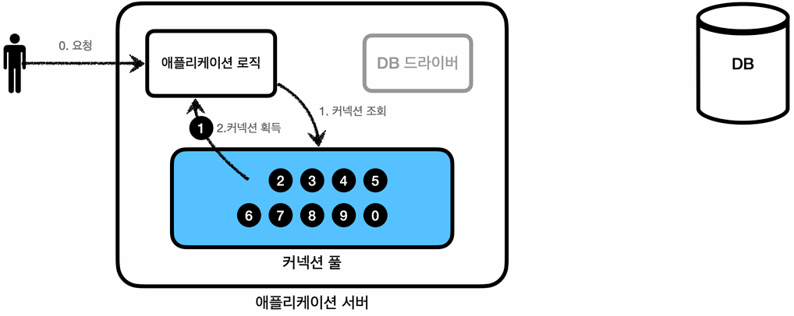
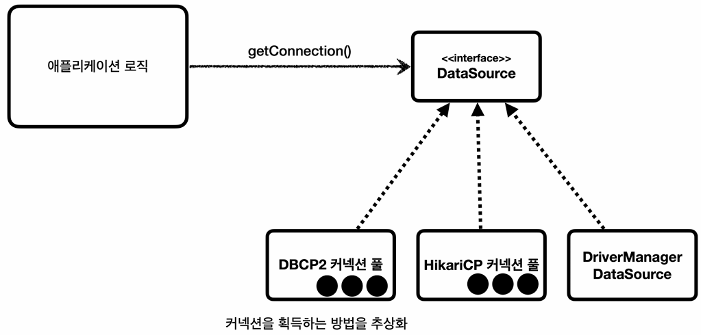

## 커넥션 풀 (Connection Pool)
### 커넥션 획득 방법
- **요청 시점에 커넥션을 생성할 수도 있고, 단순히 존재하는 커넥션을 가져올 수도 있다.**
  1. `DriverManager`를 통해 찾은 적절한 드라이버로 커넥션을 획득하는 방법
  2. 커넥션 풀에서 커넥션을 획득하는 방법
- 각 방법에 대해 하나씩 살펴보자.

### DriverManager를 통한 커넥션 획득

#### 과정
1. **애플리케이션 로직이 `DriverManager`에게 커넥션을 요청하면, `DriverManager`는 커넥션을 생성할 수 있는 적절한 DB 드라이버를 찾는다.**
2. **드라이버는 DB와 `TCP/IP` 커넥션을 연결**한다.
   - 이 과정에서 3-way handshake와 같은 `TCP/IP` 연결을 위한 네트워크 동작이 발생한다.
3. `TCP/IP` 커넥션이 연결되면, **드라이버는 인증에 필요한 정보(ID, PW, 기타 부가정보 등)를 DB에 전달**한다.
4. 정보를 통해 내부 인증이 완료되면, **DB는 내부에 세션을 생성**한다.
5. 세션까지 생성되었다면, DB는 **'커넥션 생성이 완료되었다'는 응답**을 보낸다.
6. 드라이버와 DB가 성공적으로 연결되었으므로, **드라이버는 커넥션 객체를 생성해서 클라이언트(애플리케이션)에 반환**한다.

#### DB 서버와 드라이버
- **DB 서버:**
  - 네트워크를 통해 들어온 **드라이버의 연결 요청(`TCP/IP`)을 수락**하고, **유효한 요청인 경우 내부적으로 세션을 생성**한다.
  - 즉, 쿼리를 수신할 통신 채널을 준비하는 역할을 한다.
- **DB 드라이버:**
  - 물리적인 네트워크 연결(`TCP/IP`)과 인증을 거쳐 DB에 세션이 생성된 경우, **드라이버는 애플리케이션에서 사용할 수 있는 커넥션 객체를 생성하여 반환**한다.
  - 이때 말하는 **커넥션 객체는 `java.sql.Connection` 인터페이스를 구현한 자바 객체**이다.

#### TCP/IP 커넥션과 커넥션 객체
- **TCP/IP 커넥션:**
  - **OS 및 네트워크 통신 계층에서 수립되는 물리적인 네트워크 연결 채널**이다.
- **커넥션 객체:**
  - 자바 메모리(Heap) 공간, 즉 **애플리케이션 계층에 존재하는 자바 객체**이다.
  - 이 객체는 **내부에 물리적인 TCP/IP 통신 소켓을 필드로 포함**하고 있으며, **애플리케이션이 SQL을 다룰 수 있도록 `prepareStatement()` 등의 API를 제공**한다.

#### 단점
1. 요청이 올 때마다 커넥션을 만들어야 하므로 **오버헤드가 크다.**
   - DB는 물론이고 애플리케이션 서버에서도 `TCP/IP` 커넥션을 새로 생성하기 위한 리소스를 매번 사용해야 한다.
2. 요청 시점에 **커넥션을 만드는 과정에서 응답이 지연**된다.

### 커넥션 풀을 통한 커넥션 획득

#### 커넥션 풀
- **`DriverManager`를 통한 커넥션 획득 방법에서의 단점을 해결하고자 등장**하였다.
- 이름에서 알 수 있듯, **커넥션 풀은 애플리케이션 구동 시점에 커넥션을 미리 확보해서 풀에 보관해 놓는 방식**이다.
  - 디폴트는 보통 10개지만, 성능 테스트를 거쳐 적절한 커넥션 풀 크기를 지정해도 된다.
- 커넥션 풀에 들어 있는 커넥션은 DB와의 물리적인 연결 채널(`TCP/IP` 연결)이 이미 수립된 상태이기 때문에, 언제든지 SQL을 DB에 전달할 수 있다.

#### 과정
- **DB 드라이버를 통해서 커넥션을 획득하는 것이 아니다.**
  - 커넥션 풀을 통해 이미 생성되어 있는 커넥션을 객체 참조로 그냥 가져다 쓰기만 하면 된다.
- **커넥션 사용을 마쳤다면, 종료하지 않은 채 커넥션 풀에 그대로 반환**하면 된다.
  - 다만 실제 애플리케이션에서는 `close()`를 명시적으로 호출하는데, 그 이유는 이것이 커넥션 풀을 반환하는 방법이기 때문이다.
  - 커넥션 객체는 내부적으로 조작된 프록시(Proxy) 객체이기 때문에, `close()`를 호출하더라도 실제 네트워크 연결을 물리적으로 종료하는 대신 해당 커넥션을 커넥션 풀로 반환하도록 동작 방식이 변경되어 있다.

#### 특징
- **최대 커넥션 수를 제한할 수 있는 덕에, DB 리소스를 보호**하는 효과를 지닌다.
  - OOM 등의 문제가 방지되기 때문에, **기본적으로는 커넥션 풀 방식을 채택**한다.
- 여러 커넥션 풀 오픈소스가 있지만 주로 사용하는 것은 `HikariCP`으로, 스프링 부트에서도 이를 권장하고 있다.

---

## DataSource
### 등장 배경
- 앞서 커넥션을 획득하는 여러 방법(`DriverManager`, 커넥션 풀 등)에 대해 배웠다.
- 근데 만약 커넥션을 획득하는 방법을 변경해야 한다면 어떻게 해야 할까?
  - 애플리케이션에서 특정 방법에 의존하고 있다면, 결국 애플리케이션 코드를 바꿔야 할텐데 말이다.
- 이러한 문제를 해결하기 위해, 자바에서는 `javax.sql.Datasource`라는 인터페이스를 제공한다.

### 개념

```java
public interface DataSource {
    Connection getConnection() throws SQLExcetpion;
}
```
- `Datasource`는 **커넥션을 획득하는 방법을 추상화**한 인터페이스이다.
  - 이 인터페이스의 핵심 기능은 커넥션 조회 하나이다.
- **커넥션을 획득하는 방법을 추상화한 덕에, 애플리케이션 로직은 구현체가 아닌 역할(`Datasource` 인터페이스)에만 의존하면 된다.**
  - 즉, 커넥션 획득 방법을 변경하더라도 애플리케이션 로직을 변경하지 않아도 된다.

#### DriverManagerDataSource
- 대부분의 커넥션 풀은 `Datasource` 인터페이스를 이미 구현해 둔 반면, `DriverManager`는 `Datasource` 인터페이스를 구현해두지 않았다.
- 이에 스프링에서는 `DriverManager`도 `Datasource`를 통해 사용할 수 있도록, `DriverManagerDataSource`라는 구현체를 제공한다.
- 덕분에 '실제로 커넥션을 어떻게 획득하는지'와는 무관하게, **일관된 방식으로 커넥션을 조회할 수 있게 되었다.**

#### 객체지향 프로그래밍의 4가지 특징
- 객체지향 프로그래밍은 **시스템을 유연하고 유지보수하기 쉽게 만들기 위해** 다음 4가지 특징을 가진다.
  - `DataSource`에서 '추상화'라는 단어가 나온 김에 간단하게 정리해 보았다.
- **추상화 (Abstraction):**
  - **구체적인 내부 구현 로직을 추상화하여, 클라이언트가 단순하게 사용할 수 있도록 하는(클라이언트의 목적 달성을 돕는) 성질**이다.
  - 가령 `DataSource`에서 '실제로 커넥션을 어떻게 획득하는지'와는 무관하게, 클라이언트는 단순히 `getConnection()`을 호출하는 것만으로 커넥션을 획득할 수 있다. 
- **캡슐화 (Encapsulation):**
  - **연관된 데이터(속성)와 그 데이터를 다루는 로직(메서드)를 하나의 단위(클래스)로 묶는 성질**이다.
  - 접근 제어자(`private` 등)를 사용하여 외부에서 데이터를 임의로 조작하지 못하도록 보호하는 정보 은닉의 목적을 가진다.
- **상속 (Inheritance):**
  - **부모가 가진 속성과 기능을 자식이 그대로 물려받아 사용하는 성질**이다.
  - 중복되는 코드를 줄여 재사용성을 높이고, 논리적인 계층 관계를 형성한다.
- **다형성 (Polymorphism):**
  - **하나의 인터페이스로, 여러 종류의 서로 다른 구현체를 다룰 수 있는 성질**이다.
  - 가령 클라이언트 로직은 `java.sql.Connection` 인터페이스 하나에 의존하지만, 런타임에는 다양한 구현체(H2 커넥션, MySQL 커넥션 등)로 초기화될 수 있다.

### 실습 1. DriverManager를 통해 커넥션 획득
#### 순수 DriverManager
```java
@Test
void driverManager() throws SQLException {
    Connection conn1 = DriverManager.getConnection(URL, USERNAME, PASSWORD);
    Connection conn2 = DriverManager.getConnection(URL, USERNAME, PASSWORD);
    log.info("connection={}, class={}", conn1, conn1.getClass());
    log.info("connection={}, class={}", conn2, conn2.getClass());
}
```
```plain
01:18:58.503 [Test worker] INFO hello.jdbc.connection.ConnectionTest -- connection=conn0: url=jdbc:h2:tcp://localhost/~/test user=SA, class=class org.h2.jdbc.JdbcConnection
01:18:58.527 [Test worker] INFO hello.jdbc.connection.ConnectionTest -- connection=conn1: url=jdbc:h2:tcp://localhost/~/test user=SA, class=class org.h2.jdbc.JdbcConnection
```
- **추상화(`DataSource`)를 이용하지 않은, 순수한 `DriverManager`를 통해 직접 커넥션을 획득**해 본 결과, 다음의 2가지 포인트를 확인할 수 있었다.
  1. **동일한 조건으로 `getConnection()`이 호출되더라도, 동일한 커넥션 객체가 반환되지 않는다.** (데이터 정합성을 지키기 위해서는 당연하다.)
  2. 프록시로 감싸지지 않은, **순수한 H2 커넥션을 획득**한다.
- 다음으로, 추상화를 이용한 `DriverManagerDataSource`를 통해 커넥션을 획득해 보자.

#### DriverManagerDataSource
```java
@Test
void dataSourceDriverManager() throws SQLException {
    // 설정과 사용의 분리
    DataSource dataSource = new DriverManagerDataSource(URL, USERNAME, PASSWORD);
    useDataSource(dataSource);
}

private void useDataSource(DataSource dataSource) throws SQLException {
    Connection conn1 = dataSource.getConnection();
    Connection conn2 = dataSource.getConnection();
    log.info("connection={}, class={}", conn1, conn1.getClass());
    log.info("connection={}, class={}", conn2, conn2.getClass());
}
```
```plain
01:58:39.930 [Test worker] INFO hello.jdbc.connection.ConnectionTest -- connection=conn0: url=jdbc:h2:tcp://localhost/~/test user=SA, class=class org.h2.jdbc.JdbcConnection
01:58:39.945 [Test worker] INFO hello.jdbc.connection.ConnectionTest -- connection=conn1: url=jdbc:h2:tcp://localhost/~/test user=SA, class=class org.h2.jdbc.JdbcConnection
```
- 실행 결과 상으로는, 순수한 `DriverManager`를 통해 커넥션을 획득했을 때와 다를 것이 없다.
- 하지만 코드 레벨에서 바라보면, 두 버전은 큰 차이가 있다.
  - 순수한 `DriverManager`는 커넥션을 요청할 때마다 `URL`, `USERNAME`, `PASSWORD` 같은 파라미터를 계속 전달해야 했다.
  - 하지만 `DataSource`를 사용하는 방식은 커넥션을 요청할 때가 아니라, 처음 `DataSource` 객체를 생성할 때만 파라미터를 넘겨주었다.
  - 즉, **`DriverManager`는 사용 시점에 계속 설정 값을 넘겨주어야 했던 반면, `DriverManagerDataSource`는 객체 생성 시점에만 설정 값을 넘기는 방식**이다.
- 이렇게 **'설정과 사용의 분리'가 발생한 덕분에, `DataSource`를 사용하는 방식은 '사용 시점' 기준으로 설정 값에 의존하지 않게 되었다.**
  - **보통 애플리케이션 개발 단계에서 설정은 한 번, 사용은 여러 번 이뤄진다는 점을 착안해 보면, '설정과 사용의 분리'는 상당히 유의미한 장점**이라 할 수 있다.

### 실습 2. 커넥션 풀에서 커넥션 획득
```java
@Test
void dataSourceConnectionPool() throws SQLException, InterruptedException {
    // 커넥션 풀링
    HikariDataSource dataSource = new HikariDataSource();
    dataSource.setJdbcUrl(URL);
    dataSource.setUsername(USERNAME);
    dataSource.setPassword(PASSWORD);
//        dataSource.setMaximumPoolSize(10);
    dataSource.setPoolName("MyPool");

    useDataSource(dataSource);
//        Thread.sleep(1000);
}
```
```plain
02:31:10.961 [Test worker] INFO com.zaxxer.hikari.HikariDataSource -- MyPool - Starting...
02:31:11.063 [Test worker] INFO com.zaxxer.hikari.pool.HikariPool -- MyPool - Added connection conn0: url=jdbc:h2:tcp://localhost/~/test user=SA
...
02:31:11.069 [Test worker] INFO com.zaxxer.hikari.HikariDataSource -- MyPool - Start completed.
02:31:11.084 [Test worker] INFO hello.jdbc.connection.ConnectionTest -- connection=HikariProxyConnection@140428850 wrapping conn0: url=jdbc:h2:tcp://localhost/~/test user=SA, class=class com.zaxxer.hikari.pool.HikariProxyConnection
02:31:11.084 [Test worker] INFO hello.jdbc.connection.ConnectionTest -- connection=HikariProxyConnection@470132045 wrapping conn1: url=jdbc:h2:tcp://localhost/~/test user=SA, class=class com.zaxxer.hikari.pool.HikariProxyConnection
```
- 커넥션 풀에서 커넥션을 획득하는 방식은 `DriverManager`와 비교하여 크게 3가지 부분이 다르다.
  1. **요청 시점에 커넥션을 생성하는 것이 아니라, 애플리케이션 구동 시점에 모든 커넥션을 생성해서 커넥션 풀에 등록**해 둔다.
  2. **커넥션 생성 작업을 메인 스레드가 담당하지 않는다.**
  3. **순수 H2 커넥션 객체(`JdbcConnection`)가 아닌, 프록시 객체(`HikariProxyConnection`)를 획득**하게 된다. 

#### 커넥션 생성을 별도의 스레드가 담당하는 이유 
- **커넥션을 생성해서 커넥션 풀에 채워두는 작업은 네트워크 통신(3-way handshake 등)이 수반되기 때문에** 상대적으로 오래 걸리는 일이다.
- 커넥션 풀이 모두 채워질 때까지 마냥 대기(blocking)한다면, **필연적으로 애플리케이션 구동이 지연**된다.
- 이를 방지하고자 메인 스레드가 아닌, 별도의 스레드에서 커넥션을 생성한다.

#### 커넥션을 요청했는데 커넥션 풀이 비어있는 경우
- 곧바로 에러를 반환하는 것은 아니고, 일단 해당 스레드를 대기(blocking) 상태로 만든다.
- 대기 상태에 있는 동안, 커넥션 풀에 커넥션이 반환되는 경우, 해당 커넥션을 클라이언트에 반환하게 된다.
- 설정된 대기 시간(Connection Timeout, 디폴트 30초) 내에 커넥션을 획득하지 못한다면, 그때는 획득 실패 예외(Timeout)가 발생한다. 

#### 순수 커넥션 객체가 아닌 프록시 객체를 획득하는 이유
- 프록시 객체로 감싼 덕에, `close()`가 호출되더라도 물리적인 네트워크 연결이 종료되지 않고, 단순히 커넥션 풀에 커넥션이 반환되는 작업만 이루어진다.
- 만약 순수 커넥션 객체였다면, `close()`가 호출되는 시점에 물리적인 네트워크 연결이 종료되었을 것이다.

### 실습 3. 애플리케이션 코드에 DataSource 적용
#### DataSource 의존관계 주입
```java
public class MemberRepositoryV1 {

    private final DataSource dataSource;

    public MemberRepositoryV1(DataSource dataSource) {
        this.dataSource = dataSource;
    }

    // ...

    private Connection getConnection() throws SQLException {
        return dataSource.getConnection();
    }
}

public class DBConnectionUtil {

    public static Connection getConnection() {
        try {
            Connection connection = DriverManager.getConnection(URL, USERNAME, PASSWORD);
            log.info("get connection={}, class={}", connection, connection.getClass());
            return connection;
        } catch (SQLException e) {
            throw new IllegalStateException(e);
        }
    }
}
```
- 순수 `DriverManager`로부터 커넥션을 획득하지 않고, 주입받은 `DataSource`를 통해 커넥션을 획득한다.
  - 물론 컨테이너가 아니라 클라이언트 코드로부터 주입받고 있음을 잊지 말자.
  - 애초에 스프링 빈이 아니니까, 컨테이너로부터 주입받을 수 없다.

#### JdbcUtils 활용
```java
private void close(Connection conn, Statement stmt, ResultSet rs) {
    JdbcUtils.closeResultSet(rs);
    JdbcUtils.closeStatement(stmt);
    JdbcUtils.closeConnection(conn);
}
```
- `JdbcUtils`는 JDBC 리소스를 안전하고 편리하게 종료할 수 있도록 돕는 유틸리티 클래스이다.

#### 커넥션 풀을 사용하더라도 프록시 객체는 매번 재생성하게 된다.
```plain
get connection=HikariProxyConnection@xxxxxxxx1 wrapping conn0: url=jdbc:h2:...user=SA
get connection=HikariProxyConnection@xxxxxxxx2 wrapping conn0: url=jdbc:h2:...user=SA
get connection=HikariProxyConnection@xxxxxxxx3 wrapping conn0: url=jdbc:h2:...user=SA
```
- 실제 커넥션 객체는 `conn0`로 동일하지만, 이를 감싸는 프록시 객체의 참조값이 매번 다른 것을 확인할 수 있는데, 이는 시스템의 안전성과 독립성을 위한 설계이다. 
- 이보다 **실제 커넥션 객체(target) 자체는 요청 시점마다 재생성되는 것이 아니다**는 사실이 훨씬 중요하다.

#### DataSource 도입 의의
- 커넥션을 획득하는 방법을 변경(`DriverManagerDataSource` → `HikariDataSource`)하더라도 애플리케이션 코드(`MemberRepositoryV1`)는 전혀 변경되지 않았다.
  - 이는 애플리케이션 코드가 인터페이스(`DataSource`)에 의존하고 있기 때문이다.
- 다형성과 DI를 활용한 덕분에, OCP를 준수하게 되었다.