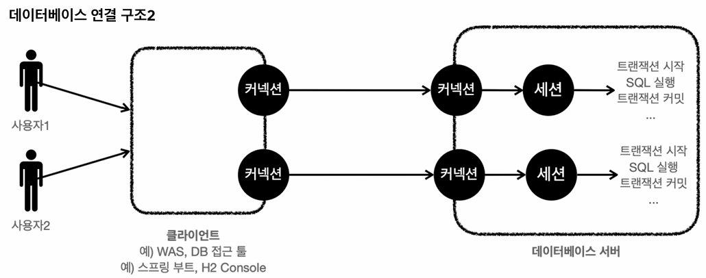
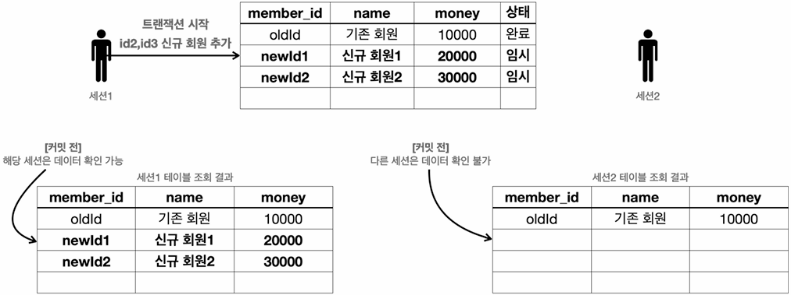

## 트랜잭션
### 개념
- **데이터를 단순히 파일에 저장하지 않고, DB에 저장하는 가장 큰 이유는 DB가 트랜잭션을 지원하기 때문**이다.
- 트랜잭션은 **DB의 상태를 변화시키는 하나의 논리적 작업 단위**로, ACID 속성을 가진다.
  - 부록에 자세히 설명되어 있기 때문에, 본 파트에서는 간단히 짚고 넘어가겠다.

### ACID 속성
#### 원자성 (Atomicity)
- 트랜잭션은 **원자적**이어야 한다.
  - 즉, **트랜잭션 내의 연산들은 모두 성공하거나 모두 실패**해야 한다.

#### 일관성 (Consistency)
- 트랜잭션은 **DB의 일관성을 유지**해야 한다.
  - 이는 **트랜잭션이 DB에서 정의된 규칙과 제약 조건을 준수해야 함**을 의미한다.

#### 격리성 (Isolation)
- **트랜잭션 간에는 격리**되어야 한다.
  - 이는 **각 트랜잭션은 서로 영향을 주지 않고, 동시에 실행되는 다른 트랜잭션에 영향을 받지 않아야 함**을 의미한다.
  - 즉, **동시에 실행되는 여러 트랜잭션이 서로의 중간 작업 결과를 참조하거나 간섭할 수 없도록 격리(별도의 세션에서 작업 수행)되어야** 한다.
- 완벽한 격리성을 보장하면 동시성이 크게 감소하므로, DB는 **성능과 일관성의 트레이드오프를 조절하기 위해 4단계의 격리 수준을 제공**한다.
  - **READ UNCOMMITED**, **READ COMMITED**, **REPEATABLE READ**, **SERIALIZABLE**

#### 지속성 (Durability)
- **트랜잭션의 결과는 지속**되어야 한다.
  - 이는 **트랜잭션이 성공적으로 완료되면, 해당 트랜잭션에 의한 변경 내용은 영구적으로 저장(반영)되어야 함**을 의미한다.

### @Transactional의 한계
- **`@Transactional`을 선언하는 것만으로 트랜잭션의 4가지 속성이 모두 보장되는 것은 아니다.**
- 주된 역할이 트랜잭션의 범위 지정이기 때문에 **원자성은 보장되지만, 일관성(정합성) 같은 경우에는 엄밀하게 보장되지 않는다.**
- **따라서 `@Transactional`을 사용하더라도, 개발자가 락 등의 동시성 제어 로직을 별도로 마련해야 한다.**

### DB 연결 구조와 세션

- **사용자는 WAS나 DB 접근 툴 같은 클라이언트를 통해 DB 서버에 접근할 수 있다.**
- **클라이언트가 DB와 물리적인 커넥션(TCP/IP)을 맺으면, DB 내부에는 해당 커넥션을 위한 논리적인 작업 공간인 세션(Session)이 생성**된다.
- **향후 클라이언트가 전달하는 모든 SQL은 이 세션을 통해 처리**된다.
  - 즉, 커넥션과 연결된 세션을 통해 SQL이 실행된다.
  - 참고로 **SQL을 해석하여 실행 계획을 수립하는 주체가 DB 엔진**이며, **그 실행 계획을 전달받아 저장 공간에서 데이터를 읽고 쓰는 주체가 스토리지 엔진**(InnoDB 등)이다.
- **세션은 커넥션이 끊어짐과 동시에 종료**되며, **한 세션 내에서 여러 번 트랜잭션을 시작했다 종료할 수 있다.**

### 실습
#### 기본 개념

- 커밋하기 전까지의 데이터 변경은 임시 상태다.
- **임시 상태의 데이터는 해당 트랜잭션을 시작한 세션(사용자)에서만 보이며, 다른 세션에서는 보이지 않는다.**
  - 이것이 '트랜잭션 간에는 격리되어야 한다'는 격리성이다.
- 커밋 대신 **롤백을 호출하는 경우, 트랜잭션을 시작하기 직전의 상태로 복구**된다.

#### 자동 커밋과 수동 커밋
```sql
set autocommit true; -- 자동 커밋 모드 설정
insert into member(member_id, money) values ('data1',10000); -- 자동 커밋
insert into member(member_id, money) values ('data2',10000); -- 자동 커밋
```
- **자동 커밋:**
  - 이름에서 알 수 있듯, **각 쿼리 실행 직후 자동으로 커밋이 호출**된다.
  - 쿼리를 하나하나 실행할 때마다 자동으로 커밋이 되어버리기 때문에 트랜잭션 기능을 제대로 사용할 수 없다.

```sql
set autocommit false; -- 수동 커밋 모드 설정
insert into member(member_id, money) values ('data3',10000);
insert into member(member_id, money) values ('data4',10000);
commit; -- 수동 커밋
```
- **수동 커밋:**
  - **트랜잭션을 시작하기 위한 필수 설정**이다.
  - 보통 자동 커밋 모드가 디폴트로 설정된 경우가 많기 때문에, **트랜잭션을 시작하기 위해서는 수동 커밋 모드로 변경(설정)해줘야 한다.**
  - 참고로 **커밋 모드는 한 번 설정하면 해당 세션에서는 계속 유지**된다.

#### 웹 세션과 DB 세션
```plain
http://localhost:8082/login.do?jsessionid=32e09432228e7dc1eb7edd4427d16bc4
```
- 위 URL은 현재 실습 중인 H2 웹 콘솔의 URL이다.
- 해당 URL에 포함된 **`jessionid`는 DB 세션 ID가 아니라, WAS에서 브라우저(웹 클라이언트)를 식별하기 위한 식별자**(웹 세션 ID)다.
  - 즉, `jsessionid`로 브라우저(웹 클라이언트)를 구별한다.
- 따라서 **여러 브라우저로 DB에 접근하고 싶은 경우, 동일한 `jsessionid`를 사용해서는 안 된다.**

#### 동시성 문제 유도
```sql
-- 세션 1, 세션 2 공통 전송 쿼리 형태
UPDATE member SET money = money - 출금금액 WHERE member_id = 'memberA';
```
- **잔액이 10000원인 계좌A에 대해 두 요청이 거의 동시에 온 상황을 가정**해보자.
  - 세션 1: 2000원 출금 요청
  - 세션 2: 3000원 출금 요청
- **요청이 어떻게 왔는가에 따라 동시성 문제가 발생할 수도, 하지 않을 수도 있다.**
  - 각 경우에 대해 살펴보자.
- **DB에 직접 UPDATE 구문을 전송하여 수정을 시도하는 경우:**
  1. 먼저 도착한 세션 1의 `UPDATE` 쿼리가 해당 레코드에 도달하는 즉시 배타 락(X-Lock)을 획득한다.
  2. 뒤이어 도착한 세션 2의 `UPDATE` 요청은 락이 없으므로 세션 1의 트랜잭션이 종료될 때까지 대기(blocking) 상태로 전환된다.
  3. 세션 1의 트랜잭션이 커밋되어 배타 락이 해제되면, 대기 중이던 세션 2가 배타 락을 획득한다.
  4. 이때 앞서 세션 1에 의해 커밋된 최신 데이터인 8000원을 기준으로 연산이 수행되므로, 최종 잔액은 5000원이 된다. (데이터 정합성 유지)
- **MVCC 아키텍처 기반 RDBMS를 사용하는 애플리케이션에 요청한 경우:**
  1. MVCC 아키텍처에서는 조회 성능 향상을 위해 일반적인 `SELECT` 구문에 락을 걸지 않는다. 
  2. 따라서 세션 1과 세션 2가 동시에 `SELECT`를 수행하면, 두 세션 모두 원본 데이터인 10000원을 각각의 애플리케이션 메모리로 읽어간다.
  3. 세션 1에서는 8000원, 2에서는 7000원으로 잔액을 갱신하려고 한다. 
  4. `UPDATE` 요청이 어떤 순서로 도착하더라도, 데이터 정합성이 깨지는 문제가 발생한다.
- **MVCC 아키텍처 기반 RDBMS를 사용하는 애플리케이션에 요청한 경우에는 동시성 문제가 발생하므로**, 이를 해결하기 위해서는 **개발자가 락 등의 적절한 동시성 제어 로직을 마련해야 한다.**

---

## 락 (Lock)
- 앞서 트랜잭션의 '동시성 문제 유도' 파트에서 확인했듯이, **락을 통해 동시성을 제어할 수 있다.**
  - **DB 엔진에서 일반적인 조회가 아닌 쿼리(데이터 변경, `SELECT FOR UPDATE` 등)를 실행할 때는 타겟 레코드(인덱스가 없을 경우에는 테이블 전체)에 락을 건다.**
  - **락이 걸려 있는 동안, 다른 트랜잭션은 해당 데이터 값을 변경할 수 없다.** (**일반적인 조회는 가능**하다.)
  - **만약 데이터 변경을 시도한 경우, 해당 트랜잭션은 대기(blocking) 상태가 되어 락이 해제될(풀릴) 때까지 기다린다.**
  - 일정 시간 대기를 했음에도 락을 획득하지 못한(**락 대기 시간이 경과한) 경우에는 타임아웃 오류가 발생**한다.
- 트랜잭션과 마찬가지로, 부록에 자세히 설명되었으므로 본 파트에서는 이 정도로만 설명하고 넘어가겠다.

---

## 트랜잭션 적용 실습 - 계좌이체
### 트랜잭션 적용 전
```java
// MemberServiceV1
private final MemberRepositoryV1 repository;

public void accountTransfer(String fromId, String toId, int amount) {
    Member fromMember = repository.findById(fromId);
    Member toMember = repository.findById(toId);

    repository.update(fromId, fromMember.getMoney() - amount);
    validation(toMember);
    repository.update(toId, toMember.getMoney() + amount);
}

private void validation(Member toMember) {
    if (toMember.getMemberId().equals("ex")) {
        throw new IllegalStateException("이체중 예외 발생");
    }
}
```
- 트랜잭션을 적용하면 어떤 식으로 데이터 정합성이 지켜지는지 확인해보고자, 트랜잭션 적용 실습을 진행했다.
- **현재 서비스 코드(`MemberServiceV1`)에서는 트랜잭션과 관련한 그 어떠한 코드도 존재하지 않는다.**
- 아래는 위 서비스 메서드를 테스트하기 위해 만든 테스트 메서드이다.
```java
// MemberServiceV1Test
@Test
@DisplayName("이체 중 예외 발생")
void accessTransferEx() {
    // given
    Member memberA = new Member(MEMBER_A, 10000);
    Member memberEx = new Member(MEMBER_EX, 10000);
    memberRepository.save(memberA);
    memberRepository.save(memberEx);

    // when
    assertThrows(IllegalStateException.class,
            () -> memberService.accountTransfer(memberA.getMemberId(), memberEx.getMemberId(), 2000));

    // then
    Member findMemberA = memberRepository.findById(memberA.getMemberId());
    validateAddress(memberA, findMemberA);
    Member findMemberEx = memberRepository.findById(memberEx.getMemberId());
    assertThat(findMemberA.getMoney()).isEqualTo(8000);
    assertThat(findMemberEx.getMoney()).isEqualTo(10000);
}
```
- 이체 중 예외가 발생했을 때, 데이터 정합성이 잘 지켜지는지 확인하기 위한 테스트 코드이다.
- 현재는 A가 출금한 직후에 예외가 발생하여 비즈니스 로직이 중단되었는데, 트랜잭션이 없기 때문에 A 계좌에서 출금된 금액이 복원되지 않았다.
- **이로 인해 계좌이체 전후로, 두 계좌의 잔액 합이 달라지는 치명적인 문제가 발생**했다.
- **트랜잭션을 적용하여, 해당(데이터 정합성이 깨지는) 문제를 해결해 보자.**

#### 같은 레코드를 가리키는 객체라면, 애플리케이션 레벨에서 메모리 주소가 같을까?
```java
private void validateAddress(Member memberA, Member findMemberA) {
    int addressMemberA = System.identityHashCode(memberA);
    int addressFindMemberA = System.identityHashCode(findMemberA);
    assertThat(addressFindMemberA).isNotEqualTo(addressMemberA);
}
```
- 결론부터 말하면, **아니다.**
- **`memberA`와 `findMemberA`는 분명 같은 레코드를 가리키지만, 메모리 상에서는 다른 객체로 존재한다.**
  - 현재 `repository.findById()` 구현 코드를 보면, `ResultSet`에 담긴 정보로 새로운 `Member` 객체를 만들어서 반환하기 때문이다.
- **완전히(메모리 주소까지) 동일한 객체가 반환되길 기대했다면, 데이터 접근 기술도 JPA고 같은 트랜잭션 내에서 생성되거나 조회되어야 했다.**
  - 이러한 상황에서는 `findMemberA`를 별도로 조회할 필요 없이, `memberA`만으로 검증해도 무방했을 것이다.

### 트랜잭션 적용 후 (커넥션을 파라미터로 직접 전달)
#### 개요
- **트랜잭션을 적용하지 않았더니, 데이터 정합성이 깨지는 문제가 발생했다.**
- **그럼 트랜잭션을 적용해야 할텐데, 어디에** 적용해야 할까?

#### 트랜잭션 적용 위치
- **트랜잭션은 비즈니스 로직이 있는 서비스 계층에 걸어야 한다.**
- 비즈니스 로직이 잘못되면, 해당 비즈니스 로직으로 인해 문제가 되는 부분을 함께 롤백해야 하기 때문이다.

#### 트랜잭션과 커넥션

- **트랜잭션을 시작하려면 기본적으로 커넥션이 필요하다.**
  - 커넥션을 맺으면 세션이 생성되는데, 해당(커넥션과 연결된) 세션이 트랜잭션을 시작하는 주체이기 때문이다.
- 즉, **커넥션이 트랜잭션을 결정하기 때문에, 같은 커넥션을 유지해야 하나의 트랜잭션 안에서 작업이 수행될 수 있다.** 
- **그러면 애플리케이션 레벨에서 어떻게 같은 커넥션을 유지할 수 있을까?**
  - 본 파트에서는 '커넥션 객체를 파라미터로 직접 전달'하는 방법에 대해서 소개할 것이다.
  - 강좌를 수강하면서 점진적으로 개선해 나갈 것이기 때문에, 가장 직관적인(초기의, 러프한) 방법부터 시도해보기 위함이다.

#### 커넥션을 파라미터로 직접 전달하여, 애플리케이션 레벨에서 같은 커넥션 유지하기
```java
// MemberServiceV2
private final DataSource dataSource;
private final MemberRepositoryV2 repository;

public void accountTransfer(String fromId, String toId, int amount) throws SQLException {
    Connection conn = dataSource.getConnection();
    try {
        conn.setAutoCommit(false);  // 트랜잭션 시작
        bizLogic(conn, fromId, toId, amount);
        conn.commit();  // 트랜잭션 종료
    } catch (Exception e) {
        conn.rollback();
        throw new IllegalStateException(e);
    } finally {
        release(conn);
    }
}

private void bizLogic(Connection conn, String fromId, String toId, int amount) {
    Member fromMember = repository.findById(conn, fromId);
    Member toMember = repository.findById(conn, toId);

    repository.update(conn, fromId, fromMember.getMoney() - amount);
    validation(toMember);
    repository.update(conn, toId, toMember.getMoney() + amount);
}

private void release(Connection conn) {
    if (conn != null) {
        try {
            conn.setAutoCommit(true);   // 초기 상태로 복구
            conn.close();
        } catch (Exception e) {
            log.info("error", e);
        }
    }
}
```
- **트랜잭션을 적용하지 않았을 때의 서비스 코드(`MemberServiceV1`)와 비교해 보면, 비즈니스 로직 전후로 트랜잭션을 처리하는 로직이 추가**되었다.
- **하지만 트랜잭션을 처리하게 되면서 크게 3가지 문제점을 안게 되었는데**, 하나씩 살펴보도록 하자.
  1. **커넥션 객체를 생성하고 반환하는 책임을 서비스 계층이 갖게 되었다.**
  2. **서비스 계층에서는 비즈니스 로직 실행에 집중해야 하는데, 비즈니스와는 무관한 로직들이 대거 추가**되었다.
  3. **데이터 접근 기술마다 트랜잭션을 거는 방법이 다르기 때문에, 데이터 접근 기술을 변경하면 애플리케이션 코드 또한 수정되어야 한다.**
- **분명 트랜잭션을 적용함으로써 데이터 정합성이 깨지는 문제는 해결했지만, 아직 개선할 부분이 상당 부분 남아 있다.**
  - 이후의 섹션을 진행하면서, 이 문제들을 점진적으로 해결해 보자.
- **참고:**
  - **커넥션 풀을 사용하는 방식에서는, 커넥션을 반환할 때 오토커밋 상태를 디폴트(`true`)로 초기화한 후에 반환해야 한다.**
  - 이는 다음에 해당 커넥션을 사용할 스레드가, **이전 작업의 영향을 받지 않도록 하기 위함**이다.