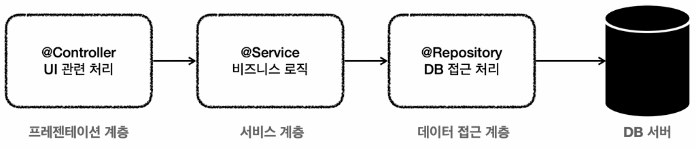
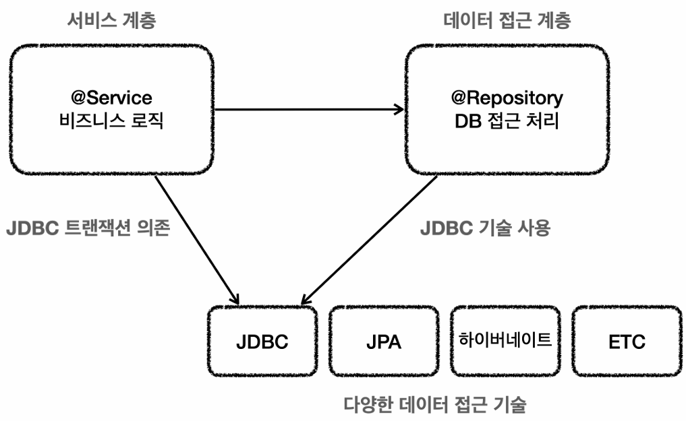
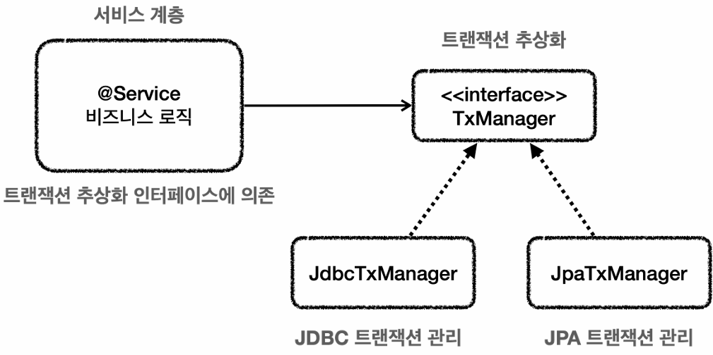
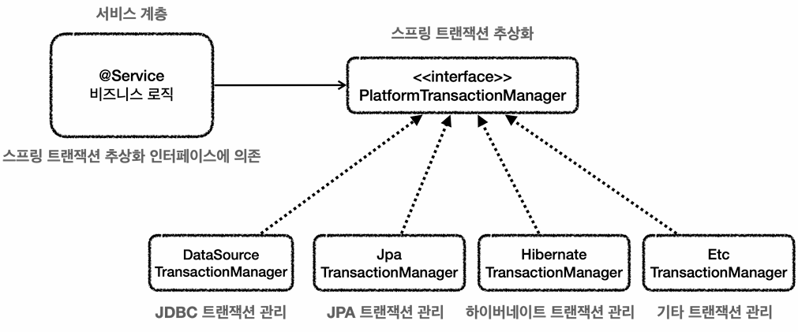
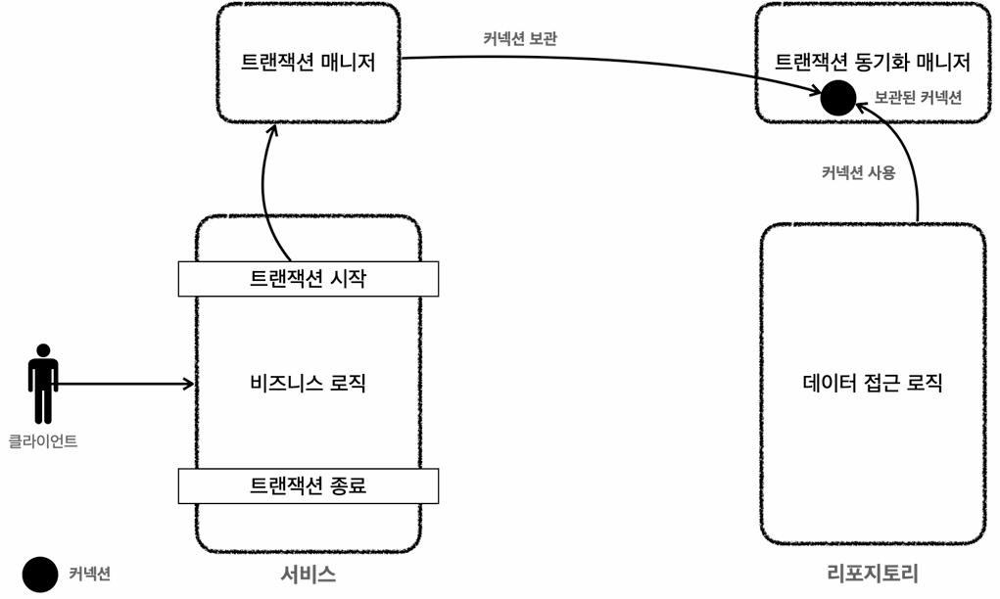

## 애플리케이션 구조
### 3-Tier 아키텍처

- 여러 애플리케이션 구조가 있지만, **가장 단순하면서 많이 사용되는 방식은 역할에 따라 계층을 3가지로 구분**하는 **3-Tier 아키텍처**다.
- 3-Tier 아키텍처에서는 **계층별로 역할이 분담된 덕분에, 순수한 서비스 계층을 유지하는 것이 용이**하다. 

#### 순수한 서비스 계층
- 순수한 서비스 계층이란, **특정 기술에 종속되지 않는 서비스 계층**을 의미한다.
- **순수한 서비스 계층이 되기 위해서는, 프레젠테이션 계층과 데이터 접근 계층에서 기술에 종속적인 부분들을 전담해줘야 한다.**
- **프레젠테이션 계층에서 클라이언트가 접근하는 UI와 관련된 기술(웹, 서블릿, HTTP 등)을 담당해주는 덕분에, 서비스 계층은 UI 기술로부터 자유**롭다.
  - 가령 HTTP(REST) API를 통해 클라이언트와 통신하다가 GRPC 등 다른 기술로 변경되더라도, 비즈니스 로직을 수정할 필요가 없다. 
- **데이터 접근 계층에서 데이터 접근과 관련된 기술(JDBC, JPA 등)을 담당해주는 덕분에, 서비스 계층은 데이터 접근 기술로부터 자유**롭다.
  - 가령 데이터 접근 기술을 JDBC에서 JPA로 변경하더라도, 비즈니스 로직을 수정할 필요가 없다.
  - 물론 이를 위해서는, 서비스 계층이 데이터 접근 계층의 구현체가 아닌 IF에 의존해야 한다. 
- **이렇게 앞뒤로 위치한 두 계층에서 기술을 추상화해주는 덕분에, 서비스 계층은 본연인 비즈니스 로직에 집중**할 수 있게 된다.
- 정리하자면 **향후 구현 기술이 변경될 때의 영향을 최소화하기 위해, 서비스 계층을 순수하게 유지**하는 것이 좋다.
- 그러면 어떻게 서비스 계층을 순수하게 유지할 수 있을까?

#### 앞선 실습에서의 문제점
```java
// MemberServiceV2
private final DataSource dataSource;
private final MemberRepositoryV2 repository;

public void accountTransfer(String fromId, String toId, int amount) throws SQLException {
    Connection conn = dataSource.getConnection();
    try {
        conn.setAutoCommit(false);  // 트랜잭션 시작
        bizLogic(conn, fromId, toId, amount);
        conn.commit();  // 트랜잭션 종료
    } catch (Exception e) {
        conn.rollback();
        throw new IllegalStateException(e);
    } finally {
        release(conn);
    }
}

private void bizLogic(Connection conn, String fromId, String toId, int amount) {
    Member fromMember = repository.findById(conn, fromId);
    Member toMember = repository.findById(conn, toId);

    repository.update(conn, fromId, fromMember.getMoney() - amount);
    validation(toMember);
    repository.update(conn, toId, toMember.getMoney() + amount);
}

private void release(Connection conn) {
    if (conn != null) {
        try {
            conn.setAutoCommit(true);   // 초기 상태로 복구
            conn.close();
        } catch (Exception e) {
            log.info("error", e);
        }
    }
}
```
- 앞서 커넥션을 파라미터로 직접 전달하여 트랜잭션을 적용하는 실습에서는 크게 3가지 문제점이 존재한다고 했다.
  1. **커넥션 객체를 생성하고 반환하는 책임을 서비스 계층이 갖게 되었다.**
  2. **서비스 계층에서는 비즈니스 로직 실행에 집중해야 하는데, 비즈니스와는 무관한 로직들이 대거 추가**되었다.
  3. **데이터 접근 기술마다 트랜잭션을 거는 방법이 다르기 때문에, 데이터 접근 기술을 변경하면 애플리케이션 코드 또한 수정되어야 한다.**
- 정리하자면 **결국 특정 기술에 의존하고, 비즈니스 로직과는 무관하거나 반복되는 코드를 처리하는 탓에 서비스 계층이 지저분**해졌다.
  - **트랜잭션을 적용하면서도, 이와 같은 문제점들을 해결하려면 어떻게** 해야 할까?

---

## 트랜잭션 매니저
### 역할
- **트랜잭션을 적용하면서도 순수한 서비스 계층을 유지할 수 있도록, 스프링에서는 트랜잭션 매니저를 제공**한다.
- 트랜잭션 매니저는 **크게 2가지 역할**을 하는데, 하나씩 살펴보도록 하자.
  1. **트랜잭션 추상화**
  2. **리소스 동기화**

### 트랜잭션 추상화
#### 개요

- 현재 서비스 계층(`MemberServiceV2`)은 트랜잭션을 적용하는 과정에서 특정 기술(JDBC)에 의존하고 있다.
- 데이터 접근 기술마다 트랜잭션을 적용하는 방법이 다르기 때문에, 만약 현재 구조에서 데이터 접근 기술이 변경(JDBC → JPA)되는 경우, 애플리케이션 코드 또한 필연적으로 수정되어야 한다.
- 이 문제를 어떻게 해결할 수 있을까?
- **앞서 '커넥션 획득'을 추상화했던 것처럼, '트랜잭션'을 추상화하면 되지 않을까?**
  - **추상화**는 **인터페이스에 의존하여, 내부 구현과는 관계없이 목표로 하는 기능을 사용할 수 있도록 돕는 성질**이다.
  - **트랜잭션 기능을 제공하기 위해서, 인터페이스는 어떤 메서드들을 담고 있어야 할까?**

#### 트랜잭션 추상화 인터페이스 (아이디어)
- **단순하게 생각하면, 트랜잭션을 시작하고 종료(커밋/롤백)할 수만 있으면 된다.**
```java
public interface TxManager {
    begin();    // 트랜잭션 시작
    commit();   // 변경사항 반영
    rollback(); // 변경사항 취소
}
```

- **위와 같은 인터페이스(`TxManager`)가 있다면, 이를 기반으로 각 데이터 접근 기술에 맞는 구현체를 만들어 런타임에 주입해주면 된다.**
  - `JdbcTxManager`: JDBC 트랜잭션 기능을 제공하는 구현체
  - `JpaTxManager`: JPA 트랜잭션 기능을 제공하는 구현체
- 이러한 방식으로 우리가 구현할 수도 있겠지만, **스프링에서 이미 트랜잭션 추상화 기술을 제공**하고 있으므로 이를 사용하도록 하자.

#### 트랜잭션 추상화 인터페이스 (스프링 제공)

- **스프링 트랜잭션 추상화의 핵심은 `PlatformTransactionManager` 인터페이스**이다.
- 여러 구현체가 존재하는 것을 확인할 수 있는데, 여기서 들 수 있는 몇 가지 의문들에 대해 간단히 짚고 넘어가 보자.
- **JPA 인터페이스의 대표적인 구현체가 Hibernate인데 왜 `TxManager`가 별도로 존재할까?**
  - 결론부터 말하면, JPA 표준이 대중화되기 전에 사용하던 구현체다.
  - 대중화된 이후로는 기본적으로 `JpaTransactionManager`를 사용한다.
  - 트랜잭션뿐만 아니라 곳곳에서 유사한 상황을 마주할 수 있는데, 대체로 이러한 이유이다.
- **왜 `JdbcTxManager`가 아니고, `DataSourceTxManager`일까? 커넥션 획득 과정에서 JPA도 `DataSource`를 사용할텐데?**
  - JDBC에서는 `DataSource` 객체로부터 획득한 `Connection` 객체를 직접 다룬다.
  - 반면 JPA에서는 `EntityManager`를 통해 `Connection` 객체를 간접적으로 다룬다.
  - 이러한 이유에서 `DataSourceTxManager`라고 명명되긴 했는데, 스프링 5.3 이후로는 `JdbcTxManager`도 제공되고 있다.
  - 기능 상으로 큰 차이는 없으니까 같은 것으로 간주하고, 그냥 '그렇구나~' 정도로 넘어가도 될 것 같다.

#### PlatformTransactionManager 인터페이스
```java
package org.springframework.transaction;

public interface PlatformTransactionManager extends TransactionManager {
    TransactionStatus getTransaction(@Nullable TransactionDefinition definition) throws TransactionException;
    void commit(TransactionStatus status) throws TransactionException;
    void rollback(TransactionStatus status) throws TransactionException;
}
```
- **`TransactionDefinition`:**
  - **`BeanDefinition`을 참고하여 Bean을 만드는 것처럼, `TransactionDefinition`을 참고하여 Transaction을 만들게 된다.**
    - 즉, **트랜잭션의 설계서**이다.
  - 전파, 격리 수준, 타임아웃, 읽기 전용 등 **여러 옵션을 설정**할 수 있다.
    - **전파 (Propagation):** 기존 트랜잭션이 있을 때 어떻게 동작할지 결정한다.
    - **격리 수준 (Isolation):** 트랜잭션 간 격리 수준을 지정한다.
    - **타임아웃 (Timeout):** 지정된 시간 내에 끝나지 않으면 강제 롤백한다.
    - **읽기 전용 (Read-Only):** 트랜잭션을 조회 전용으로 생성하는 대신, 성능을 최적화(JPA 스냅샷 생성 방지, DB 부하 분산 등)시킨다.
- **`TransactionStatus`:**
  - 이름에서 알 수 있듯, **현재 트랜잭션의 상태 정보를 담고 있는 객체**이다.
  - **`TxManager`는 트랜잭션을 종료할 때, 현재 트랜잭션의 상태 정보(`TxStatus`)를 참고**한다.
    - **`isNewTransaction():`** 신규 생성(`REQUIRES_NEW`)된 트랜잭션인지 확인한다.
    - **`isRollbackOnly():`** 롤백 마킹된 트랜잭션인지 확인한다.
- **`getTransaction()`:**
  - **트랜잭션을 시작**한다.
  - 트랜잭션 **전파 옵션에 따라 새로운 트랜잭션을 생성(`REQUIRES_NEW`)할 수도, 기존 트랜잭션에 참여(`REQUIRED`)할 수도 있다.**
  - 디폴트 옵션은 기존 트랜잭션에 참여(`REQUIRED`)하는 것이다.

#### 트랜잭션 전파 (Propagation)
- **이미 트랜잭션이 진행 중인 상태에서 추가로 트랜잭션이 요구(`getTransaction()`)되었을 때, 트랜잭션을 어떻게 처리할지 결정하는 동작 방식**이다.
- **참여 (`REQUIRED`):**
  - 이미 시작된 물리적인 트랜잭션(커넥션)이 있다면, **새로운 커넥션을 맺지 않고 기존 트랜잭션에 그대로 참여**(합류)한다.
- **생성 (`REQUIRES_NEW`):**
  - 참여와 달리, 새로운 트랜잭션을 생성하는 전파 옵션이다.
  - **이미 진행 중인 외부 트랜잭션이 있더라도, 이를 잠시 보류(Suspend)시키고 별도의 새로운 물리적인 트랜잭션을 시작**한다.
- **롤백 마킹:**
  - **참여(`REQUIRED`) 상태인 내부 메서드에서 예외가 발생하여 롤백해야 할 때 붙이는 마킹**이다.
  - 롤백 마킹이 붙어 있는 경우, **외부 메서드는 트랜잭션의 종료 방식(커밋/롤백)과는 관계없이 강제로 롤백하**게 된다.

### 리소스 동기화
#### 개요
- 현재 서비스 계층(`MemberServiceV2`)은 한 트랜잭션 내에서 작업을 수행하기 위해, 커넥션 객체를 파라미터로 직접 전달하고 있다.
- 단순히 코드가 지저분해진다는 것을 떠나서, 비즈니스 로직 실행에 집중해야 하는 서비스 계층이 커넥션에 대한 책임을 가지는 것은 구조적으로 좋지 않다.
- 이 문제를 해결하기 위해, **스프링에서는 트랜잭션 동기화 매니저를 제공**한다.

#### 트랜잭션 동기화 매니저

- 트랜잭션 동기화 매니저(`TxSyncManager`)는 **트랜잭션 매니저(`TxManager`)가 획득한 커넥션을 보관**한다.
- **내부적으로 `ThreadLocal`을 사용하여 커넥션을 동기화하는 덕분에, 멀티스레드 환경에서도 안전한 동작이 보장**된다.
  - `ThreadLocal`은 해당 스레드만 접근할 수 있는 전용 메모리 저장소이다.
- **동기화 매니저 덕분에, 파라미터로 직접 전달하지 않아도 동기화된(동일한) 커넥션 객체를 획득할 수 있게 되었다.**

#### 동작 방식 (약식)
1. **트랜잭션 시작에 필요한 커넥션을 획득한 후, 트랜잭션을 시작**한다.
2. 트랜잭션 매니저(`TxManager`)는 **트랜잭션이 시작된 커넥션을 동기화 매니저(`TxSyncManager`)에 보관**한다.
3. 레포지토리는 **보관된 커넥션을 사용**한다.
4. **트랜잭션이 종료되면 트랜잭션 매니저(`TxManager`)는 해당 커넥션을 닫는다.**
   - `DriverManager` 방식이었다면 정말로 종료하고, 커넥션 풀 방식이었다면 커넥션을 커넥션 풀에 반환한다.

#### 동작 방식 (세부)
1. **트랜잭션 시작에 필요한 커넥션을 획득한 후, 트랜잭션을 시작**한다. 
   - 서비스 계층에서 `txManager.getTransaction()`을 호출해 트랜잭션을 시작한다. 
   - 트랜잭션 시작에 필요한 커넥션을 획득한다.
   - 트랜잭션을 시작한다. (커넥션을 수동 커밋 모드로 변경한다.) 
2. 트랜잭션 매니저(`TxManager`)는 **트랜잭션이 시작된 커넥션을 동기화 매니저(`TxSyncManager`)에 보관**한다.
   - 트랜잭션이 시작된 커넥션을 `TxSyncManager`에 보관한다.
   - `TxSyncManager`는 `ThreadLocal`에 커넥션을 보관(bind)한다.
3. 레포지토리는 **보관된 커넥션을 사용**한다.
   - 서비스는 커넥션 객체를 파라미터로 직접 전달하지 않는다.
   - 레포지토리는 `DataSourceUtils.getConnection()`를 통해 `TxSyncManager`에 보관된 커넥션을 사용한다. (이 과정에서 자연스럽게 동기화된 커넥션, 트랜잭션을 사용하게 된다.)
4. **트랜잭션이 종료되면 트랜잭션 매니저(`TxManager`)는 해당 커넥션을 닫는다.**
   - 트랜잭션을 종료하기 위해 트랜잭션 매니저(`TxManager`)는 보관된 커넥션을 꺼낸다.
   - 트랜잭션을 종료(커밋/롤백)한다.
   - 전체 리소스를 정리한다. (`TxSyncManager` 정리(unbind) → 커넥션 자동 커밋 모드로 원복 → 커넥션 닫기)
     
#### 트랜잭션 매니저와 동기화 매니저의 생명주기
- **트랜잭션 매니저 (`TxManager`):**
  - **스프링 빈**이다.
  - **스프링 서버가 구동될 때 생성되어 싱글톤으로 등록되며, 애플리케이션이 종료될 때까지 살아있다.**
- **트랜잭션 동기화 매니저 (`TxSyncManager`):**
  - **스프링 빈이 아니라, 필드가 전부 정적(`static`)으로 선언된 전역 유틸리티 클래스**이다.
  - 따라서 **클래스 자체는 애플리케이션 메모리에 항상 올라가 있지만, 내부 데이터(커넥션 정보, 트랜잭션 상태 등)는 트랜잭션 단위로 생성되고 지워진다.**
    - 정적이므로 참조값 자체는 `method` 영역, 실제 인스턴스는 `heap` 영역에 저장되어 있다.
    - 스프링 빈이 아니므로 컨테이너에 등록되어 있지 않다.
  - **트랜잭션이 시작될 때 동기화 매니저(`TxSyncManager`)의 `ThreadLocal` 공간에 커넥션을 묶어두고(bind), 트랜잭션이 종료되면 해당 공간을 비우는(unbind) 식으로 동작**한다.  

### 실습 (트랜잭션 매니저 적용)
#### 레포지토리 (`MemberRepositoryV3`)
```java
private void close(Connection conn, Statement stmt, ResultSet rs) {
    JdbcUtils.closeResultSet(rs);
    JdbcUtils.closeStatement(stmt);
    // 동기화 매니저가 관리(bind)하고 있는 커넥션이면, 닫지 않고 유지
    // 관리하지 않는 커넥션이면 해당 커넥션을 닫음
    DataSourceUtils.releaseConnection(conn, dataSource);
}

private Connection getConnection() throws SQLException {
    // 동기화 매니저가 관리하는 커넥션의 참조값 반환
    // 없으면 새로운 커넥션을 생성하여 반환
    return DataSourceUtils.getConnection(dataSource);
}
```
- `JdbcUtils` 대신 `DataSourceUtils`를 사용하는데, 두 메서드(`getConnection()`, `releaseConnection()`)는 내부적으로 `TxSyncManager`를 사용한다.
- **`DataSourceUtils.getConnection()`:**
  - **동기화 매니저가 관리(bind)하고 있는 커넥션이 있으면 해당 커넥션을 반환**한다.
  - 없으면 새로운 커넥션을 생성하여 반환한다.
- **`DataSourceUtils.releaseConnection()`:**
  - **동기화 매니저가 관리(bind)하고 있는 커넥션이면, 닫지 않고 유지**한다.
  - 관리하지 않는 커넥션이라면 해당 커넥션을 닫는다.

#### 서비스 (`MemberServiceV3_1`)
```java
private final PlatformTransactionManager transactionManager;
private final MemberRepositoryV3 repository;

public void accountTransfer(String fromId, String toId, int amount) {
    TransactionStatus status = transactionManager.getTransaction(new DefaultTransactionDefinition());   // 트랜잭션 시작
    try {
        bizLogic(fromId, toId, amount);
        transactionManager.commit(status);  // 트랜잭션 종료
    } catch (Exception e) {
        transactionManager.rollback(status);
        throw new IllegalStateException(e);
    }
}

private void bizLogic(String fromId, String toId, int amount) {
    Member fromMember = repository.findById(fromId);
    Member toMember = repository.findById(toId);

    repository.update(fromId, fromMember.getMoney() - amount);
    validation(toMember);
    repository.update(toId, toMember.getMoney() + amount);
}

// ...
```
- **분석:**
  - 커넥션을 파라미터로 직접 전달하는 대신, 트랜잭션 매니저(`TxManager`)가 적용된 코드임을 확인할 수 있다.
  - **원하는 형태로 트랜잭션을 시작할 수 있도록 `TransactionDefinition`을 전달하고, `TransactionStatus`를 통해 현재 트랜잭션의 상태를 파악**한다.
  - **트랜잭션을 종료할 때는, 참고할 정보인 `TransactionStatus`를 함께 전달**한다.
  - **커넥션을 닫는 책임은 `TxManager`가 가지고 있으므로, 서비스 계층에서 별도로 커넥션을 닫을 필요가 없다.**
- **잔존하는 문제:**
  - **서비스 계층에서 커넥션 관리에 대한 책임을 배제했고, 트랜잭션 기능 또한 추상화하여 데이터 접근 기술이 변경되더라도 애플리케이션 코드를 수정하지 않도록 되게끔** 만들었다.
  - 하지만 **여전히 비즈니스 로직에 집중해야 할 서비스 계층에서, 비즈니스 로직과는 무관한 코드를 작성해야 하는 문제**가 남아 있다.
  - 이 문제를 **어떻게 해결할 수 있을까?**

---

## 트랜잭션 템플릿
### 개요
```java
// MemberServiceV3_1
TransactionStatus status = transactionManager.getTransaction(new DefaultTransactionDefinition());   // 트랜잭션 시작
try {
    bizLogic(fromId, toId, amount);
    transactionManager.commit(status);  // 변경사항 반영
} catch (Exception e) {
    transactionManager.rollback(status);    // 변경사항 취소
    throw new IllegalStateException(e);
}
```
- 현재 서비스 계층(`MemberServiceV3_1`)은 트랜잭션을 적용하는 과정에서, **매번 동일한 패턴을 반복하여 작성**하고 있다.
- 특정 기능을 적용하는 과정에서 매번 동일한 코드의 작성이 강제되는 것은 생산성, 유지보수성 측면 모두에서 좋지 않다.
- **이 문제를 어떻게 해결**할 수 있을까?
- 이때 적용할 수 있는 디자인 패턴은 **템플릿 콜백 패턴**으로, **스프링에서는 트랜잭션에 템플릿 콜백 패턴이 적용된 클래스인 `TransactionTemplate`를 사용**할 수 있다. 

### 템플릿 콜백 패턴
- 이름에서 알 수 있듯, **전체적인 코드 흐름을 템플릿과 콜백으로 분리하는 설계 패턴**이다.
- **변하지 않는 부분은 템플릿으로** 만들어 두고, **변하는 비즈니스 로직만 파라미터(콜백)로 전달**하여 **템플릿 내부의 특정 시점에 실행시키는 방식**이다.
- **특정 기능을 적용하기 위해 매번 반복되는 코드를 쓸 필요 없이, 단순히 템플릿만 갖다 쓰면 되기 때문에 개발자는 그만큼 핵심 비즈니스 로직(콜백) 구현에 집중**할 수 있게 된다.  

#### 인터페이스와 추상 클래스
- **인터페이스든 추상 클래스든 그 자체로는 인스턴스를 생성할 수 없다**는 공통점을 가지고 있다.
- **그러면 둘이 갖는 차이점이 뭘까?** 간단하게 알아보자.
- **인터페이스:**
  - **구현 객체가 같은 동작을 한다**는 것에 초점을 둔다.
  - **내부의 모든 필드는 상수(`public static final`), 모든 메서드는 추상 메서드(`public abstract`)로 정의**된다.
    - 자바 1.8부터 `default` 키워드를 통해 일반적인 메서드 또한 구현할 수 있지만, **필드는 여전히 상수로만 존재**한다.
  - **단일 클래스에서 여러 인터페이스를 구현할 수도 있고, 하나의 인터페이스가 여러 인터페이스를 상속받을 수도 있다.**
- **추상 클래스:**
  - **클래스 간 연관 관계를 구축**하는 것에 초점을 둔다.
  - **추상 메서드 외에 일반적인 필드, 메서드, 생성자를 가질 수 있다.**
    - 덕분에 구현 객체별로, 클래스 멤버를 중복해서 작성할 필요가 없다.
    - 이러한 특성에 기인하여 **`Interface → Abstract Class → Concrete Class` 디자인 패턴**이 등장하였다.
    - 간단히 설명하자면 **인터페이스와 구체 클래스 사이에 추상 클래스를 둬서 공통되는 멤버를 한 번만 작성하여 불필요한 중복을 배제**하는 디자인 패턴이다.
  - **클래스에 속하므로 단일 상속만이 허용**된다.
```java
// Interface
interface IShape {
    void setOpacity(double opacity);    // 도형 투명도 지정
    void setColor(String color);    // 도형 색상 지정
    void draw();    // 도형 그리기
}

// Abstract Class
abstract class Shape implements IShape {
    // 여러 구체 클래스에서 중복으로 사용될 멤버들을 추상 클래스에 정의 (인터페이스는 일반 변수를 정의할 수 없기 때문)
    protected double opacity;
    protected String color;
    
    public void setOpacity(double opacity) {
        this.opacity = opacity;
    }
    
    public void setColor(String color) {
        this.color = color;
    }
    
    // 구체 클래스가 아니므로, 모든 추상 메서드를 구현할 필요가 없음
    // 구체 클래스별로 로직이 다르므로, draw()는 추상 클래스에서 구현하지 않음
}

// Concrete Class
class Triangle extends Shape {
    public void draw() {
        // 세모 그리기
    }
}

class Circle extends Shape {
    public void draw() {
        // 원 그리기
    }
}
```

#### 익명 구현 객체와 람다식
```java
// 익명 구현 객체
Shape square = new Shape() {
    @Override
    public void draw() {
        // 네모 그리기
    }
};

// 람다식: 함수형 인터페이스를 익명으로 구현하는 경우
@FunctionalInterface    // 어노테이션은 없어도 되지만, 유지보수를 위해 작성
public interface IDrawable {
    void draw();
}

IDrawable lambdaSquare = () -> {
    // 네모 그리기
};
```
- **익명 구현 객체:**
  - 원래 추상화된 대상(인터페이스나 추상 클래스)은 이를 구현한 구체 클래스가 존재해서, 해당 클래스로 구현 객체를 만든다.
    - 즉, 일반적으로는 `추상화 대상 → 구체 클래스 → 구현 객체` 순서를 따른다.
  - 하지만 익명 구현 객체는 **별도로 구체 클래스를 두지 않고, 추상화 대상을 곧바로 구현한 객체**를 의미한다.
    - 이러한 이유에서 '익명'이라는 키워드가 붙게 되었다.
  - 익명 구현 객체는 **별도로 구체 클래스를 두지 않기 때문에 일회성으로 사용된다**는 점이 가장 큰 특징이다.
  - **구현체이므로 당연히 모든 추상 메서드를 구현해야 하는데, 이때 인터페이스를 구현하고 추상 메서드가 1개만 존재하는 경우라면 람다식을 활용**할 수 있다. 
- **람다식:**
  - 앞서 인터페이스를 구현하고 추상 메서드가 1개만 존재하는 경우라면 람다식을 활용할 수도 있다고 했다.
  - 간단히 표현하자면, 결국 **함수형 인터페이스를 익명으로 구현하는 경우에는 람다식을 활용할 수 있다**는 의미이다.
  - 추상 메서드의 파라미터를 `()`에, 내부 로직을 `{}`에 작성하면 된다.

#### 함수형 인터페이스 표준 API
- **함수형 인터페이스 (Functional Interface):**
  - **추상 메서드가 1개만 정의된 인터페이스**를 의미한다.
  - 함수형 인터페이스의 **가장 큰 의의는 람다식을 적용할 수 있다**는 것이다.
  - **함수형 인터페이스의 익명 구현 객체를 생성할 때는 람다식을 적극적으로 활용**하도록 하자.
- **함수형 인터페이스 표준 API:**
  - **자주 사용되는 추상 메서드의 형태(Signature)에 따라 일부 인터페이스를 미리 만들어** 두었는데, 이를 **함수형 인터페이스 표준 API**라고 한다.
  - `java.util.function` 패키지에서 여러 함수형 인터페이스를 표준 API로 제공해주는 덕분에, **우리는 함수형 인터페이스를 일일이 정의할 필요가 없다.** 
    - **`Runnable`:** `void run()`
    - **`Consumer<T>`:** `void accept(T t)`
    - **`Supplier<T>`:** `T get()`
    - **`Function<T, R>`:** `R apply(T t)`
    - **`Predicate<T>`:** `boolean test(T t)`
  - **함수형 인터페이스 표준 API 덕분에, 우리는 람다식으로 표현된 익명 구현 객체를 변수나 매개변수에 담을 수 있게 되었다.**

### TransactionTemplate
```java
public class TransactionTemplate {
    
    private PlatformTransactionManager transactionManager;

    public TransactionTemplate(PlatformTransactionManager transactionManager) { // 트랜잭션 템플릿 콜백을 위해서는 txManager를 주입해줘야 함
        this.transactionManager = transactionManager;
    }
    
    public <T> T execute(TransactionCallback<T> action) {   // 응답 값이 있을 때 사용
        // ...
    }
    
    public void executeWithoutResult(Consumer<TransactionStatus> action) { // 응답 값이 없을 때 사용
        // ...
    }
}
```
- 트랜잭션 템플릿 콜백을 위해서는 `TxManager`를 주입해줘야 한다.
- **비즈니스 로직의 응답 값 유무에 따라 사용하는 메서드가 다르다.**
  - **`execute()`**: 응답 값이 있을 때 사용
  - **`executeWithoutResult()`**: 응답 값이 없을 때 사용
- 특히 `executeWithoutResult()`에서는 매개변수로 함수형 인터페이스 표준 API를 활용하고 있기 때문에, 인자로 람다식을 넘길 수 있다.

#### 실습 (`MemberServiceV3_2`)
```java
// MemberServiceV3_2
private final TransactionTemplate txTemplate;
private final MemberRepositoryV3 repository;

public MemberServiceV3_2(PlatformTransactionManager transactionManager, MemberRepositoryV3 repository) {
    this.txTemplate = new TransactionTemplate(transactionManager);
    this.repository = repository;
}

public void accountTransfer(String fromId, String toId, int amount) {
    txTemplate.executeWithoutResult((status) -> bizLogic(fromId, toId, amount));    // 인자로 람다식을 전달
}
```
- **`TransactionTemplate` 덕분에, 개발자는 더 이상 트랜잭션을 적용하기 위해 매번 템플릿(동일한 코드)을 작성할 필요가 없어졌다.**
- 하지만 **여전히 비즈니스 로직에 집중해야 할 서비스 계층에서, 비즈니스 로직과는 무관한 코드를 작성해야 하는 문제**는 남아 있다.
  - 애플리케이션을 구성하는 로직을 핵심 기능과 부가 기능으로 구분했을 때, 결국 트랜잭션은 부가 기능이므로 서비스 계층에서는 아예 다루지 않았으면 좋겠다.
  - 두 관심사(핵심 기능, 부가 기능)를 하나의 클래스에서 전부 처리하면, 장기적으로 유지보수성이 떨어지기 때문이다.
- **서비스 계층에서 정말 비즈니스 로직에만 집중할 수 있는 방법이 없을까?**

---

## 트랜잭션 AOP
### AOP
### 스프링 AOP
### 실습