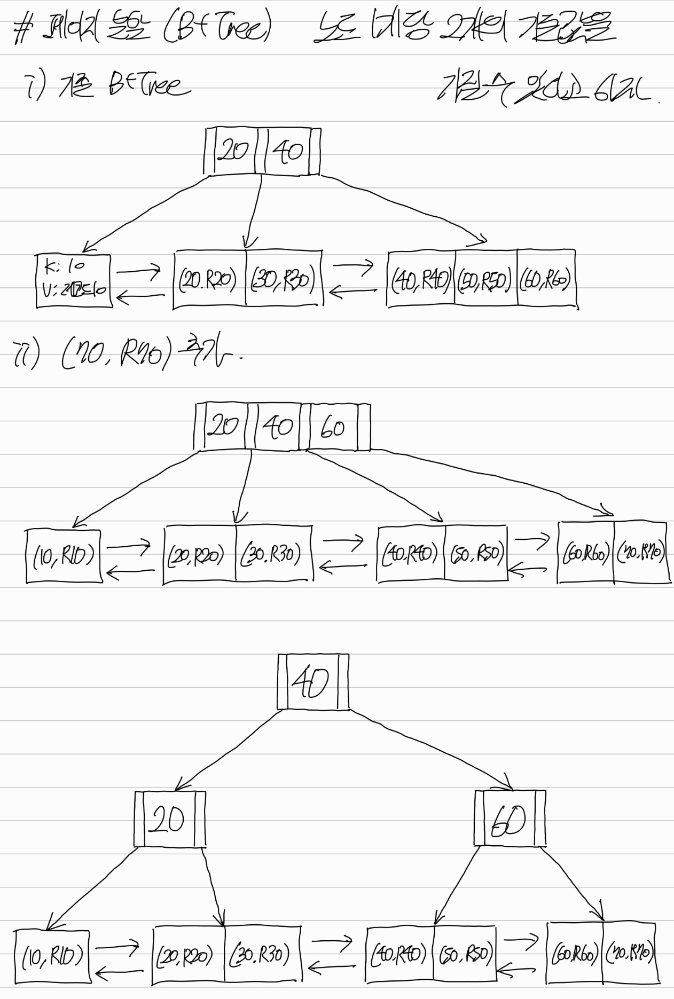

## 인덱스와 B-Tree
### 인덱스와 물리적 저장 단위 (Disk & Page)
#### 인덱스
- **테이블의 검색 속도를 높이기 위해 특정 컬럼의 값들을 오름차순으로 정렬해 놓은 자료구조**이다.
- MySQL InnoDB에서는 인덱스의 종류에 따라 구조와 역할이 다르다.
- **클러스터링 인덱스:**
  - **PK를 지정하면 기본적으로 생성**되며, **`(PK 값, 해당 PK를 가진 실제 데이터 레코드)` 쌍을 저장**한다.
  - **인덱스에 실제 레코드들이 저장되고 있으므로, 클러스터링 인덱스 파일 자체가 곧 테이블**이라고 볼 수 있다.
  - 그렇기에 **테이블별로 고유하게(하나만) 존재**한다.
- **세컨더리 인덱스:**
  - **PK가 아닌 컬럼을 조건으로 검색할 때 발생하는 풀 테이블 스캔(FTS)을 방지**하고, **검색 시간을 단축하기 위해 활용하는 자료구조**이다.
  - **PK가 아닌 컬럼에 지정할 때 생성**되며, **`(인덱스 키 값, 해당 레코드의 PK)` 쌍을 저장**한다.
  - **저장하는 데이터 구조 상, 하나의 테이블에 여러 개의 세컨더리 인덱스 파일이 존재**할 수 있다.

#### 디스크와 파일
- 디스크는 **SDD나 HDD 같은 비휘발성 물리적 저장장치**를 의미한다.
- **DB는 OS의 파일 시스템을 이용해 파일 형태로 디스크에 데이터를 저장**한다.
  - 예) 클러스터링 인덱스(테이블 데이터), (세컨더리) 인덱스

#### 페이지(블록)
- **DB 엔진은 디스크에 저장된 파일을 논리적으로 분할(8KB, 16KB 등 고정된 크기)하여 관리**한다.
- **분할된 파일 조각을 페이지**(블록)이라고 하는데, 페이지는 **디스크와 메모리 사이에서 데이터를 읽고 쓰는 기본 I/O 단위**가 된다.
- 후술할 B-Tree에서 노드는 곧 페이지를 의미한다.

### B-Tree (Balanced Tree)
- **관계형 DB의 기본 인덱스 구조는 B-Tree**이다.
- 이름에서 알 수 있듯, **리프 노드의 깊이(레벨)가 일정하게 유지되기 때문에, 탐색 시간은 항상 $O(logN)$으로 보장**된다.
- 2개의 자식만을 가질 수 있는 **이진 트리와는 달리, $m$개의 자식을 가질 수 있도록 확장된 트리**이다.
- **부모 노드가 $m$개의 자식 노드로 분기하기 위해서는, 내부에 반드시 $m-1$개의 기준값(인덱스 키)를 가져야 한다.**
  - 탐색 시점에는 부모 노드가 가지고 있는 이 기준값에만 의거하여 분기한다.

#### 순수 B-Tree와 B+Tree
- **순수 B-Tree는 브랜치 노드에도 데이터를 저장할 수 있으며, 리프 노드들끼리 연결되어 있지 않다.**
- 반면 **B+Tree는 모든 데이터를 리프 노드에만 저장하고, 리프 노드들을 이중 연결 리스트로 연결하여 범위 검색을 최적화한 구조**이다.
- **대다수의 관계형 DB에서 인덱스는 B+Tree로 구현되어 있지만, 관용적으로 B-Tree라고 표현**하는 경우가 많다.
- **본 파일 역시** B-Tree라고 표현하긴 했지만, 정확히는 **B+Tree를 기준으로 설명하고 있음**을 인지하자.

### B-Tree 내부 구조
#### 루트 노드와 브랜치 노드
- **목적지인 리프 노드로 찾아가기 위한 길잡이 역할**을 한다.
- **내부적으로 포인터(하위 노드 주소)와 기준값(키)이 교대로 이어지는 1차원 선형 배열 구조**를 가진다.
  - 예) `[P1] 10 [P2] 20 [P3] 30 [P4] 40 [P5]`
  - 가령 검색어(타겟)가 10 이상 20 미만이라면, 포인터 `[P2]`의 주소를 타고 다음 자식 노드로 내려간다.

#### 리프 노드 (Leaf Node)
- **B-Tree의 목적지**(최하단 종착지)로, **인덱스의 종류에 따라 페이지 내부에 저장되는 데이터 쌍이 다르다.** 
  - **클러스터링 인덱스:** 여러 개의 `(PK 값, 해당 PK를 가진 실제 데이터 레코드)` 쌍을 정렬된 상태로 저장한다.
  - **세컨더리 인덱스:** 여러 개의 `(인덱스 키 값, 해당 레코드의 PK)` 쌍을 정렬된 상태로 저장한다.
- **리프 노드들은 서로 이중 연결 리스트(Doubly Linked List)로 연결**되어 있다.

### B-Tree 탐색 원리
#### 단건 검색 (Point Query)
- 루트 및 브랜치 노드에서 **기준값과 검색어를 비교하여 적절한 포인터를 타고 자식 노드로** 내려온다.
- 리프 노드(페이지)에 도달하면, 인덱스의 종류에 따라 다르게 동작한다.
- **클러스터링 인덱스 탐색:**
  - 해당 페이지 내부에서 PK 값을 이용하여 타겟 레코드를 읽어온다.
- **세컨더리 인덱스 탐색 (Table Lookup):**
  - 해당 인덱스 키와 매핑된 PK 값을 획득한다.
  - 획득한 PK 값을 이용하여 클러스터링 인덱스 탐색을 수행하고, 최종적으로 리프 노드에 도달하여 타겟 레코드를 읽어온다.
- **타겟 레코드 탐색 과정:**
  - 먼저, 디스크의 인덱스 파일에서 타겟 페이지(리프 노드)를 찾아 메모리에 올린다.
  - 이후, 타겟 페이지 내부에서 이진 탐색을 활용하여 타겟 레코드를 찾는다.

#### 범위 검색 (Range Scan)
- **범위(조건)를 만족하는 최초의 리프 노드를 찾는다.**
- **이후 상위 노드(브랜치/루트)로 다시 올라가지 않고, 리프 노드 간에 연결된 이중 연결 리스트를 이용하여 순차적으로 탐색**한다.
- 범위를 벗어나는 데이터를 만나는 순간 스캔을 종료한다.

### B-Tree 탐색 방식
#### 수직 탐색 (Index Seek)
- **검색 조건에 맞는 인덱스가 존재할 때 발생**한다.
- **루트 노드부터 시작하여 브랜치 노드를 거쳐 리프 노드까지 타고 내려가는 탐색 방식**이다.

#### 수평 탐색 (Full Table Scan, Index Full Scan)
- **검색 조건에 맞는 인덱스가 없을 때 발생**한다.
- 수직 탐색을 수행하지 않고, **클러스터링 인덱스의 첫 번째 리프 노드로 직접 접근**한다. 
- 이후, **이중 연결 리스트를 타고 마지막 리프 노드까지 디스크 페이지를 순차적으로 읽어 들이는 방식**이다.

### B-Tree 특징
- **인덱스를 적절하게 사용하면 확실히 조회는 빨라진다.**
- 하지만 **인덱스의 정렬 상태 및 트리의 균형을 유지하기 위해 발생하는 추가적인 오버헤드(디스크 I/O 비용)는 불가피**하다.

#### INSERT와 페이지 분할 (Page Split)
> **새로운 데이터를 삽입해야 할 리프 노드(페이지)에 더 이상 공간이 없을 경우, 페이지 분할이 발생**한다.



1. 디스크에서 새로운 빈 페이지(자식 노드)를 할당받고, 기존 페이지 데이터의 절반을 새 페이지로 이동시킨다.
2. 이후 빈 공간이 확보된 위치에 새 데이터를 삽입하며, 부모 노드에 새로운 자식 노드 관련 정보(기준값 및 포인터)를 추가한다.
3. 이 과정에서 **다량의 디스크 쓰기 작업이 발생**한다.

#### SOFT DELETE
- **리프 노드의 데이터를 물리적으로 지우지 않고, '사용하지 않음'으로 마킹**한다.
- 때문에 삭제 작업이 누적되면, 디스크 공간이 낭비되고 스캔 성능이 저하된다.

#### UPDATE
- **인덱스는 항상 키 값을 기준으로 정렬된 상태를 유지해야 하므로, 기존 자리에서 키 값을 덮어쓰는 것은 불가능**하다.
- 때문에 기존 키 값을 `DELETE`하고, 변경된 값을 새로 `INSERT`해야 한다.
- 즉, **`UPDATE`를 수행하기 위해 두 번의 작업(`DELETE` 및 `INSERT`)이 발생하기 때문에 오버헤드가 가장 크다.**

---

## 클러스터링 인덱스와 논클러스터링 인덱스
### 테이블 파일과 인덱스 파일
#### 일반 RDBMS (Oracle 등)
- **데이터가 무작위로 저장되는 '테이블 파일(Heap)'과 이를 탐색하기 위한 '인덱스 파일'이 디스크에 별개로 존재**한다.

#### MySQL InnoDB
- **별도로 테이블 파일이 존재하지 않는다.**
- PK를 지정하면 기본적으로 생성되는 '클러스터링 인덱스 파일'에 실제 데이터 레코드들이 저장되고 있으므로, **클러스터링 인덱스 파일 자체가 곧 테이블**이라고 볼 수 있다.
  - **실제 데이터를 저장한다는 측면에서, 클러스터링 인덱스 파일이 테이블 파일의 역할을 수행**한다고 볼 수 있다.

### 클러스터링 인덱스 (Clustered Index)
- **PK를 지정하면 기본적으로 생성**되며, **리프 노드에는 여러 개의 `(PK 값, 해당 PK를 가진 실제 데이터 레코드)` 쌍이 정렬된 상태로 저장**되어 있다.
- **인덱스에 실제 레코드들이 저장되고 있으므로, 클러스터링 인덱스 파일 자체가 곧 테이블**이라고 볼 수 있다.
- 그렇기에 **테이블별로 고유하게(하나만) 존재**한다.

#### PK 미지정 시 동작 원리
- **InnoDB는 클러스터링 인덱스 없이는 데이터를 저장할 수 없다.**
- 명시적으로 PK를 지정하지 않은 경우, `UNIQUE NOT NULL` 조건이 걸린 컬럼을 키로 사용한다.
- 해당 컬럼조차 없다면, 내부 식별자(`ROW_ID`)를 강제로 생성하여 클러스터링 인덱스를 구축한다.

#### PK 설계 기준
- **클러스터링 인덱스는 PK를 기준으로 실제 데이터 레코드들을 물리적으로 정렬하여 저장**하고 있다.
- **PK 값이 변경될 때 B-Tree 내부적으로 수행되는 `UPDATE`(`SOFT DELETE` 및 `INSERT`) 작업은 오버헤드가 크다.**
- 따라서 **PK는 가급적 값이 변경되지 않는 속성(예: `AUTO INCREMENT`)으로 설정하는 것이 일반적**이다.

### 논클러스터링 인덱스 (Secondary Index, 보조 인덱스)
- **PK가 아닌 컬럼을 조건으로 검색할 때 발생하는 풀 테이블 스캔(FTS)을 방지**하고, **검색 시간을 단축하기 위해 활용하는 자료구조**이다.
- **PK가 아닌 컬럼에 지정할 때 생성**되며, **리프 노드에는 여러 개의 `(인덱스 키 값, 해당 레코드의 PK)` 쌍이 정렬된 상태로 저장**되어 있다.
- **저장하는 데이터 구조 상, 하나의 테이블에 여러 개의 세컨더리 인덱스 파일이 존재**할 수 있다.

#### 세컨더리 인덱스가 PK를 저장하는 이유
- **세컨더리 인덱스의 리프 노드는 물리적 주소(RowID)나 실제 데이터 레코드가 아니라 PK를 값으로 저장**한다.
- 이로 인해 **조회 시 클러스터링 인덱스를 한 번 더 탐색하는 비용(Table Lookup)이 추가로 발생하지만, 후술할 오버헤드에 비하면 합리적**이다. 
- **실제 데이터 레코드를 저장할 수 없는 이유:**
  - 세컨더리 인덱스에 실제 데이터 레코드를 저장하면, **요구 디스크 공간이 배로 증가**한다.
  - 또한 실제 데이터 레코드가 유일하지 않으므로, **모든 인덱스의 데이터 정합성 문제** 또한 고려해야 한다.
- **물리적 주소를 가리킬 수 없는 이유:**
  - 클러스터링 인덱스에서 페이지 분할이 발생하면, 실제 데이터 레코드들의 물리적 주소가 대량으로 변경된다.
  - 만약 세컨더리 인덱스가 물리적 주소를 직접 가리키고 있었다면, **모든 세컨더리 인덱스의 포인터를 일일이 찾아 수정해야 하는 대량의 쓰기 오버헤드가 발생**하게 된다.

### 데이터 변경 시나리오별 내부 동작
#### 전제 사항
- **클러스터링 인덱스 파일: `(PK: 나이, 주소)`**
  - `(1: 13, 제주도)`, `(2: 14, 제주도)`, `(3: 14, 서울)`, `(4: 17, 부산)`, `(5: 18, 대전)`
- **세컨더리 인덱스 파일(나이 기준): `(나이: PK)`**
  - `(13: 1)`, `(14: 2)`, `(14: 3)`, `(17: 4)`, `(18: 5)`

#### 세컨더리 인덱스의 키 값이 변경되는 경우 (나이 14 → 15)
1. **세컨더리 인덱스 접근 (Search):** 
   - 조건절(`WHERE age = 14`)을 처리하기 위해 세컨더리 인덱스 트리를 탐색하여 대상 레코드의 PK 값들을 모두 찾는다.
2. **클러스터링 인덱스 접근 (Lookup & Lock):**
   - 찾은 PK로 클러스터링 인덱스 트리를 탐색하여(Lookup) 타겟 페이지를 찾아 메모리에 올린다.
   - 이후, 타겟 페이지 내부에서 이진 탐색을 활용하여 타겟 레코드를 찾는다.
   - 찾았다면, 동시성 제어를 위해 해당 레코드에 락(X-Lock)을 건다.
3. **클러스터링 인덱스 수정 (In-place Update):**
   - 타겟 레코드의 컬럼 값을 갱신한다.
4. **세컨더리 인덱스 수정:**
   - 변경된 내용을 세컨더리 인덱스에 반영한다.
   - 기존 엔트리(`14: PK`)를 `SOFT DELETE`하고, 새로운 엔트리(`15: PK`)를 올바른 정렬 위치에 `INSERT`한다.
- **결론:**
  - 정렬 오버헤드는 세컨더리 인덱스에서만 발생한다.
  - 클러스터링 인덱스에서는 단순히 컬럼 값만 변경할 뿐이다.

#### 클러스터링 인덱스의 키 값(PK)이 변경되는 경우 (PK 2 → 100)
1. **클러스터링 인덱스 접근:**
   - 조건절이 PK이므로, 세컨더리 인덱스를 거치지 않고 바로 클러스터링 인덱스로 접근하여 타겟 레코드를 찾는다.
2. **클러스터링 인덱스 수정:**
   - 기존 엔트리를 `SOFT DELETE`하고, 새로운 엔트리를 올바른 정렬 위치에 `INSERT`한다.
3. **세컨더리 인덱스 수정:**
   - 세컨더리 인덱스의 키 값은 아니지만, PK가 갱신되었으므로 테이블에 걸린 '모든' 세컨더리 인덱스에 이를 반영(`SOFT DELETE` + `INSERT`)해야 한다.
- **결론:**
  - **클러스터링 인덱스뿐만 아니라, 모든 세컨더리 인덱스의 갱신이 강제되므로 대량의 오버헤드가 발생**한다.
  - 이와 같은 이유에서, **PK는 최대한 값이 변경되지 않는 속성(예: `AUTO INCREMENT`)으로 설정**해야 한다.

#### 어떤 인덱스의 키 값도 아닌 컬럼이 변경되는 경우 (주소 제주도 → 경기도)
1. **클러스터링 인덱스 수평 탐색:**
   - 해당 컬럼(주소)에 대한 세컨더리 인덱스가 없으므로, 클러스터링 인덱스를 수평 탐색(FTS)하여 타겟 레코드를 찾는다.
2. **클러스터링 인덱스 수정:**
   - 타겟 레코드의 컬럼 값을 갱신한다.
3. **세컨더리 인덱스:**
   - 세컨더리 인덱스가 관리하는 엔트리(`인덱스 키: PK`)에는 전혀 영향이 없다.
- **결론:**
  - 갱신 과정에서 오버헤드가 발생하지는 않지만, 수평 탐색(FTS) 과정에서 오버헤드가 발생한다.

---

## 인덱스 카디널리티와 선택도
### 카디널리티 (Cardinality)
- **특정 컬럼 내에 존재하는 고유한 값(Distinct Value)의 개수**를 의미한다.
- **카디널리티가 높은 컬럼:**
  - 고유한 값이 많아 중복도가 낮다.
  - 예) PK, 이메일, 주민등록번호 등
- **카디널리티가 낮은 컬럼:**
  - 고유한 값이 적어 중복도가 높다. 
  - 예) 성별, 결제상태, 부서코드 등
- **세컨더리 인덱스는 카디널리티가 높은 컬럼에 생성하는 것이 좋다.**
  - **카디널리티가 낮으면 인덱스를 탐색하더라도 반환되는 PK가 너무 많아져서, 이후 발생하는 클러스터링 인덱스 재탐색(Table Lookup) 오버헤드가 급증하기 때문**이다.

#### 개수가 아니라 비율이 중요하지 않나?
- 결론부터 말하면 **아니다**.
- 가령 컬럼의 크기가 `100`일 때 카디널리티가 `15`인거랑, 컬럼의 크기가 `10`일 때 카디널리티 `5`인게 있다면 후자를 선택해야 하는거 아닌가 생각할 수 있다.
- 하지만 애초에 **동일한 테이블이라면 모든 컬럼의 크기(레코드의 개수)가 동일하기 때문에, 비율과 무관하게 '고유한 값을 많이 가진 컬럼'을 선택하는 것이 좋다.** 

### 선택도 (Selectivity)
- **전체 테이블 레코드 중에서 특정 검색 조건을 만족하여 반환되는 레코드의 비율**을 의미한다.
- 옵티마이저가 **인덱스 사용 여부를 결정하는 핵심 지표**이다.
- 일반적으로 MySQL **옵티마이저는 선택도가 `5 ~ 10%` 이하일 때만 인덱스를 타는 것이 효율적이라고 판단**한다.

#### 일반적인 경우에서의 선택도 (옵티마이저의 실행 기준표)
- $선택도 = \frac{Filtered\ Rows}{Total\ Rows}\ *\ 100$

#### 데이터가 균일하게 분포되어 있을 경우의 선택도 (수학적 기댓값)
- $선택도 = \frac{1}{Cardinality}\ *\ 100$ (∵ $Filtered\ Rows = \frac{Total\ Rows}{Cardinality}$ )

#### 데이터 편향(Data Skew)에 따른 옵티마이저의 판단
- **현실의 데이터는 수학적 기댓값처럼 균일하게 분포되어 있지 않고 특정 값에 편향되어 있는 경우가 많다.**
- 따라서 **수학적 기댓값($\frac{1}{Cardinality}$) 상으로는 선택도가 높아 인덱스가 비효율적일 것 같아도, 실제 쿼리 조건에 해당하는 데이터가 적다면 인덱스를 타는 것이 유리할 수 있다.**
  - 가령 결제상태 컬럼에서 결제완료가 99%, 환불이 1% 비율로 분포해 있다고 하자.
  - `WHERE 결제상태 = '환불'` 조건으로 검색하는 경우, 수학적 기댓값에 따르면 33%이므로 인덱스를 타지 않는 것이 맞다.
  - 하지만 실제 데이터 분포를 고려하면 선택도가 1%이므로 인덱스를 타는 것이 맞고, 이러한 경우 옵티마이저도 실제로 인덱스를 탄다.
- 즉, **옵티마이저는 단순 수식에 의존하지 않고, 조건절을 만족하는 레코드의 개수(Filtered Rows)를 추산하여 인덱스 사용 여부를 결정**한다. 
  - 인덱스 통계 정보(Statistics/Histogram) 확인
  - 실행 시점에 트리 일부를 탐색하는 인덱스 다이브(Index Dive) 

### 옵티마이저 판단 기준 (Table Lookup vs FTS)
> **선택도가 10%를 초과할 경우 옵티마이저는 FTS를 선택하는데, 이는 디스크 I/O 방식의 차이에 기인**한다.

#### 세컨더리 인덱스 탐색의 물리적 비용 (랜덤 I/O)
- **추출된 $K$개의 PK를 바탕으로 클러스터링 인덱스에서 $K$번의 수직 탐색을 수행해야 하므로, 총 논리적 탐색 시간은 $O(KlogN)$이 소요**된다.
- 논리적으로는 그렇지만, **실제로는 매번 디스크 헤더를 물리적으로 이동시키기 위한 오버헤드가 추가로 발생하는데, 이 오버헤드가 매우 크다.**
  - 즉, **랜덤 I/O 오버헤드가 매우 크기 때문에 선택도가 10% 이상이면 인덱스를 타지 않는다.**

#### FTS의 물리적 비용 (순차 I/O)
- **디스크 헤더의 큰 이동 없이, 클러스터링 인덱스의 첫 번째 리프 노드부터 마지막 리프 노드까지 물리적으로 인접한 페이지들을 순서대로 스캔(수평 탐색)한다.**

#### 결론
- **조건절을 만족하는 데이터($K$)가 일정 비율을 넘어서면, $K$번의 랜덤 I/O를 수행하는 누적 비용이 테이블 전체를 순차 I/O로 읽어 들이는 비용을 역전하게 되므로, 인덱스를 타지 않게 된다.**

### 단일 인덱스 설계 관련 요약
- **단일 컬럼에 인덱스를 생성할 때는 기본적으로 카디널리티가 높은(고유값이 많은) 컬럼을 선택**해야 한다.
- **단, 카디널리티가 높더라도(고유값의 개수가 많더라도) 선택도가 10%를 초과하게 되면, 옵티마이저는 인덱스를 타지 않고 FTS을 수행**하게 된다.

---

## 복합 인덱스와 커버링 인덱스
### 복합 인덱스 (Composite Index)
- **2개 이상의 컬럼을 묶어서 하나의 세컨더리 인덱스로 생성하는 기법**이다.
- **복합 인덱스를 `(A, B)` 순서로 생성하면, 먼저 A 컬럼을 기준으로 물리적 정렬이 수행**된다.
  - **B 컬럼은 A 컬럼 값이 동일한 파티션 내부에서만 정렬**된다.
  - **즉, 선행 컬럼의 값이 다르면 후행 컬럼의 정렬 상태는 보장되지 않는다.**

### 복합 인덱스에서 선행 컬럼 선정 기준
- **복합 인덱스를 생성할 때는 카디널리티(고유값의 개수)보다 '점 조건을 선행 컬럼으로 지정하는 것'이 중요**하다.
  - 예) **`CREATE INDEX {복합 인덱스명} ON {테이블명} (점 조건, 선분 조건)`**
- 이를 이해하기 위해서는 먼저 점 조건과 선분 조건에 대해 알아보자.

#### 점 조건
- **특정 값**을 찾는 조건이다.
- 예) `=`, `IN`

#### 선분 조건
- **특정 범위**를 찾는 조건이다.
- 예) `>`, `<`, `BETWEEN`, `LIKE` (단, `LIKE '%KOREA'`처럼 와일드카드가 맨 앞에 오는 경우 제외)

#### 선분 조건이 선행할 때 발생하는 문제
- `부서`와 `나이` 컬럼을 묶어서 복합 인덱스를 만들 때, 선행 컬럼을 달리 하여 두 경우를 비교해보자.
  - 쿼리는 `WHERE 부서 = '개발팀' AND 나이 >= 30`으로 동일하다고 하자.
  - 참고로, **`WHERE`절의 조건 순서는 인덱스를 타는 것과 무관**하다. (옵티마이저가 최적화하기 때문) 
- **점 조건이 앞에 오는 경우: `(부서, 나이)`**
  - 인덱스는 부서 기준으로 정렬되어 있으므로, `개발팀`이 시작되는 위치를 단번에 찾는다.
  - `개발팀` 파티션 내에서는 `나이` 순으로 정렬되어 있기 때문에, `나이 30`이 시작되는 컬럼 또한 단번에 찾을 수 있다.
  - 즉, **두 조건(`부서 = '개발팀'`, `나이 >= 30`) 모두 검색 범위를 확 좁혀주는 탐색 조건으로 활용**되었다.
- **선분 조건이 앞에 오는 경우: `(나이, 부서)`**
  - 인덱스가 나이 기준으로 정렬되어 있으므로, `나이 30`이 시작되는 위치를 단번에 찾는다.
  - 하지만 `동일한 나이` 파티션 내에서만 `부서`가 정렬되어 있을 뿐, `나이 >= 30` 이라는 타겟 범위에서는 `부서`가 정렬되어 있지 않다.
  - 따라서 `나이 30`이 시작되는 위치부터 디스크 끝까지 전부 순차적으로 스캔하면서 `부서 = 개발팀`인지를 일일이 필터링 해야 한다.
  - 즉, **선분 조건인 `나이 >= 30`은 탐색 조건으로 쓰였지만, 뒤에 있는 점 조건인 `부서 = 개발팀`은 단순히 필터링 조건으로만 사용**되었다.
- 이러한 이유에서 **복합 인덱스를 설계(생성)할 때는 카디널리티보다 '어떤 컬럼이 점 조건으로 사용되는가'를 알아내는 것이 중요**하다.
- **반드시 점 조건으로 조회되는 컬럼을 인덱스의 앞쪽에 배치하고, 범위 검색(선분 조건)으로 조회되는 컬럼을 뒤쪽에 배치**해야 한다.

### Leftmost Prefix Rule (왼쪽 법칙)
- **복합 인덱스를 타기 위해서는, 생성 시점에 가장 왼쪽에 지정했던 컬럼만큼은 반드시 조건절로 포함해야 한다.**
- 생각해보면 너무나 당연하니까, 바로 예시를 확인해보자.
  - **인덱스:** `(A, B, C)`
  - **가능:** `WHERE A = 1`, `WHERE A = 1 AND C = 1`, ...
  - **불가능:** `WHERE B = 2`, `WHERE B = 2 AND C = 3`, ...

### 커버링 인덱스 (Covering Index)
- **모든 컬럼 값을 세컨더리 인덱스에서 찾을 수 있도록 구성된 쿼리**(또는 상태)를 의미한다.
- **커버링 인덱스가 적용되면 필요한 모든 데이터(PK 포함)가 세컨더리 인덱스에 존재하는 상태**이므로, **클러스터링 인덱스 재탐색(Table Lookup)을 수행하지 않고 쿼리를 종료**하게 된다.

### 커버링 인덱스를 통한 페이징 최적화 (Deferred Join)
> **게시글을 최신순으로 정렬했을 때, 100번째부터 시작하여 10개의 게시글을 조회하는 상황**을 생각해보자.

#### 단순 페이징 쿼리 (커버링 인덱스 미적용)
- 가장 간단하게 생각할 수 있는 페이징 쿼리는 다음과 같다.
    ```sql
    -- 전제: '작성일자' 컬럼에 세컨더리 인덱스가 있음
    SELECT * FROM board ORDER BY 작성일자 DESC LIMIT 100, 10; 
    ```
- **페이징 쿼리다 보니까 기본적으로 `작성일자` 세컨더리 인덱스에서 역순으로 수평 탐색**하긴 할 것이다.
  - 즉, 역순으로 하나씩 읽고 버리는 과정을 100번 반복한 다음, 10개를 가져올 것이다.
  - 참고로 종단(앞이든 뒤든)에서부터 하나씩 읽는 이유는 리프 노드가 `LinkedList`로 구현되어 있기 때문에, 원하는 위치로 점프할 수 없기 때문이다. 
- **문제는 하나씩 읽는 과정에서, 세컨더리 인덱스뿐만 아니라 클러스터링 인덱스까지 읽는다**(Table Lookup, 랜덤 I/O)는 것이다.
  - (스토리지 엔진이) 세컨더리 인덱스만 조회해서는, DB 엔진의 요구사항(`SELECT *`)을 충족할 수 없었기 때문이다.  
- **결과적으로 불필요한 Table Lookup이 `OFFSET` 크기만큼 발생하게 되므로, 굉장히 비효율적**이라고 볼 수 있다.

#### 커버링 인덱스를 활용한 최적화 쿼리 (Deferred Join)
- **단순 페이징 쿼리에서의 불필요한 Table Lookup을 피하기 위해, 다음과 같이 쿼리를 두 개(서브쿼리와 조인)로 분리**할 수 있다. 
    ```sql
    SELECT b.*
    FROM board b
    JOIN (
        -- 서브쿼리: 커버링 인덱스 적용
        SELECT id FROM board ORDER BY 작성일자 DESC LIMIT 100, 10;
    ) temp
    ON b.id = temp.id;
    ```
1. **커버링 인덱스 적용 (서브쿼리):**
   - **세컨더리 인덱스만 조회해도 DB 엔진의 요구사항을 충족할 수 있도록, 요구사항 자체를 간소화**(**`SELECT *` → `SELECT id`**)한다.
   - 페이징 쿼리다 보니까 기본적으로 `작성일자` 세컨더리 인덱스에서 역순으로 수평 탐색하긴 하겠지만, **하나씩 읽는 과정에서 클러스터링 인덱스 탐색(Table Lookup)은 수행하지 않게 된다.**
2. **실제 데이터 조인:**
   - 서브쿼리에서 추출해낸 10개의 PK를 가지고 원래 테이블(`board`)과 조인한다. 
3. **결과:**
   - **불필요한 Table Lookup(랜덤 I/O)을 전혀 수행하지 않고, 필요한 데이터에 대해서만 Table Lookup이 발생**하게 된다.
   - 즉, **커버링 인덱스를 통해 쿼리를 최적화한 결과, 디스크 I/O 횟수를 `OFFSET + LIMIT`에서 `LIMIT`로 감축**할 수 있게 되었다.  

#### DB 엔진과 스토리지 엔진
- **DB 엔진 (MySQL):**
  - **SQL 문장을 해석하여, 스토리지 엔진에게 데이터를 요청**한다. 
- **스토리지 엔진 (InnoDB):**
  - **요청 데이터를 응답하기 위해, 디스크(인덱스)를 탐색**한다.
  - 즉, DB 엔진이 요청한 데이터를 묵묵히 반환할 뿐이다.

### 인덱스 정렬 순서와 탐색 순서
#### 오름차순 인덱스에서의 역순 탐색
- **인덱스 생성 시 디폴트 정렬 순서는 오름차순**인데, 이 상태에서 역순 탐색(내림차순 조회)을 요청하면 다음과 같이 동작한다.
- **수직 탐색:**
  - B-Tree의 루트 노드에서 시작하여, 가장 큰 값이 존재하는 인덱스의 맨 오른쪽 끝 리프 노드로 이동한다.
- **수평 탐색:**
  - **맨 오른쪽 끝 노드에서 시작하여, 이중 연결 리스트의 이전 노드(`prev`) 포인터를 타고 왼쪽으로(역방향으로) 데이터를 읽어 나간다.**

#### 역순 탐색 페널티
> **논리적으로는 정순 탐색이든 역순 탐색이든 동일할 것 같지만, InnoDB 스토리지 엔진 구조상 역순 탐색은 정순 탐색보다 약 15~20% 정도 느리다.**

- **리프 노드 간, 즉 페이지와 페이지 사이는 이중 연결 리스트로 묶여 있기 때문에 양방향 이동이 원활**하다. (속도 차가 발생하지 않는다.)
- **하지만 하나의 페이지(16KB 등) 내부에 존재하는 레코드들은 리프 노드와 달리 단방향으로만 연결**되어 있다.
- 따라서 엔진이 페이지 내부 데이터를 역순으로 읽어내는 과정은 **필연적으로 더 큰 오버헤드**가 발생하게 된다.
- 이러한 **역순 탐색 페널티를 없애기 위해서는 내림차순 인덱스를 생성**하면 된다.
  - 예) `CREATE INDEX {인덱스명} ON {테이블명} (컬럼명 DESC)`

---

## 실행 계획 및 조인 최적화
### 실행 계획 (`EXPLAIN`)
- **DB 옵티마이저가 쿼리를 분석한 뒤 수립한 '데이터 탐색 경로(물리적 실행 계획)'를 표 형태로 출력**해주는 명령어다.
- 쿼리 앞에 `EXPLAIN`을 붙여 실행하며, '실행 계획'이라는 이름에 걸맞게 **실제로 실행하는 것은 아니다.**
  - 만약 실제로 실행해서 그 결과를 분석하고 싶다면, 쿼리 앞에 `EXPLAIN ANALYZE`을 붙이면 된다.
- 실행 계획을 통해 여러 정보를 파악할 수 있는데, 그 중 **`type` 컬럼은 대상 테이블로 접근하는 방식을 나타내는 가장 중요한 성능 지표**이므로 알아둘 필요가 있다.

#### `type` 컬럼의 종류
1. **`const` (상수 탐색):**
   - **조건절에 PK나 Unique Key를 점 조건(`=`)으로 지정**하여, **1건의 레코드만 반환될 때** 발생한다.
2. **`eq_ref` (1:1 조인 탐색):**
   - 조인 쿼리에서 **Driven 테이블의 조인 컬럼(`ON` 절에서 조인 조건으로 사용되는 컬럼)이 PK 또는 Unique Key일 때** 발생한다.
   - 예) `SELECT * FROM Orders o JOIN Customers c ON o.c_id = c.id WHERE o.order_date = '2026-05-31'`에서 Driven 테이블인 `Customers`의 조인 컬럼(`id`)은 PK이므로, 해당 조인은 `eq_ref` 타입이다.
3. **`ref` (세컨더리 인덱스 탐색):**
   - **PK나 Unique Key가 아닌 일반 세컨더리 인덱스를 점 조건(`=`)으로 탐색**하거나, 조인 쿼리에서 **Driven 테이블의 조인 컬럼이 일반 세컨더리 인덱스일 때** 발생한다. 
4. **`range` (범위 검색):**
   - **인덱스를 선분 조건(`<`, `>`, `BETWEEN`, 일부 `LIKE`)으로 탐색할 때** 발생한다.
5. **`index` (인덱스 풀 조건):**
   - **세컨더리 인덱스를 (처음부터 끝까지) 수평 탐색할 때** 발생한다.
6. **`all` (FTS):**
   - **클러스터링 인덱스를 (처음부터 끝까지) 수평 탐색할 때** 발생한다.

#### Driving Table 및 Driven 테이블
- **MySQL의 디폴트 조인 방식은 Nested Loop Join(NLJ)으로, 이중 for문과 동일하게 동작**한다.
- NLJ를 이해하기 위해서는, 먼저 Driving 및 Driven 테이블에 대해 알고 있어야 한다.
- **Driving Table:**
  - **외부 반복문(바깥쪽 루프)을 담당**하는 테이블이다.
  - 조인 시 디스크에서 가장 먼저 읽히며, **Driving 테이블에서 조건절(`WHERE`)을 거쳐 필터링된 레코드의 개수가 조인 작업의 총 반복 횟수를 결정**한다.
- **Driven Table:**
  - **내부 반복문(안쪽 루프)을 담당**하는 테이블이다.
  - **Driving 테이블에서 레코드가 하나 추출되어 넘어올 때마다, 그 값을 기준으로 반복해서 조인이 수행**된다.

#### SELECT 문의 논리적 파싱 순서와 물리적 실행 순서 (조건절 푸시다운)
- **옵티마이저는 무작정 두 테이블을 통째로 조인(Cartesian Product)한 뒤에 `WHERE` 절로 걸러내지 않는다.**
- **OOM(Out Of Memory)를 막기 위해 내부적으로 조건절 푸시다운(Predict Pushdown) 전략을 사용**한다.
- **논리적 파싱 순서:**
  - `FROM` → `WHERE` → `GROUP BY` → `HAVING` → `SELECT` → `ORDER BY`
  - 이는 사람의 이해를 돕기 위한 '논리적 파싱 순서'일 뿐, DB가 실제로 데이터를 찾아오는 '물리적 실행 순서(실행 계획)'와는 완전히 다르다.
- **물리적 실행 순서 (푸시다운):**
  - **조인(`FROM`/`JOIN`)에 앞서 불필요한 데이터를 먼저 필터링(`WHERE`)하여 조인할 대상 자체를 미리 최소한으로 줄인다.**
  - 즉, **Driving 테이블에 걸린 조건절을 먼저 평가하여 타겟 레코드를 좁혀낸 뒤, 추출된 소수의 레코드로만 Driven 테이블에 접근**한다.

#### Nested Loop Join 동작 방식
```java
// 옵티마이저의 내부적인 물리적 실행 흐름 (Nested Loop Join)

// 1. Driving Table 탐색 (조건절 푸시다운으로 추출된 소수 데이터만 순회)
for (Customer c : Customers.findByRegion("KOREA")) { // id가 1, 5, 9라고 가정
    
    // 2. Driven Table 탐색 (Index to Index 조인)
    // 앞서 꺼낸 c.id 하나를 즉시 들고 Orders 테이블 인덱스를 수직 탐색함
    for (Order o : Orders.findByCustomerId(c.getId())) {

        // 3. 조인 후 즉시 반환 (Streaming / Pipelining)
        // 메모리에 배열을 만들어 모아두지 않음!
        yield return join(c, o);
    }
}
```
1. **Driving Table 탐색:**
   - 인덱스를 수직 탐색하여 조건에 맞는 첫 번째 레코드(`id = 1`)를 찾는다.
   - 이때 타겟을 한 번에 다 찾아 임시 테이블을 만드는 것이 아니라, 일단 `id = 1` 하나만 먼저 쥐고 있는다.
2. **Driven Table 탐색:**
   - `id = 1` 값을 들고 즉시 Driven 테이블(`Orders`)의 인덱스를 수직 탐색하여 매칭되는 데이터를 찾는다.
3. **조인 후 즉시 반환 (Streaming):**
   - 찾아낼 때마다 두 레코드를 조인하여 메모리에 쌓아두지 않고 즉시 클라이언트(애플리케이션)로 흘려보낸다.

### 조인 최적화
> **Driven 테이블의 조인 컬럼에는 반드시 인덱스가 있어야 한다.**

#### Driven 테이블의 조인 컬럼에 인덱스가 없는 경우
- Driving 테이블에서 조건절 필터링을 거쳐 최종 추출된 레코드의 개수를 $M$, Driven 테이블의 총 레코드 건수를 $N$이라 하자.
- Driven 테이블의 조인 컬럼에 인덱스가 없다면, **Driving 테이블에서 추출된 $M$개의 레코드 각각에 대해 Driven 테이블 전체($N$건)을 매번 풀 스캔**해야 하므로, 총 발생 비용은 $M * N$이 된다.

#### Driven 테이블의 조인 컬럼에 인덱스가 있는 경우
- 반면 Driven 테이블의 조인 컬럼에 인덱스가 존재하면, **복잡도가 단순 덧셈 수준인 $O(M * logN)$으로 감소**한다.
- 정확한 발생 비용은 $M * (logN + K)$인데, 일반적으로 $K$의 값이 상수 수준이기 때문에 $M * logN$ 과 같이 표현한다.
  - **$logN$ (Index Seek):** B-Tree 루트 노드에서 리프 노드까지 찾아 내려가는 수직 탐색 비용
  - **$K$ (Index Scan):** 조건에 매칭되어 리프 노드를 수평으로 스캔하며 읽어 들이는 레코드 개수

#### 옵티마이저의 비용 기반 최적화 (Cost-based Optimization)
- 개발자가 쿼리를 작성할 때 적은 순서와 무관하게, **옵티마이저는 인덱스 구조와 통계 정보를 바탕으로 Driving/Driven 테이블을 재배치**할 수 있다.
  - 즉, **`FROM A JOIN B`라고 적었다고 해서 A를 Driving 테이블, B를 Driven 테이블로 보지 않는다**는 것이다.
- **판단 기준 1: 조인 컬럼의 인덱스 유무**
  - 한쪽 테이블에만 조인 컬럼 인덱스가 존재하는 경우, 옵티마이저는 **인덱스가 없는 테이블을 Driving 테이블로 선택**한다.
  - 인덱스가 없는 테이블을 Driving으로 둬야, 전체 비용이 최소화 되기 때문이다. (한 번만 FTS한 뒤, 추출된 데이터로 Driven 테이블의 인덱스 수직 탐색)
- **판단 기준 2: 필터링 이후의 레코드 건수**
  - 두 테이블 모두 조인 컬럼 인덱스가 존재하는 경우, 옵티마이저는 **조건절(`WHERE`)에 의해 필터링되고 남은 최종 레코드의 개수가 더 적은 테이블을 Driving 테이블로 선택**한다.
  - 바깥쪽 루프에서 추출된 레코드 건수($M$)가 적어야, 전체 비용이 최소화 되기 때문이다. (안쪽 루프에서 수직 탐색하는 총 횟수가 더 적어짐)

#### 옵티마이저 조인 최적화: 서브쿼리 언네스팅 (Subquery Unnesting)
- **옵티마이저(최적화)가 없는 환경에서는 `IN (서브쿼리)` 형태와 `JOIN` 형태의 쿼리가 인덱스 활용 측면에서 성능 차이**를 보였다.
- 성능 차이를 비교하기에 앞서, **도메인 모델(게시글 및 회원)부터 정의**해 보자.
  - `Posts (id, member_id, title)` → `member_id`에 세컨더리 인덱스 존재 
  - `Members (id, name, role)` -> `id`는 PK, `role`에 세컨더리 인덱스 존재
- **쿼리 A: `IN` 서브쿼리 형태**
    ```sql
    SELECT * FROM Posts p
    WHERE p.member_id IN (
        SELECT id 
        FROM Members m
        WHERE m.role = 'ADMIN'
    );
    ```
  - **메인쿼리(`Posts`)의 `WHERE`절 안에 포함된 서브쿼리**(`Members`)를 **중첩된 서브쿼리**(Nested Subquery)라고 한다.
  - **점 조건(`=`)을 통해 인덱스를 활용하고 있는 서브쿼리와는 달리, 메인쿼리에서는 `IN` 연산자로 인해 FTS이 발생**한다.
    - **`IN` 연산자는 값의 대소 비교가 아니라 포함 여부만 판단**하기 때문이다.
  - 참고로 DB 엔진이 스토리지 엔진에게 `SELECT *`을 요청하여 Table Lookup이 발생했기 때문에, 해당 메인쿼리의 타입은 `all`이 된다. (`index`가 아니다)
- **쿼리 B: 일반 JOIN 형태**
    ```sql
    SELECT p.* FROM Posts p
    JOIN Members m ON p.member_id = m.id
    WHERE m.role = 'ADMIN';
    ```
  - **Driving 테이블 결정:**
    - **비용 최소화 관점에서 `Members` 테이블이 Driving 테이블**이 된다.
    - **`Members`와 `Posts`가 애초에 1:多 관계**인데다가, **`Members` 테이블에 점 조건(`=`)이 걸려 있어, `Members` 테이블의 타겟 레코드 수가 더 적을 수 밖에 없기 때문**이다.
  - **Driving 테이블에서 타겟 레코드 추출:**
    - **조건절 푸시다운을 통해 타겟 레코드만을 빠르게 추출**한다.
    - 즉, **조인(`FROM`/`JOIN`)에 앞서 Driving 테이블의 조건절부터 평가**하여 타겟 레코드만을 빠르게 추출한다.
  - **타겟 레코드에 대해 건 바이 건(Row by Row)으로 Driven 테이블 레코드 매핑:**
    - **Driving 테이블에서 추출된 타겟 레코드 하나와 매핑되는 Driven 테이블 레코드를 찾아 조인하여 즉시(스트리밍 방식으로) 반환**한다. 
- **옵티마이저의 최적화:**
  - **옵티마이저가 있는 환경에서는 `IN (서브쿼리)` 형태든 `JOIN` 형태든 성능 차이를 보이지 않는다.**
  - **DB 엔진 내 옵티마이저가 쿼리를 분석하고 최적화하여 재작성(Query Rewrite)한 후, 스토리지 엔진에게 요청하기 때문**이다.
  - 결과적으로 **A 쿼리가 들어오든 B 쿼리가 들어오든, 내부적으로 생성되는 실행 계획과 인덱스 활용 방식은 동일**해진다.

---

## 커넥션 풀과 스레드의 관계